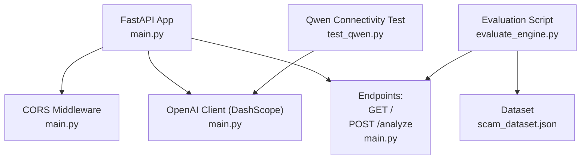
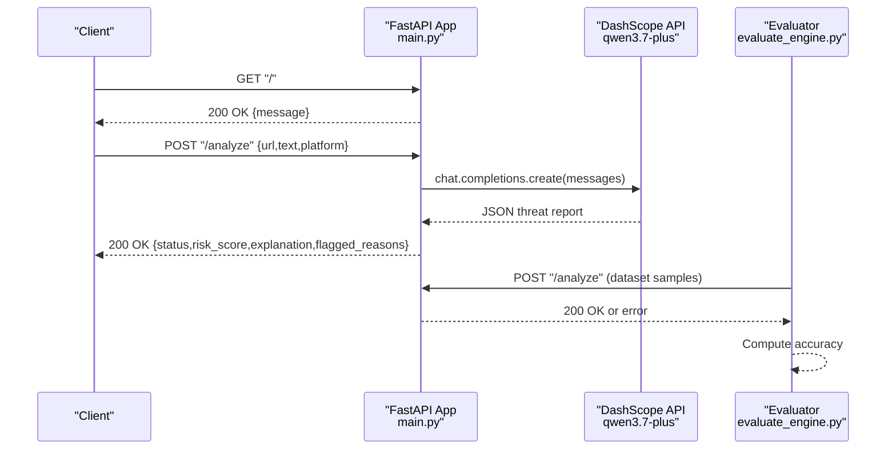
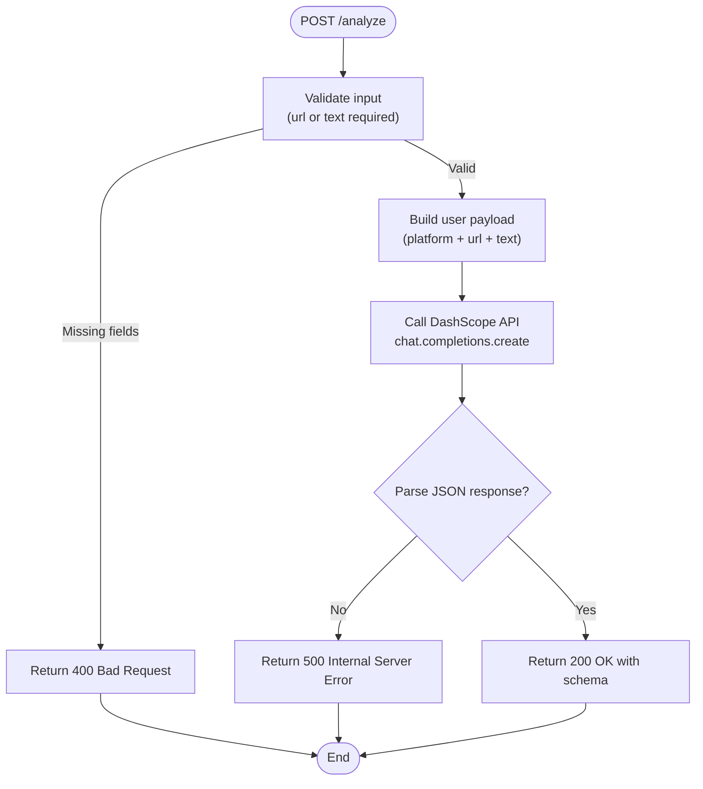
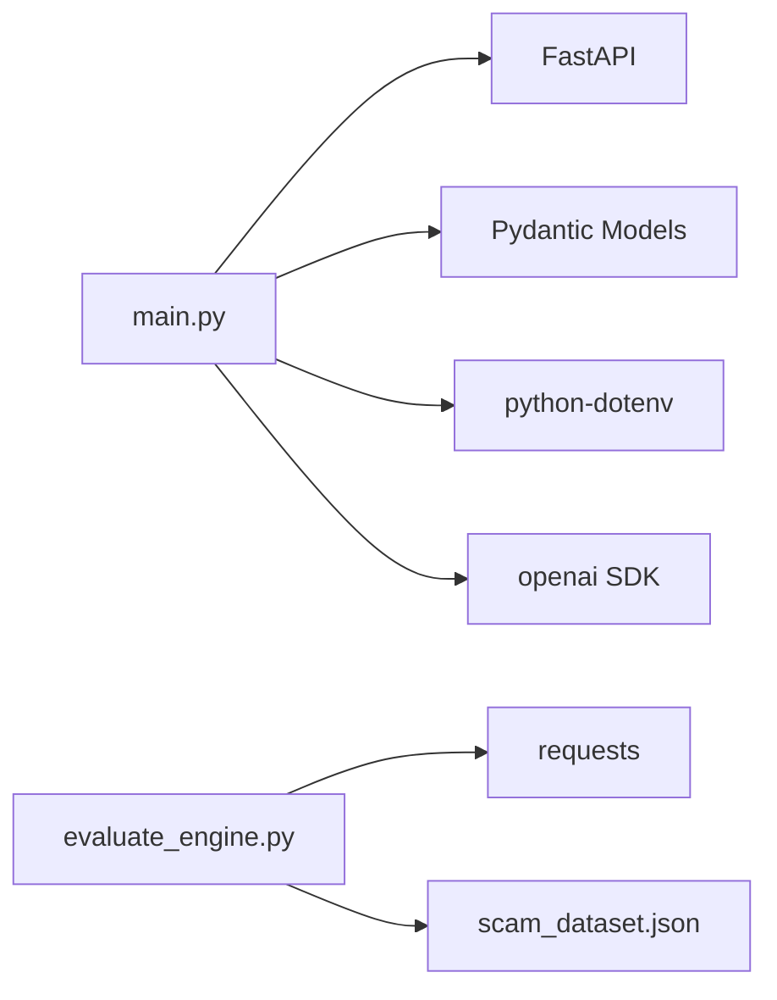

# Backend API Documentation

<cite>
**Referenced Files in This Document**
- [main.py](file://backend/main.py)
- [evaluate_engine.py](file://backend/evaluate_engine.py)
- [scam_dataset.json](file://backend/scam_dataset.json)
- [test_qwen.py](file://backend/test_qwen.py)
- [README.md](file://README.md)
</cite>

## Table of Contents
1. [Introduction](#introduction)
2. [Project Structure](#project-structure)
3. [Core Components](#core-components)
4. [Architecture Overview](#architecture-overview)
5. [Detailed Component Analysis](#detailed-component-analysis)
6. [Dependency Analysis](#dependency-analysis)
7. [Performance Considerations](#performance-considerations)
8. [Troubleshooting Guide](#troubleshooting-guide)
9. [Conclusion](#conclusion)
10. [Appendices](#appendices)

## Introduction
This document provides comprehensive API documentation for the ScrollGuard AI backend RESTful service built with FastAPI. It covers server configuration (CORS, OpenAI client setup for DashScope), endpoint specifications (health check and content analysis), authentication via environment variables, error handling, evaluation framework integration, client implementation guidelines, and debugging using FastAPI’s interactive documentation.

## Project Structure
The backend is organized under a single module with clear separation of concerns:
- Server and endpoints: main.py
- Evaluation harness: evaluate_engine.py
- Benchmark dataset: scam_dataset.json
- Optional Qwen connectivity test: test_qwen.py
- Project overview and setup instructions: README.md

**Diagram sources**
- [main.py:20-29](file://backend/main.py#L20-L29)
- [main.py:60-92](file://backend/main.py#L60-L92)
- [evaluate_engine.py:1-49](file://backend/evaluate_engine.py#L1-L49)
- [scam_dataset.json:1-37](file://backend/scam_dataset.json#L1-L37)
- [test_qwen.py:1-34](file://backend/test_qwen.py#L1-L34)

**Section sources**
- [main.py:1-92](file://backend/main.py#L1-L92)
- [evaluate_engine.py:1-49](file://backend/evaluate_engine.py#L1-L49)
- [scam_dataset.json:1-37](file://backend/scam_dataset.json#L1-L37)
- [test_qwen.py:1-34](file://backend/test_qwen.py#L1-L34)
- [README.md:63-143](file://README.md#L63-L143)

## Core Components
- FastAPI application with CORS enabled to allow browser extension communication.
- OpenAI-compatible client configured to use Alibaba Cloud DashScope with model qwen3.7-plus.
- Pydantic models defining request/response schemas for structured validation and auto-generated docs.
- Endpoints:
  - GET /: Health check returning a simple status message.
  - POST /analyze: Content analysis endpoint that calls the LLM and returns risk assessment.

Key behaviors:
- Environment variable DASHSCOPE_API_KEY is required at startup; missing key raises a runtime error.
- The analyze endpoint validates input (requires at least url or text).
- The analyze endpoint parses LLM JSON output and returns a standardized response schema.
- Errors are converted to HTTPException with appropriate status codes.

**Section sources**
- [main.py:11-18](file://backend/main.py#L11-L18)
- [main.py:20-29](file://backend/main.py#L20-L29)
- [main.py:31-40](file://backend/main.py#L31-L40)
- [main.py:60-92](file://backend/main.py#L60-L92)

## Architecture Overview
The backend exposes a minimal REST API backed by an external LLM. Clients send requests to the FastAPI server, which forwards analysis tasks to the DashScope API and returns structured results. An evaluation script periodically tests the API against a curated dataset to measure accuracy.

**Diagram sources**
- [main.py:60-92](file://backend/main.py#L60-L92)
- [evaluate_engine.py:19-46](file://backend/evaluate_engine.py#L19-L46)

## Detailed Component Analysis

### Health Check Endpoint: GET /
- Method: GET
- URL Pattern: /
- Purpose: Verify server availability and basic health.
- Request: None
- Response Schema:
  - Fields:
    - message: string
- Status Codes:
  - 200 OK: Service is active and responding.
- Notes:
  - No authentication required.
  - Useful for readiness probes and monitoring.

Example responses:
- 200 OK
  - Body: {"message": "ScrollGuard AI Detection Engine is active!"}

**Section sources**
- [main.py:60-62](file://backend/main.py#L60-L62)

### Content Analysis Endpoint: POST /analyze
- Method: POST
- URL Pattern: /analyze
- Purpose: Analyze a URL and/or text content to determine safety and risk level using the LLM.
- Authentication:
  - Requires environment variable DASHSCOPE_API_KEY to be set before server startup.
  - No per-request auth header; rely on server-side env configuration.
- Request Schema:
  - url: string (optional)
  - text: string (optional)
  - platform: string (default "Unknown")
  - Constraint: At least one of url or text must be provided.
- Response Schema:
  - status: string ("Safe", "Suspicious", or "Dangerous")
  - risk_score: integer (0–100)
  - explanation: string (brief summary of the threat)
  - flagged_reasons: array of strings (reasons for flagging)
- Status Codes:
  - 200 OK: Successful analysis with structured JSON response.
  - 400 Bad Request: Missing both url and text in the request body.
  - 500 Internal Server Error: LLM parsing failure or unexpected exception during processing.
- Rate Limiting:
  - Not implemented in the server code. Requests are forwarded directly to the DashScope API.
  - Consumers should implement client-side rate limiting and retry logic to respect upstream quotas and avoid overloading the service.

Request examples:
- Minimal payload with URL only:
  - {"url": "http://example.com", "text": "", "platform": "Browser"}
- Payload with text only:
  - {"url": "", "text": "You won a prize! Click here now!", "platform": "WhatsApp"}
- Full payload:
  - {"url": "https://github.com/trending", "text": "Check trending repos.", "platform": "Browser"}

Response example (200 OK):
- {"status": "Safe", "risk_score": 10, "explanation": "Standard verified domain with benign content.", "flagged_reasons": []}

Error examples:
- 400 Bad Request:
  - {"detail": "Provide at least a URL or text to analyze."}
- 500 Internal Server Error:
  - {"detail": "Failed to parse structured response from AI model."}
  - Or generic error details if an unexpected exception occurs.

Processing flow:

**Diagram sources**
- [main.py:64-92](file://backend/main.py#L64-L92)

**Section sources**
- [main.py:31-40](file://backend/main.py#L31-L40)
- [main.py:64-92](file://backend/main.py#L64-L92)

### CORS Middleware Configuration
- Allows cross-origin requests from any origin, method, and header to support browser extension communication.
- Credentials are allowed.

Configuration highlights:
- allow_origins: ["*"]
- allow_credentials: True
- allow_methods: ["*"]
- allow_headers: ["*"]

**Section sources**
- [main.py:22-29](file://backend/main.py#L22-L29)

### OpenAI Client Setup for DashScope Integration
- Uses the OpenAI SDK with a custom base_url pointing to DashScope’s compatible endpoint.
- Model used: qwen3.7-plus
- Authentication via DASHSCOPE_API_KEY loaded from environment.

Notes:
- If DASHSCOPE_API_KEY is not set, the server will raise a runtime error at startup.
- The same client configuration is mirrored in the optional connectivity test script.

**Section sources**
- [main.py:11-18](file://backend/main.py#L11-L18)
- [test_qwen.py:7-15](file://backend/test_qwen.py#L7-L15)

### Evaluation Framework Integration
The evaluation script runs automated tests against the running API using a curated dataset:
- Reads scam_dataset.json containing sample entries with expected statuses.
- For each sample, posts a request to the /analyze endpoint.
- Compares predicted status with expected_status and computes accuracy.
- Prints detailed logs per sample including platform, expected vs predicted, risk score, and explanation.

Usage:
- Ensure the FastAPI server is running locally at http://127.0.0.1:8000.
- Execute the evaluation script from the backend directory.

Data model in dataset:
- id: integer
- url: string
- text: string
- platform: string
- expected_status: string ("Safe", "Suspicious", or "Dangerous")

Accuracy calculation:
- Accuracy = (correct predictions / total samples) * 100

**Section sources**
- [evaluate_engine.py:1-49](file://backend/evaluate_engine.py#L1-L49)
- [scam_dataset.json:1-37](file://backend/scam_dataset.json#L1-L37)
- [README.md:175-190](file://README.md#L175-L190)

## Dependency Analysis
High-level dependencies:
- FastAPI and Uvicorn for serving the API.
- Pydantic for request/response modeling and validation.
- python-dotenv for loading environment variables.
- openai SDK for calling DashScope’s OpenAI-compatible API.
- requests used by the evaluation script to call the API.

**Diagram sources**
- [main.py:1-8](file://backend/main.py#L1-L8)
- [evaluate_engine.py:1-3](file://backend/evaluate_engine.py#L1-L3)

**Section sources**
- [main.py:1-8](file://backend/main.py#L1-L8)
- [evaluate_engine.py:1-3](file://backend/evaluate_engine.py#L1-L3)

## Performance Considerations
- No server-side rate limiting is implemented. Implement client-side throttling and exponential backoff retries to handle upstream rate limits gracefully.
- Network latency to DashScope may vary; consider timeouts and retries in clients.
- Avoid sending overly large payloads; keep text concise to reduce token usage and latency.
- Batch evaluations can be run offline using the evaluation script to measure throughput and accuracy without impacting live users.

[No sources needed since this section provides general guidance]

## Troubleshooting Guide
Common issues and resolutions:
- Missing API key:
  - Symptom: Server fails to start with a runtime error indicating the API key is not set.
  - Resolution: Set DASHSCOPE_API_KEY in a .env file within the backend directory and ensure it is loaded.
- Invalid request to /analyze:
  - Symptom: 400 Bad Request when neither url nor text is provided.
  - Resolution: Include at least one of url or text in the request body.
- LLM parsing errors:
  - Symptom: 500 Internal Server Error due to non-JSON or malformed response from the model.
  - Resolution: Inspect system prompt and user payload; ensure the model returns valid JSON matching the expected schema.
- CORS issues:
  - Symptom: Browser blocks requests from the extension.
  - Resolution: Confirm CORS middleware is enabled and origins/methods/headers are permitted.

Debugging with FastAPI docs:
- Interactive API documentation is available at http://127.0.0.1:8000/docs.
- Use it to explore endpoints, test requests, and inspect response schemas directly in the browser.

**Section sources**
- [main.py:11-13](file://backend/main.py#L11-L13)
- [main.py:64-92](file://backend/main.py#L64-L92)
- [README.md:127-143](file://README.md#L127-L143)

## Conclusion
The ScrollGuard AI backend provides a lightweight, secure, and extensible REST API for real-time content analysis powered by DashScope’s Qwen model. With clear schemas, robust error handling, and an evaluation harness, it supports rapid development and continuous quality assurance. Clients should implement resilient networking patterns, including retries and rate limiting, to ensure reliable operation in production environments.

[No sources needed since this section summarizes without analyzing specific files]

## Appendices

### Client Implementation Guidelines
- Base URL: http://127.0.0.1:8000 (or your deployed host)
- Endpoints:
  - GET /: Health check
  - POST /analyze: Content analysis
- Headers:
  - Content-Type: application/json
- Request bodies:
  - POST /analyze:
    - url: string (optional)
    - text: string (optional)
    - platform: string (default "Unknown")
- Response handling:
  - On 200 OK: Parse JSON and extract status, risk_score, explanation, flagged_reasons.
  - On 400 Bad Request: Prompt user to provide at least url or text.
  - On 500 Internal Server Error: Retry with backoff or surface a user-friendly error.
- Retry logic:
  - Implement exponential backoff with jitter for transient errors (network issues, 5xx responses).
  - Respect upstream rate limits; add delays between requests if necessary.
- Example flows:
  - Health check: GET / -> expect 200 OK with message field.
  - Analysis: POST /analyze -> expect 200 OK with structured JSON or appropriate error.

[No sources needed since this section provides general guidance]

### Evaluation Workflow
- Run the evaluation script after starting the server.
- The script reads scam_dataset.json, sends requests to /analyze, compares predicted status with expected_status, and prints accuracy.
- Use this workflow to validate improvements to prompts or model behavior.

**Section sources**
- [evaluate_engine.py:19-46](file://backend/evaluate_engine.py#L19-L46)
- [scam_dataset.json:1-37](file://backend/scam_dataset.json#L1-L37)
- [README.md:175-190](file://README.md#L175-L190)