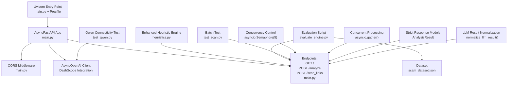
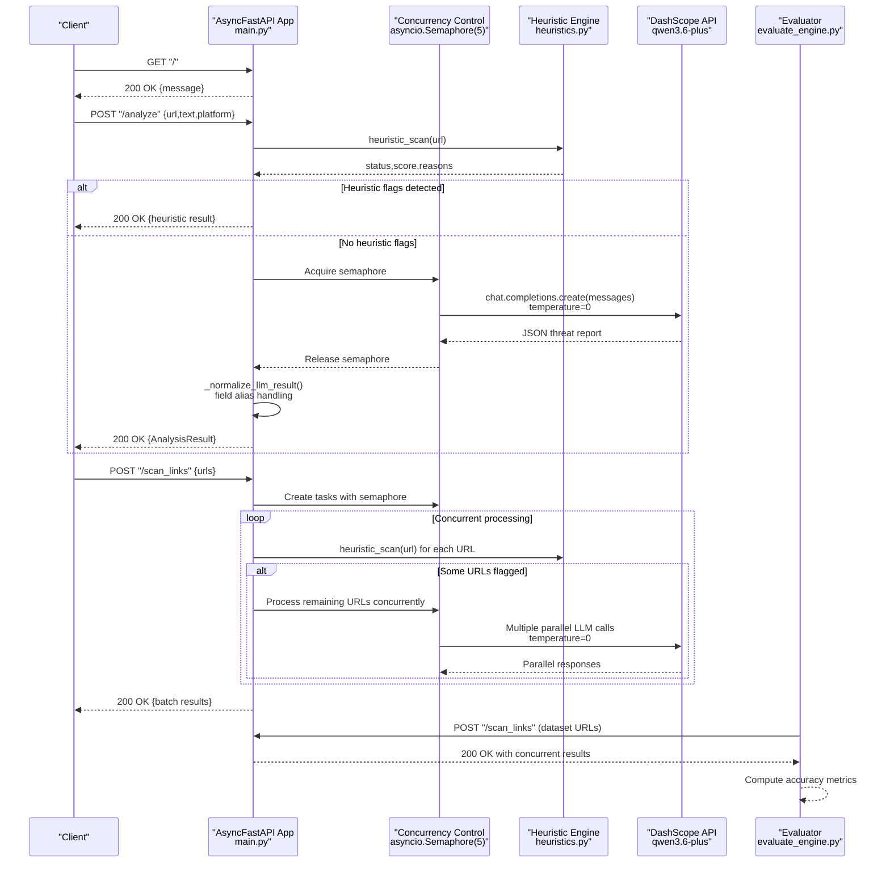
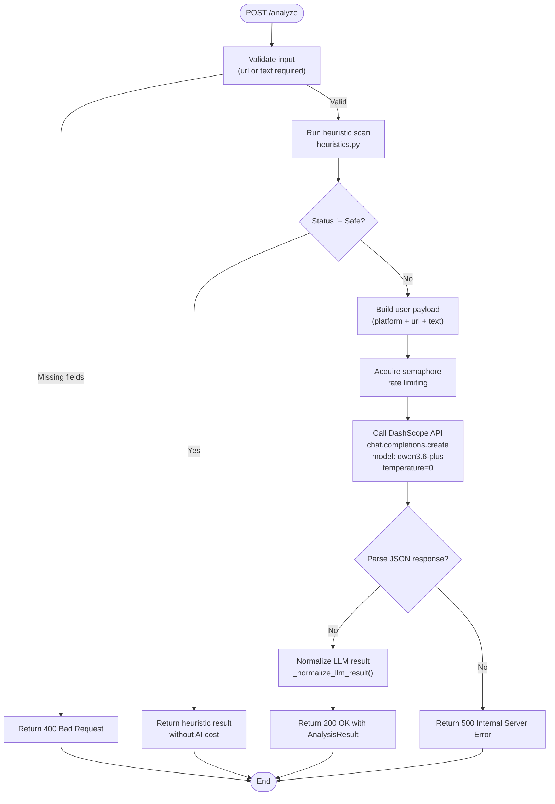
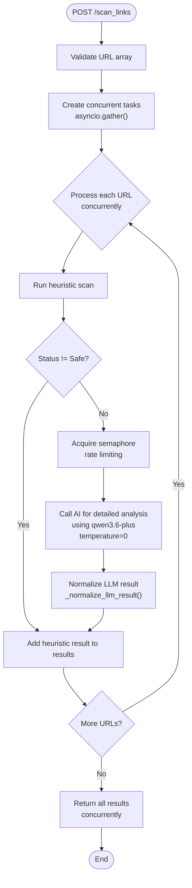
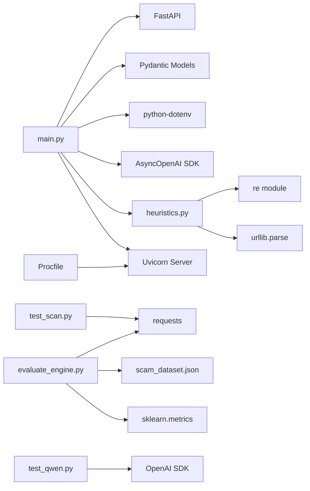

# Backend API Documentation

<cite>
**Referenced Files in This Document**
- [main.py](file://backend/main.py)
- [heuristics.py](file://backend/heuristics.py)
- [evaluate_engine.py](file://backend/evaluate_engine.py)
- [scam_dataset.json](file://backend/scam_dataset.json)
- [test_scan.py](file://backend/test_scan.py)
- [test_qwen.py](file://backend/test_qwen.py)
- [Procfile](file://backend/Procfile)
- [README.md](file://README.md)
</cite>

## Update Summary
**Changes Made**
- **Strict Response Model**: Implemented standardized AnalysisResult model with enforced field types and constraints
- **Enhanced Error Handling**: Added comprehensive error response standardization with HTTPException mapping
- **Rate Limiting**: Integrated asyncio.Semaphore for concurrent LLM call control (max 5 simultaneous calls)
- **Deterministic Processing**: Set temperature=0 for consistent LLM responses
- **Field Normalization**: Added sophisticated LLM result normalization handling field aliases and type coercion
- **Model Update**: Updated from qwen-max to qwen3.6-plus for enhanced performance

## Table of Contents
1. [Introduction](#introduction)
2. [Project Structure](#project-structure)
3. [Core Components](#core-components)
4. [Architecture Overview](#architecture-overview)
5. [Detailed Component Analysis](#detailed-component-analysis)
6. [Dependency Analysis](#dependency-analysis)
7. [Performance Considerations](#performance-considerations)
8. [Troubleshooting Guide](#troubleshooting-guide)
9. [Conclusion](#conclusion)
10. [Appendices](#appendices)

## Introduction
This document provides comprehensive API documentation for the ScrollGuard AI backend RESTful service built with an **asynchronous FastAPI architecture**. The system features a fully async implementation with AsyncOpenAI client integration for DashScope, concurrent URL analysis capabilities, sophisticated heuristic pre-screening, and robust error handling. It covers server configuration (CORS, async OpenAI client setup), endpoint specifications (health check, content analysis, and batch URL scanning), authentication via environment variables, error handling strategies, evaluation framework integration, client implementation guidelines, and debugging using FastAPI's interactive documentation.

**Updated**: The backend now implements strict response models with standardized fields, enhanced error handling, deterministic processing with temperature=0, and sophisticated LLM result normalization for improved reliability and consistency.

## Project Structure
The backend is organized with clear separation of concerns and modern async patterns:
- **Server and endpoints**: main.py (fully asynchronous implementation with strict response models)
- **Heuristic scanning engine**: heuristics.py (enhanced rule-based analysis)
- **Evaluation harness**: evaluate_engine.py (optimized for batch processing)
- **Benchmark dataset**: scam_dataset.json
- **Batch testing utility**: test_scan.py
- **Optional Qwen connectivity test**: test_qwen.py
- **Cloud deployment configuration**: Procfile (Uvicorn entry point)
- **Project overview and setup instructions**: README.md

**Diagram sources**
- [main.py:15-38](file://backend/main.py#L15-L38)
- [main.py:65-73](file://backend/main.py#L65-L73)
- [main.py:209-210](file://backend/main.py#L209-L210)
- [main.py:223-250](file://backend/main.py#L223-L250)
- [main.py:288-295](file://backend/main.py#L288-L295)
- [main.py:324-360](file://backend/main.py#L324-L360)
- [Procfile:1-2](file://backend/Procfile#L1-L2)
- [heuristics.py:40-109](file://backend/heuristics.py#L40-L109)
- [evaluate_engine.py:30-77](file://backend/evaluate_engine.py#L30-L77)

**Section sources**
- [main.py:1-375](file://backend/main.py#L1-L375)
- [heuristics.py:1-110](file://backend/heuristics.py#L1-L110)
- [evaluate_engine.py:1-78](file://backend/evaluate_engine.py#L1-L78)
- [scam_dataset.json:1-37](file://backend/scam_dataset.json#L1-L37)
- [test_scan.py:1-52](file://backend/test_scan.py#L1-L52)
- [test_qwen.py:1-34](file://backend/test_qwen.py#L1-L34)
- [Procfile:1-2](file://backend/Procfile#L1-L2)
- [README.md:63-143](file://README.md#L63-L143)

## Core Components
- **Asynchronous FastAPI application** with CORS enabled for browser extension communication
- **AsyncOpenAI client** configured for Alibaba Cloud DashScope with **qwen3.6-plus model**
- **Pydantic models** defining request/response schemas for structured validation and auto-generated docs
- **Enhanced heuristic scanning engine** with sophisticated pattern matching for suspicious TLDs, URL shortener detection, typosquatting detection, and refined risk scoring
- **Concurrency control** using asyncio.Semaphore for rate limiting (max 5 simultaneous LLM calls)
- **Concurrent URL processing** using asyncio.gather() for efficient batch operations
- **Strict response models** ensuring consistent API contracts with standardized fields
- **Direct server deployment** with Uvicorn entry point and environment-based configuration
- Endpoints:
  - GET /: Health check returning a simple status message
  - POST /analyze: Content analysis endpoint that runs heuristic scans first, then calls LLM if needed
  - POST /scan_links: Batch URL processing endpoint for scanning multiple URLs efficiently with concurrent processing

Key behaviors:
- Environment variable DASHSCOPE_API_KEY is required at startup; missing key raises a runtime error
- The analyze endpoint validates input (requires at least url or text) and runs heuristic scans before AI analysis
- The scan_links endpoint processes multiple URLs concurrently with built-in rate limiting and error handling
- Heuristic scans provide immediate results for obvious threats without consuming AI tokens
- **Enhanced**: Sophisticated heuristic detection includes free TLD detection, typosquatting patterns, shortened URL detection, scam keywords, HTTPS security checks, and domain analysis
- **Enhanced**: Strict AnalysisResult model ensures consistent response format with validated fields (status limited to Safe/Suspicious/Dangerous/Error, score clamped 0-100)
- **Enhanced**: Deterministic processing with temperature=0 for consistent LLM responses
- **Enhanced**: Comprehensive error handling with standardized error responses and HTTPException mapping
- Errors are converted to HTTPException with appropriate status codes
- **New**: Asynchronous architecture enables better performance and resource utilization

**Section sources**
- [main.py:15-38](file://backend/main.py#L15-L38)
- [main.py:55-73](file://backend/main.py#L55-L73)
- [main.py:90-91](file://backend/main.py#L90-L91)
- [main.py:103-168](file://backend/main.py#L103-L168)
- [main.py:177-208](file://backend/main.py#L177-L208)
- [main.py:209-210](file://backend/main.py#L209-L210)
- [main.py:223-250](file://backend/main.py#L223-L250)
- [main.py:288-295](file://backend/main.py#L288-L295)
- [main.py:324-360](file://backend/main.py#L324-L360)
- [heuristics.py:40-109](file://backend/heuristics.py#L40-L109)

## Architecture Overview
The backend exposes a minimal REST API backed by an external LLM with enhanced heuristic pre-screening and **asynchronous concurrency control**. Clients send requests to the FastAPI server, which performs rule-based analysis first, then forwards complex cases to the DashScope API for detailed assessment using concurrent processing. An evaluation script tests the API against a curated dataset to measure accuracy.

**Updated**: The architecture now leverages strict response models, deterministic processing with temperature=0, and enhanced error handling for improved reliability and consistency.

**Diagram sources**
- [main.py:90-91](file://backend/main.py#L90-L91)
- [main.py:123-137](file://backend/main.py#L123-L137)
- [main.py:209-210](file://backend/main.py#L209-L210)
- [main.py:223-250](file://backend/main.py#L223-L250)
- [main.py:288-295](file://backend/main.py#L288-L295)
- [main.py:324-360](file://backend/main.py#L324-L360)
- [heuristics.py:40-109](file://backend/heuristics.py#L40-L109)
- [evaluate_engine.py:30-77](file://backend/evaluate_engine.py#L30-L77)

## Detailed Component Analysis

### Health Check Endpoint: GET /
- Method: GET
- URL Pattern: /
- Purpose: Verify server availability and basic health
- Request: None
- Response Schema:
  - Fields:
    - message: string
- Status Codes:
  - 200 OK: Service is active and responding
- Notes:
  - No authentication required
  - Useful for readiness probes and monitoring

Example responses:
- 200 OK
  - Body: {"message": "ScrollGuard AI Detection Engine is active!"}

**Section sources**
- [main.py:324-326](file://backend/main.py#L324-L326)

### Content Analysis Endpoint: POST /analyze
- Method: POST
- URL Pattern: /analyze
- Purpose: Analyze a URL and/or text content to determine safety and risk level using heuristic pre-screening followed by AI analysis
- Authentication:
  - Requires environment variable DASHSCOPE_API_KEY to be set before server startup
  - No per-request auth header; rely on server-side env configuration
- Request Schema:
  - url: string (optional)
  - text: string (optional)
  - platform: string (default "Unknown")
  - Constraint: At least one of url or text must be provided
- Response Schema:
  - **Strict AnalysisResult model**:
    - url: string (the analyzed URL)
    - status: Literal["Safe", "Suspicious", "Dangerous", "Error"]
    - score: integer (0–100, clamped)
    - explanation: string (brief summary of the threat)
    - reasons: array of strings (reasons for flagging)
- Status Codes:
  - 200 OK: Successful analysis with structured JSON response conforming to AnalysisResult schema
  - 400 Bad Request: Missing both url and text in the request body
  - 500 Internal Server Error: LLM parsing failure or unexpected exception during processing
- Rate Limiting:
  - **Enhanced**: Built-in concurrency control using asyncio.Semaphore (max 5 simultaneous LLM calls)
  - Requests are processed asynchronously with automatic rate limiting to prevent overwhelming the DashScope API
- **Enhanced Features**:
  - Deterministic processing with temperature=0 for consistent results
  - Sophisticated LLM result normalization handling field aliases (risk_score → score, flagged_reasons → reasons)
  - Comprehensive error handling with standardized error responses
  - Strict response validation ensuring API contract compliance

**Updated**: The endpoint now uses the qwen3.6-plus model with deterministic processing (temperature=0), strict response models, and enhanced error handling for improved reliability and consistency.

Request examples:
- Minimal payload with URL only:
  - {"url": "http://example.com", "text": "", "platform": "Browser"}
- Payload with text only:
  - {"url": "", "text": "You won a prize! Click here now!", "platform": "WhatsApp"}
- Full payload:
  - {"url": "https://github.com/trending", "text": "Check trending repos.", "platform": "Browser"}

Response example (200 OK):
- {"url": "http://example.com", "status": "Safe", "score": 10, "explanation": "Standard verified domain with benign content.", "reasons": []}

Error examples:
- 400 Bad Request:
  - {"detail": "Provide at least a URL or text to analyze."}
- 500 Internal Server Error:
  - {"detail": "Failed to parse AI response."}
  - Or generic error details if an unexpected exception occurs

Processing flow:

**Diagram sources**
- [main.py:329-347](file://backend/main.py#L329-L347)
- [main.py:262-320](file://backend/main.py#L262-L320)
- [main.py:223-250](file://backend/main.py#L223-L250)
- [main.py:288-295](file://backend/main.py#L288-L295)
- [heuristics.py:40-109](file://backend/heuristics.py#L40-L109)

**Section sources**
- [main.py:55-58](file://backend/main.py#L55-L58)
- [main.py:65-73](file://backend/main.py#L65-L73)
- [main.py:329-347](file://backend/main.py#L329-L347)

### Batch URL Processing Endpoint: POST /scan_links
- Method: POST
- URL Pattern: /scan_links
- Purpose: Process multiple URLs in a single request for efficient batch analysis with **concurrent processing**
- Authentication:
  - Requires environment variable DASHSCOPE_API_KEY to be set before server startup
  - No per-request auth header; rely on server-side env configuration
- Request Schema:
  - urls: array of strings (required)
  - Each URL will be processed individually with heuristic pre-screening and concurrent LLM calls
- Response Schema:
  - Array of AnalysisResult objects, each containing:
    - url: string (the original URL)
    - status: Literal["Safe", "Suspicious", "Dangerous", "Error"]
    - score: integer (0–100, clamped)
    - explanation: string (brief summary of the threat)
    - reasons: array of strings (reasons for flagging)
- Status Codes:
  - 200 OK: Successful batch processing with results for all URLs
  - 400 Bad Request: Invalid request format or empty URL list
  - 500 Internal Server Error: Unexpected processing errors

**Enhanced Feature**: This endpoint enables efficient batch processing of multiple URLs with **concurrent processing** using asyncio.gather() and built-in rate limiting through asyncio.Semaphore. All responses conform to the strict AnalysisResult model with standardized fields and deterministic processing.

Request examples:
- Basic batch request:
  - {"urls": ["http://example.com", "https://github.com", "http://bit.ly/scam-link"]}
- Large batch request:
  - {"urls": ["url1", "url2", "url3", "url4", "url5"]}

Response example (200 OK):
- [
  {"url": "http://example.com", "status": "Safe", "score": 10, "explanation": "Standard verified domain.", "reasons": []},
  {"url": "http://bit.ly/scam-link", "status": "Suspicious", "score": 45, "explanation": "Shortened URL detected", "reasons": ["URL shortener service detected"]},
  {"url": "http://malicious.tk", "status": "Dangerous", "score": 85, "explanation": "Free TLD domain often used in scams", "reasons": ["Free / suspicious TLD often abused for scams"]}
]

Processing flow:

**Diagram sources**
- [main.py:350-360](file://backend/main.py#L350-L360)
- [main.py:209-210](file://backend/main.py#L209-L210)

**Section sources**
- [main.py:61-62](file://backend/main.py#L61-L62)
- [main.py:350-360](file://backend/main.py#L350-L360)

### Enhanced Heuristic Scanning Engine
- **Enhanced Component**: Advanced rule-based URL analysis engine that identifies common scam patterns before AI processing
- Location: heuristics.py
- Function: `heuristic_scan(url: str)` returns tuple `(status, risk_score, reasons)`

**Enhanced Detection Rules**:
1. **Free/Suspicious TLD Detection**: Identifies domains ending in .tk, .ml, .ga, .cf, .gq, .xyz, .top, .buzz, .click, .icu, .cam (+40 points)
2. **Typosquatting Patterns**: Detects suspicious character patterns like "g00gl", "paypa1", "amaz0n", "faceb00k", "app1e", "mircosoft" (+35 points)
3. **URL Shortener Detection**: Identifies bit.ly, tinyurl.com, t.co, ow.ly, shorturl.at, goo.gl, is.gd, buff.ly, rebrand.ly (+20 points)
4. **Scam Keywords in Path**: Scans URL paths for words like "claim", "winner", "free-money", "giveaway", "bonus", "verify-account", "urgent-security", "login-secure" (+30 points)
5. **Scam Keywords in Domain**: Detects suspicious domain patterns like "free-money", "claim-now", "verify-urgent", "account-verify", "bank-account-verify" (+25 points)
6. **Excessive Subdomain Depth**: Flags unusually deep subdomain nesting (>4 levels) (+15 points)
7. **Hyphen-heavy Domains**: Detects domains with many hyphens (common phishing pattern) (+20 points)
8. **HTTPS Security**: Flags non-HTTPS URLs (+10 points)

Classification Logic:
- Risk score ≥ 70: "Dangerous"
- Risk score ≥ 30: "Suspicious"
- Risk score < 30: "Safe"

Benefits:
- Immediate threat detection without AI token consumption
- Reduces API costs by filtering obvious threats
- Provides transparent reasoning for heuristic flags
- Improves overall system performance
- **Enhanced**: More sophisticated pattern matching with brand-specific typosquatting detection

**Section sources**
- [heuristics.py:40-109](file://backend/heuristics.py#L40-L109)

### CORS Middleware Configuration
- Allows cross-origin requests from any origin, method, and header to support browser extension communication
- Credentials are allowed

Configuration highlights:
- allow_origins: ["*"]
- allow_credentials: True
- allow_methods: ["*"]
- allow_headers: ["*"]

**Section sources**
- [main.py:45-51](file://backend/main.py#L45-L51)

### AsyncOpenAI Client Setup for DashScope Integration
- Uses the **AsyncOpenAI SDK** with a custom base_url pointing to DashScope's compatible endpoint
- **Updated Model**: Now using **qwen3.6-plus** instead of qwen-max for enhanced performance
- Authentication via DASHSCOPE_API_KEY loaded from environment
- **Fully asynchronous implementation** for better performance and resource utilization
- **Enhanced**: Deterministic processing with temperature=0 for consistent results

Notes:
- If DASHSCOPE_API_KEY is not set, the server will raise a runtime error at startup
- The same client configuration is mirrored in the optional connectivity test script
- **Enhanced**: Async implementation enables concurrent API calls with proper rate limiting
- **Enhanced**: Temperature=0 setting ensures deterministic and consistent LLM responses

**Section sources**
- [main.py:15-38](file://backend/main.py#L15-L38)
- [main.py:288-295](file://backend/main.py#L288-L295)
- [test_qwen.py:1-34](file://backend/test_qwen.py#L1-L34)

### Direct Server Deployment with Uvicorn
- **New Feature**: Built-in Uvicorn entry point for direct server deployment
- Environment-based configuration support for flexible deployment scenarios
- Cloud-ready deployment with configurable port binding

Deployment Options:
- **Direct Execution**: Run `python main.py` for local development
- **Development Mode**: Use `python -m uvicorn main:app --reload --port 8000` for auto-reload
- **Production Deployment**: Configure via Procfile for PaaS platforms
- **Environment Variables**: PORT (default 8000), ENV (development vs production mode)

Configuration Features:
- Automatic reload in development mode when ENV != "production"
- Host binding to 0.0.0.0 for container/cloud compatibility
- Port configuration via environment variable with default fallback

**Section sources**
- [main.py:365-374](file://backend/main.py#L365-L374)
- [Procfile:1-2](file://backend/Procfile#L1-L2)

### Evaluation Framework Integration
The evaluation script has been optimized for the new batch endpoint with concurrent processing:
- Reads scam_dataset.json containing sample entries with expected statuses
- Sends all URLs in a single batch request to the /scan_links endpoint
- Compares predicted statuses with expected_status and computes accuracy metrics
- Prints detailed logs per URL including platform, expected vs predicted, risk score, explanation, and flagged reasons
- Uses sklearn metrics for classification_report and confusion_matrix analysis

Usage:
- Ensure the FastAPI server is running locally at http://127.0.0.1:8000
- Execute the evaluation script from the backend directory

Data model in dataset:
- id: integer
- url: string
- text: string
- platform: string
- expected_status: string ("Safe", "Suspicious", or "Dangerous")

Accuracy calculation:
- Accuracy = (correct predictions / total samples) * 100

**Enhanced**: Now uses batch processing with concurrent execution for improved efficiency and reduced API calls.

**Section sources**
- [evaluate_engine.py:30-77](file://backend/evaluate_engine.py#L30-L77)
- [scam_dataset.json:1-37](file://backend/scam_dataset.json#L1-L37)
- [README.md:175-190](file://README.md#L175-L190)

### Strict Response Models and Error Handling
- **Enhanced Component**: Comprehensive response model enforcement and error handling
- **AnalysisResult Model**: Strict Pydantic model ensuring consistent API responses
  - url: string (the analyzed URL)
  - status: Literal["Safe", "Suspicious", "Dangerous", "Error"] (validated enum)
  - score: int with Field(ge=0, le=100) (clamped between 0-100)
  - explanation: str (default empty string)
  - reasons: list[str] (default empty list)
- **LLM Result Normalization**: Sophisticated handling of field aliases and type coercion
  - Handles risk_score → score mapping
  - Handles flagged_reasons → reasons mapping
  - Validates and normalizes status values
  - Coerces scores to integers within valid range
  - Ensures reasons arrays contain only strings
- **Error Handling**: Standardized error responses with HTTPException mapping
  - 400 Bad Request for validation errors
  - 500 Internal Server Error for processing failures
  - Consistent error message format

**Section sources**
- [main.py:65-73](file://backend/main.py#L65-L73)
- [main.py:215-250](file://backend/main.py#L215-L250)
- [main.py:332-346](file://backend/main.py#L332-L346)

## Dependency Analysis
High-level dependencies:
- FastAPI and Uvicorn for serving the API
- Pydantic for request/response modeling and validation
- python-dotenv for loading environment variables
- **AsyncOpenAI SDK** for calling DashScope's OpenAI-compatible API
- requests used by the evaluation script to call the API
- **Enhanced**: re and urllib.parse for sophisticated heuristic URL analysis
- **Enhanced**: sklearn for evaluation metrics computation

**Diagram sources**
- [main.py:15-38](file://backend/main.py#L15-L38)
- [main.py:365-374](file://backend/main.py#L365-L374)
- [heuristics.py:11-12](file://backend/heuristics.py#L11-L12)
- [evaluate_engine.py:12-17](file://backend/evaluate_engine.py#L12-L17)
- [test_qwen.py:1-15](file://backend/test_qwen.py#L1-L15)
- [Procfile:1-2](file://backend/Procfile#L1-L2)

**Section sources**
- [main.py:15-38](file://backend/main.py#L15-L38)
- [main.py:365-374](file://backend/main.py#L365-L374)
- [heuristics.py:11-12](file://backend/heuristics.py#L11-L12)
- [evaluate_engine.py:12-17](file://backend/evaluate_engine.py#L12-L17)

## Performance Considerations
- **Enhanced**: Heuristic pre-screening significantly reduces AI token usage by filtering obvious threats before expensive LLM calls
- **Enhanced**: Built-in concurrency control using asyncio.Semaphore prevents overwhelming the DashScope API with too many simultaneous requests (max 5 concurrent calls)
- **Enhanced**: Fully asynchronous architecture enables better resource utilization and concurrent processing
- **Enhanced**: Deterministic processing with temperature=0 ensures consistent and predictable LLM responses
- Network latency to DashScope may vary; consider timeouts and retries in clients
- Avoid sending overly large payloads; keep text concise to reduce token usage and latency
- **Enhanced**: Use the /scan_links endpoint for batch processing to improve efficiency and reduce API overhead
- **Enhanced**: Concurrent URL processing with asyncio.gather() maximizes throughput while respecting rate limits
- **New**: Direct server deployment eliminates additional process management overhead
- **Enhanced**: Strict response models reduce parsing overhead and ensure consistent client behavior
- Batch evaluations can be run offline using the evaluation script to measure throughput and accuracy without impacting live users

## Troubleshooting Guide
Common issues and resolutions:
- Missing API key:
  - Symptom: Server fails to start with a runtime error indicating the API key is not set
  - Resolution: Set DASHSCOPE_API_KEY in a .env file within the backend directory and ensure it is loaded
- Invalid request to /analyze:
  - Symptom: 400 Bad Request when neither url nor text is provided
  - Resolution: Include at least one of url or text in the request body
- LLM parsing errors:
  - Symptom: 500 Internal Server Error due to non-JSON or malformed response from the model
  - Resolution: Inspect system prompt and user payload; ensure the model returns valid JSON matching the expected schema
- CORS issues:
  - Symptom: Browser blocks requests from the extension
  - Resolution: Confirm CORS middleware is enabled and origins/methods/headers are permitted
- **Enhanced**: Heuristic false positives:
  - Symptom: Legitimate URLs flagged by heuristic rules
  - Resolution: Review enhanced heuristic rules in heuristics.py and adjust thresholds if necessary
- **Enhanced**: Concurrency issues:
  - Symptom: Too many simultaneous LLM calls causing rate limiting
  - Resolution: Adjust _MAX_CONCURRENT_AI_CALLS constant in main.py to control concurrent requests
- **Enhanced**: Response model validation errors:
  - Symptom: 500 errors due to invalid response formats
  - Resolution: Check LLM output formatting and ensure it conforms to the strict AnalysisResult schema
- **New**: Deployment issues:
  - Symptom: Server fails to start with Uvicorn
  - Resolution: Check environment variables (PORT, ENV) and ensure proper installation of dependencies
  - For cloud deployments, verify Procfile configuration matches your platform requirements

Debugging with FastAPI docs:
- Interactive API documentation is available at http://127.0.0.1:8000/docs
- Use it to explore endpoints, test requests, and inspect response schemas directly in the browser
- **Enhanced**: Test the /scan_links endpoint with batch URL processing capabilities and observe concurrent processing behavior
- **Enhanced**: Verify strict response model validation and standardized error handling

**Section sources**
- [main.py:32-34](file://backend/main.py#L32-L34)
- [main.py:332-346](file://backend/main.py#L332-L346)
- [main.py:350-360](file://backend/main.py#L350-L360)
- [main.py:365-374](file://backend/main.py#L365-L374)
- [README.md:127-143](file://README.md#L127-L143)

## Conclusion
The ScrollGuard AI backend provides a lightweight, secure, and extensible REST API for real-time content analysis powered by DashScope's **qwen3.6-plus model** with **strict response models**, **deterministic processing**, and **enhanced error handling**. The complete rewrite to async FastAPI with AsyncOpenAI client, combined with asyncio.Semaphore for rate limiting and asyncio.gather() for concurrent URL analysis, significantly improves performance and scalability while maintaining high accuracy. With direct server deployment capabilities through Uvicorn entry points and environment-based configuration, the system supports rapid development and continuous quality assurance. Clients should implement resilient networking patterns, including retries and rate limiting, to ensure reliable operation in production environments.

**Updated**: The implementation now features strict response models ensuring API contract compliance, deterministic processing with temperature=0 for consistent results, sophisticated LLM result normalization handling field aliases, and comprehensive error handling for improved reliability and maintainability.

## Appendices

### Client Implementation Guidelines
- Base URL: http://127.0.0.1:8000 (or your deployed host)
- Endpoints:
  - GET /: Health check
  - POST /analyze: Single URL/text analysis with heuristic pre-screening
  - **Enhanced**: POST /scan_links: Batch URL processing for multiple URLs with concurrent execution
- Headers:
  - Content-Type: application/json
- Request bodies:
  - POST /analyze:
    - url: string (optional)
    - text: string (optional)
    - platform: string (default "Unknown")
  - **Enhanced**: POST /scan_links:
    - urls: array of strings (required)
- Response handling:
  - On 200 OK: Parse JSON and extract status, score, explanation, reasons from AnalysisResult
  - On 400 Bad Request: Prompt user to provide at least url or text
  - On 500 Internal Server Error: Retry with backoff or surface a user-friendly error
- **Enhanced**: Batch processing best practices:
  - Use /scan_links for processing multiple URLs to improve efficiency with concurrent execution
  - Handle mixed results where some URLs may be flagged by heuristics while others require AI analysis
  - Implement proper error handling for individual URL failures within batch requests
  - Leverage built-in concurrency control to avoid overwhelming the API
  - Expect consistent AnalysisResult responses with standardized fields
- Retry logic:
  - Implement exponential backoff with jitter for transient errors (network issues, 5xx responses)
  - Respect upstream rate limits; add delays between requests if necessary
- Example flows:
  - Health check: GET / -> expect 200 OK with message field
  - Analysis: POST /analyze -> expect 200 OK with AnalysisResult or appropriate error
  - **Enhanced**: Batch processing: POST /scan_links -> expect 200 OK with array of AnalysisResult objects

### Server Deployment Options
- **Local Development**:
  - Direct execution: `python main.py`
  - Auto-reload mode: `python -m uvicorn main:app --reload --port 8000`
- **Production Deployment**:
  - Procfile-based: `web: uvicorn main:app --host 0.0.0.0 --port $PORT`
  - Environment variables: DASHSCOPE_API_KEY, PORT (default 8000), ENV (development/production)
- **Cloud Platforms**:
  - Render, Heroku, Railway: Standard Procfile support
  - Containerized: Docker-friendly with environment variable configuration

### Evaluation Workflow
- Run the evaluation script after starting the server
- The script reads scam_dataset.json, sends batch requests to /scan_links, compares predicted status with expected_status, and prints accuracy metrics
- Use this workflow to validate improvements to prompts, heuristic rules, or model behavior
- **Enhanced**: The evaluation now benefits from batch processing efficiency and concurrent execution capabilities

**Section sources**
- [evaluate_engine.py:30-77](file://backend/evaluate_engine.py#L30-L77)
- [scam_dataset.json:1-37](file://backend/scam_dataset.json#L1-L37)
- [README.md:175-190](file://README.md#L175-L190)

### Enhanced Heuristic Rules Reference
The enhanced heuristic engine applies the following sophisticated detection rules with associated risk scores:

| Rule Type | Pattern | Risk Score | Status Impact |
|-----------|---------|------------|---------------|
| Free/Suspicious TLD | .tk, .ml, .ga, .cf, .gq, .xyz, .top, .buzz, .click, .icu, .cam | +40 | Dangerous (≥70) |
| Typosquatting | g00gl, paypa1, amaz0n, faceb00k, app1e, mircosoft | +35 | Dangerous (≥70) |
| URL Shorteners | bit.ly, tinyurl.com, t.co, ow.ly, shorturl.at, goo.gl, is.gd, buff.ly, rebrand.ly | +20 | Suspicious (≥30) |
| Path Keywords | claim, winner, free-money, giveaway, bonus, verify-account, urgent-security, login-secure | +30 | Suspicious (≥30) |
| Domain Keywords | free-money, claim-now, verify-urgent, account-verify, bank-account-verify | +25 | Suspicious (≥30) |
| Excessive Subdomains | >4 levels of subdomain nesting | +15 | Minor impact |
| Hyphen-heavy Domains | Domains with 3+ hyphens | +20 | Suspicious (≥30) |
| HTTPS Missing | Non-HTTPS URLs | +10 | Minor impact |

**Section sources**
- [heuristics.py:16-98](file://backend/heuristics.py#L16-L98)

### Model and Processing Updates
- **Current Model**: qwen3.6-plus (updated from qwen-max)
- **Processing**: Deterministic with temperature=0 for consistent results
- **Response Models**: Strict AnalysisResult with validated fields and constraints
- **Error Handling**: Comprehensive with standardized HTTPException mapping
- **Rate Limiting**: asyncio.Semaphore with max 5 concurrent calls
- **Benefits**: Improved reliability, consistency, and maintainability

**Section sources**
- [main.py:288-295](file://backend/main.py#L288-L295)
- [main.py:65-73](file://backend/main.py#L65-L73)
- [main.py:209-210](file://backend/main.py#L209-L210)
- [main.py:223-250](file://backend/main.py#L223-L250)

### Strict Response Model Details
The AnalysisResult model enforces strict API contracts:

| Field | Type | Constraints | Description |
|-------|------|-------------|-------------|
| url | string | Required | The analyzed URL |
| status | Literal["Safe", "Suspicious", "Dangerous", "Error"] | Enum validation | Threat classification |
| score | integer | ge=0, le=100 | Risk score (0-100) |
| explanation | string | Default "" | Brief threat summary |
| reasons | list[string] | Default [] | Array of flagging reasons |

**Section sources**
- [main.py:65-73](file://backend/main.py#L65-L73)