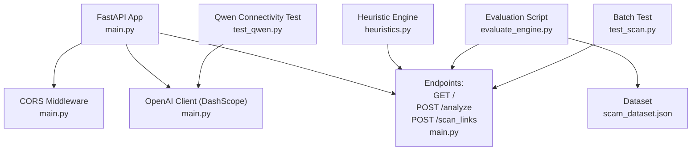
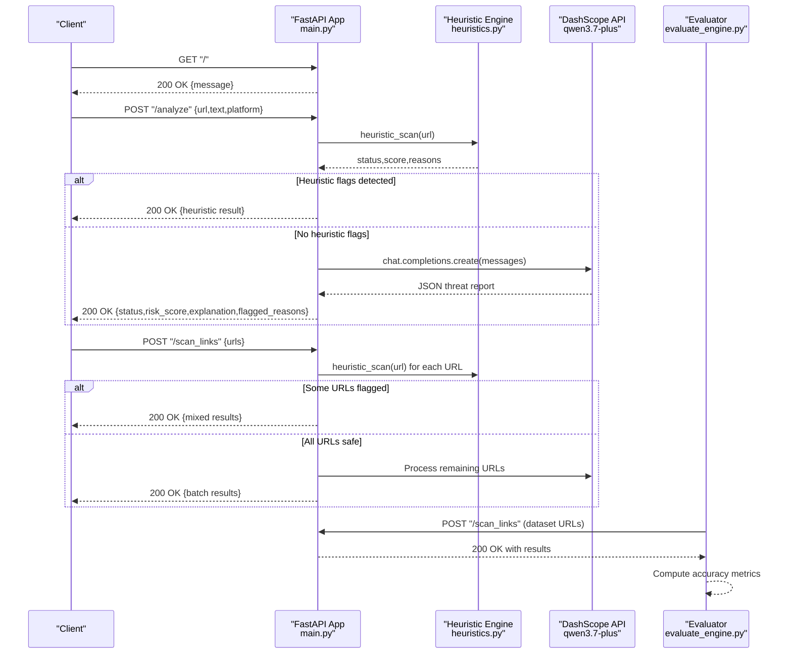
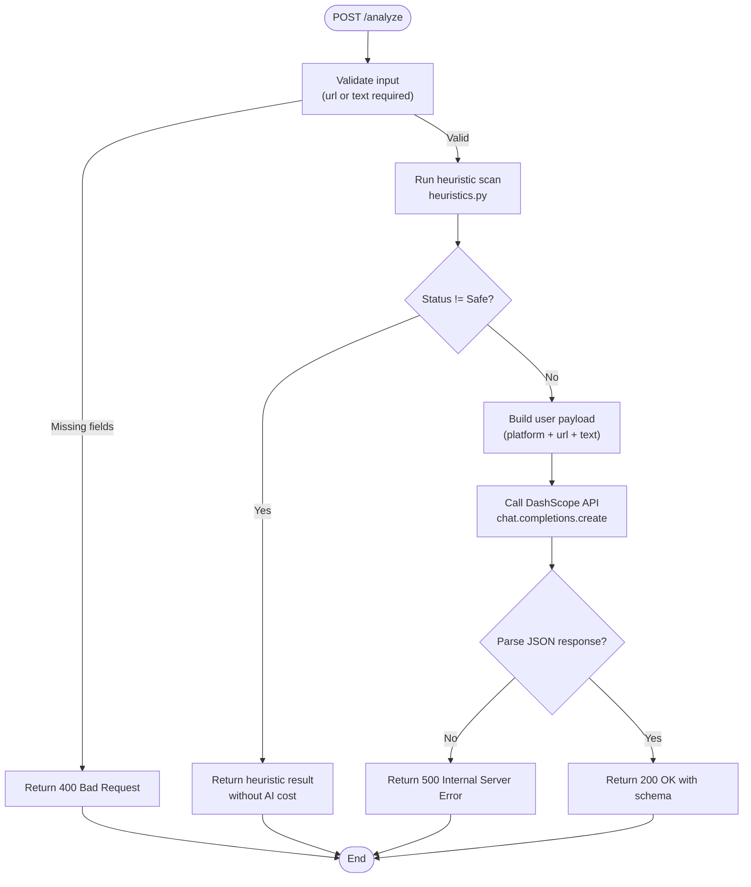
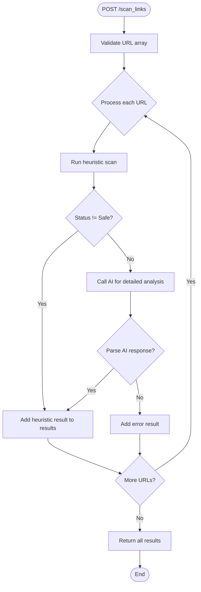
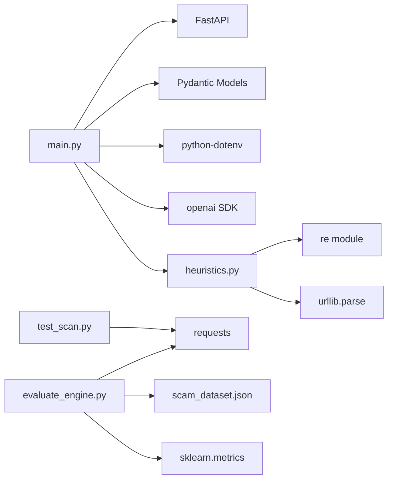

Based on my analysis of the codebase changes, I can now update the documentation to reflect the new `/scan_links` endpoint, enhanced `/analyze` endpoint with heuristic scans, and the integrated `heuristics.py` module. Here's the updated documentation:

# Backend API Documentation

<cite>
**Referenced Files in This Document**
- [main.py](file://backend/main.py)
- [heuristics.py](file://backend/heuristics.py)
- [evaluate_engine.py](file://backend/evaluate_engine.py)
- [scam_dataset.json](file://backend/scam_dataset.json)
- [test_scan.py](file://backend/test_scan.py)
- [test_qwen.py](file://backend/test_qwen.py)
- [README.md](file://README.md)
</cite>

## Update Summary
**Changes Made**
- Added new `/scan_links` batch processing endpoint for URL scanning
- Enhanced `/analyze` endpoint to run heuristic scans before AI analysis
- Integrated new `heuristics.py` module for rule-based URL scanning with pattern matching
- Updated evaluation framework to use the new batch endpoint
- Added comprehensive heuristic detection rules for common scam indicators

## Table of Contents
1. [Introduction](#introduction)
2. [Project Structure](#project-structure)
3. [Core Components](#core-components)
4. [Architecture Overview](#architecture-overview)
5. [Detailed Component Analysis](#detailed-component-analysis)
6. [Dependency Analysis](#dependency-analysis)
7. [Performance Considerations](#performance-considerations)
8. [Troubleshooting Guide](#troubleshooting-guide)
9. [Conclusion](#conclusion)
10. [Appendices](#appendices)

## Introduction
This document provides comprehensive API documentation for the ScrollGuard AI backend RESTful service built with FastAPI. It covers server configuration (CORS, OpenAI client setup for DashScope), endpoint specifications (health check, content analysis, and batch URL scanning), authentication via environment variables, error handling, evaluation framework integration, client implementation guidelines, and debugging using FastAPI's interactive documentation.

## Project Structure
The backend is organized with clear separation of concerns:
- Server and endpoints: main.py
- Heuristic scanning engine: heuristics.py
- Evaluation harness: evaluate_engine.py
- Benchmark dataset: scam_dataset.json
- Batch testing utility: test_scan.py
- Optional Qwen connectivity test: test_qwen.py
- Project overview and setup instructions: README.md

**Diagram sources**
- [main.py:21-30](file://backend/main.py#L21-L30)
- [main.py:66-149](file://backend/main.py#L66-L149)
- [heuristics.py:4-48](file://backend/heuristics.py#L4-L48)
- [evaluate_engine.py:12-43](file://backend/evaluate_engine.py#L12-L43)
- [test_scan.py:10-21](file://backend/test_scan.py#L10-L21)

**Section sources**
- [main.py:1-150](file://backend/main.py#L1-L150)
- [heuristics.py:1-49](file://backend/heuristics.py#L1-L49)
- [evaluate_engine.py:1-44](file://backend/evaluate_engine.py#L1-L44)
- [scam_dataset.json:1-37](file://backend/scam_dataset.json#L1-L37)
- [test_scan.py:1-22](file://backend/test_scan.py#L1-L22)
- [test_qwen.py:1-34](file://backend/test_qwen.py#L1-L34)
- [README.md:63-143](file://README.md#L63-L143)

## Core Components
- FastAPI application with CORS enabled to allow browser extension communication.
- OpenAI-compatible client configured to use Alibaba Cloud DashScope with model qwen3.7-plus.
- Pydantic models defining request/response schemas for structured validation and auto-generated docs.
- **Enhanced**: Heuristic scanning engine for rule-based URL analysis before AI processing.
- Endpoints:
  - GET /: Health check returning a simple status message.
  - POST /analyze: Content analysis endpoint that runs heuristic scans first, then calls LLM if needed.
  - **New**: POST /scan_links: Batch URL processing endpoint for scanning multiple URLs efficiently.

Key behaviors:
- Environment variable DASHSCOPE_API_KEY is required at startup; missing key raises a runtime error.
- The analyze endpoint validates input (requires at least url or text) and runs heuristic scans before AI analysis.
- The scan_links endpoint processes multiple URLs with built-in rate limiting and error handling.
- Heuristic scans provide immediate results for obvious threats without consuming AI tokens.
- Errors are converted to HTTPException with appropriate status codes.

**Section sources**
- [main.py:12-19](file://backend/main.py#L12-L19)
- [main.py:21-30](file://backend/main.py#L21-L30)
- [main.py:33-46](file://backend/main.py#L33-L46)
- [main.py:71-149](file://backend/main.py#L71-L149)
- [heuristics.py:4-48](file://backend/heuristics.py#L4-L48)

## Architecture Overview
The backend exposes a minimal REST API backed by an external LLM with enhanced heuristic pre-screening. Clients send requests to the FastAPI server, which performs rule-based analysis first, then forwards complex cases to the DashScope API for detailed assessment. An evaluation script tests the API against a curated dataset to measure accuracy.

**Diagram sources**
- [main.py:66-149](file://backend/main.py#L66-L149)
- [heuristics.py:4-48](file://backend/heuristics.py#L4-L48)
- [evaluate_engine.py:12-43](file://backend/evaluate_engine.py#L12-L43)

## Detailed Component Analysis

### Health Check Endpoint: GET /
- Method: GET
- URL Pattern: /
- Purpose: Verify server availability and basic health.
- Request: None
- Response Schema:
  - Fields:
    - message: string
- Status Codes:
  - 200 OK: Service is active and responding.
- Notes:
  - No authentication required.
  - Useful for readiness probes and monitoring.

Example responses:
- 200 OK
  - Body: {"message": "ScrollGuard AI Detection Engine is active!"}

**Section sources**
- [main.py:66-68](file://backend/main.py#L66-L68)

### Content Analysis Endpoint: POST /analyze
- Method: POST
- URL Pattern: /analyze
- Purpose: Analyze a URL and/or text content to determine safety and risk level using heuristic pre-screening followed by AI analysis.
- Authentication:
  - Requires environment variable DASHSCOPE_API_KEY to be set before server startup.
  - No per-request auth header; rely on server-side env configuration.
- Request Schema:
  - url: string (optional)
  - text: string (optional)
  - platform: string (default "Unknown")
  - Constraint: At least one of url or text must be provided.
- Response Schema:
  - status: string ("Safe", "Suspicious", or "Dangerous")
  - risk_score: integer (0–100)
  - explanation: string (brief summary of the threat)
  - flagged_reasons: array of strings (reasons for flagging)
- Status Codes:
  - 200 OK: Successful analysis with structured JSON response.
  - 400 Bad Request: Missing both url and text in the request body.
  - 500 Internal Server Error: LLM parsing failure or unexpected exception during processing.
- Rate Limiting:
  - Not implemented in the server code. Requests are forwarded directly to the DashScope API.
  - Consumers should implement client-side rate limiting and retry logic to respect upstream quotas and avoid overloading the service.

**Updated**: The endpoint now includes heuristic pre-screening that can immediately identify obvious threats without consuming AI tokens.

Request examples:
- Minimal payload with URL only:
  - {"url": "http://example.com", "text": "", "platform": "Browser"}
- Payload with text only:
  - {"url": "", "text": "You won a prize! Click here now!", "platform": "WhatsApp"}
- Full payload:
  - {"url": "https://github.com/trending", "text": "Check trending repos.", "platform": "Browser"}

Response example (200 OK):
- {"status": "Safe", "risk_score": 10, "explanation": "Standard verified domain with benign content.", "flagged_reasons": []}

Error examples:
- 400 Bad Request:
  - {"detail": "Provide at least a URL or text to analyze."}
- 500 Internal Server Error:
  - {"detail": "Failed to parse structured response from AI model."}
  - Or generic error details if an unexpected exception occurs.

Processing flow:

**Diagram sources**
- [main.py:71-107](file://backend/main.py#L71-L107)
- [heuristics.py:4-48](file://backend/heuristics.py#L4-L48)

**Section sources**
- [main.py:33-42](file://backend/main.py#L33-L42)
- [main.py:71-107](file://backend/main.py#L71-L107)

### Batch URL Processing Endpoint: POST /scan_links
- Method: POST
- URL Pattern: /scan_links
- Purpose: Process multiple URLs in a single request for efficient batch analysis.
- Authentication:
  - Requires environment variable DASHSCOPE_API_KEY to be set before server startup.
  - No per-request auth header; rely on server-side env configuration.
- Request Schema:
  - urls: array of strings (required)
  - Each URL will be processed individually with heuristic pre-screening.
- Response Schema:
  - Array of objects, each containing:
    - url: string (the original URL)
    - status: string ("Safe", "Suspicious", "Dangerous", or "Error")
    - risk_score: integer (0–100)
    - explanation: string (brief summary of the threat)
    - flagged_reasons: array of strings (reasons for flagging)
- Status Codes:
  - 200 OK: Successful batch processing with results for all URLs.
  - 400 Bad Request: Invalid request format or empty URL list.
  - 500 Internal Server Error: Unexpected processing errors.

**New Feature**: This endpoint enables efficient batch processing of multiple URLs with built-in error handling and mixed results support.

Request examples:
- Basic batch request:
  - {"urls": ["http://example.com", "https://github.com", "http://bit.ly/scam-link"]}
- Large batch request:
  - {"urls": ["url1", "url2", "url3", "url4", "url5"]}

Response example (200 OK):
- [
  {"url": "http://example.com", "status": "Safe", "risk_score": 10, "explanation": "Standard verified domain.", "flagged_reasons": []},
  {"url": "http://bit.ly/scam-link", "status": "Suspicious", "risk_score": 45, "explanation": "Shortened URL detected", "flagged_reasons": ["Shortened URL detected"]},
  {"url": "http://malicious.tk", "status": "Dangerous", "risk_score": 85, "explanation": "Free TLD domain often used in scams", "flagged_reasons": ["Free TLD domain often used in scams"]}
]

Processing flow:

**Diagram sources**
- [main.py:110-149](file://backend/main.py#L110-L149)

**Section sources**
- [main.py:44-46](file://backend/main.py#L44-L46)
- [main.py:110-149](file://backend/main.py#L110-L149)

### Heuristic Scanning Engine
- **New Component**: Rule-based URL analysis engine that identifies common scam patterns before AI processing.
- Location: heuristics.py
- Function: `heuristic_scan(url: str)` returns tuple `(status, risk_score, reasons)`

Detection Rules:
1. **Free TLD Detection**: Identifies domains ending in .tk, .ml, .ga, .cf, .gq (+40 points)
2. **Typosquatting Patterns**: Detects suspicious character patterns like "00", "ll", "-" (+25 points)
3. **Shortened URL Detection**: Identifies bit.ly, tinyurl, t.co links (+20 points)
4. **Scam Keywords**: Scans for words like "claim", "win", "free", "bonus", "verify", "urgent", "login" (+30 points)
5. **HTTPS Security**: Flags non-HTTPS URLs (+15 points)

Classification Logic:
- Risk score ≥ 70: "Dangerous"
- Risk score ≥ 30: "Suspicious"
- Risk score < 30: "Safe"

Benefits:
- Immediate threat detection without AI token consumption
- Reduces API costs by filtering obvious threats
- Provides transparent reasoning for heuristic flags
- Improves overall system performance

**Section sources**
- [heuristics.py:4-48](file://backend/heuristics.py#L4-L48)

### CORS Middleware Configuration
- Allows cross-origin requests from any origin, method, and header to support browser extension communication.
- Credentials are allowed.

Configuration highlights:
- allow_origins: ["*"]
- allow_credentials: True
- allow_methods: ["*"]
- allow_headers: ["*"]

**Section sources**
- [main.py:24-30](file://backend/main.py#L24-L30)

### OpenAI Client Setup for DashScope Integration
- Uses the OpenAI SDK with a custom base_url pointing to DashScope's compatible endpoint.
- Model used: qwen3.7-plus
- Authentication via DASHSCOPE_API_KEY loaded from environment.

Notes:
- If DASHSCOPE_API_KEY is not set, the server will raise a runtime error at startup.
- The same client configuration is mirrored in the optional connectivity test script.

**Section sources**
- [main.py:12-19](file://backend/main.py#L12-L19)
- [test_qwen.py:7-15](file://backend/test_qwen.py#L7-L15)

### Evaluation Framework Integration
The evaluation script has been updated to use the new batch endpoint for more efficient testing:
- Reads scam_dataset.json containing sample entries with expected statuses.
- Sends all URLs in a single batch request to the /scan_links endpoint.
- Compares predicted statuses with expected_status and computes accuracy metrics.
- Prints detailed logs per URL including platform, expected vs predicted, risk score, explanation, and flagged reasons.
- Uses sklearn metrics for classification_report and confusion_matrix analysis.

Usage:
- Ensure the FastAPI server is running locally at http://127.0.0.1:8000.
- Execute the evaluation script from the backend directory.

Data model in dataset:
- id: integer
- url: string
- text: string
- platform: string
- expected_status: string ("Safe", "Suspicious", or "Dangerous")

Accuracy calculation:
- Accuracy = (correct predictions / total samples) * 100

**Updated**: Now uses batch processing for improved efficiency and reduced API calls.

**Section sources**
- [evaluate_engine.py:1-44](file://backend/evaluate_engine.py#L1-L44)
- [scam_dataset.json:1-37](file://backend/scam_dataset.json#L1-L37)
- [README.md:175-190](file://README.md#L175-L190)

## Dependency Analysis
High-level dependencies:
- FastAPI and Uvicorn for serving the API.
- Pydantic for request/response modeling and validation.
- python-dotenv for loading environment variables.
- openai SDK for calling DashScope's OpenAI-compatible API.
- requests used by the evaluation script to call the API.
- **New**: re and urllib.parse for heuristic URL analysis.
- **New**: sklearn for evaluation metrics computation.

**Diagram sources**
- [main.py:1-8](file://backend/main.py#L1-L8)
- [heuristics.py:1-2](file://backend/heuristics.py#L1-L2)
- [evaluate_engine.py:1-3](file://backend/evaluate_engine.py#L1-L3)

**Section sources**
- [main.py:1-8](file://backend/main.py#L1-L8)
- [heuristics.py:1-2](file://backend/heuristics.py#L1-L2)
- [evaluate_engine.py:1-3](file://backend/evaluate_engine.py#L1-L3)

## Performance Considerations
- **Enhanced**: Heuristic pre-screening significantly reduces AI token usage by filtering obvious threats before expensive LLM calls.
- No server-side rate limiting is implemented. Implement client-side throttling and exponential backoff retries to handle upstream rate limits gracefully.
- Network latency to DashScope may vary; consider timeouts and retries in clients.
- Avoid sending overly large payloads; keep text concise to reduce token usage and latency.
- **New**: Use the /scan_links endpoint for batch processing to improve efficiency and reduce API overhead.
- Batch evaluations can be run offline using the evaluation script to measure throughput and accuracy without impacting live users.

## Troubleshooting Guide
Common issues and resolutions:
- Missing API key:
  - Symptom: Server fails to start with a runtime error indicating the API key is not set.
  - Resolution: Set DASHSCOPE_API_KEY in a .env file within the backend directory and ensure it is loaded.
- Invalid request to /analyze:
  - Symptom: 400 Bad Request when neither url nor text is provided.
  - Resolution: Include at least one of url or text in the request body.
- LLM parsing errors:
  - Symptom: 500 Internal Server Error due to non-JSON or malformed response from the model.
  - Resolution: Inspect system prompt and user payload; ensure the model returns valid JSON matching the expected schema.
- CORS issues:
  - Symptom: Browser blocks requests from the extension.
  - Resolution: Confirm CORS middleware is enabled and origins/methods/headers are permitted.
- **New**: Heuristic false positives:
  - Symptom: Legitimate URLs flagged by heuristic rules.
  - Resolution: Review heuristic rules in heuristics.py and adjust thresholds if necessary.

Debugging with FastAPI docs:
- Interactive API documentation is available at http://127.0.0.1:8000/docs.
- Use it to explore endpoints, test requests, and inspect response schemas directly in the browser.
- **New**: Test the /scan_links endpoint with batch URL processing capabilities.

**Section sources**
- [main.py:12-14](file://backend/main.py#L12-L14)
- [main.py:71-107](file://backend/main.py#L71-L107)
- [main.py:110-149](file://backend/main.py#L110-L149)
- [README.md:127-143](file://README.md#L127-L143)

## Conclusion
The ScrollGuard AI backend provides a lightweight, secure, and extensible REST API for real-time content analysis powered by DashScope's Qwen model with enhanced heuristic pre-screening. The new batch processing capabilities and rule-based scanning significantly improve performance and reduce costs while maintaining high accuracy. With clear schemas, robust error handling, and an evaluation harness, it supports rapid development and continuous quality assurance. Clients should implement resilient networking patterns, including retries and rate limiting, to ensure reliable operation in production environments.

## Appendices

### Client Implementation Guidelines
- Base URL: http://127.0.0.1:8000 (or your deployed host)
- Endpoints:
  - GET /: Health check
  - POST /analyze: Single URL/text analysis with heuristic pre-screening
  - **New**: POST /scan_links: Batch URL processing for multiple URLs
- Headers:
  - Content-Type: application/json
- Request bodies:
  - POST /analyze:
    - url: string (optional)
    - text: string (optional)
    - platform: string (default "Unknown")
  - **New**: POST /scan_links:
    - urls: array of strings (required)
- Response handling:
  - On 200 OK: Parse JSON and extract status, risk_score, explanation, flagged_reasons.
  - On 400 Bad Request: Prompt user to provide at least url or text.
  - On 500 Internal Server Error: Retry with backoff or surface a user-friendly error.
- **New**: Batch processing best practices:
  - Use /scan_links for processing multiple URLs to improve efficiency.
  - Handle mixed results where some URLs may be flagged by heuristics while others require AI analysis.
  - Implement proper error handling for individual URL failures within batch requests.
- Retry logic:
  - Implement exponential backoff with jitter for transient errors (network issues, 5xx responses).
  - Respect upstream rate limits; add delays between requests if necessary.
- Example flows:
  - Health check: GET / -> expect 200 OK with message field.
  - Analysis: POST /analyze -> expect 200 OK with structured JSON or appropriate error.
  - **New**: Batch processing: POST /scan_links -> expect 200 OK with array of results.

### Evaluation Workflow
- Run the evaluation script after starting the server.
- The script reads scam_dataset.json, sends batch requests to /scan_links, compares predicted status with expected_status, and prints accuracy metrics.
- Use this workflow to validate improvements to prompts, heuristic rules, or model behavior.
- **New**: The evaluation now benefits from batch processing efficiency and heuristic pre-screening.

**Section sources**
- [evaluate_engine.py:12-43](file://backend/evaluate_engine.py#L12-L43)
- [scam_dataset.json:1-37](file://backend/scam_dataset.json#L1-L37)
- [README.md:175-190](file://README.md#L175-L190)

### Heuristic Rules Reference
The heuristic engine applies the following detection rules with associated risk scores:

| Rule Type | Pattern | Risk Score | Status Impact |
|-----------|---------|------------|---------------|
| Free TLD | .tk, .ml, .ga, .cf, .gq | +40 | Dangerous (≥70) |
| Typosquatting | 00, ll, -, suspicious patterns | +25 | Suspicious (≥30) |
| Shortened URLs | bit.ly, tinyurl, t.co | +20 | Suspicious (≥30) |
| Scam Keywords | claim, win, free, bonus, verify, urgent, login | +30 | Suspicious (≥30) |
| HTTPS Missing | Non-HTTPS URLs | +15 | Minor impact |

**Section sources**
- [heuristics.py:16-41](file://backend/heuristics.py#L16-L41)

</docs>