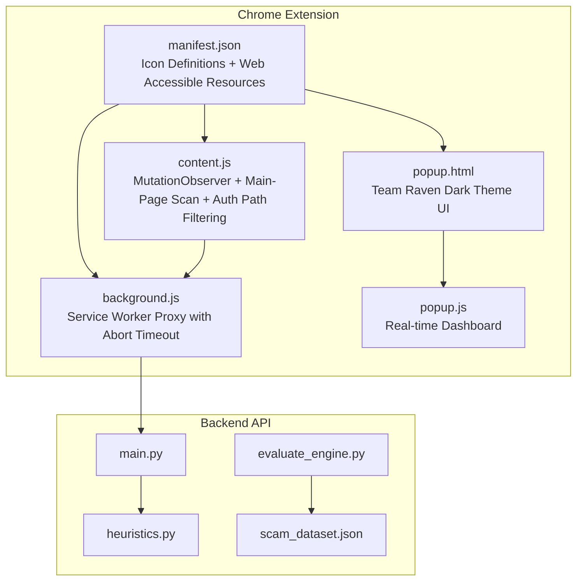
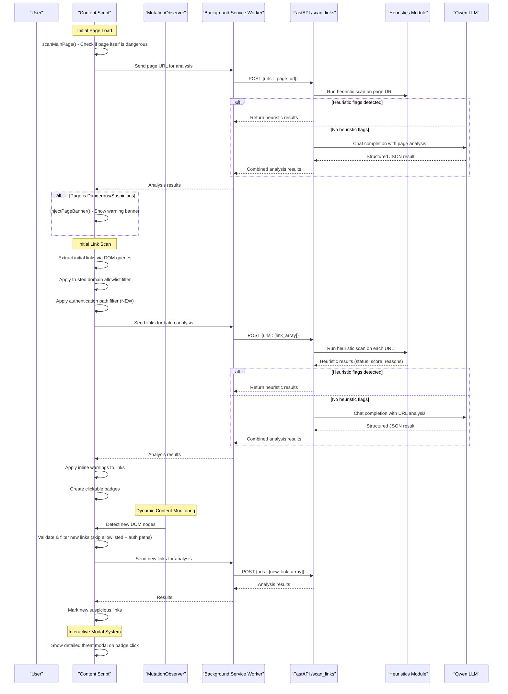
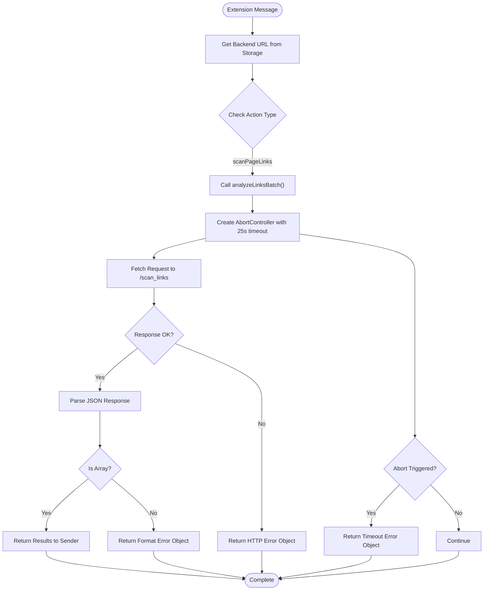
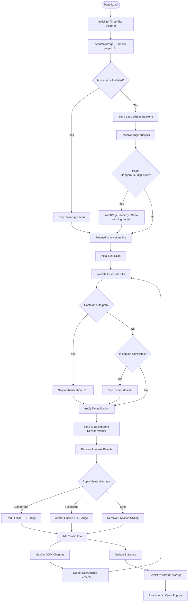
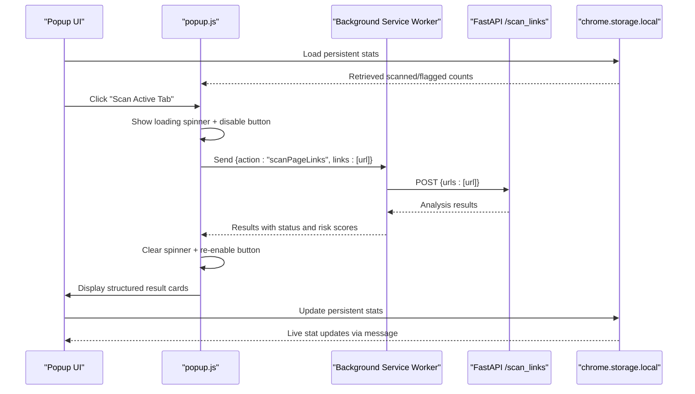
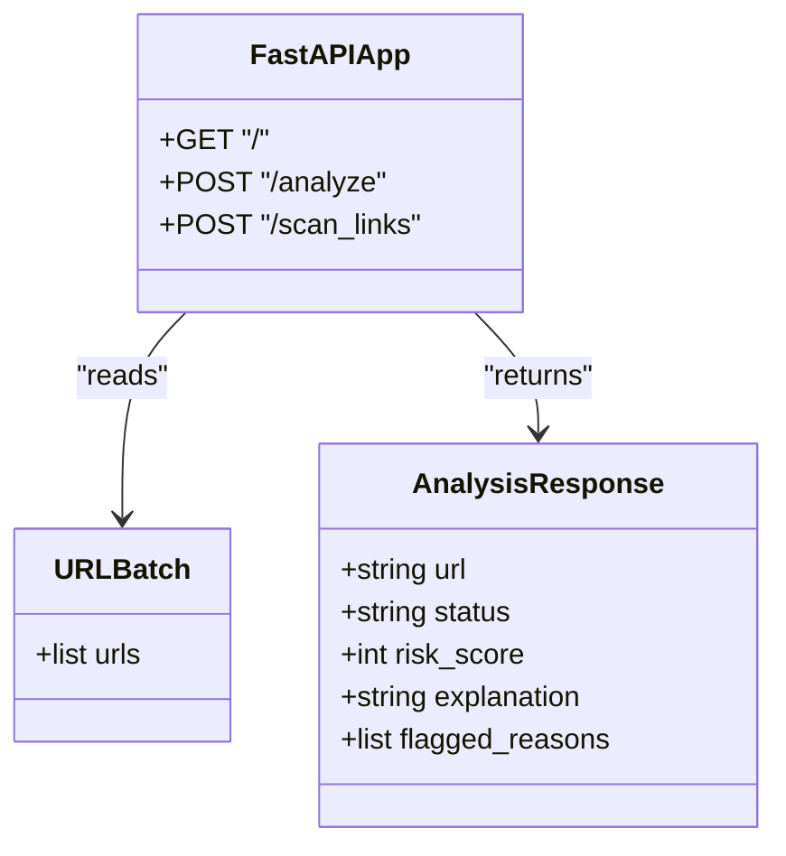
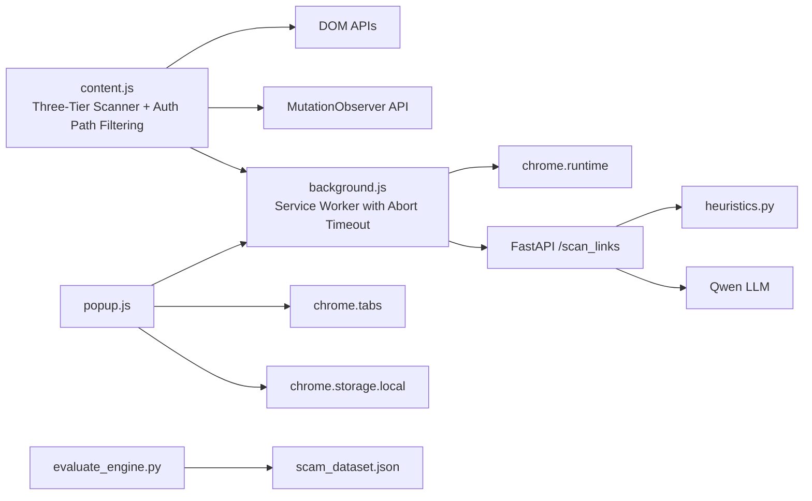

# Chrome Extension Development

<cite>
**Referenced Files in This Document**
- [manifest.json](file://extension/manifest.json)
- [background.js](file://extension/background.js)
- [content.js](file://extension/content.js)
- [popup.html](file://extension/popup.html)
- [popup.js](file://extension/popup.js)
- [main.py](file://backend/main.py)
- [heuristics.py](file://backend/heuristics.py)
- [evaluate_engine.py](file://backend/evaluate_engine.py)
- [scam_dataset.json](file://backend/scam_dataset.json)
- [README.md](file://README.md)
</cite>

## Update Summary
**Changes Made**
- Enhanced background service worker with abort-based timeout handling (25-second timeout) preventing hung connections and improved network error handling distinguishing between abort timeouts, connectivity issues, and malformed responses
- Updated content script with comprehensive trusted domain allowlist skipping well-known safe domains (Google, GitHub, Microsoft, etc.) and authentication path filter automatically skipping URLs containing login/signin/signup/auth/oauth/register keywords
- Improved mutation observer efficiency with SkipGuard-injected nodes detection and batched scan requests to reduce API calls
- Refactored link collection with WeakSet tracking to avoid duplicate rescanning and improve performance
- Introduced 'Team Raven' dark theme system providing consistent styling across all injected UI components including banners, modals, badges, and inline indicators with centralized color palette and specific gradients for different threat levels
- Complete popup interface visual overhaul matching new dark theme system with updated colors, gradients, and professional branding throughout

## Table of Contents
1. [Introduction](#introduction)
2. [Project Structure](#project-structure)
3. [Core Components](#core-components)
4. [Architecture Overview](#architecture-overview)
5. [Detailed Component Analysis](#detailed-component-analysis)
6. [Dependency Analysis](#dependency-analysis)
7. [Performance Considerations](#performance-considerations)
8. [Troubleshooting Guide](#troubleshooting-guide)
9. [Conclusion](#conclusion)
10. [Appendices](#appendices)

## Introduction
ScrollGuard AI is a Manifest V3 Chrome extension that provides real-time protection against phishing and scam links through an intelligent three-tier detection system. The extension combines lightweight client-side link extraction with AI-powered backend analysis via a background service worker proxy. It injects a sophisticated content script into web pages that uses MutationObserver to monitor dynamic content changes, extracts visible links from both static and dynamically loaded content, scans the main page URL itself, then sends them to the backend for comprehensive threat analysis and displays inline warnings directly on suspicious links with interactive detail modals. A modernized popup interface allows users to manually trigger scans of the current page URL with enhanced user experience and real-time statistics tracking.

## Project Structure
The project consists of:
- Extension files under extension/: manifest configuration with background service worker, advanced content script with MutationObserver support and main-page scanning, and modernized popup UI with interactive features
- Background service worker for secure backend communication and batch link analysis with configurable endpoints
- Backend API under backend/: FastAPI server with heuristics module, evaluation scripts, and test dataset
- Documentation and setup instructions in README.md

**Diagram sources**
- [manifest.json:1-47](file://extension/manifest.json#L1-L47)
- [background.js:1-148](file://extension/background.js#L1-L148)
- [content.js:1-969](file://extension/content.js#L1-L969)
- [popup.html:1-402](file://extension/popup.html#L1-L402)
- [popup.js:1-166](file://extension/popup.js#L1-L166)
- [main.py:1-314](file://backend/main.py#L1-L314)
- [heuristics.py:1-110](file://backend/heuristics.py#L1-L110)
- [evaluate_engine.py:1-78](file://backend/evaluate_engine.py#L1-L78)
- [scam_dataset.json:1-37](file://backend/scam_dataset.json#L1-L37)

**Section sources**
- [manifest.json:1-47](file://extension/manifest.json#L1-L47)
- [README.md:45-56](file://README.md#L45-L56)

## Core Components
- Manifest V3 configuration defines permissions, background service worker, action popup, and content script injection rules with proper icon definitions and web-accessible resources.
- **Background Service Worker**: Acts as a secure proxy between content scripts/popups and the backend API, handling batch link analysis requests with configurable endpoints and robust abort-based timeout handling (25-second timeout) preventing hung connections.
- **Advanced Content Script**: Uses MutationObserver for real-time monitoring of DOM changes, sophisticated link validation with trusted domain allowlist and authentication path filtering, robust deduplication systems using WeakSet, main-page scanning capability, and interactive modal support for efficient processing of dynamic content.
- **Modernized Popup Interface**: Features Team Raven dark theme with gradient backgrounds, professional ScrollGuard branding with logo integration, auto-scan status banner, real-time statistics dashboard, quick stats chips, loading indicators, structured result cards, improved error handling, and responsive design considerations.
- Backend exposes CORS-enabled FastAPI endpoints including batch link analysis endpoint that calls heuristics and LLM for threat classification.

**Section sources**
- [manifest.json:1-47](file://extension/manifest.json#L1-L47)
- [background.js:1-148](file://extension/background.js#L1-L148)
- [content.js:1-969](file://extension/content.js#L1-L969)
- [popup.html:1-402](file://extension/popup.html#L1-L402)
- [popup.js:1-166](file://extension/popup.js#L1-L166)
- [main.py:1-314](file://backend/main.py#L1-L314)

## Architecture Overview
The system implements an intelligent three-tier threat detection approach with secure backend communication and real-time monitoring:
- **Main-Page Scanning**: On page load, the extension automatically scans the current page URL itself to detect if the entire page is dangerous or suspicious, injecting a prominent warning banner when threats are detected.
- **Real-Time Link Extraction**: Content script uses MutationObserver to continuously monitor DOM changes and extract new links from dynamic content like infinite scroll feeds and AJAX-loaded content.
- **Trusted Domain Allowlist**: Sophisticated filtering system automatically skips known-safe domains (Google, YouTube, GitHub, Facebook, Microsoft, Apple, Amazon, Twitter, Wikipedia, Reddit, Instagram, WhatsApp, Netflix, Yahoo, Bing, Twitch, Medium, Stack Overflow) to conserve API quota and eliminate false positives on universally trusted sites.
- **Authentication Path Filtering**: New intelligent filtering system automatically skips standard authentication paths (login, signin, signup, auth, oauth, register) to prevent false positives on legitimate authentication flows while conserving API quota.
- **Sophisticated Link Validation**: Advanced filtering system rejects non-HTTP schemes, same-origin links, navigation stubs, authentication paths, and allowlisted domains before sending to backend.
- **Robust Deduplication**: Memory-efficient deduplication using Set and WeakSet prevents redundant processing and memory leaks.
- **Interactive Modal System**: Full-screen overlay modals provide detailed threat analysis with risk scores, explanations, and actionable buttons for user decisions.
- **Background Service Worker Proxy**: Securely handles all backend communications with abort-based timeout handling, providing a privileged context for API calls and avoiding CORS/Mixed Content issues.
- **Real-time Statistics Dashboard**: Persistent metrics tracking scanned and flagged links with live updates to open popups.
- **Enhanced Visual Feedback**: Applies subtle visual indicators with inline badges and border highlighting directly to suspicious links without disrupting page layout, plus full-page warning banners for dangerous pages.

**Diagram sources**
- [content.js:186-200](file://extension/content.js#L186-L200)
- [content.js:213-307](file://extension/content.js#L213-L307)
- [content.js:547-566](file://extension/content.js#L547-L566)
- [content.js:83-106](file://extension/content.js#L83-L106)
- [content.js:93-113](file://extension/content.js#L93-L113)
- [background.js:63-68](file://extension/background.js#L63-L68)
- [main.py:289-299](file://backend/main.py#L289-L299)
- [heuristics.py:40-110](file://backend/heuristics.py#L40-L110)

## Detailed Component Analysis

### Manifest Configuration and Permissions
**Updated** Enhanced with proper icon definitions and web-accessible resources configuration

- Uses Manifest V3 with minimal permissions: activeTab, scripting, and storage.
- Defines default_popup for the toolbar action.
- Configures background service worker (background.js) for secure backend communication.
- Declares host_permissions for <all_urls> to enable content script injection across all websites.
- Declares content script matched to all URLs, injected at document_idle to ensure DOM readiness before link extraction.
- **New**: Proper icon definitions for multiple sizes (16px, 32px, 48px, 128px) for consistent branding across different UI contexts.
- **New**: Web-accessible resources configuration allowing content scripts to access extension icons for modal display.

Security considerations:
- Using document_idle reduces interference with critical rendering paths.
- Host permissions are scoped broadly for development; consider narrowing to specific domains for production deployments.
- Web-accessible resources are properly configured to only expose necessary icon files.

**Section sources**
- [manifest.json:1-47](file://extension/manifest.json#L1-L47)

### Background Service Worker: Configurable Batch Link Analysis Proxy with Abort-Based Timeout Handling
**Updated** Enhanced with abort-based timeout handling (25-second timeout), structured error responses, and improved network error handling

The background service worker serves as a secure proxy between extension components and the backend API, specifically optimized for batch link analysis operations with flexible backend configuration and robust error handling.

Key responsibilities:
- **Configurable Backend**: Supports dynamic backend URL configuration via chrome.storage.local with fallback to localhost development server.
- **Batch Processing**: Accepts arrays of URLs from content scripts and popups for efficient batch analysis.
- **Abort-Based Timeout Handling**: Implements 25-second timeout using AbortController to prevent hung connections and gracefully handle slow backend responses.
- **Structured Error Responses**: Returns clean fallback objects with success/failure indicators instead of throwing exceptions, preventing Chrome extension error badges.
- **Enhanced Network Error Handling**: Distinguishes between abort timeouts, connectivity issues, and malformed responses with appropriate error messages.
- **Secure Proxy**: Executes fetch requests in the extension's privileged context, bypassing browser security restrictions.
- **Error Handling**: Provides robust error handling for network failures and backend unavailability.
- **Request Formatting**: Standardizes request payloads with consistent structure containing URL arrays.

Implementation details:
- Uses chrome.runtime.onMessage listener for inter-script communication
- Implements async/await pattern for non-blocking operations
- Includes comprehensive error handling for network failures with graceful fallbacks
- Provides detailed error responses for debugging
- Supports runtime backend URL switching for development/production environments
- Prevents unhandled rejections and console errors that would trigger Chrome's extension error badge

**Diagram sources**
- [background.js:27-33](file://extension/background.js#L27-L33)
- [background.js:39-57](file://extension/background.js#L39-L57)
- [background.js:63-68](file://extension/background.js#L63-L68)
- [background.js:68-126](file://extension/background.js#L68-L126)

**Section sources**
- [background.js:1-148](file://extension/background.js#L1-L148)

### Content Script: Advanced Real-Time Link Scanning with Main-Page Protection and Authentication Filtering
**Updated** Completely rewritten with main-page scanning, trusted domain allowlist, authentication path filtering, warning banner injection, comprehensive user interaction features, and Team Raven dark theme system

The content script now features sophisticated three-tier scanning capabilities for comprehensive threat detection with enhanced user protection features and consistent dark theme styling.

**Main-Page Scanning System**:
- **Automatic Page Analysis**: On page load, automatically scans the current page URL (`window.location.href`) to detect if the entire page is dangerous or suspicious
- **Warning Banner Injection**: When threats are detected, injects a prominent fixed-top warning banner with gradient styling (red for dangerous, amber for suspicious) using Team Raven theme
- **Dismissable Interface**: Includes a dismiss button (X) allowing users to close the warning banner while maintaining awareness
- **Trusted Domain Skip**: Automatically skips allowlisted domains to prevent false positives on universally trusted sites

**Trusted Domain Allowlist**:
- **Comprehensive Safe List**: Includes Google, YouTube, GitHub, Facebook, LinkedIn, Microsoft, Apple, Amazon, Twitter, X.com, Wikipedia, Reddit, Stack Overflow, Instagram, WhatsApp, Netflix, Yahoo, Bing, Twitch, Medium
- **Suffix-Based Matching**: Uses domain suffix matching to cover subdomains (e.g., www.google.com, mail.google.com) while preventing look-alike attacks
- **API Quota Conservation**: Significantly reduces unnecessary backend calls by skipping known-safe domains
- **False Positive Prevention**: Eliminates false positives on universally trusted platforms

**Authentication Path Filtering** (NEW):
- **Intelligent Path Detection**: Automatically identifies and skips standard authentication paths including login, signin, sign-in, signup, sign-up, auth, oauth, and register
- **False Positive Reduction**: Prevents false positives on legitimate authentication flows which were identified as a leading source of false positives
- **API Quota Conservation**: Significantly reduces unnecessary backend calls by skipping authentication-related URLs
- **Case-Insensitive Matching**: Handles various URL formats and casing patterns commonly found in authentication flows

**MutationObserver Integration**:
- Continuously monitors DOM changes for newly inserted anchor elements
- Debounced processing (300ms delay) to handle bursts of DOM mutations efficiently
- Supports infinite scroll feeds, AJAX-loaded content, and dynamic link generation
- Tracks pending roots to process multiple mutations in batches
- **SkipGuard Enhancement**: Efficiently skips nodes injected by ScrollGuard itself (badges, banner, modal) to prevent re-triggering the scanner

**Enhanced Link Validation**:
- Rejects non-HTTP schemes (javascript:, data:, mailto:, tel:, #anchor, blob:, file:)
- Filters out same-origin links to avoid internal navigation
- Blocks navigation stubs and empty href values
- Validates URL parseability and protocol safety
- **New**: Automatically skips allowlisted domains and authentication paths to conserve API resources

**Robust Deduplication System**:
- Uses Set for URL-level deduplication to prevent redundant backend calls
- Implements WeakSet for element-level tracking with automatic garbage collection
- Prevents memory leaks while maintaining efficient processing of large DOM trees

**Interactive Modal System**:
- **Full-screen Overlay**: Professional modal interface with backdrop blur and smooth animations using Team Raven theme
- **Threat Details**: Displays comprehensive threat analysis including URL, risk score, AI explanation, and flagged reasons
- **Action Buttons**: "Close / Stay Safe" button to dismiss modal safely, "Proceed Anyway" button to open URL in new tab
- **Visual Styling**: Color-coded headers based on threat level (red for dangerous, amber for suspicious) with gradient backgrounds
- **Event Handling**: Click outside modal or on backdrop closes the modal, preventing accidental navigation

**Enhanced Visual Feedback System**:
- **Dangerous Links**: 3px solid red outline with 🚨 [DANGEROUS SCAN] badge (red bg, white text) using Team Raven theme
- **Suspicious Links**: 3px solid amber outline with ⚠️ [SUSPICIOUS SCAN] badge (amber bg, dark text) using Team Raven theme
- **Safe Links**: Removes previous styling to indicate safe URLs
- **Inline Badges**: Non-intrusive warning indicators positioned after link text with click-to-view functionality
- **Tooltip Information**: Comprehensive hover tooltips showing status and risk scores

**Real-time Statistics Tracking**:
- **Persistent Metrics**: Tracks total scanned and flagged links using chrome.storage.local
- **Live Updates**: Broadcasts statistics updates to open popups via chrome.runtime.sendMessage
- **Dashboard Integration**: Popups display real-time statistics with Active/Waiting status indicators

**Event Management**:
- Throttled scroll event handling with debouncing to prevent excessive processing
- Efficient DOM querying using querySelectorAll for optimal performance
- Graceful error handling with fallback mechanisms for failed operations

**Diagram sources**
- [content.js:186-200](file://extension/content.js#L186-L200)
- [content.js:213-307](file://extension/content.js#L213-L307)
- [content.js:547-566](file://extension/content.js#L547-L566)
- [content.js:83-106](file://extension/content.js#L83-L106)
- [content.js:93-113](file://extension/content.js#L93-L113)
- [content.js:148-359](file://extension/content.js#L148-L359)
- [content.js:415-474](file://extension/content.js#L415-L474)
- [content.js:486-499](file://extension/content.js#L486-L499)

**Section sources**
- [content.js:1-969](file://extension/content.js#L1-L969)

### Popup Interface: Enhanced Dashboard with Real-time Statistics and Professional Branding
**Updated** Complete visual overhaul with Team Raven dark theme system, gradient backgrounds, professional ScrollGuard branding with logo integration, and enhanced user experience

UI layout:
- Displays a clean header with gradient background, professional ScrollGuard logo integration, and "Team Raven" badge.
- Shows current tab URL in a styled box with word-break support for long URLs.
- Features prominent "Scan Active Tab" button with hover effects and disabled states.
- Auto-scan status banner with animated pulse dot indicating active monitoring.
- Quick stats chips displaying links scanned, flagged count, and active status.
- Results area displays structured cards with color-coded status indicators and detailed explanations.

Interaction flow:
- On load, retrieves active tab URL and displays it in the interface.
- Loads persistent statistics from chrome.storage.local to show historical scan data.
- Listens for real-time stat updates from content script via chrome.runtime.onMessage.
- On manual scan click, retrieves the active tab URL and sends it to background service worker for analysis.
- Shows loading spinner during processing with disabled button state.
- Parses JSON response and updates the UI with structured result cards showing status, risk scores, explanations, and reasons.
- Handles connection errors with user-friendly error messages in styled error boxes.

Responsive design:
- Fixed width container (320px) with modern typography and accessible color coding.
- Clean button styling with smooth transitions and proper accessibility attributes.
- Structured result cards with clear visual hierarchy and semantic HTML structure.
- Animated status indicators and professional gradient backgrounds.
- **New**: Professional ScrollGuard logo integration replacing generic shield emoji for consistent branding.
- **New**: Team Raven dark theme system with consistent color palette throughout the interface.

**Diagram sources**
- [popup.html:288-315](file://extension/popup.html#L288-L315)
- [popup.js:27-47](file://extension/popup.js#L27-L47)
- [popup.js:49-95](file://extension/popup.js#L49-L95)

**Section sources**
- [popup.html:1-402](file://extension/popup.html#L1-L402)
- [popup.js:1-166](file://extension/popup.js#L1-L166)

### Backend API: Heuristic and AI-Powered Analysis
**Updated** Enhanced with dedicated batch link analysis endpoint and concurrent processing

Endpoints:
- GET / returns a health message.
- POST /analyze accepts individual URL/text analysis requests.
- POST /scan_links accepts batch URL analysis requests for extension use.

Processing:
- **Heuristic Scanning**: All URLs first run through fast rule-based checks in heuristics.py for immediate threat detection.
- **AI Analysis**: URLs passing heuristic checks are sent to Qwen LLM for comprehensive analysis with rate limiting.
- **Batch Processing**: Efficiently processes multiple URLs concurrently using asyncio.gather with semaphore-based concurrency control.

CORS:
- Allows cross-origin requests from the extension during development with wildcard origins.

**Diagram sources**
- [main.py:59-61](file://backend/main.py#L59-L61)
- [main.py:289-299](file://backend/main.py#L289-L299)

**Section sources**
- [main.py:1-314](file://backend/main.py#L1-L314)

### Heuristics Module: Rule-Based Detection Engine
**Updated** Enhanced with comprehensive detection rules and improved scoring

Detection Rules:
- **Free TLD Detection**: Flags domains ending in .tk, .ml, .ga, .cf, .gq, .xyz, .top, .buzz, .click, .icu, .cam commonly used in scams.
- **URL Shortener Detection**: Recognizes shortened URLs from bit.ly, tinyurl.com, t.co, ow.ly, shorturl.at, goo.gl, is.gd, buff.ly, rebrand.ly services.
- **Subdomain Depth Analysis**: Identifies unusually deep subdomain nesting as potential phishing indicator.
- **Hyphen Pattern Detection**: Flags domains with excessive hyphens suggesting impersonation attempts.
- **Typosquatting Patterns**: Identifies domains with character substitutions mimicking known brands (g00gl, paypa1, amaz0n, faceb00k, app1e, mircosoft).
- **Path Keywords**: Searches for common scam indicators in URL paths like "claim", "winner", "free-money", "giveaway", "verify-account", "urgent-security".
- **Domain Keywords**: Checks domain names for suspicious patterns like "free-crypto", "claim-now", "verify-urgent", "account-verify".
- **HTTPS Validation**: Flags non-HTTPS URLs as potentially insecure.

Risk Scoring:
- Each rule contributes to cumulative risk score (0-100) with weighted scoring.
- Thresholds determine final classification: Dangerous (≥70), Suspicious (≥30), Safe (<30).
- Returns structured results with status, score, and detailed reasons for flagging.

**Section sources**
- [heuristics.py:1-110](file://backend/heuristics.py#L1-L110)

### Evaluation and Benchmarking
- evaluate_engine.py loads scam_dataset.json and posts each sample to the backend batch endpoint.
- Compares predicted status with expected_status and prints per-sample results and overall accuracy metrics.
- Uses scikit-learn for classification reports and confusion matrix generation.

Use cases:
- Validate detection quality across known safe and dangerous samples.
- Iterate on heuristics and prompts to improve accuracy.
- Measure performance improvements after code changes.

**Section sources**
- [evaluate_engine.py:1-78](file://backend/evaluate_engine.py#L1-L78)
- [scam_dataset.json:1-37](file://backend/scam_dataset.json#L1-L37)

## Dependency Analysis
- Extension depends on browser APIs (chrome.tabs, chrome.runtime, fetch) and the backend API for advanced analysis.
- **Advanced Content Script** depends on DOM APIs, MutationObserver, and background service worker for analysis.
- **Background Service Worker** depends on chrome.runtime messaging and fetch API for backend communication.
- Backend depends on FastAPI, OpenAI-compatible client, heuristics module, and environment variables for API keys.

**Diagram sources**
- [content.js:186-200](file://extension/content.js#L186-L200)
- [background.js:63-68](file://extension/background.js#L63-L68)
- [popup.js:27-47](file://extension/popup.js#L27-L47)
- [main.py:289-299](file://backend/main.py#L289-L299)
- [heuristics.py:40-110](file://backend/heuristics.py#L40-L110)
- [evaluate_engine.py:35-48](file://backend/evaluate_engine.py#L35-L48)
- [scam_dataset.json:1-37](file://backend/scam_dataset.json#L1-L37)

**Section sources**
- [popup.js:1-166](file://extension/popup.js#L1-L166)
- [main.py:1-314](file://backend/main.py#L1-L314)

## Performance Considerations
- **Main-Page Scanning Efficiency**: Single URL analysis on page load with trusted domain skip prevents unnecessary backend calls for safe sites.
- **Trusted Domain Optimization**: Allowlist system significantly reduces API quota usage by skipping known-safe domains like Google, YouTube, GitHub, etc.
- **Authentication Path Optimization** (NEW): New authentication path filtering significantly reduces API quota usage by skipping legitimate authentication flows that were causing false positives.
- **MutationObserver Efficiency**: Debounced processing (300ms) prevents excessive DOM queries during rapid content updates.
- **Memory Management**: WeakSet usage ensures automatic garbage collection of processed anchor elements, preventing memory leaks.
- **Link Validation Optimization**: Early rejection of invalid URLs, allowlisted domains, and authentication paths reduces unnecessary backend calls and processing overhead.
- **Concurrent Processing**: Backend uses asyncio.gather with semaphore-based concurrency control for efficient batch processing.
- **Background Service Worker**: Offloads network requests from content scripts, improving page performance and avoiding CORS issues.
- **Abort-Based Timeout Handling**: 25-second timeout prevents hung connections and improves overall reliability.
- **SkipGuard-Injected Nodes**: MutationObserver efficiently skips nodes injected by ScrollGuard itself to prevent re-triggering the scanner.
- **Batched Scan Requests**: Multiple mutations are coalesced into single backend calls to reduce API overhead.
- **Minimal Popup Operations**: Lightweight interface that only performs network calls on explicit user actions.
- **Efficient DOM Manipulation**: Inline visual feedback uses minimal CSS modifications to maintain page performance.
- **Interactive Modal Performance**: Modal creation uses efficient DOM manipulation with proper cleanup and event delegation.
- **Statistics Persistence**: Chrome storage operations are batched to minimize storage writes and improve performance.

Recommendations:
- Monitor memory usage for pages with extremely large DOM trees or frequent dynamic content updates.
- Consider implementing URL caching for recently analyzed URLs to reduce redundant backend calls.
- Add retry logic with exponential backoff for failed background service worker communications.
- Implement progressive loading for pages with massive numbers of links to avoid blocking UI.
- Consider lazy-loading heavy resources if extending functionality with additional features.
- Monitor modal creation frequency to prevent performance issues on pages with many flagged links.
- Expand trusted domain allowlist as needed to further optimize API usage and reduce false positives.
- **New**: Consider expanding authentication path keywords list as needed to catch additional authentication flow patterns.
- **New**: Monitor abort timeout effectiveness and adjust 25-second timeout based on backend performance.

## Troubleshooting Guide
Common issues and resolutions:
- **Background Service Worker Issues**: Ensure the service worker is properly registered and listening for messages. Check console logs for registration errors.
- **Backend Not Reachable**: Ensure the FastAPI server is running locally and CORS is enabled. The popup shows an alert on connection failure.
- **CORS Errors**: Verify host_permissions are correctly configured in manifest.json for the backend domain.
- **Missing API Key**: Backend raises an error if DASHSCOPE_API_KEY is not set; configure environment variables as documented.
- **No Visual Warnings**: Verify content script injection at document_idle and confirm links are being extracted and sent to background service worker. Check that backend is returning proper response format.
- **MutationObserver Not Working**: Ensure DOM is fully loaded before observer initialization and check for JavaScript errors in console.
- **Memory Leaks**: Monitor memory usage in Chrome DevTools and verify WeakSet cleanup is working properly.
- **Evaluation Failures**: Confirm scam_dataset.json exists and the backend responds with 200 OK for /scan_links.
- **Modal Not Appearing**: Check that badge click events are properly bound and modal creation functions are executing without errors.
- **Statistics Not Updating**: Verify chrome.storage.local operations are successful and popup is listening for message updates.
- **Interactive Features Broken**: Ensure event listeners are properly attached to dynamically created modal elements.
- **Main-Page Banner Not Showing**: Verify that `scanMainPage()` is being called and that the page URL is not in the trusted domain allowlist.
- **Trusted Domain Issues**: Check that domain matching is working correctly for subdomains and that the allowlist is properly configured.
- **Authentication Path Issues** (NEW): Verify that authentication path filtering is working correctly and not accidentally skipping legitimate URLs that contain auth keywords.
- **Timeout Issues** (NEW): If experiencing backend timeouts, check network connectivity and consider adjusting the 25-second timeout in background.js.
- **Theme Display Issues** (NEW): Verify that Team Raven theme CSS is properly injected and not conflicting with host page styles.

Debugging techniques:
- Use Chrome DevTools to inspect the content script console logs and DOM changes.
- Inspect network requests from the popup to verify payloads and responses.
- Check background service worker logs for message routing issues.
- Run evaluate_engine.py to measure detection accuracy and identify misclassified samples.
- Test content script link extraction by examining DOM queries in the console.
- Monitor MutationObserver activity using Performance tab in DevTools.
- Check for memory leaks using Memory tab and heap snapshots.
- Use Application tab to inspect chrome.storage.local contents for statistics persistence.
- Test modal functionality by clicking on flagged link badges and verifying event handling.
- Verify main-page scanning by checking if warning banners appear on known dangerous sites.
- Test trusted domain functionality by visiting allowlisted sites to ensure no banners or warnings appear.
- **New**: Test authentication path filtering by visiting sites with login/signup pages to verify they are properly skipped.
- **New**: Monitor abort timeout behavior using Network tab to verify 25-second timeout is working correctly.
- **New**: Inspect Team Raven theme application by checking computed styles in DevTools.

**Section sources**
- [popup.js:49-95](file://extension/popup.js#L49-L95)
- [main.py:31-33](file://backend/main.py#L31-L33)
- [evaluate_engine.py:35-41](file://backend/evaluate_engine.py#L35-L41)

## Conclusion
ScrollGuard AI implements an advanced three-tier threat detection system that combines sophisticated client-side link extraction with powerful AI analysis through a secure background service worker architecture. The completely rewritten content script now features main-page scanning capability with trusted domain allowlist and authentication path filtering, making it ideal for comprehensive protection against both malicious pages and suspicious links. The sophisticated link validation system ensures only relevant external links are processed while conserving API quota through smart domain skipping and authentication path filtering. The robust deduplication mechanism prevents memory leaks and redundant processing. The enhanced popup interface provides an improved user experience with auto-scan status banner, real-time statistics dashboard, quick stats chips, loading indicators, structured result cards, comprehensive error handling, and professional ScrollGuard branding with logo integration. The interactive modal system offers detailed threat analysis with actionable user choices. The background service worker solves critical CORS and Mixed Content issues, enabling seamless backend communication with configurable endpoints and robust abort-based timeout handling. The modular design supports easy extension of detection rules, customization of visual feedback, and integration with additional threat intelligence sources while maintaining optimal performance and user experience.

## Appendices

### How to Extend Detection Rules
**Updated** Enhanced with backend heuristics and simplified content script approach

- Add new detection rules to the heuristics.py module to include additional TLD patterns, typosquatting detection, or keyword combinations.
- Modify risk scoring thresholds in heuristics.py to adjust sensitivity levels for different threat categories.
- Update the backend system prompt in main.py to incorporate new rule categories and refine AI analysis criteria.
- Extend content script visual feedback by adding new border styles or tooltip formats for different threat levels.
- Consider how new rules might affect the balance between heuristic and AI detection layers.
- Update modal styling to reflect new threat categories or severity levels.
- **New**: Expand the trusted domain allowlist in content.js to include additional safe domains that should be skipped.
- **New**: Expand authentication path keywords in content.js to catch additional authentication flow patterns.

**Section sources**
- [heuristics.py:16-99](file://backend/heuristics.py#L16-L99)
- [content.js:415-474](file://extension/content.js#L415-L474)
- [main.py:64-86](file://backend/main.py#L64-L86)
- [content.js:93-113](file://extension/content.js#L93-L113)

### Customize Visual Feedback
**Updated** Enhanced with inline link warning system, badge integration, and interactive modal support

- Modify inline styles in the content script to adjust border colors, thickness, and positioning for different threat levels.
- Change visual indicators to use different CSS properties (e.g., background highlighting, text decoration) instead of borders.
- Enhance tooltip information by adding more detailed threat explanations or risk assessment details.
- Customize the modal appearance by modifying the showModal function styles and layout.
- Update badge styling and positioning for better visual consistency across different website themes.
- Implement custom modal themes or branding options for different deployment scenarios.
- Consider adding accessibility features like ARIA labels for screen reader support.
- **New**: Customize warning banner appearance by modifying the injectPageBanner function styles and gradient colors.
- **New**: Update modal logo integration to use custom branding assets.
- **New**: Modify Team Raven theme constants in content.js to customize colors, gradients, and styling across all UI components.

**Section sources**
- [content.js:415-474](file://extension/content.js#L415-L474)
- [content.js:148-359](file://extension/content.js#L148-L359)
- [content.js:213-307](file://extension/content.js#L213-L307)

### Add New Threat Detection Rules
**Updated** Enhanced with comprehensive backend heuristics and AI integration

- Expand heuristics.py with domain-specific regex patterns (e.g., social media impersonation, crypto giveaways, government impersonation, banking fraud).
- Integrate additional data sources (blocklists, reputation APIs) into the backend analysis pipeline.
- Update the backend system prompt to incorporate new rule categories and refine scoring logic for better accuracy.
- Implement category-specific scoring weights to prioritize certain types of threats over others.
- Consider how new rules might interact with the simplified two-tier detection system.
- Add new validation rules in content.js for specialized link types or protocols.
- Extend modal content to display category-specific threat information and recommended actions.
- **New**: Add new trusted domains to the TRUSTED_DOMAINS array in content.js to expand the allowlist.
- **New**: Add new authentication path keywords to the AUTH_PATH_KEYWORDS array to catch additional authentication flow patterns.

**Section sources**
- [heuristics.py:16-99](file://backend/heuristics.py#L16-L99)
- [main.py:64-86](file://backend/main.py#L64-L86)
- [content.js:44-75](file://extension/content.js#L44-L75)
- [content.js:93-113](file://extension/content.js#L93-L113)

### Security Considerations
**Updated** Enhanced with simplified architecture security practices and advanced validation

- Permission scoping: Keep permissions minimal (activeTab, scripting, storage) and restrict content script matches where possible.
- **Background Service Worker Security**: The service worker acts as a secure proxy, preventing CORS and Mixed Content issues while maintaining separation between page context and backend communication.
- **Content script isolation**: Avoid exposing sensitive data to the page; use chrome.runtime messaging if inter-script communication is required. The current implementation maintains isolation by only accessing necessary DOM elements.
- **Safe DOM manipulation**: Sanitize injected content, avoid eval, and prefer attribute setting and style assignments to mitigate XSS risks. Current implementation uses direct DOM property assignment safely.
- Backend security: Restrict CORS origins in production and validate inputs rigorously.
- **Heuristics security**: Regularly update rule sets to address emerging threats while avoiding false positives on legitimate content.
- **Host permissions**: Currently scoped to <all_urls>; restrict to specific domains in production for enhanced security.
- **Link validation security**: Sophisticated validation prevents execution of javascript: URLs, data: URIs, and other potentially malicious protocols.
- **Modal security**: Ensure modal content is properly sanitized and event handlers prevent unintended navigation or data exposure.
- **Trusted domain security**: Allowlist uses suffix-based matching to prevent look-alike domain attacks while covering legitimate subdomains.
- **Web-accessible resources security**: Icon files are properly configured as web-accessible resources with appropriate scope limitations.
- **Abort timeout security**: 25-second timeout prevents resource exhaustion from hung backend connections.

**Section sources**
- [manifest.json:6-13](file://extension/manifest.json#L6-L13)
- [background.js:1-148](file://extension/background.js#L1-L148)
- [main.py:44-50](file://backend/main.py#L44-L50)
- [content.js:44-75](file://extension/content.js#L44-L75)
- [manifest.json:40-45](file://extension/manifest.json#L40-L45)

### Compatibility Testing Across Websites
**Updated** Enhanced with simplified content script testing scenarios and SPA support

- Test on diverse sites (news, e-commerce, social platforms) to ensure inline warnings do not break layouts or interfere with site functionality.
- Verify performance on pages with heavy DOM trees and dynamic content. Content script uses efficient DOM queries and MutationObserver for optimal performance.
- Validate that content script injection at document_idle works reliably across different frameworks and SPAs.
- Test visual feedback functionality and border styling across different website structures and CSS frameworks.
- Verify accessibility compliance across different screen readers and assistive technologies.
- **Background Service Worker Testing**: Ensure service worker registration and message passing work correctly across different page contexts and security policies.
- **CORS Testing**: Verify backend communication works on both HTTP and HTTPS pages with proper host_permissions configuration.
- **SPA Testing**: Test mutation observer functionality on single-page applications with dynamic content loading, infinite scroll, and AJAX-driven interfaces.
- **Modal Testing**: Verify modal functionality works correctly across different website structures and doesn't interfere with existing modal systems.
- **Statistics Testing**: Ensure persistent statistics work correctly across different browsing sessions and popup instances.
- **Main-Page Banner Testing**: Test warning banner appearance on known dangerous sites and verify it doesn't appear on trusted domains.
- **Trusted Domain Testing**: Verify that allowlisted domains (Google, YouTube, GitHub, etc.) are properly skipped and no banners or warnings appear.
- **Authentication Path Testing** (NEW): Test that authentication pages (login, signup, OAuth flows) are properly skipped and don't generate false positives.
- **Timeout Testing** (NEW): Verify that 25-second abort timeout works correctly under various network conditions and backend performance scenarios.
- **Theme Testing** (NEW): Test Team Raven dark theme rendering across different browsers and website themes to ensure consistent appearance.

### Content Script Implementation Details
**New Section** Comprehensive overview of the advanced three-tier scanning architecture with main-page protection, trusted domain optimization, and authentication path filtering

The content script implements a sophisticated three-tier approach focused on reliable link extraction, real-time monitoring, visual feedback, and interactive user experiences for modern web applications:

**Main-Page Scanning System**:
- **Automatic Page Analysis**: Scans `window.location.href` on page load to detect if the entire page is dangerous or suspicious
- **Warning Banner Injection**: Creates prominent fixed-top banners with gradient styling (red for dangerous, amber for suspicious) using Team Raven theme
- **Dismissable Interface**: Includes X button for users to close warnings while maintaining awareness
- **Trusted Domain Skip**: Automatically skips allowlisted domains to prevent false positives

**Trusted Domain Allowlist**:
- **Comprehensive Safe List**: Includes major platforms (Google, YouTube, GitHub, Facebook, LinkedIn, Microsoft, Apple, Amazon, Twitter, X.com, Wikipedia, Reddit, Instagram, WhatsApp, Netflix, Yahoo, Bing, Twitch, Medium, Stack Overflow)
- **Suffix-Based Matching**: Covers subdomains (www.google.com, mail.google.com) while preventing look-alike attacks
- **API Quota Conservation**: Significantly reduces backend calls by skipping known-safe domains
- **False Positive Prevention**: Eliminates false positives on universally trusted platforms

**Authentication Path Filtering** (NEW):
- **Intelligent Path Detection**: Automatically identifies and skips standard authentication paths including login, signin, sign-in, signup, sign-up, auth, oauth, and register
- **False Positive Reduction**: Prevents false positives on legitimate authentication flows which were identified as a leading source of false positives
- **API Quota Conservation**: Significantly reduces unnecessary backend calls by skipping authentication-related URLs
- **Case-Insensitive Matching**: Handles various URL formats and casing patterns commonly found in authentication flows

**MutationObserver Integration**:
- Continuously monitors DOM changes for newly inserted anchor elements
- Debounced processing (300ms delay) to handle bursts of DOM mutations efficiently
- Supports infinite scroll feeds, AJAX-loaded content, and dynamic link generation
- Tracks pending roots to process multiple mutations in batches
- **SkipGuard Enhancement**: Efficiently skips nodes injected by ScrollGuard itself to prevent re-triggering the scanner

**Enhanced Link Validation**:
- Rejects non-HTTP schemes (javascript:, data:, mailto:, tel:, #anchor, blob:, file:)
- Filters out same-origin links to avoid internal navigation
- Blocks navigation stubs and empty href values
- Validates URL parseability and protocol safety
- **New**: Automatically skips allowlisted domains and authentication paths to conserve API resources

**Robust Deduplication System**:
- Uses Set for URL-level deduplication to prevent redundant backend calls
- Implements WeakSet for element-level tracking with automatic garbage collection
- Prevents memory leaks while maintaining efficient processing of large DOM trees

**Interactive Modal System**:
- Full-screen overlay modal with backdrop blur and smooth animations using Team Raven theme
- Displays comprehensive threat analysis including URL, risk score, AI explanation, and flagged reasons
- Provides actionable buttons: "Close / Stay Safe" and "Proceed Anyway"
- Color-coded headers based on threat level (red for dangerous, amber for suspicious) with gradient backgrounds
- Proper event handling for modal dismissal and user interactions

**Enhanced Visual Feedback System**:
- Applies subtle CSS modifications directly to link elements without disrupting page layout
- Uses outline styling for clear but non-intrusive visual indicators
- Provides contextual information through title attributes for hover tooltips
- Supports three-tier severity levels: Dangerous (red outline + 🚨 badge), Suspicious (amber outline + ⚠️ badge), Safe (no styling)
- Clickable badges that open detailed threat analysis modals

**Real-time Statistics Tracking**:
- Maintains persistent counters for total scanned and flagged links using chrome.storage.local
- Broadcasts live updates to open popups via chrome.runtime.sendMessage
- Enables real-time dashboard functionality in the popup interface

**Event Management**:
- Implements throttled scroll event handling to prevent excessive processing during user interaction
- Uses setTimeout/clearTimeout pattern to manage concurrent link extraction operations
- Ensures single instance of link extraction per scroll event cycle
- Proper event delegation for dynamically created modal elements

**Background Service Worker Integration**:
- Secure proxy for backend communication avoiding CORS and Mixed Content issues
- Message routing between content scripts and backend API with proper error handling
- Robust error handling for network failures and backend unavailability

**Accessibility and UX Features**:
- Maintains page layout integrity through minimal CSS modifications
- Provides semantic HTML structure for better accessibility
- Uses standard CSS properties for broad browser compatibility
- Implements keyboard navigation support for modal interactions

**Team Raven Dark Theme System**:
- Centralized color palette with consistent styling across all UI components
- Gradient backgrounds for different threat levels (dangerous: red gradient, suspicious: amber gradient)
- Consistent typography using Segoe UI font family
- Professional branding with ScrollGuard logo integration
- Smooth animations and transitions for enhanced user experience

**Section sources**
- [content.js:1-969](file://extension/content.js#L1-L969)
- [background.js:1-148](file://extension/background.js#L1-L148)

### Background Service Worker Architecture
**New Section** Detailed overview of the streamlined proxy architecture with configurable endpoints and abort-based timeout handling

The background service worker serves as a critical component in the extension's security architecture, providing secure backend communication while maintaining separation from page contexts.

**Core Responsibilities**:
- **Configurable Backend**: Supports dynamic backend URL configuration via chrome.storage.local with fallback to localhost development server.
- **Batch Processing**: Optimized for handling arrays of URLs efficiently in single API calls.
- **Abort-Based Timeout Handling**: Implements 25-second timeout using AbortController to prevent hung connections and gracefully handle slow backend responses.
- **Secure Proxy**: Executes fetch requests in the extension's privileged context, bypassing browser security restrictions that would otherwise block content scripts and popups on HTTPS pages.
- **Message Routing**: Listens for messages from content scripts and popup, routing them to appropriate backend endpoints with proper error handling.
- **Structured Error Responses**: Returns clean fallback objects with success/failure indicators instead of throwing exceptions, preventing Chrome extension error badges.
- **Enhanced Network Error Handling**: Distinguishes between abort timeouts, connectivity issues, and malformed responses with appropriate error messages.

**Communication Patterns**:
- Uses chrome.runtime.onMessage listener for inter-script communication.
- Implements async/await pattern for non-blocking operations.
- Includes timeout handling to prevent blocking page loads.
- Provides detailed error responses for debugging and troubleshooting.
- Supports runtime backend URL switching for development/production environments.

**Security Benefits**:
- Prevents CORS violations by executing network requests in extension context.
- Eliminates Mixed Content issues when communicating with HTTP backends from HTTPS pages.
- Maintains separation between page JavaScript and extension privileges.
- Provides centralized error handling and logging for backend communication.
- Secure backend URL management through chrome.storage.local.
- **Resource Protection**: Abort timeout prevents resource exhaustion from hung backend connections.

**Section sources**
- [background.js:1-148](file://extension/background.js#L1-L148)

### Popup Interface Architecture
**New Section** Detailed overview of the enhanced dashboard with real-time statistics and interactive features

The popup interface provides a comprehensive dashboard for monitoring extension activity and performing manual link analysis.

**Core Features**:
- **Auto-scan Status Banner**: Animated indicator showing active monitoring status with pulsing dot animation.
- **Real-time Statistics Dashboard**: Displays persistent metrics for links scanned and flagged using chrome.storage.local.
- **Quick Stats Chips**: Compact display of key metrics with Active/Waiting status indicators.
- **Manual Scan Fallback**: Button for on-demand analysis of the current tab URL.
- **Structured Results Panel**: Color-coded cards showing detailed analysis results with explanations and reasons.
- **Professional Branding**: ScrollGuard logo integration replacing generic shield emoji for consistent branding.
- **Team Raven Dark Theme**: Consistent dark theme system with gradient backgrounds and professional styling.

**Data Flow**:
- Loads persistent statistics from chrome.storage.local on popup initialization.
- Listens for real-time stat updates from content script via chrome.runtime.onMessage.
- Performs manual scans by sending tab URL to background service worker for analysis.
- Displays loading states and error handling for network operations.

**User Experience**:
- Professional gradient header with ShieldGuard logo and Team Raven badge.
- Responsive design optimized for popup window dimensions.
- Smooth animations and transitions for loading states and status updates.
- Accessible color coding and semantic HTML structure.
- **New**: Team Raven dark theme system with consistent color palette throughout the interface.

**Section sources**
- [popup.html:1-402](file://extension/popup.html#L1-L402)
- [popup.js:1-166](file://extension/popup.js#L1-L166)