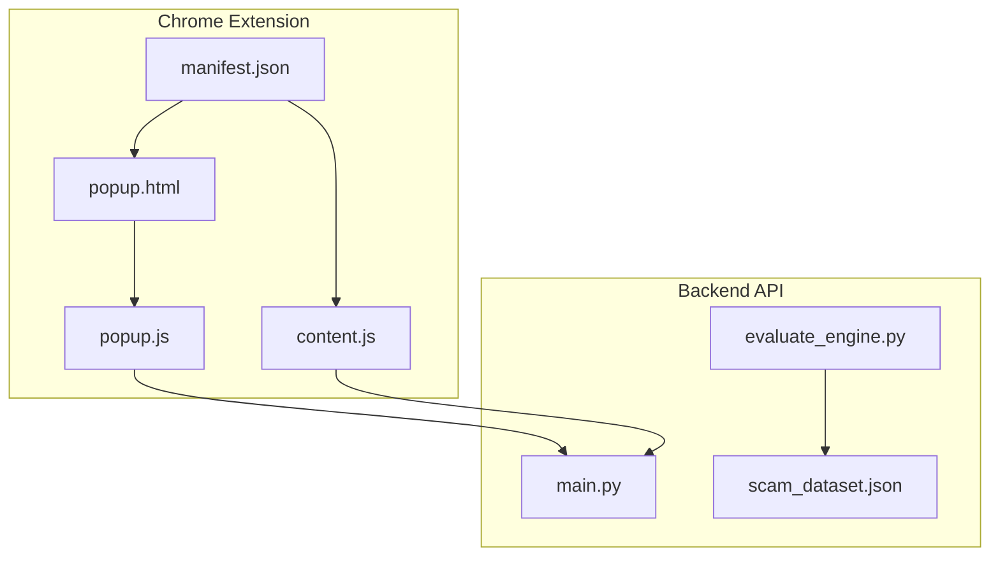
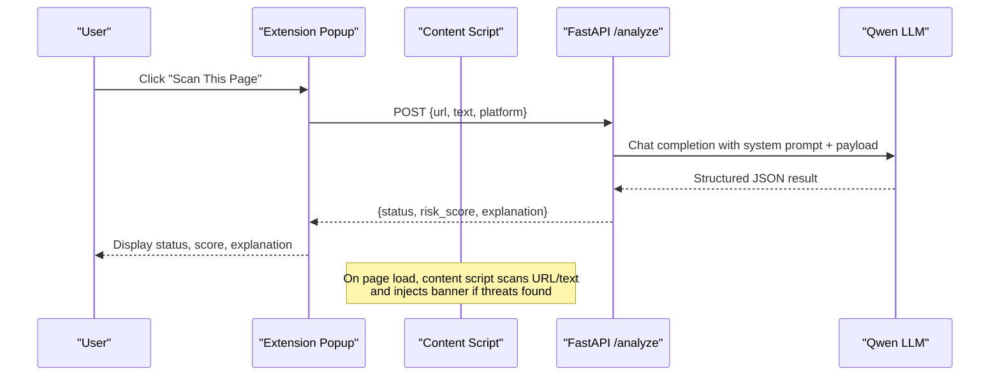
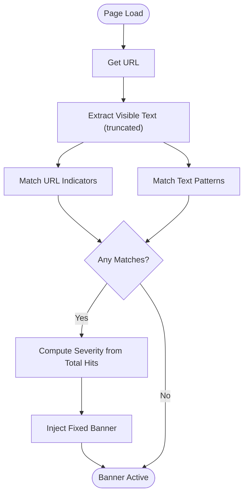
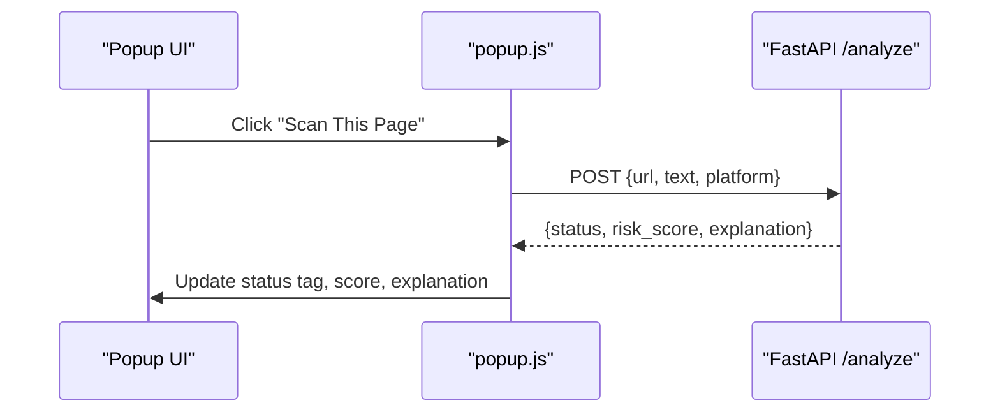
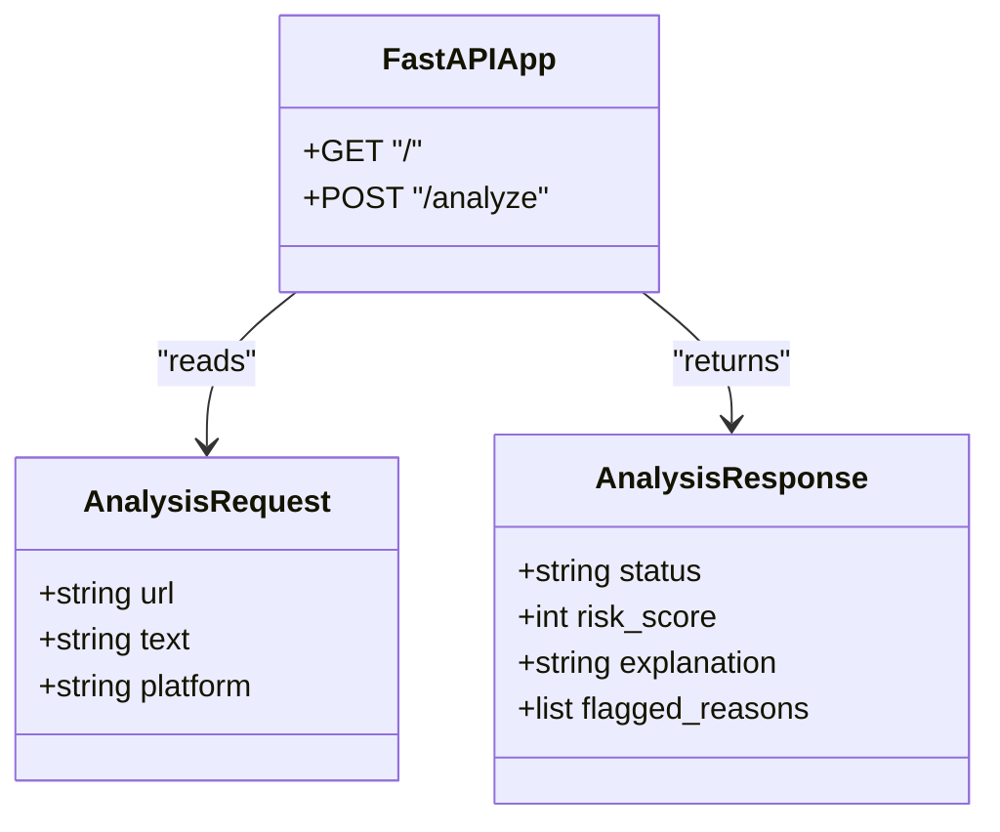
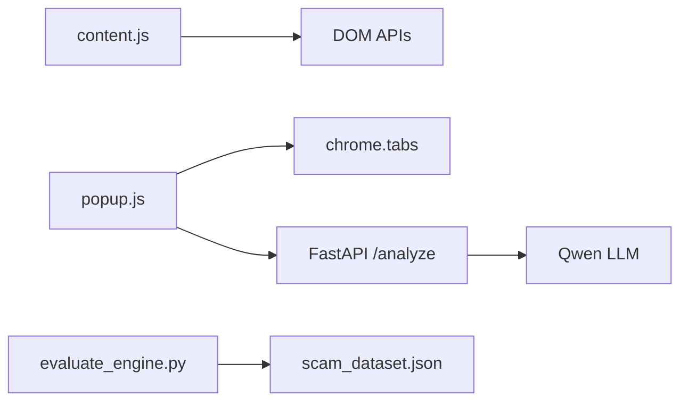

# Chrome Extension Development

<cite>
**Referenced Files in This Document**
- [manifest.json](file://extension/manifest.json)
- [content.js](file://extension/content.js)
- [popup.html](file://extension/popup.html)
- [popup.js](file://extension/popup.js)
- [main.py](file://backend/main.py)
- [evaluate_engine.py](file://backend/evaluate_engine.py)
- [scam_dataset.json](file://backend/scam_dataset.json)
- [README.md](file://README.md)
</cite>

## Table of Contents
1. [Introduction](#introduction)
2. [Project Structure](#project-structure)
3. [Core Components](#core-components)
4. [Architecture Overview](#architecture-overview)
5. [Detailed Component Analysis](#detailed-component-analysis)
6. [Dependency Analysis](#dependency-analysis)
7. [Performance Considerations](#performance-considerations)
8. [Troubleshooting Guide](#troubleshooting-guide)
9. [Conclusion](#conclusion)
10. [Appendices](#appendices)

## Introduction
ScrollGuard AI is a Manifest V3 Chrome extension that provides real-time protection against phishing, scam links, and deceptive content. It combines local pattern-based scanning with an AI-powered backend to analyze URLs and page text, returning structured risk assessments. The extension injects a lightweight content script into web pages to detect threats and display a severity-based warning banner. A popup interface allows users to manually trigger scans and view results from the backend API.

## Project Structure
The project consists of:
- Extension files under extension/: manifest configuration, content script, and popup UI
- Backend API under backend/: FastAPI server, evaluation scripts, and test dataset
- Documentation and setup instructions in README.md

**Diagram sources**
- [manifest.json:1-20](file://extension/manifest.json#L1-L20)
- [content.js:1-276](file://extension/content.js#L1-L276)
- [popup.html:1-108](file://extension/popup.html#L1-L108)
- [popup.js:1-46](file://extension/popup.js#L1-L46)
- [main.py:1-92](file://backend/main.py#L1-L92)
- [evaluate_engine.py:1-49](file://backend/evaluate_engine.py#L1-L49)
- [scam_dataset.json:1-37](file://backend/scam_dataset.json#L1-L37)

**Section sources**
- [manifest.json:1-20](file://extension/manifest.json#L1-L20)
- [README.md:45-56](file://README.md#L45-L56)

## Core Components
- Manifest V3 configuration defines permissions, action popup, and content script injection rules.
- Content script performs URL and visible text scanning using curated indicator lists and regex patterns, then injects a fixed warning banner when threats are detected.
- Popup UI displays current tab URL, triggers manual scan via the backend API, and renders status, risk score, and explanation.
- Backend exposes a CORS-enabled FastAPI endpoint that calls an LLM to return structured JSON with threat classification and reasoning.

**Section sources**
- [manifest.json:1-20](file://extension/manifest.json#L1-L20)
- [content.js:15-57](file://extension/content.js#L15-L57)
- [content.js:106-253](file://extension/content.js#L106-L253)
- [popup.html:1-108](file://extension/popup.html#L1-L108)
- [popup.js:1-46](file://extension/popup.js#L1-L46)
- [main.py:20-40](file://backend/main.py#L20-L40)
- [main.py:64-92](file://backend/main.py#L64-L92)

## Architecture Overview
The system integrates client-side detection with cloud-assisted analysis:
- Content script runs in the context of each loaded page, scanning URL and visible text for indicators and injecting a banner if needed.
- Popup initiates a manual scan by sending the active tab’s URL and title to the backend.
- Backend uses an LLM to evaluate the input and returns a structured response (status, risk score, explanation).
- CORS is enabled so the extension can communicate with the local backend during development.

**Diagram sources**
- [popup.js:16-45](file://extension/popup.js#L16-L45)
- [main.py:64-92](file://backend/main.py#L64-L92)
- [content.js:257-274](file://extension/content.js#L257-L274)

## Detailed Component Analysis

### Manifest Configuration and Permissions
- Uses Manifest V3 with minimal permissions: activeTab and scripting.
- Defines default_popup for the toolbar action.
- Declares a content script matched to all URLs, injected at document_idle to ensure DOM readiness before scanning.

Security considerations:
- Restricting matches to <all_urls> enables broad scanning; consider narrowing to specific domains or patterns for production deployments.
- Using document_idle reduces interference with critical rendering paths.

**Section sources**
- [manifest.json:1-20](file://extension/manifest.json#L1-L20)

### Content Script: Real-Time Scanning and Banner Injection
Scanning mechanism:
- Extracts window.location.href and a truncated sample of visible text (up to a configurable length).
- Applies two curated indicator sets:
  - URL_INDICATORS: suspicious TLDs, known shorteners, phishing-style path keywords, and regex patterns for hyphen-heavy domains.
  - TEXT_INDICATORS: regex patterns targeting prize scams, investment/crypto fraud, urgency tactics, credential harvesting, and pressure language.

Detection logic:
- checkUrl iterates through URL_INDICATORS, matching both string substrings and regular expressions.
- checkText applies each TEXT_INDICATORS regex to the page text and collects matches.
- If any matches are found, injectBanner computes severity based on total hits and renders a fixed banner with accessibility attributes.

Banner behavior:
- Fixed at top with high z-index, includes icon, headline, detail text, and dismiss button.
- Adjusts body margin to prevent content overlap and restores it on dismissal via MutationObserver.

**Diagram sources**
- [content.js:65-89](file://extension/content.js#L65-L89)
- [content.js:106-253](file://extension/content.js#L106-L253)
- [content.js:257-274](file://extension/content.js#L257-L274)

**Section sources**
- [content.js:15-57](file://extension/content.js#L15-L57)
- [content.js:65-99](file://extension/content.js#L65-L99)
- [content.js:106-253](file://extension/content.js#L106-L253)
- [content.js:257-274](file://extension/content.js#L257-L274)

### Popup Interface: User Interaction and API Communication
UI layout:
- Displays current tab URL and a “Scan This Page” button.
- Shows result card with status tag, risk score, and explanation.

Interaction flow:
- On click, disables the button and sends a POST request to the backend with the active tab’s URL and title.
- Parses JSON response and updates the UI accordingly.
- Handles connection errors with an alert.

Responsive design:
- Fixed width container with clean typography and accessible color-coded status tags.

**Diagram sources**
- [popup.html:90-104](file://extension/popup.html#L90-L104)
- [popup.js:16-45](file://extension/popup.js#L16-L45)

**Section sources**
- [popup.html:1-108](file://extension/popup.html#L1-L108)
- [popup.js:1-46](file://extension/popup.js#L1-L46)

### Backend API: Threat Classification and Structured Responses
Endpoints:
- GET / returns a health message.
- POST /analyze accepts a JSON payload and returns structured analysis.

Processing:
- Validates input (requires at least URL or text).
- Constructs a user payload combining platform, URL, and text.
- Calls the LLM with a strict system prompt enforcing JSON output schema.
- Cleans potential markdown code blocks and parses JSON to return standardized fields.

CORS:
- Allows cross-origin requests from the extension during development.

**Diagram sources**
- [main.py:31-40](file://backend/main.py#L31-L40)
- [main.py:60-92](file://backend/main.py#L60-L92)

**Section sources**
- [main.py:1-92](file://backend/main.py#L1-L92)

### Evaluation and Benchmarking
- evaluate_engine.py loads scam_dataset.json and posts each sample to the backend.
- Compares predicted status with expected_status and prints per-sample results and overall accuracy.

Use cases:
- Validate detection quality across known safe and dangerous samples.
- Iterate on prompts and heuristics to improve accuracy.

**Section sources**
- [evaluate_engine.py:1-49](file://backend/evaluate_engine.py#L1-L49)
- [scam_dataset.json:1-37](file://backend/scam_dataset.json#L1-L37)

## Dependency Analysis
- Extension depends on browser APIs (chrome.tabs, fetch) and the backend API for advanced analysis.
- Content script depends on DOM APIs and local indicator lists.
- Backend depends on FastAPI, OpenAI-compatible client, and environment variables for API keys.

**Diagram sources**
- [content.js:94-99](file://extension/content.js#L94-L99)
- [popup.js:1-46](file://extension/popup.js#L1-L46)
- [main.py:15-18](file://backend/main.py#L15-L18)
- [evaluate_engine.py:1-49](file://backend/evaluate_engine.py#L1-L49)
- [scam_dataset.json:1-37](file://backend/scam_dataset.json#L1-L37)

**Section sources**
- [popup.js:1-46](file://extension/popup.js#L1-L46)
- [main.py:1-92](file://backend/main.py#L1-L92)

## Performance Considerations
- Content script truncates visible text to a fixed maximum length to limit processing overhead on large pages.
- Indicator matching uses efficient substring checks and precompiled regex patterns.
- Banner injection occurs once per page load and avoids repeated DOM mutations by observing removal events to restore margins.
- Popup operations are lightweight and only perform network calls on explicit user actions.

Recommendations:
- Debounce or throttle re-scans if extending to dynamic content changes.
- Cache results for identical URLs to reduce redundant backend calls.
- Consider lazy-loading heavy resources in banners and deferring non-critical DOM work.

[No sources needed since this section provides general guidance]

## Troubleshooting Guide
Common issues and resolutions:
- Backend not reachable: Ensure the FastAPI server is running locally and CORS is enabled. The popup shows an alert on connection failure.
- Missing API key: Backend raises an error if DASHSCOPE_API_KEY is not set; configure environment variables as documented.
- No banner displayed: Verify content script injection at document_idle and confirm no duplicate banner IDs block re-injection.
- Evaluation failures: Confirm scam_dataset.json exists and the backend responds with 200 OK for /analyze.

Debugging techniques:
- Use Chrome DevTools to inspect the content script console logs and DOM changes.
- Inspect network requests from the popup to verify payloads and responses.
- Run evaluate_engine.py to measure detection accuracy and identify misclassified samples.

**Section sources**
- [popup.js:39-44](file://extension/popup.js#L39-L44)
- [main.py:11-13](file://backend/main.py#L11-L13)
- [evaluate_engine.py:6-49](file://backend/evaluate_engine.py#L6-L49)

## Conclusion
ScrollGuard AI combines fast, local pattern-based detection with powerful AI analysis to protect users from scams and phishing in real time. Its Manifest V3 architecture ensures secure, efficient operation within the browser, while the popup and content script provide clear feedback and actionable warnings. The modular design supports easy extension of detection rules, customization of banner styling, and integration with additional threat intelligence sources.

[No sources needed since this section summarizes without analyzing specific files]

## Appendices

### How to Extend Pattern Databases
- Add new URL indicators to the URL_INDICATORS array in the content script to include additional TLDs, shorteners, or path patterns.
- Introduce new regex patterns in TEXT_INDICATORS to capture emerging scam phrases or urgency tactics.
- Validate changes using the evaluation script to measure impact on accuracy.

**Section sources**
- [content.js:15-57](file://extension/content.js#L15-L57)
- [evaluate_engine.py:19-43](file://backend/evaluate_engine.py#L19-L43)

### Customize Banner Appearance
- Modify inline styles in the banner injection function to adjust colors, fonts, spacing, and layout.
- Change severity thresholds to alter how many hits map to POTENTIAL THREAT, SUSPICIOUS, or HIGH RISK labels.
- Enhance accessibility by adding more descriptive aria attributes and keyboard navigation support.

**Section sources**
- [content.js:106-253](file://extension/content.js#L106-L253)

### Add New Threat Detection Rules
- Expand TEXT_INDICATORS with domain-specific regex patterns (e.g., social media impersonation, crypto giveaways).
- Integrate additional data sources (blocklists, reputation APIs) into checkUrl or checkText to enrich detection.
- Update the backend system prompt to incorporate new rule categories and refine scoring logic.

**Section sources**
- [content.js:32-57](file://extension/content.js#L32-L57)
- [main.py:42-58](file://backend/main.py#L42-L58)

### Security Considerations
- Permission scoping: Keep permissions minimal (activeTab, scripting) and restrict content script matches where possible.
- Content script isolation: Avoid exposing sensitive data to the page; use chrome.runtime messaging if inter-script communication is required.
- Safe DOM manipulation: Sanitize injected content, avoid eval, and prefer attribute setting and style assignments to mitigate XSS risks.
- Backend security: Restrict CORS origins in production and validate inputs rigorously.

**Section sources**
- [manifest.json:6-18](file://extension/manifest.json#L6-L18)
- [main.py:22-29](file://backend/main.py#L22-L29)

### Compatibility Testing Across Websites
- Test on diverse sites (news, e-commerce, social platforms) to ensure banner placement does not break layouts.
- Verify performance on pages with heavy DOM trees and dynamic content.
- Validate that content script injection at document_idle works reliably across different frameworks and SPAs.

[No sources needed since this section provides general guidance]