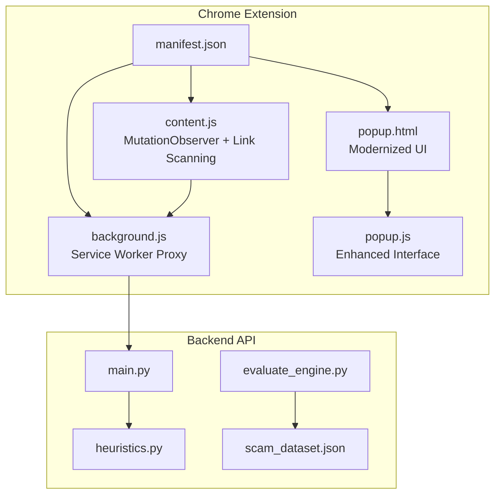
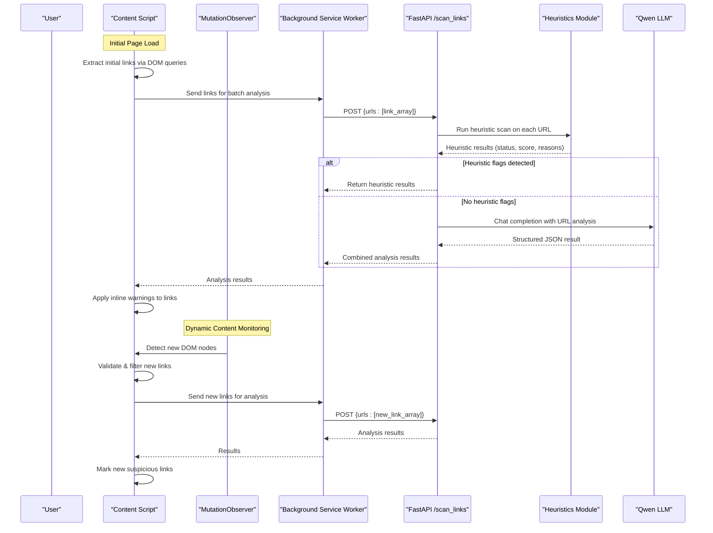
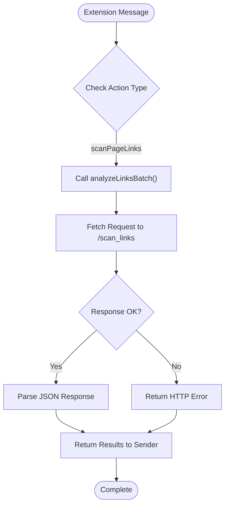
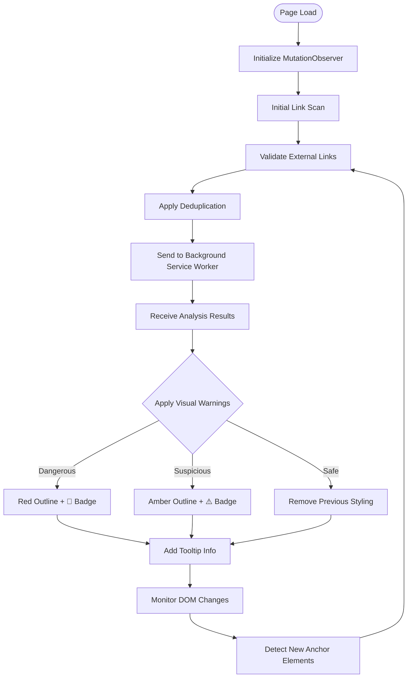
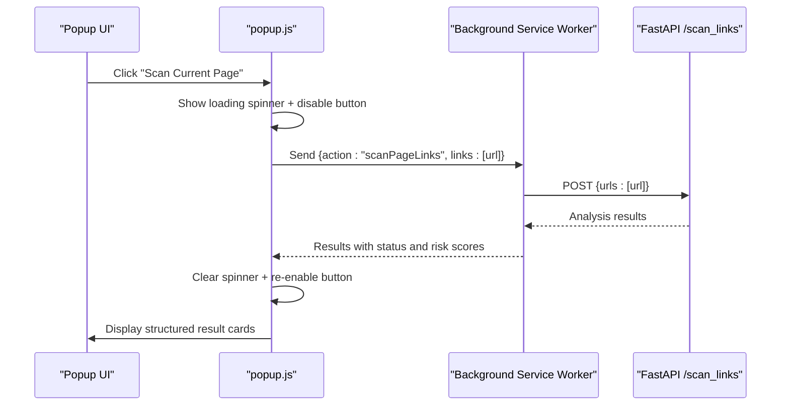
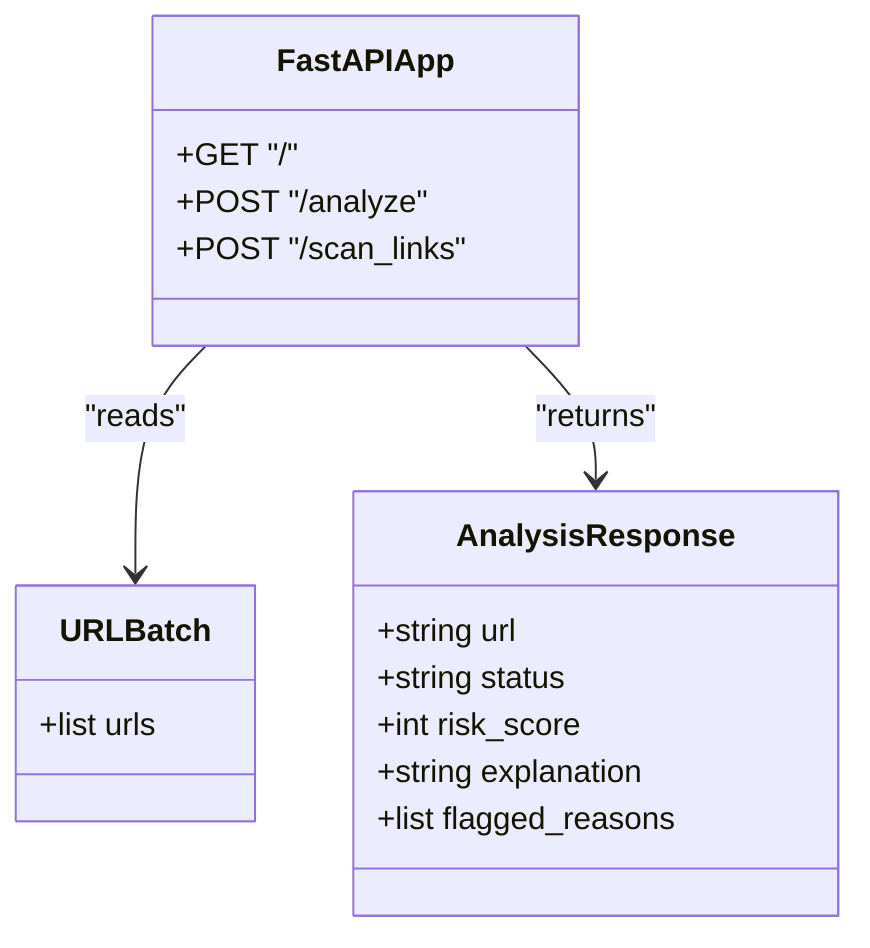
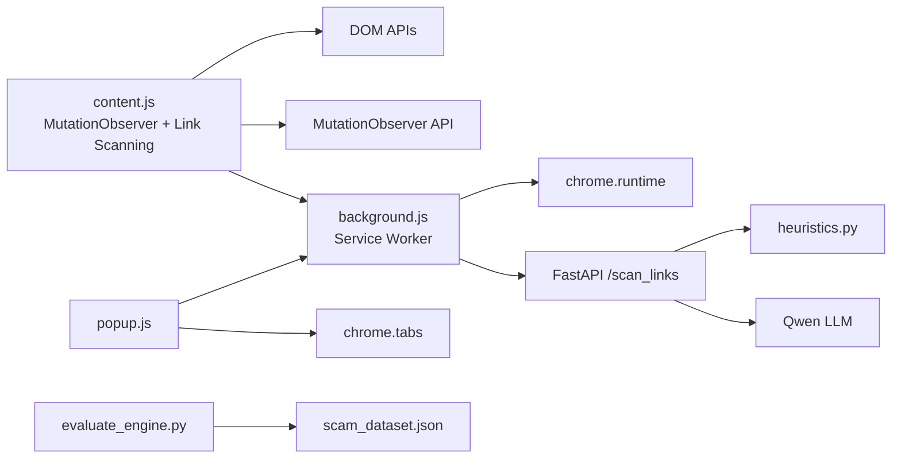

# Chrome Extension Development

<cite>
**Referenced Files in This Document**
- [manifest.json](file://extension/manifest.json)
- [background.js](file://extension/background.js)
- [content.js](file://extension/content.js)
- [popup.html](file://extension/popup.html)
- [popup.js](file://extension/popup.js)
- [main.py](file://backend/main.py)
- [heuristics.py](file://backend/heuristics.py)
- [evaluate_engine.py](file://backend/evaluate_engine.py)
- [scam_dataset.json](file://backend/scam_dataset.json)
- [README.md](file://README.md)
</cite>

## Update Summary
**Changes Made**
- Completely rewrote content script with MutationObserver integration for real-time link scanning in single-page applications (SPAs)
- Added sophisticated link validation rejecting non-HTTP schemes, same-origin links, and navigation stubs
- Implemented robust deduplication system using Set and WeakSet for memory efficiency
- Modernized popup interface with enhanced UI, loading indicators, structured result cards, and improved error handling
- Enhanced visual feedback system with inline badges and border styling for threat detection
- Improved background service worker communication with timeout handling and error recovery

## Table of Contents
1. [Introduction](#introduction)
2. [Project Structure](#project-structure)
3. [Core Components](#core-components)
4. [Architecture Overview](#architecture-overview)
5. [Detailed Component Analysis](#detailed-component-analysis)
6. [Dependency Analysis](#dependency-analysis)
7. [Performance Considerations](#performance-considerations)
8. [Troubleshooting Guide](#troubleshooting-guide)
9. [Conclusion](#conclusion)
10. [Appendices](#appendices)

## Introduction
ScrollGuard AI is a Manifest V3 Chrome extension that provides real-time protection against phishing and scam links through an intelligent two-tier detection system. The extension combines lightweight client-side link extraction with AI-powered backend analysis via a background service worker proxy. It injects a sophisticated content script into web pages that uses MutationObserver to monitor dynamic content changes, extracting visible links from both static and dynamically loaded content, then sends them to the backend for comprehensive threat analysis and displays inline warnings directly on suspicious links. A modernized popup interface allows users to manually trigger scans of the current page URL with enhanced user experience.

## Project Structure
The project consists of:
- Extension files under extension/: manifest configuration with background service worker, advanced content script with MutationObserver support, and modernized popup UI
- Background service worker for secure backend communication and batch link analysis
- Backend API under backend/: FastAPI server with heuristics module, evaluation scripts, and test dataset
- Documentation and setup instructions in README.md

**Diagram sources**
- [manifest.json:1-28](file://extension/manifest.json#L1-L28)
- [background.js:1-45](file://extension/background.js#L1-L45)
- [content.js:1-262](file://extension/content.js#L1-L262)
- [popup.html:1-205](file://extension/popup.html#L1-L205)
- [popup.js:1-139](file://extension/popup.js#L1-L139)
- [main.py:1-209](file://backend/main.py#L1-L209)
- [heuristics.py:1-110](file://backend/heuristics.py#L1-L110)
- [evaluate_engine.py:1-78](file://backend/evaluate_engine.py#L1-L78)
- [scam_dataset.json:1-37](file://backend/scam_dataset.json#L1-L37)

**Section sources**
- [manifest.json:1-28](file://extension/manifest.json#L1-L28)
- [README.md:45-56](file://README.md#L45-L56)

## Core Components
- Manifest V3 configuration defines permissions, background service worker, action popup, and content script injection rules.
- **Background Service Worker**: Acts as a secure proxy between content scripts/popups and the backend API, handling batch link analysis requests with timeout handling.
- **Advanced Content Script**: Uses MutationObserver for real-time monitoring of DOM changes, sophisticated link validation, and robust deduplication systems for efficient processing of dynamic content.
- **Modernized Popup Interface**: Features enhanced UI with loading indicators, structured result cards, and improved error handling for better user experience.
- Backend exposes CORS-enabled FastAPI endpoints including batch link analysis endpoint that calls heuristics and LLM for threat classification.

**Section sources**
- [manifest.json:1-28](file://extension/manifest.json#L1-L28)
- [background.js:1-45](file://extension/background.js#L1-L45)
- [content.js:1-262](file://extension/content.js#L1-L262)
- [popup.html:1-205](file://extension/popup.html#L1-L205)
- [popup.js:1-139](file://extension/popup.js#L1-L139)
- [main.py:1-209](file://backend/main.py#L1-L209)

## Architecture Overview
The system implements an intelligent two-tier threat detection approach with secure backend communication and real-time monitoring:
- **Real-Time Link Extraction**: Content script uses MutationObserver to continuously monitor DOM changes and extract new links from dynamic content like infinite scroll feeds and AJAX-loaded content.
- **Sophisticated Link Validation**: Advanced filtering system rejects non-HTTP schemes, same-origin links, and navigation stubs before sending to backend.
- **Robust Deduplication**: Memory-efficient deduplication using Set and WeakSet prevents redundant processing and memory leaks.
- **Background Service Worker Proxy**: Securely handles all backend communications, providing a privileged context for API calls and avoiding CORS/Mixed Content issues.
- **Backend Analysis**: Combines fast heuristic scanning with AI-powered analysis via Qwen LLM for comprehensive threat detection.
- **Enhanced Visual Feedback**: Applies subtle visual indicators with inline badges and border highlighting directly to suspicious links without disrupting page layout.

**Diagram sources**
- [content.js:244-260](file://extension/content.js#L244-L260)
- [content.js:218-240](file://extension/content.js#L218-L240)
- [background.js:39-44](file://extension/background.js#L39-L44)
- [main.py:198-209](file://backend/main.py#L198-L209)
- [heuristics.py:40-110](file://backend/heuristics.py#L40-L110)

## Detailed Component Analysis

### Manifest Configuration and Permissions
**Updated** Simplified configuration with essential permissions only

- Uses Manifest V3 with minimal permissions: activeTab, scripting, and storage.
- Defines default_popup for the toolbar action.
- Configures background service worker (background.js) for secure backend communication.
- Declares host_permissions for <all_urls> to enable content script injection across all websites.
- Declares content script matched to all URLs, injected at document_idle to ensure DOM readiness before link extraction.

Security considerations:
- Using document_idle reduces interference with critical rendering paths.
- Host permissions are scoped broadly for development; consider narrowing to specific domains for production deployments.

**Section sources**
- [manifest.json:1-28](file://extension/manifest.json#L1-L28)

### Background Service Worker: Batch Link Analysis Proxy
**Updated** Streamlined for batch link processing and error handling

The background service worker serves as a secure proxy between extension components and the backend API, specifically optimized for batch link analysis operations.

Key responsibilities:
- **Batch Processing**: Accepts arrays of URLs from content scripts and popups for efficient batch analysis.
- **Secure Proxy**: Executes fetch requests in the extension's privileged context, bypassing browser security restrictions.
- **Error Handling**: Provides robust error handling for network failures and backend unavailability.
- **Request Formatting**: Standardizes request payloads with consistent structure containing URL arrays.

Implementation details:
- Uses chrome.runtime.onMessage listener for inter-script communication
- Implements async/await pattern for non-blocking operations
- Includes comprehensive error handling for network failures
- Provides detailed error responses for debugging

**Diagram sources**
- [background.js:17-33](file://extension/background.js#L17-L33)
- [background.js:39-44](file://extension/background.js#L39-L44)

**Section sources**
- [background.js:1-45](file://extension/background.js#L1-L45)

### Content Script: Advanced Real-Time Link Scanning System
**Updated** Completely rewritten with MutationObserver integration for SPA support

The content script now features sophisticated real-time monitoring capabilities for single-page applications and dynamic content scenarios.

**MutationObserver Integration**:
- Continuously monitors DOM changes for newly inserted anchor elements
- Debounced processing (300ms delay) to handle bursts of DOM mutations efficiently
- Supports infinite scroll feeds, AJAX-loaded content, and dynamic link generation
- Tracks pending roots to process multiple mutations in batches

**Sophisticated Link Validation**:
- Rejects non-HTTP schemes (javascript:, data:, mailto:, tel:, #anchor, blob:, file:)
- Filters out same-origin links to avoid internal navigation
- Blocks navigation stubs and empty href values
- Validates URL parseability and protocol safety

**Robust Deduplication System**:
- Uses Set for URL-level deduplication to prevent redundant backend calls
- Implements WeakSet for element-level tracking with automatic garbage collection
- Prevents memory leaks while maintaining efficient processing of large DOM trees

**Enhanced Visual Feedback System**:
- **Dangerous Links**: 3px solid red outline with 🚨 badge and subtle red background tint
- **Suspicious Links**: 3px solid amber outline with ⚠️ badge and amber background tint
- **Safe Links**: Removes previous styling to indicate safe URLs
- **Inline Badges**: Non-intrusive warning indicators positioned after link text
- **Tooltip Information**: Comprehensive hover tooltips showing status and risk scores

**Event Management**:
- Throttled scroll event handling with debouncing to prevent excessive processing
- Efficient DOM querying using querySelectorAll for optimal performance
- Graceful error handling with fallback mechanisms for failed operations

**Diagram sources**
- [content.js:244-260](file://extension/content.js#L244-L260)
- [content.js:218-240](file://extension/content.js#L218-L240)
- [content.js:39-70](file://extension/content.js#L39-L70)
- [content.js:139-176](file://extension/content.js#L139-L176)

**Section sources**
- [content.js:1-262](file://extension/content.js#L1-L262)

### Popup Interface: Modernized Manual Scanning Interface
**Updated** Enhanced UI with loading indicators, structured result cards, and improved error handling

UI layout:
- Displays a clean header with gradient background, shield icon, and "Team Raven" badge.
- Shows current tab URL in a styled box with word-break support for long URLs.
- Features prominent "Scan Current Page" button with hover effects and disabled states.
- Results area displays structured cards with color-coded status indicators and detailed explanations.

Interaction flow:
- On click, retrieves the active tab URL and sends it to background service worker for analysis.
- Shows loading spinner during processing with disabled button state.
- Parses JSON response and updates the UI with structured result cards showing status, risk scores, explanations, and reasons.
- Handles connection errors with user-friendly error messages in styled error boxes.

Responsive design:
- Fixed width container (300px) with modern typography and accessible color coding.
- Clean button styling with smooth transitions and proper accessibility attributes.
- Structured result cards with clear visual hierarchy and semantic HTML structure.

**Diagram sources**
- [popup.html:187-205](file://extension/popup.html#L187-L205)
- [popup.js:21-66](file://extension/popup.js#L21-L66)

**Section sources**
- [popup.html:1-205](file://extension/popup.html#L1-L205)
- [popup.js:1-139](file://extension/popup.js#L1-L139)

### Backend API: Heuristic and AI-Powered Analysis
**Updated** Enhanced with dedicated batch link analysis endpoint and concurrent processing

Endpoints:
- GET / returns a health message.
- POST /analyze accepts individual URL/text analysis requests.
- POST /scan_links accepts batch URL analysis requests for extension use.

Processing:
- **Heuristic Scanning**: All URLs first run through fast rule-based checks in heuristics.py for immediate threat detection.
- **AI Analysis**: URLs passing heuristic checks are sent to Qwen LLM for comprehensive analysis with rate limiting.
- **Batch Processing**: Efficiently processes multiple URLs concurrently using asyncio.gather with semaphore-based concurrency control.

CORS:
- Allows cross-origin requests from the extension during development with wildcard origins.

**Diagram sources**
- [main.py:59-61](file://backend/main.py#L59-L61)
- [main.py:198-209](file://backend/main.py#L198-L209)

**Section sources**
- [main.py:1-209](file://backend/main.py#L1-L209)

### Heuristics Module: Rule-Based Detection Engine
**Updated** Enhanced with comprehensive detection rules and improved scoring

Detection Rules:
- **Free TLD Detection**: Flags domains ending in .tk, .ml, .ga, .cf, .gq, .xyz, .top, .buzz, .click, .icu, .cam commonly used in scams.
- **URL Shortener Detection**: Recognizes shortened URLs from bit.ly, tinyurl.com, t.co, ow.ly, shorturl.at, goo.gl, is.gd, buff.ly, rebrand.ly services.
- **Subdomain Depth Analysis**: Identifies unusually deep subdomain nesting as potential phishing indicator.
- **Hyphen Pattern Detection**: Flags domains with excessive hyphens suggesting impersonation attempts.
- **Typosquatting Patterns**: Identifies domains with character substitutions mimicking known brands (g00gl, paypa1, amaz0n, faceb00k, app1e, mircosoft).
- **Path Keywords**: Searches for common scam indicators in URL paths like "claim", "winner", "free-money", "giveaway", "verify-account", "urgent-security".
- **Domain Keywords**: Checks domain names for suspicious patterns like "free-crypto", "claim-now", "verify-urgent", "account-verify".
- **HTTPS Validation**: Flags non-HTTPS URLs as potentially insecure.

Risk Scoring:
- Each rule contributes to cumulative risk score (0-100) with weighted scoring.
- Thresholds determine final classification: Dangerous (≥70), Suspicious (≥30), Safe (<30).
- Returns structured results with status, score, and detailed reasons for flagging.

**Section sources**
- [heuristics.py:1-110](file://backend/heuristics.py#L1-L110)

### Evaluation and Benchmarking
- evaluate_engine.py loads scam_dataset.json and posts each sample to the backend batch endpoint.
- Compares predicted status with expected_status and prints per-sample results and overall accuracy metrics.
- Uses scikit-learn for classification reports and confusion matrix generation.

Use cases:
- Validate detection quality across known safe and dangerous samples.
- Iterate on heuristics and prompts to improve accuracy.
- Measure performance improvements after code changes.

**Section sources**
- [evaluate_engine.py:1-78](file://backend/evaluate_engine.py#L1-L78)
- [scam_dataset.json:1-37](file://backend/scam_dataset.json#L1-L37)

## Dependency Analysis
- Extension depends on browser APIs (chrome.tabs, chrome.runtime, fetch) and the backend API for advanced analysis.
- **Advanced Content Script** depends on DOM APIs, MutationObserver, and background service worker for analysis.
- **Background Service Worker** depends on chrome.runtime messaging and fetch API for backend communication.
- Backend depends on FastAPI, OpenAI-compatible client, heuristics module, and environment variables for API keys.

**Diagram sources**
- [content.js:249-253](file://extension/content.js#L249-L253)
- [background.js:39-44](file://extension/background.js#L39-L44)
- [popup.js:15-18](file://extension/popup.js#L15-L18)
- [main.py:198-209](file://backend/main.py#L198-L209)
- [heuristics.py:40-110](file://backend/heuristics.py#L40-L110)
- [evaluate_engine.py:35-48](file://backend/evaluate_engine.py#L35-L48)
- [scam_dataset.json:1-37](file://backend/scam_dataset.json#L1-L37)

**Section sources**
- [popup.js:1-139](file://extension/popup.js#L1-L139)
- [main.py:1-209](file://backend/main.py#L1-L209)

## Performance Considerations
- **MutationObserver Efficiency**: Debounced processing (300ms) prevents excessive DOM queries during rapid content updates.
- **Memory Management**: WeakSet usage ensures automatic garbage collection of processed anchor elements, preventing memory leaks.
- **Link Validation Optimization**: Early rejection of invalid URLs reduces unnecessary backend calls and processing overhead.
- **Concurrent Processing**: Backend uses asyncio.gather with semaphore-based concurrency control for efficient batch processing.
- **Background Service Worker**: Offloads network requests from content scripts, improving page performance and avoiding CORS issues.
- **Throttled Event Handling**: Scroll events and DOM mutations are debounced to prevent excessive processing during user interaction.
- **Minimal Popup Operations**: Lightweight interface that only performs network calls on explicit user actions.
- **Efficient DOM Manipulation**: Inline visual feedback uses minimal CSS modifications to maintain page performance.

Recommendations:
- Monitor memory usage for pages with extremely large DOM trees or frequent dynamic content updates.
- Consider implementing URL caching for recently analyzed URLs to reduce redundant backend calls.
- Add retry logic with exponential backoff for failed background service worker communications.
- Implement progressive loading for pages with massive numbers of links to avoid blocking UI.
- Consider lazy-loading heavy resources if extending functionality with additional features.

## Troubleshooting Guide
Common issues and resolutions:
- **Background Service Worker Issues**: Ensure the service worker is properly registered and listening for messages. Check console logs for registration errors.
- **Backend Not Reachable**: Ensure the FastAPI server is running locally and CORS is enabled. The popup shows an alert on connection failure.
- **CORS Errors**: Verify host_permissions are correctly configured in manifest.json for the backend domain.
- **Missing API Key**: Backend raises an error if DASHSCOPE_API_KEY is not set; configure environment variables as documented.
- **No Visual Warnings**: Verify content script injection at document_idle and confirm links are being extracted and sent to background service worker. Check that backend is returning proper response format.
- **MutationObserver Not Working**: Ensure DOM is fully loaded before observer initialization and check for JavaScript errors in console.
- **Memory Leaks**: Monitor memory usage in Chrome DevTools and verify WeakSet cleanup is working properly.
- **Evaluation Failures**: Confirm scam_dataset.json exists and the backend responds with 200 OK for /scan_links.

Debugging techniques:
- Use Chrome DevTools to inspect the content script console logs and DOM changes.
- Inspect network requests from the popup to verify payloads and responses.
- Check background service worker logs for message routing issues.
- Run evaluate_engine.py to measure detection accuracy and identify misclassified samples.
- Test content script link extraction by examining DOM queries in the console.
- Monitor MutationObserver activity using Performance tab in DevTools.
- Check for memory leaks using Memory tab and heap snapshots.

**Section sources**
- [popup.js:45-49](file://extension/popup.js#L45-L49)
- [main.py:31-33](file://backend/main.py#L31-L33)
- [evaluate_engine.py:35-41](file://backend/evaluate_engine.py#L35-L41)

## Conclusion
ScrollGuard AI implements an advanced threat detection system that combines sophisticated client-side link extraction with powerful AI analysis through a secure background service worker architecture. The completely rewritten content script now features MutationObserver integration for real-time monitoring of dynamic content, making it ideal for single-page applications and infinite scroll feeds. The sophisticated link validation system ensures only relevant external links are processed, while the robust deduplication mechanism prevents memory leaks and redundant processing. The modernized popup interface provides an enhanced user experience with loading indicators, structured result cards, and comprehensive error handling. The background service worker solves critical CORS and Mixed Content issues, enabling seamless backend communication. The modular design supports easy extension of detection rules, customization of visual feedback, and integration with additional threat intelligence sources while maintaining optimal performance and user experience.

## Appendices

### How to Extend Detection Rules
**Updated** Enhanced with backend heuristics and simplified content script approach

- Add new detection rules to the heuristics.py module to include additional TLD patterns, typosquatting detection, or keyword combinations.
- Modify risk scoring thresholds in heuristics.py to adjust sensitivity levels for different threat categories.
- Update the backend system prompt in main.py to incorporate new rule categories and refine AI analysis criteria.
- Extend content script visual feedback by adding new border styles or tooltip formats for different threat levels.
- Consider how new rules might affect the balance between heuristic and AI detection layers.

**Section sources**
- [heuristics.py:16-99](file://backend/heuristics.py#L16-L99)
- [content.js:139-176](file://extension/content.js#L139-L176)
- [main.py:64-86](file://backend/main.py#L64-L86)

### Customize Visual Feedback
**Updated** Enhanced with inline link warning system and badge integration

- Modify inline styles in the content script to adjust border colors, thickness, and positioning for different threat levels.
- Change visual indicators to use different CSS properties (e.g., background highlighting, text decoration) instead of borders.
- Enhance tooltip information by adding more detailed threat explanations or risk assessment details.
- Customize the dismiss behavior and visual feedback timing for different use cases.
- Consider adding accessibility features like ARIA labels for screen reader support.
- Update badge styling and positioning for better visual consistency across different website themes.

**Section sources**
- [content.js:139-176](file://extension/content.js#L139-L176)

### Add New Threat Detection Rules
**Updated** Enhanced with comprehensive backend heuristics and AI integration

- Expand heuristics.py with domain-specific regex patterns (e.g., social media impersonation, crypto giveaways, government impersonation, banking fraud).
- Integrate additional data sources (blocklists, reputation APIs) into the backend analysis pipeline.
- Update the backend system prompt to incorporate new rule categories and refine scoring logic for better accuracy.
- Implement category-specific scoring weights to prioritize certain types of threats over others.
- Consider how new rules might interact with the simplified two-tier detection system.
- Add new validation rules in content.js for specialized link types or protocols.

**Section sources**
- [heuristics.py:16-99](file://backend/heuristics.py#L16-L99)
- [main.py:64-86](file://backend/main.py#L64-L86)
- [content.js:39-70](file://extension/content.js#L39-L70)

### Security Considerations
**Updated** Enhanced with simplified architecture security practices and advanced validation

- Permission scoping: Keep permissions minimal (activeTab, scripting, storage) and restrict content script matches where possible.
- **Background Service Worker Security**: The service worker acts as a secure proxy, preventing CORS and Mixed Content issues while maintaining separation between page context and backend communication.
- **Content script isolation**: Avoid exposing sensitive data to the page; use chrome.runtime messaging if inter-script communication is required. The current implementation maintains isolation by only accessing necessary DOM elements.
- **Safe DOM manipulation**: Sanitize injected content, avoid eval, and prefer attribute setting and style assignments to mitigate XSS risks. Current implementation uses direct DOM property assignment safely.
- Backend security: Restrict CORS origins in production and validate inputs rigorously.
- **Heuristics security**: Regularly update rule sets to address emerging threats while avoiding false positives on legitimate content.
- **Host permissions**: Currently scoped to <all_urls>; restrict to specific domains in production for enhanced security.
- **Link validation security**: Sophisticated validation prevents execution of javascript: URLs, data: URIs, and other potentially malicious protocols.

**Section sources**
- [manifest.json:6-13](file://extension/manifest.json#L6-L13)
- [background.js:1-45](file://extension/background.js#L1-L45)
- [main.py:44-50](file://backend/main.py#L44-L50)
- [content.js:39-70](file://extension/content.js#L39-L70)

### Compatibility Testing Across Websites
**Updated** Enhanced with simplified content script testing scenarios and SPA support

- Test on diverse sites (news, e-commerce, social platforms) to ensure inline warnings do not break layouts or interfere with site functionality.
- Verify performance on pages with heavy DOM trees and dynamic content. Content script uses efficient DOM queries and MutationObserver for optimal performance.
- Validate that content script injection at document_idle works reliably across different frameworks and SPAs.
- Test visual feedback functionality and border styling across different website structures and CSS frameworks.
- Verify accessibility compliance across different screen readers and assistive technologies.
- **Background Service Worker Testing**: Ensure service worker registration and message passing work correctly across different page contexts and security policies.
- **CORS Testing**: Verify backend communication works on both HTTP and HTTPS pages with proper host_permissions configuration.
- **SPA Testing**: Test mutation observer functionality on single-page applications with dynamic content loading, infinite scroll, and AJAX-driven interfaces.

### Content Script Implementation Details
**New Section** Comprehensive overview of the advanced link extraction capabilities with MutationObserver support

The content script implements a sophisticated approach focused on reliable link extraction, real-time monitoring, and visual feedback for modern web applications:

**MutationObserver Integration**:
- Continuously monitors DOM changes for newly inserted anchor elements
- Debounced processing (300ms delay) to handle bursts of DOM mutations efficiently
- Supports infinite scroll feeds, AJAX-loaded content, and dynamic link generation
- Tracks pending roots to process multiple mutations in batches

**Sophisticated Link Validation**:
- Rejects non-HTTP schemes (javascript:, data:, mailto:, tel:, #anchor, blob:, file:)
- Filters out same-origin links to avoid internal navigation
- Blocks navigation stubs and empty href values
- Validates URL parseability and protocol safety

**Robust Deduplication System**:
- Uses Set for URL-level deduplication to prevent redundant backend calls
- Implements WeakSet for element-level tracking with automatic garbage collection
- Prevents memory leaks while maintaining efficient processing of large DOM trees

**Enhanced Visual Feedback System**:
- Applies subtle CSS modifications directly to link elements without disrupting page layout
- Uses outline styling for clear but non-intrusive visual indicators
- Provides contextual information through title attributes for hover tooltips
- Supports three-tier severity levels: Dangerous (red outline + 🚨 badge), Suspicious (amber outline + ⚠️ badge), Safe (no styling)

**Event Management**:
- Implements throttled scroll event handling to prevent excessive processing during user interaction
- Uses setTimeout/clearTimeout pattern to manage concurrent link extraction operations
- Ensures single instance of link extraction per scroll event cycle

**Background Service Worker Integration**:
- Secure proxy for backend communication avoiding CORS and Mixed Content issues
- Message routing between content scripts and backend API with proper error handling
- Robust error handling for network failures and backend unavailability

**Accessibility and UX Features**:
- Maintains page layout integrity through minimal CSS modifications
- Provides semantic HTML structure for better accessibility
- Uses standard CSS properties for broad browser compatibility

**Section sources**
- [content.js:1-262](file://extension/content.js#L1-L262)
- [background.js:1-45](file://extension/background.js#L1-L45)

### Background Service Worker Architecture
**New Section** Detailed overview of the streamlined proxy architecture

The background service worker serves as a critical component in the extension's security architecture, providing secure backend communication while maintaining separation from page contexts.

**Core Responsibilities**:
- **Batch Processing**: Optimized for handling arrays of URLs efficiently in single API calls.
- **Secure Proxy**: Executes fetch requests in the extension's privileged context, bypassing browser security restrictions that would otherwise block content scripts and popups on HTTPS pages.
- **Message Routing**: Listens for messages from content scripts and popup, routing them to appropriate backend endpoints with proper error handling.
- **Error Handling**: Provides comprehensive error responses for network failures, backend unavailability, and malformed requests.

**Communication Patterns**:
- Uses chrome.runtime.onMessage listener for inter-script communication.
- Implements async/await pattern for non-blocking operations.
- Includes timeout handling to prevent blocking page loads.
- Provides detailed error responses for debugging and troubleshooting.

**Security Benefits**:
- Prevents CORS violations by executing network requests in extension context.
- Eliminates Mixed Content issues when communicating with HTTP backends from HTTPS pages.
- Maintains separation between page JavaScript and extension privileges.
- Provides centralized error handling and logging for backend communication.

**Section sources**
- [background.js:1-45](file://extension/background.js#L1-L45)