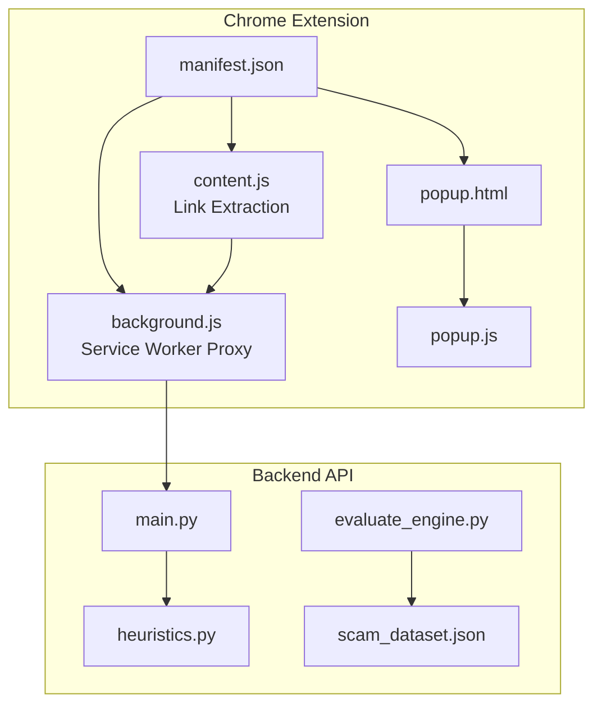
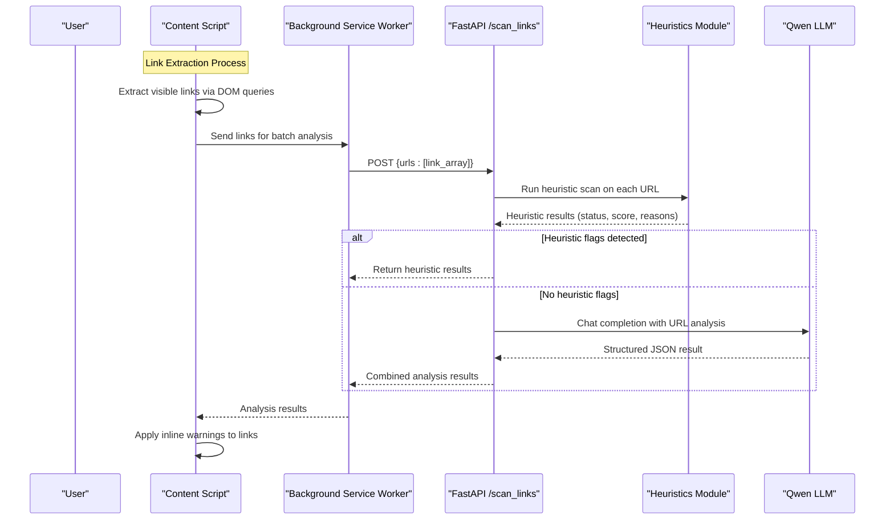
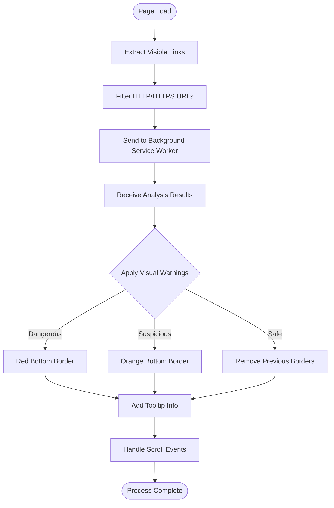
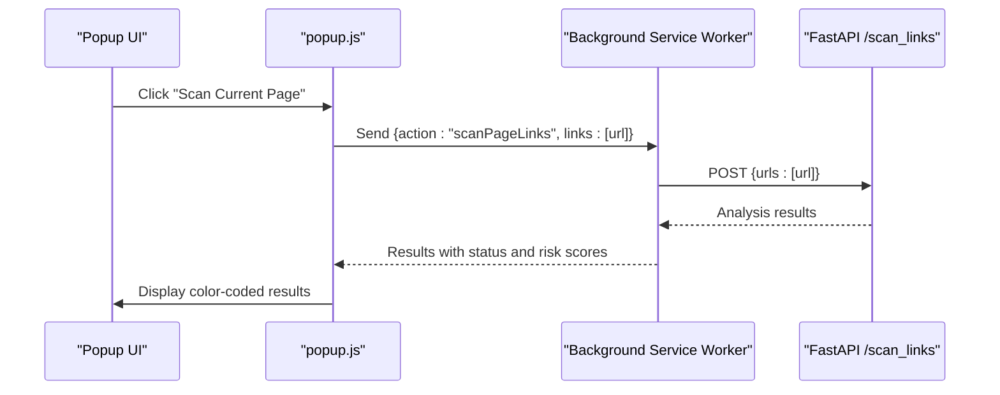
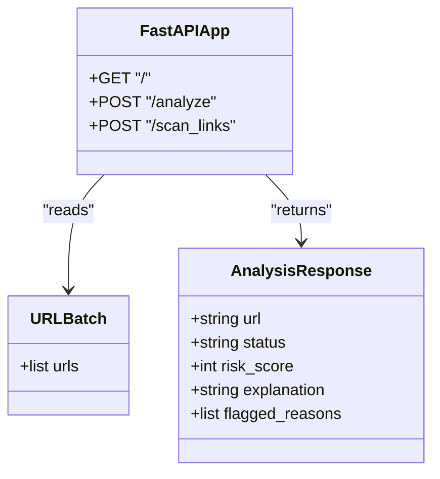
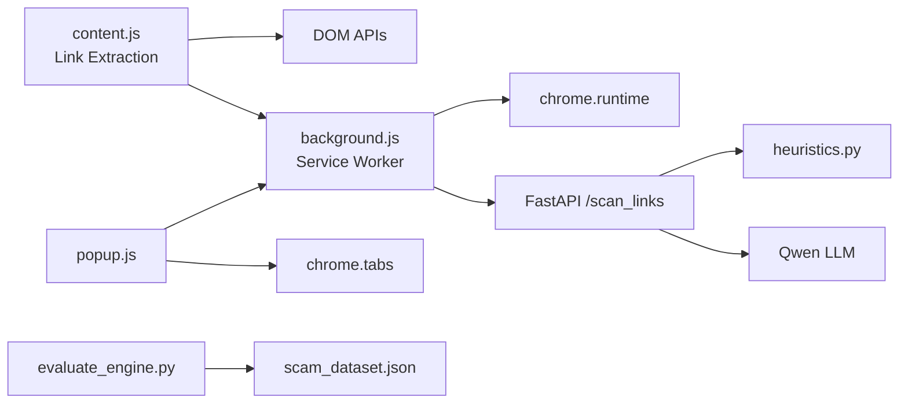

# Chrome Extension Development

<cite>
**Referenced Files in This Document**
- [manifest.json](file://extension/manifest.json)
- [background.js](file://extension/background.js)
- [content.js](file://extension/content.js)
- [popup.html](file://extension/popup.html)
- [popup.js](file://extension/popup.js)
- [main.py](file://backend/main.py)
- [heuristics.py](file://backend/heuristics.py)
- [evaluate_engine.py](file://backend/evaluate_engine.py)
- [scam_dataset.json](file://backend/scam_dataset.json)
- [README.md](file://README.md)
</cite>

## Update Summary
**Changes Made**
- Dramatically simplified extension architecture with content.js reduced from 622 to 54 lines
- Removed three-layer protection system, complex link scraping infrastructure, and advanced banner system
- Eliminated local heuristic detection engine and SPA-specific optimizations from content script
- New implementation uses straightforward DOM query approach for link extraction
- Simplified popup interface focusing on manual scanning functionality
- Streamlined backend communication through background service worker proxy

## Table of Contents
1. [Introduction](#introduction)
2. [Project Structure](#project-structure)
3. [Core Components](#core-components)
4. [Architecture Overview](#architecture-overview)
5. [Detailed Component Analysis](#detailed-component-analysis)
6. [Dependency Analysis](#dependency-analysis)
7. [Performance Considerations](#performance-considerations)
8. [Troubleshooting Guide](#troubleshooting-guide)
9. [Conclusion](#conclusion)
10. [Appendices](#appendices)

## Introduction
ScrollGuard AI is a Manifest V3 Chrome extension that provides real-time protection against phishing and scam links through a streamlined two-tier detection system. The extension combines lightweight client-side link extraction with AI-powered backend analysis via a background service worker proxy. It injects a minimal content script into web pages to extract visible links using simple DOM queries, then sends them to the backend for comprehensive threat analysis and displays inline warnings directly on suspicious links. A simplified popup interface allows users to manually trigger scans of the current page URL.

## Project Structure
The project consists of:
- Extension files under extension/: manifest configuration with background service worker, simplified content script for link extraction, and basic popup UI
- Background service worker for secure backend communication and batch link analysis
- Backend API under backend/: FastAPI server with heuristics module, evaluation scripts, and test dataset
- Documentation and setup instructions in README.md

**Diagram sources**
- [manifest.json:1-29](file://extension/manifest.json#L1-L29)
- [background.js:1-45](file://extension/background.js#L1-L45)
- [content.js:1-54](file://extension/content.js#L1-L54)
- [popup.html:1-47](file://extension/popup.html#L1-L47)
- [popup.js:1-37](file://extension/popup.js#L1-L37)
- [main.py:1-150](file://backend/main.py#L1-L150)
- [heuristics.py:1-49](file://backend/heuristics.py#L1-L49)
- [evaluate_engine.py:1-44](file://backend/evaluate_engine.py#L1-L44)
- [scam_dataset.json:1-37](file://backend/scam_dataset.json#L1-L37)

**Section sources**
- [manifest.json:1-29](file://extension/manifest.json#L1-L29)
- [README.md:45-56](file://README.md#L45-L56)

## Core Components
- Manifest V3 configuration defines permissions, background service worker, action popup, and content script injection rules.
- **Background Service Worker**: Acts as a secure proxy between content scripts/popups and the backend API, handling batch link analysis requests.
- **Simplified Content Script**: Uses straightforward DOM queries to extract visible links and applies inline visual warnings (border highlighting + tooltips) based on backend analysis results.
- Popup UI displays current tab URL and triggers manual scan via background service worker communication.
- Backend exposes CORS-enabled FastAPI endpoints including batch link analysis endpoint that calls heuristics and LLM for threat classification.

**Section sources**
- [manifest.json:1-29](file://extension/manifest.json#L1-L29)
- [background.js:1-45](file://extension/background.js#L1-L45)
- [content.js:1-54](file://extension/content.js#L1-L54)
- [popup.html:1-47](file://extension/popup.html#L1-L47)
- [popup.js:1-37](file://extension/popup.js#L1-L37)
- [main.py:1-150](file://backend/main.py#L1-L150)

## Architecture Overview
The system implements a streamlined two-tier threat detection approach with secure backend communication:
- **Client-Side Link Extraction**: Content script performs immediate DOM queries to extract visible links from the current page.
- **Background Service Worker Proxy**: Securely handles all backend communications, providing a privileged context for API calls and avoiding CORS/Mixed Content issues.
- **Backend Analysis**: Combines fast heuristic scanning with AI-powered analysis via Qwen LLM for comprehensive threat detection.
- **Inline Visual Feedback**: Applies subtle visual indicators directly to suspicious links without disrupting page layout.

**Diagram sources**
- [content.js:12-43](file://extension/content.js#L12-L43)
- [background.js:17-44](file://extension/background.js#L17-L44)
- [main.py:110-150](file://backend/main.py#L110-L150)
- [heuristics.py:4-49](file://backend/heuristics.py#L4-L49)

## Detailed Component Analysis

### Manifest Configuration and Permissions
**Updated** Simplified configuration with essential permissions only

- Uses Manifest V3 with minimal permissions: activeTab, scripting, and storage.
- Defines default_popup for the toolbar action.
- Configures background service worker (background.js) for secure backend communication.
- Declares host_permissions for <all_urls> to enable content script injection across all websites.
- Declares content script matched to all URLs, injected at document_idle to ensure DOM readiness before link extraction.

Security considerations:
- Using document_idle reduces interference with critical rendering paths.
- Host permissions are scoped broadly for development; consider narrowing to specific domains for production deployments.

**Section sources**
- [manifest.json:1-29](file://extension/manifest.json#L1-L29)

### Background Service Worker: Batch Link Analysis Proxy
**Updated** Streamlined for batch link processing and error handling

The background service worker serves as a secure proxy between extension components and the backend API, specifically optimized for batch link analysis operations.

Key responsibilities:
- **Batch Processing**: Accepts arrays of URLs from content scripts and popups for efficient batch analysis.
- **Secure Proxy**: Executes fetch requests in the extension's privileged context, bypassing browser security restrictions.
- **Error Handling**: Provides robust error handling for network failures and backend unavailability.
- **Request Formatting**: Standardizes request payloads with consistent structure containing URL arrays.

Implementation details:
- Uses chrome.runtime.onMessage listener for inter-script communication
- Implements async/await pattern for non-blocking operations
- Includes comprehensive error handling for network failures
- Provides detailed error responses for debugging

**Diagram sources**
- [background.js:17-33](file://extension/background.js#L17-L33)
- [background.js:39-44](file://extension/background.js#L39-L44)

**Section sources**
- [background.js:1-45](file://extension/background.js#L1-L45)

### Content Script: Simplified Link Extraction System
**Updated** Dramatically simplified from complex three-layer system to straightforward DOM queries

The content script now focuses exclusively on extracting visible links and applying inline visual feedback based on backend analysis results.

**Link Extraction Logic**:
- Uses `document.querySelectorAll("a")` to find all anchor elements on the page.
- Maps extracted links to their href attributes and filters for HTTP/HTTPS URLs.
- Sends extracted links array to background service worker for batch analysis.
- Applies inline visual warnings directly to matching links based on analysis results.

**Visual Feedback System**:
- **Dangerous Links**: Red bottom border (2px solid red) indicating high-risk URLs.
- **Suspicious Links**: Orange bottom border (2px solid orange) indicating potentially risky URLs.
- **Safe Links**: Removes any previous border styling to indicate safe URLs.
- **Tooltip Information**: Adds title attribute showing status and risk score for hover information.

**Event Handling**:
- Listens for window load event to perform initial link extraction.
- Implements throttled scroll event handling (500ms delay) to avoid excessive processing during user scrolling.
- Uses clearTimeout/setTimeout pattern to prevent multiple simultaneous extractions.

**Diagram sources**
- [content.js:12-43](file://extension/content.js#L12-L43)
- [content.js:48-54](file://extension/content.js#L48-L54)

**Section sources**
- [content.js:1-54](file://extension/content.js#L1-L54)

### Popup Interface: Manual Scanning Interface
**Updated** Simplified to focus on single URL scanning functionality

UI layout:
- Displays a clean header with "ScrollGuard AI" title.
- Shows a prominent "Scan Current Page" button for manual scanning.
- Results area displays analysis outcomes with color-coded status indicators.

Interaction flow:
- On click, retrieves the active tab URL and sends it to background service worker for analysis.
- Parses JSON response and updates the UI with color-coded results (green for Safe, orange for Suspicious, red for Dangerous).
- Handles connection errors with user-friendly error messages.

Responsive design:
- Fixed width container (250px) with clean typography and accessible color coding.
- Simple button styling with hover effects for better user experience.

**Diagram sources**
- [popup.html:40-42](file://extension/popup.html#L40-L42)
- [popup.js:7-36](file://extension/popup.js#L7-L36)

**Section sources**
- [popup.html:1-47](file://extension/popup.html#L1-L47)
- [popup.js:1-37](file://extension/popup.js#L1-L37)

### Backend API: Heuristic and AI-Powered Analysis
**Updated** Enhanced with dedicated batch link analysis endpoint

Endpoints:
- GET / returns a health message.
- POST /analyze accepts individual URL/text analysis requests.
- POST /scan_links accepts batch URL analysis requests for extension use.

Processing:
- **Heuristic Scanning**: All URLs first run through fast rule-based checks in heuristics.py for immediate threat detection.
- **AI Analysis**: URLs passing heuristic checks are sent to Qwen LLM for comprehensive analysis.
- **Batch Processing**: Efficiently processes multiple URLs in single API call for optimal performance.

CORS:
- Allows cross-origin requests from the extension during development.

**Diagram sources**
- [main.py:33-46](file://backend/main.py#L33-L46)
- [main.py:71-108](file://backend/main.py#L71-L108)
- [main.py:110-150](file://backend/main.py#L110-L150)

**Section sources**
- [main.py:1-150](file://backend/main.py#L1-L150)

### Heuristics Module: Rule-Based Detection Engine
**New Section** Comprehensive overview of the backend heuristic detection system

The heuristics module provides fast, rule-based threat detection that runs before AI analysis to quickly identify obvious threats.

Detection Rules:
- **Free TLD Detection**: Flags domains ending in .tk, .ml, .ga, .cf, .gq commonly used in scams.
- **Typosquatting Patterns**: Identifies domains with repeated characters or hyphens suggesting impersonation attempts.
- **URL Shortener Detection**: Recognizes shortened URLs from bit.ly, tinyurl, and t.co services.
- **Scam Keywords**: Searches for common scam indicators like "claim", "win", "free", "bonus", "reward", "verify", "urgent", "login".
- **HTTPS Validation**: Flags non-HTTPS URLs as potentially insecure.

Risk Scoring:
- Each rule contributes to cumulative risk score (0-100).
- Thresholds determine final classification: Dangerous (≥70), Suspicious (≥30), Safe (<30).
- Returns structured results with status, score, and detailed reasons for flagging.

**Section sources**
- [heuristics.py:1-49](file://backend/heuristics.py#L1-L49)

### Evaluation and Benchmarking
- evaluate_engine.py loads scam_dataset.json and posts each sample to the backend batch endpoint.
- Compares predicted status with expected_status and prints per-sample results and overall accuracy metrics.
- Uses scikit-learn for classification reports and confusion matrix generation.

Use cases:
- Validate detection quality across known safe and dangerous samples.
- Iterate on heuristics and prompts to improve accuracy.
- Measure performance improvements after code changes.

**Section sources**
- [evaluate_engine.py:1-44](file://backend/evaluate_engine.py#L1-L44)
- [scam_dataset.json:1-37](file://backend/scam_dataset.json#L1-L37)

## Dependency Analysis
- Extension depends on browser APIs (chrome.tabs, chrome.runtime, fetch) and the backend API for advanced analysis.
- **Simplified Content Script** depends on DOM APIs for link extraction and background service worker for analysis.
- **Background Service Worker** depends on chrome.runtime messaging and fetch API for backend communication.
- Backend depends on FastAPI, OpenAI-compatible client, heuristics module, and environment variables for API keys.

**Diagram sources**
- [content.js:12-43](file://extension/content.js#L12-L43)
- [background.js:17-44](file://extension/background.js#L17-L44)
- [popup.js:7-36](file://extension/popup.js#L7-L36)
- [main.py:110-150](file://backend/main.py#L110-L150)
- [heuristics.py:4-49](file://backend/heuristics.py#L4-L49)
- [evaluate_engine.py:12-44](file://backend/evaluate_engine.py#L12-L44)
- [scam_dataset.json:1-37](file://backend/scam_dataset.json#L1-L37)

**Section sources**
- [popup.js:1-37](file://extension/popup.js#L1-L37)
- [main.py:1-150](file://backend/main.py#L1-L150)

## Performance Considerations
- **Streamlined Content Script**: Minimal DOM queries and simple filtering logic ensure fast execution even on large pages.
- **Throttled Event Handling**: Scroll events are debounced with 500ms delay to prevent excessive processing during user interaction.
- **Background Service Worker**: Offloads network requests from content scripts, improving page performance and avoiding CORS issues.
- **Batch Processing**: Backend efficiently processes multiple URLs in single API calls, reducing network overhead.
- **Heuristic Pre-screening**: Fast rule-based checks eliminate obvious threats before expensive AI analysis.
- **Minimal Popup Operations**: Lightweight interface that only performs network calls on explicit user actions.
- **Inline Visual Feedback**: Subtle CSS modifications avoid heavy DOM manipulation and maintain page performance.

Recommendations:
- Monitor memory usage for pages with extremely large DOM trees.
- Consider implementing link deduplication to avoid analyzing the same URL multiple times.
- Add caching for recently analyzed URLs to reduce redundant backend calls.
- Implement retry logic for failed background service worker communications.
- Consider lazy-loading heavy resources if extending functionality.

## Troubleshooting Guide
Common issues and resolutions:
- **Background Service Worker Issues**: Ensure the service worker is properly registered and listening for messages. Check console logs for registration errors.
- **Backend Not Reachable**: Ensure the FastAPI server is running locally and CORS is enabled. The popup shows an alert on connection failure.
- **CORS Errors**: Verify host_permissions are correctly configured in manifest.json for the backend domain.
- **Missing API Key**: Backend raises an error if DASHSCOPE_API_KEY is not set; configure environment variables as documented.
- **No Visual Warnings**: Verify content script injection at document_idle and confirm links are being extracted and sent to background service worker. Check that backend is returning proper response format.
- **Evaluation Failures**: Confirm scam_dataset.json exists and the backend responds with 200 OK for /scan_links.

Debugging techniques:
- Use Chrome DevTools to inspect the content script console logs and DOM changes.
- Inspect network requests from the popup to verify payloads and responses.
- Check background service worker logs for message routing issues.
- Run evaluate_engine.py to measure detection accuracy and identify misclassified samples.
- Test content script link extraction by examining DOM queries in the console.

**Section sources**
- [popup.js:22-25](file://extension/popup.js#L22-L25)
- [main.py:12-14](file://backend/main.py#L12-L14)
- [evaluate_engine.py:18-21](file://backend/evaluate_engine.py#L18-L21)

## Conclusion
ScrollGuard AI implements a streamlined threat detection system that combines lightweight client-side link extraction with powerful AI analysis through a secure background service worker architecture. The dramatically simplified extension architecture focuses on core functionality: extracting visible links from web pages and providing immediate visual feedback about potential threats. The background service worker solves critical CORS and Mixed Content issues, enabling seamless backend communication. The popup and content script provide clear, non-intrusive warnings with subtle visual indicators. The modular design supports easy extension of detection rules, customization of visual feedback, and integration with additional threat intelligence sources while maintaining optimal performance and user experience.

## Appendices

### How to Extend Detection Rules
**Updated** Enhanced with backend heuristics and simplified content script approach

- Add new detection rules to the heuristics.py module to include additional TLD patterns, typosquatting detection, or keyword combinations.
- Modify risk scoring thresholds in heuristics.py to adjust sensitivity levels for different threat categories.
- Update the backend system prompt in main.py to incorporate new rule categories and refine AI analysis criteria.
- Extend content script visual feedback by adding new border styles or tooltip formats for different threat levels.
- Consider how new rules might affect the balance between heuristic and AI detection layers.

**Section sources**
- [heuristics.py:16-41](file://backend/heuristics.py#L16-L41)
- [content.js:30-38](file://extension/content.js#L30-L38)
- [main.py:47-63](file://backend/main.py#L47-L63)

### Customize Visual Feedback
**Updated** Enhanced with inline link warning system

- Modify inline styles in the content script to adjust border colors, thickness, and positioning for different threat levels.
- Change visual indicators to use different CSS properties (e.g., background highlighting, text decoration) instead of borders.
- Enhance tooltip information by adding more detailed threat explanations or risk assessment details.
- Customize the dismiss behavior and visual feedback timing for different use cases.
- Consider adding accessibility features like ARIA labels for screen reader support.

**Section sources**
- [content.js:30-38](file://extension/content.js#L30-L38)

### Add New Threat Detection Rules
**Updated** Enhanced with comprehensive backend heuristics and AI integration

- Expand heuristics.py with domain-specific regex patterns (e.g., social media impersonation, crypto giveaways, government impersonation, banking fraud).
- Integrate additional data sources (blocklists, reputation APIs) into the backend analysis pipeline.
- Update the backend system prompt to incorporate new rule categories and refine scoring logic for better accuracy.
- Implement category-specific scoring weights to prioritize certain types of threats over others.
- Consider how new rules might interact with the simplified two-tier detection system.

**Section sources**
- [heuristics.py:16-41](file://backend/heuristics.py#L16-L41)
- [main.py:47-63](file://backend/main.py#L47-L63)

### Security Considerations
**Updated** Enhanced with simplified architecture security practices

- Permission scoping: Keep permissions minimal (activeTab, scripting, storage) and restrict content script matches where possible.
- **Background Service Worker Security**: The service worker acts as a secure proxy, preventing CORS and Mixed Content issues while maintaining separation between page context and backend communication.
- **Content script isolation**: Avoid exposing sensitive data to the page; use chrome.runtime messaging if inter-script communication is required. The current implementation maintains isolation by only accessing necessary DOM elements.
- **Safe DOM manipulation**: Sanitize injected content, avoid eval, and prefer attribute setting and style assignments to mitigate XSS risks. Current implementation uses direct DOM property assignment safely.
- Backend security: Restrict CORS origins in production and validate inputs rigorously.
- **Heuristics security**: Regularly update rule sets to address emerging threats while avoiding false positives on legitimate content.
- **Host permissions**: Currently scoped to <all_urls>; restrict to specific domains in production for enhanced security.

**Section sources**
- [manifest.json:6-13](file://extension/manifest.json#L6-L13)
- [background.js:1-45](file://extension/background.js#L1-L45)
- [main.py:23-30](file://backend/main.py#L23-L30)

### Compatibility Testing Across Websites
**Updated** Enhanced with simplified content script testing scenarios

- Test on diverse sites (news, e-commerce, social platforms) to ensure inline warnings do not break layouts or interfere with site functionality.
- Verify performance on pages with heavy DOM trees and dynamic content. Content script uses efficient DOM queries for optimal performance.
- Validate that content script injection at document_idle works reliably across different frameworks and SPAs.
- Test visual feedback functionality and border styling across different website structures and CSS frameworks.
- Verify accessibility compliance across different screen readers and assistive technologies.
- **Background Service Worker Testing**: Ensure service worker registration and message passing work correctly across different page contexts and security policies.
- **CORS Testing**: Verify backend communication works on both HTTP and HTTPS pages with proper host_permissions configuration.

### Content Script Implementation Details
**New Section** Comprehensive overview of the simplified link extraction capabilities

The content script implements a streamlined approach focused on reliable link extraction and visual feedback:

**Link Extraction Engine**:
- Uses efficient DOM queries (`document.querySelectorAll("a")`) to find all anchor elements.
- Filters extracted links to include only HTTP/HTTPS URLs, excluding mailto:, javascript:, and other protocols.
- Processes links in batches for optimal performance and reduced network overhead.

**Visual Feedback System**:
- Applies subtle CSS modifications directly to link elements without disrupting page layout.
- Uses border-bottom styling for clear but non-intrusive visual indicators.
- Provides contextual information through title attributes for hover tooltips.
- Supports three-tier severity levels: Dangerous (red), Suspicious (orange), Safe (no border).

**Event Management**:
- Implements throttled scroll event handling to prevent excessive processing during user interaction.
- Uses setTimeout/clearTimeout pattern to manage concurrent link extraction operations.
- Ensures single instance of link extraction per scroll event cycle.

**Background Service Worker Integration**:
- Secure proxy for backend communication avoiding CORS and Mixed Content issues.
- Message routing between content scripts and backend API with proper error handling.
- Robust error handling for network failures and backend unavailability.

**Accessibility and UX Features**:
- Maintains page layout integrity through minimal CSS modifications.
- Provides semantic HTML structure for better accessibility.
- Uses standard CSS properties for broad browser compatibility.

**Section sources**
- [content.js:1-54](file://extension/content.js#L1-L54)
- [background.js:1-45](file://extension/background.js#L1-L45)

### Background Service Worker Architecture
**New Section** Detailed overview of the streamlined proxy architecture

The background service worker serves as a critical component in the extension's security architecture, providing secure backend communication while maintaining separation from page contexts.

**Core Responsibilities**:
- **Batch Processing**: Optimized for handling arrays of URLs efficiently in single API calls.
- **Secure Proxy**: Executes fetch requests in the extension's privileged context, bypassing browser security restrictions that would otherwise block content scripts and popups on HTTPS pages.
- **Message Routing**: Listens for messages from content scripts and popup, routing them to appropriate backend endpoints with proper error handling.
- **Error Handling**: Provides comprehensive error responses for network failures, backend unavailability, and malformed requests.

**Communication Patterns**:
- Uses chrome.runtime.onMessage listener for inter-script communication.
- Implements async/await pattern for non-blocking operations.
- Includes timeout handling to prevent blocking page loads.
- Provides detailed error responses for debugging and troubleshooting.

**Security Benefits**:
- Prevents CORS violations by executing network requests in extension context.
- Eliminates Mixed Content issues when communicating with HTTP backends from HTTPS pages.
- Maintains separation between page JavaScript and extension privileges.
- Provides centralized error handling and logging for backend communication.

**Section sources**
- [background.js:1-45](file://extension/background.js#L1-L45)