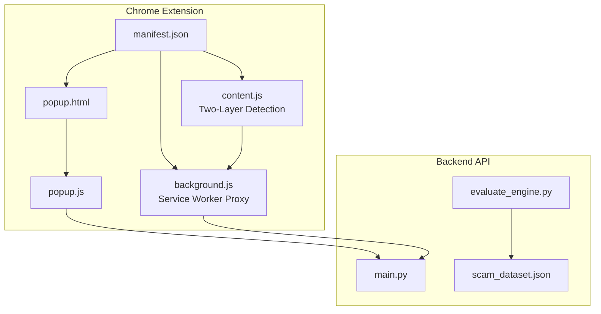
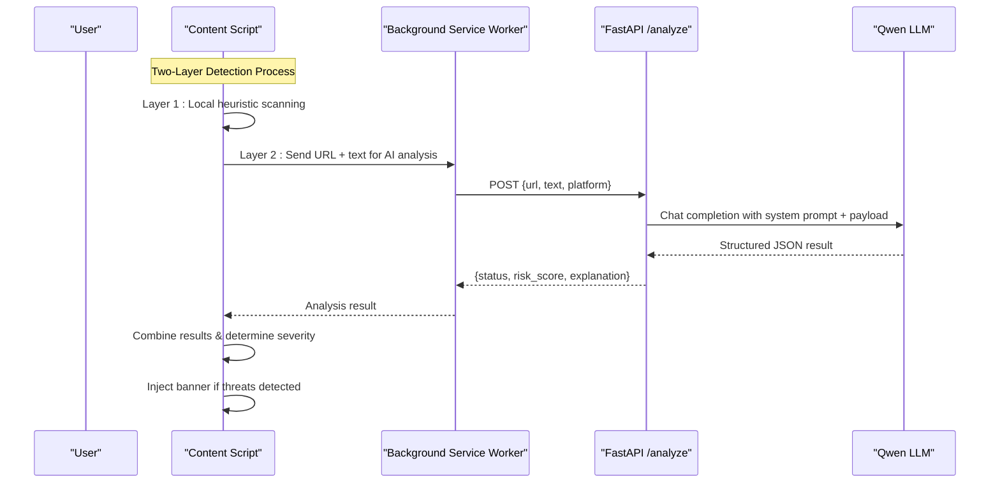
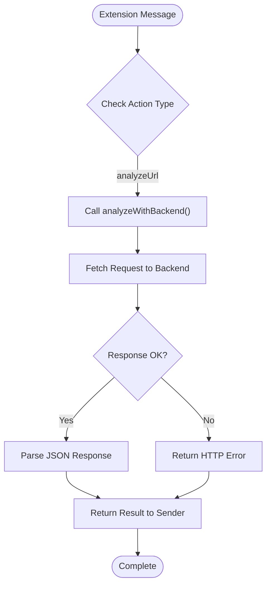
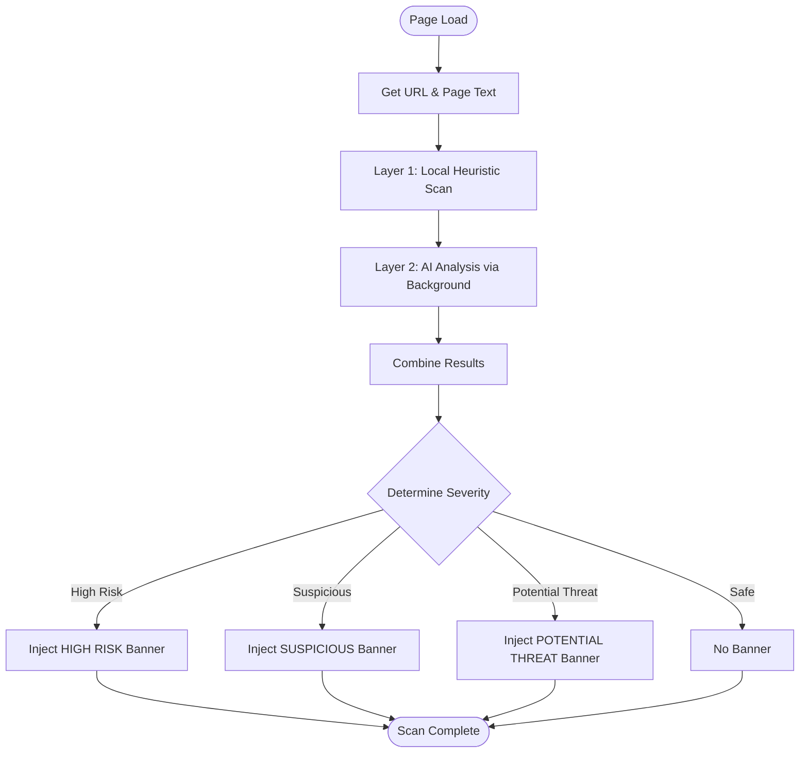
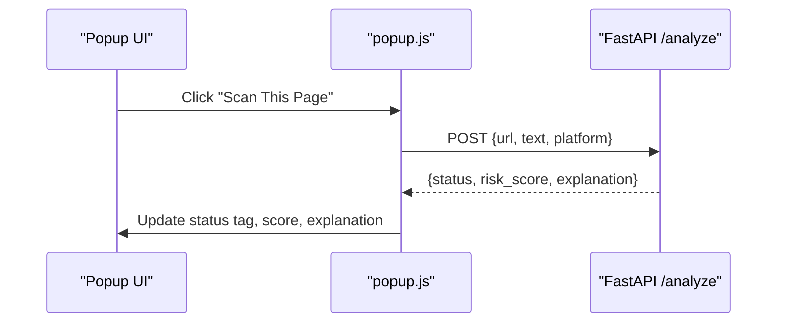
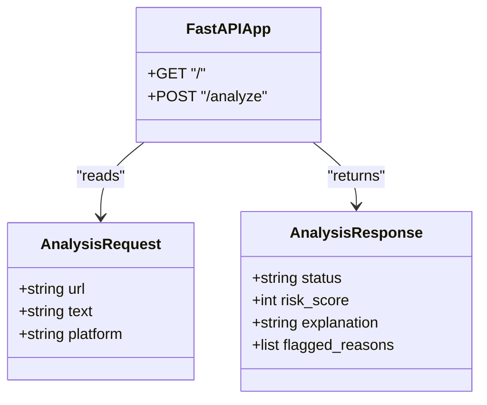
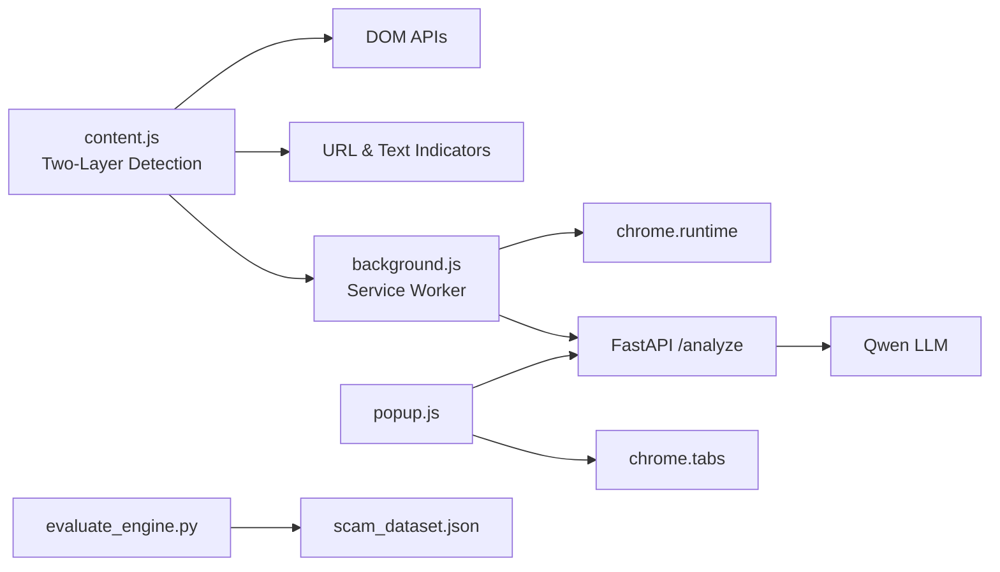

# Chrome Extension Development

<cite>
**Referenced Files in This Document**
- [manifest.json](file://extension/manifest.json)
- [background.js](file://extension/background.js)
- [content.js](file://extension/content.js)
- [popup.html](file://extension/popup.html)
- [popup.js](file://extension/popup.js)
- [main.py](file://backend/main.py)
- [evaluate_engine.py](file://backend/evaluate_engine.py)
- [scam_dataset.json](file://backend/scam_dataset.json)
- [README.md](file://README.md)
</cite>

## Update Summary
**Changes Made**
- Added comprehensive coverage of new background service worker architecture acting as a secure proxy
- Documented two-layer threat detection system combining local heuristics with AI-powered backend analysis
- Updated manifest permissions section with host_permissions for backend communication
- Enhanced content script documentation with background service worker integration
- Expanded security considerations for CORS handling and mixed content protection

## Table of Contents
1. [Introduction](#introduction)
2. [Project Structure](#project-structure)
3. [Core Components](#core-components)
4. [Architecture Overview](#architecture-overview)
5. [Detailed Component Analysis](#detailed-component-analysis)
6. [Dependency Analysis](#dependency-analysis)
7. [Performance Considerations](#performance-considerations)
8. [Troubleshooting Guide](#troubleshooting-guide)
9. [Conclusion](#conclusion)
10. [Appendices](#appendices)

## Introduction
ScrollGuard AI is a Manifest V3 Chrome extension that provides real-time protection against phishing, scam links, and deceptive content through a sophisticated two-layer threat detection system. The extension combines fast local pattern-based scanning with AI-powered backend analysis via a background service worker proxy. It injects a lightweight content script into web pages to detect threats using comprehensive URL pattern matching and text analysis algorithms, then displays severity-based warning banners. A popup interface allows users to manually trigger scans and view results from the backend API.

## Project Structure
The project consists of:
- Extension files under extension/: manifest configuration with background service worker, content script with two-layer detection, and popup UI
- Background service worker for secure backend communication
- Backend API under backend/: FastAPI server, evaluation scripts, and test dataset
- Documentation and setup instructions in README.md

**Diagram sources**
- [manifest.json:1-27](file://extension/manifest.json#L1-L27)
- [background.js:1-49](file://extension/background.js#L1-L49)
- [content.js:1-409](file://extension/content.js#L1-L409)
- [popup.html:1-108](file://extension/popup.html#L1-L108)
- [popup.js:1-46](file://extension/popup.js#L1-L46)
- [main.py:1-92](file://backend/main.py#L1-L92)
- [evaluate_engine.py:1-49](file://backend/evaluate_engine.py#L1-L49)
- [scam_dataset.json:1-37](file://backend/scam_dataset.json#L1-L37)

**Section sources**
- [manifest.json:1-27](file://extension/manifest.json#L1-L27)
- [README.md:45-56](file://README.md#L45-L56)

## Core Components
- Manifest V3 configuration defines permissions, background service worker, action popup, and content script injection rules.
- **Background Service Worker**: Acts as a secure proxy between content scripts/popups and the backend API, avoiding CORS and Mixed Content restrictions.
- **Enhanced Content Script**: Implements two-layer detection - fast local heuristic scanning combined with AI-powered backend analysis via background service worker, then injects severity-based warning banners when threats are detected.
- Popup UI displays current tab URL, triggers manual scan via direct backend communication, and renders status, risk score, and explanation.
- Backend exposes a CORS-enabled FastAPI endpoint that calls an LLM to return structured JSON with threat classification and reasoning.

**Section sources**
- [manifest.json:1-27](file://extension/manifest.json#L1-L27)
- [background.js:1-49](file://extension/background.js#L1-L49)
- [content.js:1-409](file://extension/content.js#L1-L409)
- [popup.html:1-108](file://extension/popup.html#L1-L108)
- [popup.js:1-46](file://extension/popup.js#L1-L46)
- [main.py:1-92](file://backend/main.py#L1-L92)

## Architecture Overview
The system implements a sophisticated two-layer threat detection approach with secure backend communication:
- **Layer 1 - Local Heuristic Scanning**: Content script performs immediate URL and text analysis using curated indicator databases for fast threat detection.
- **Layer 2 - AI-Powered Analysis**: Content script communicates with background service worker, which proxies requests to the backend API to avoid CORS/Mixed Content issues.
- **Background Service Worker**: Securely handles all backend communications, providing a privileged context for API calls.
- Popup initiates manual scans by directly communicating with the backend API.
- Backend uses Qwen LLM to evaluate inputs and returns structured responses with threat classifications.

**Diagram sources**
- [content.js:374-400](file://extension/content.js#L374-L400)
- [background.js:16-48](file://extension/background.js#L16-L48)
- [main.py:64-92](file://backend/main.py#L64-L92)

## Detailed Component Analysis

### Manifest Configuration and Enhanced Permissions
**Updated** Added background service worker configuration and host permissions for backend communication

- Uses Manifest V3 with minimal permissions: activeTab and scripting.
- Defines default_popup for the toolbar action.
- Configures background service worker (background.js) for secure backend communication.
- Declares host_permissions for http://127.0.0.1:8000/* to allow backend API access.
- Declares content script matched to all URLs, injected at document_idle to ensure DOM readiness before scanning.

Security considerations:
- Restricting matches to <all_urls> enables broad scanning; consider narrowing to specific domains or patterns for production deployments.
- Using document_idle reduces interference with critical rendering paths.
- Host permissions are scoped to localhost development environment only.

**Section sources**
- [manifest.json:1-27](file://extension/manifest.json#L1-L27)

### Background Service Worker: Secure Backend Communication
**New Section** Comprehensive overview of the background service worker architecture

The background service worker serves as a secure proxy between extension components and the backend API, solving CORS and Mixed Content issues that would otherwise block content scripts and popups running on HTTPS pages.

Key responsibilities:
- **Secure Proxy**: Executes fetch requests in the extension's privileged context, bypassing browser security restrictions.
- **Message Routing**: Listens for messages from content scripts and popup, routing them to the appropriate backend endpoints.
- **Error Handling**: Provides robust error handling for network failures and backend unavailability.
- **Request Formatting**: Standardizes request payloads with consistent structure including URL, text, and platform information.

Implementation details:
- Uses chrome.runtime.onMessage listener for inter-script communication
- Implements async/await pattern for non-blocking operations
- Includes timeout handling to prevent blocking page loads
- Provides detailed error responses for debugging

**Diagram sources**
- [background.js:42-48](file://extension/background.js#L42-L48)
- [background.js:16-36](file://extension/background.js#L16-L36)

**Section sources**
- [background.js:1-49](file://extension/background.js#L1-L49)

### Content Script: Two-Layer Threat Detection System
**Updated** Enhanced with background service worker integration and AI-powered analysis

The content script implements a sophisticated two-layer detection system that combines immediate local scanning with comprehensive AI-powered backend analysis.

**Layer 1 - Local Heuristic Scanning**:
- Extracts window.location.href and a truncated sample of visible text (up to 5000 characters) for performance optimization.
- Applies curated indicator sets including suspicious TLDs, URL shorteners, phishing keywords, and regex patterns.
- Provides immediate threat detection without network dependencies.

**Layer 2 - AI-Powered Backend Analysis**:
- Communicates with background service worker via chrome.runtime.sendMessage.
- Sends URL and page title for comprehensive AI analysis.
- Implements 6-second timeout to prevent blocking page loads.
- Handles background service worker unavailability gracefully.

Detection logic:
- **checkUrl**: Iterates through URL_INDICATORS, matching both string substrings and regular expressions for comprehensive URL analysis.
- **checkText**: Applies TEXT_INDICATORS regex patterns to page text and collects matches for content analysis.
- **analyzeViaBackground**: Sends data to background service worker for AI analysis with proper error handling.
- **resolveSeverity**: Combines local and AI results to determine final threat level.

Severity assessment:
- **HIGH RISK**: AI status "Dangerous" OR 5+ total hits - indicates multiple strong indicators of malicious content
- **SUSPICIOUS**: AI status "Suspicious" OR 3-4 total hits - suggests potential threats requiring caution  
- **POTENTIAL THREAT**: 1-2 total hits - minor indicators warranting awareness

Banner behavior:
- Fixed positioning at top with high z-index, includes SVG warning icon, headline, detail text, and dismiss button.
- Adjusts body margin to prevent content overlap and restores it on dismissal via MutationObserver.
- Full accessibility support with role="alert" and aria-live="assertive" attributes.
- Displays AI explanation when available from backend analysis.

**Diagram sources**
- [content.js:374-400](file://extension/content.js#L374-L400)
- [content.js:112-124](file://extension/content.js#L112-L124)
- [content.js:131-140](file://extension/content.js#L131-L140)

**Section sources**
- [content.js:1-409](file://extension/content.js#L1-L409)

### Popup Interface: Direct Backend Communication
UI layout:
- Displays current tab URL and a "Scan This Page" button.
- Shows result card with status tag, risk score, and explanation.

Interaction flow:
- On click, disables the button and sends a POST request directly to the backend with the active tab's URL and title.
- Parses JSON response and updates the UI accordingly.
- Handles connection errors with an alert.

Responsive design:
- Fixed width container with clean typography and accessible color-coded status tags.

**Diagram sources**
- [popup.html:90-104](file://extension/popup.html#L90-L104)
- [popup.js:16-45](file://extension/popup.js#L16-L45)

**Section sources**
- [popup.html:1-108](file://extension/popup.html#L1-L108)
- [popup.js:1-46](file://extension/popup.js#L1-L46)

### Backend API: Threat Classification and Structured Responses
Endpoints:
- GET / returns a health message.
- POST /analyze accepts a JSON payload and returns structured analysis.

Processing:
- Validates input (requires at least URL or text).
- Constructs a user payload combining platform, URL, and text.
- Calls the Qwen LLM with a strict system prompt enforcing JSON output schema.
- Cleans potential markdown code blocks and parses JSON to return standardized fields.

CORS:
- Allows cross-origin requests from the extension during development.

**Diagram sources**
- [main.py:31-40](file://backend/main.py#L31-L40)
- [main.py:60-92](file://backend/main.py#L60-L92)

**Section sources**
- [main.py:1-92](file://backend/main.py#L1-L92)

### Evaluation and Benchmarking
- evaluate_engine.py loads scam_dataset.json and posts each sample to the backend.
- Compares predicted status with expected_status and prints per-sample results and overall accuracy.

Use cases:
- Validate detection quality across known safe and dangerous samples.
- Iterate on prompts and heuristics to improve accuracy.

**Section sources**
- [evaluate_engine.py:1-49](file://backend/evaluate_engine.py#L1-L49)
- [scam_dataset.json:1-37](file://backend/scam_dataset.json#L1-L37)

## Dependency Analysis
- Extension depends on browser APIs (chrome.tabs, chrome.runtime, fetch) and the backend API for advanced analysis.
- **Enhanced Content Script** depends on DOM APIs, comprehensive local indicator databases, and background service worker for AI analysis.
- **Background Service Worker** depends on chrome.runtime messaging and fetch API for backend communication.
- Backend depends on FastAPI, OpenAI-compatible client, and environment variables for API keys.

**Diagram sources**
- [content.js:94-99](file://extension/content.js#L94-L99)
- [content.js:112-124](file://extension/content.js#L112-L124)
- [background.js:42-48](file://extension/background.js#L42-L48)
- [popup.js:1-46](file://extension/popup.js#L1-L46)
- [main.py:15-18](file://backend/main.py#L15-L18)
- [evaluate_engine.py:1-49](file://backend/evaluate_engine.py#L1-L49)
- [scam_dataset.json:1-37](file://backend/scam_dataset.json#L1-L37)

**Section sources**
- [popup.js:1-46](file://extension/popup.js#L1-L46)
- [main.py:1-92](file://backend/main.py#L1-L92)

## Performance Considerations
- **Two-Layer Detection**: Local heuristics provide immediate feedback while AI analysis runs asynchronously with 6-second timeout.
- **Background Service Worker**: Offloads network requests from content scripts, improving page performance and avoiding CORS issues.
- **Content Script Optimization**: Truncates visible text to 5000 characters maximum to limit processing overhead on large pages while maintaining detection effectiveness.
- **Indicator Matching**: Uses efficient substring checks and precompiled regex patterns for optimal performance.
- **Banner Injection**: Occurs once per page load and avoids repeated DOM mutations by observing removal events to restore margins.
- **Popup Operations**: Lightweight and only perform network calls on explicit user actions.
- **Prevention of Double Injection**: Script includes guard clause to prevent multiple banner instances.

Recommendations:
- Debounce or throttle re-scans if extending to dynamic content changes.
- Cache results for identical URLs to reduce redundant backend calls.
- Consider lazy-loading heavy resources in banners and deferring non-critical DOM work.
- Monitor memory usage for pages with extremely large DOM trees.
- Implement retry logic for failed background service worker communications.

## Troubleshooting Guide
Common issues and resolutions:
- **Background Service Worker Issues**: Ensure the service worker is properly registered and listening for messages. Check console logs for registration errors.
- **Backend Not Reachable**: Ensure the FastAPI server is running locally and CORS is enabled. The popup shows an alert on connection failure.
- **CORS Errors**: Verify host_permissions are correctly configured in manifest.json for the backend domain.
- **Missing API Key**: Backend raises an error if DASHSCOPE_API_KEY is not set; configure environment variables as documented.
- **No Banner Displayed**: Verify content script injection at document_idle and confirm no duplicate banner IDs block re-injection. Check that URL and text indicators are properly configured.
- **Evaluation Failures**: Confirm scam_dataset.json exists and the backend responds with 200 OK for /analyze.

Debugging techniques:
- Use Chrome DevTools to inspect the content script console logs and DOM changes.
- Inspect network requests from the popup to verify payloads and responses.
- Check background service worker logs for message routing issues.
- Run evaluate_engine.py to measure detection accuracy and identify misclassified samples.
- Test content script detection by examining URL and text matching results in the console.

**Section sources**
- [popup.js:39-44](file://extension/popup.js#L39-L44)
- [main.py:11-13](file://backend/main.py#L11-L13)
- [evaluate_engine.py:6-49](file://backend/evaluate_engine.py#L6-L49)

## Conclusion
ScrollGuard AI implements a sophisticated two-layer threat detection system that combines fast local pattern-based detection with powerful AI analysis through a secure background service worker architecture. The extension's Manifest V3 implementation ensures secure, efficient operation within the browser, while the enhanced content script provides immediate threat detection through comprehensive URL pattern matching and text analysis. The background service worker solves critical CORS and Mixed Content issues, enabling seamless backend communication. The popup and content script provide clear feedback and actionable warnings with severity-based alerts. The modular design supports easy extension of detection rules, customization of banner styling, and integration with additional threat intelligence sources.

## Appendices

### How to Extend Pattern Databases
**Updated** Enhanced with comprehensive indicator categories and AI integration

- Add new URL indicators to the URL_INDICATORS array in the content script to include additional TLDs, shorteners, or path patterns. Current categories include suspicious TLDs, URL shorteners, phishing keywords, and domain patterns.
- Introduce new regex patterns in TEXT_INDICATORS to capture emerging scam phrases, urgency tactics, or credential harvesting attempts. Categories include prize scams, investment fraud, phishing, pressure tactics, and credential harvesting.
- Validate changes using the evaluation script to measure impact on accuracy across different threat types.
- Consider how new patterns might affect the balance between local and AI detection layers.

**Section sources**
- [content.js:21-61](file://extension/content.js#L21-L61)
- [evaluate_engine.py:19-43](file://backend/evaluate_engine.py#L19-L43)

### Customize Banner Appearance
**Updated** Enhanced with severity-based styling and accessibility features

- Modify inline styles in the banner injection function to adjust colors, fonts, spacing, and layout. Current implementation includes gradient backgrounds, SVG icons, and responsive design.
- Change severity thresholds to alter how many hits map to POTENTIAL THREAT (1-2), SUSPICIOUS (3-4), or HIGH RISK (5+) labels.
- Enhance accessibility by adding more descriptive aria attributes and keyboard navigation support. Current implementation includes role="alert" and aria-live="assertive".
- Customize the dismiss button behavior and banner positioning for different use cases.
- Consider adding AI explanation display formatting for better readability.

**Section sources**
- [content.js:175-351](file://extension/content.js#L175-L351)

### Add New Threat Detection Rules
**Updated** Enhanced with comprehensive pattern categories and AI integration

- Expand TEXT_INDICATORS with domain-specific regex patterns (e.g., social media impersonation, crypto giveaways, government impersonation, banking fraud).
- Integrate additional data sources (blocklists, reputation APIs) into checkUrl or checkText to enrich detection capabilities.
- Update the backend system prompt to incorporate new rule categories and refine scoring logic for better accuracy.
- Implement category-specific scoring weights to prioritize certain types of threats over others.
- Consider how new rules might interact with the two-layer detection system.

**Section sources**
- [content.js:36-61](file://extension/content.js#L36-L61)
- [main.py:42-58](file://backend/main.py#L42-L58)

### Security Considerations
**Updated** Enhanced with background service worker security and content script isolation practices

- Permission scoping: Keep permissions minimal (activeTab, scripting) and restrict content script matches where possible.
- **Background Service Worker Security**: The service worker acts as a secure proxy, preventing CORS and Mixed Content issues while maintaining separation between page context and backend communication.
- **Content script isolation**: Avoid exposing sensitive data to the page; use chrome.runtime messaging if inter-script communication is required. The current implementation maintains isolation by only accessing necessary DOM elements.
- **Safe DOM manipulation**: Sanitize injected content, avoid eval, and prefer attribute setting and style assignments to mitigate XSS risks. Current implementation uses createElement and setAttribute methods safely.
- Backend security: Restrict CORS origins in production and validate inputs rigorously.
- **Pattern database security**: Regularly update indicator lists to address emerging threats while avoiding false positives on legitimate content.
- **Host permissions**: Currently scoped to localhost development; restrict to specific domains in production.

**Section sources**
- [manifest.json:6-18](file://extension/manifest.json#L6-L18)
- [background.js:1-49](file://extension/background.js#L1-L49)
- [main.py:22-29](file://backend/main.py#L22-L29)

### Compatibility Testing Across Websites
**Updated** Enhanced with content script testing scenarios and background service worker considerations

- Test on diverse sites (news, e-commerce, social platforms) to ensure banner placement does not break layouts. Current implementation uses fixed positioning and body margin adjustment to maintain compatibility.
- Verify performance on pages with heavy DOM trees and dynamic content. Content script limits text extraction to 5000 characters for optimal performance.
- Validate that content script injection at document_idle works reliably across different frameworks and SPAs.
- Test banner dismissal functionality and margin restoration across different website structures.
- Verify accessibility compliance across different screen readers and assistive technologies.
- **Background Service Worker Testing**: Ensure service worker registration and message passing work correctly across different page contexts and security policies.
- **CORS Testing**: Verify backend communication works on both HTTP and HTTPS pages with proper host_permissions configuration.

### Content Script Implementation Details
**New Section** Comprehensive overview of two-layer detection capabilities

The content script implements a sophisticated two-layer detection system with the following key components:

**Layer 1 - Local Heuristic Engine**:
- Supports multiple detection strategies including exact string matching, regex pattern matching, and domain analysis
- Covers suspicious TLDs commonly used in phishing campaigns
- Detects URL shortener services often abused for hiding malicious destinations
- Identifies common phishing path patterns and keyword combinations
- Processes up to 5000 characters of visible page content for performance optimization

**Layer 2 - AI-Powered Backend Analysis**:
- Communicates with background service worker via chrome.runtime.sendMessage
- Sends URL and page title for comprehensive AI analysis
- Implements 6-second timeout to prevent blocking page loads
- Handles background service worker unavailability gracefully

**Background Service Worker Integration**:
- Secure proxy for backend communication avoiding CORS and Mixed Content issues
- Message routing between content scripts and backend API
- Robust error handling for network failures and backend unavailability
- Standardized request payload formatting

**Severity Assessment System**:
- Combines local and AI results to determine final threat level
- Provides three-tier severity classification: Potential Threat, Suspicious, High Risk
- Generates appropriate warning messages based on detected threat type
- Displays AI explanations when available from backend analysis

**Accessibility and UX Features**:
- Includes proper ARIA attributes for screen reader support
- Provides dismissible banner with smooth animations
- Maintains page layout integrity through intelligent margin management
- Uses semantic HTML structure for better accessibility

**Section sources**
- [content.js:1-409](file://extension/content.js#L1-L409)
- [background.js:1-49](file://extension/background.js#L1-L49)

### Background Service Worker Architecture
**New Section** Detailed overview of the secure proxy architecture

The background service worker serves as a critical component in the extension's security architecture, providing secure backend communication while maintaining separation from page contexts.

**Core Responsibilities**:
- **Secure Proxy**: Executes fetch requests in the extension's privileged context, bypassing browser security restrictions that would otherwise block content scripts and popups on HTTPS pages.
- **Message Routing**: Listens for messages from content scripts and popup, routing them to appropriate backend endpoints with proper error handling.
- **Request Management**: Standardizes request payloads and handles asynchronous operations with proper timeout management.
- **Error Handling**: Provides comprehensive error responses for network failures, backend unavailability, and malformed requests.

**Communication Patterns**:
- Uses chrome.runtime.onMessage listener for inter-script communication
- Implements async/await pattern for non-blocking operations
- Includes timeout handling to prevent blocking page loads
- Provides detailed error responses for debugging and troubleshooting

**Security Benefits**:
- Prevents CORS violations by executing network requests in extension context
- Eliminates Mixed Content issues when communicating with HTTP backends from HTTPS pages
- Maintains separation between page JavaScript and extension privileges
- Provides centralized error handling and logging for backend communication

**Section sources**
- [background.js:1-49](file://extension/background.js#L1-L49)