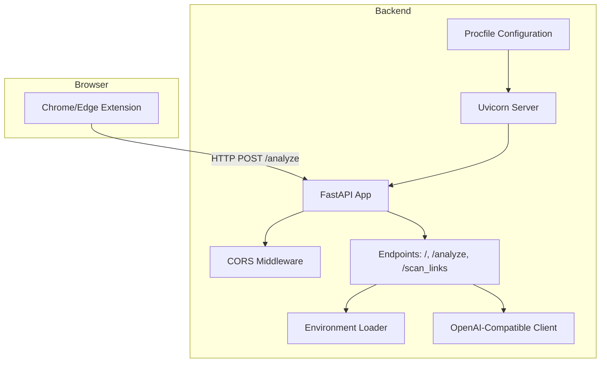
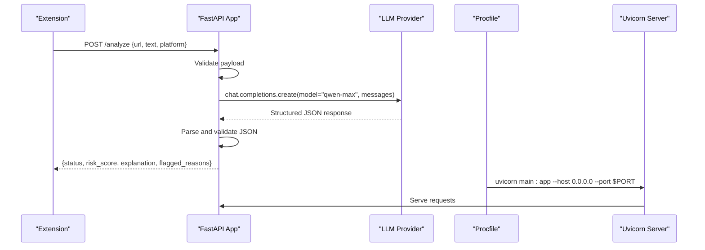
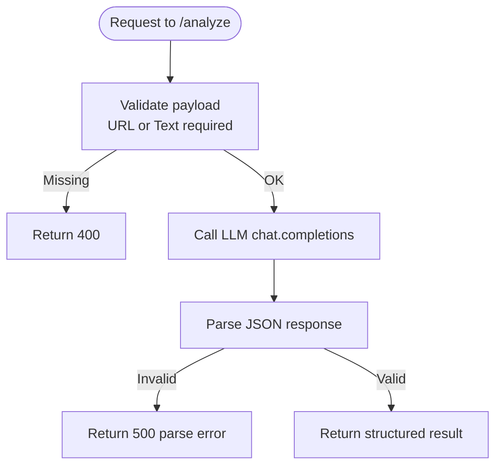
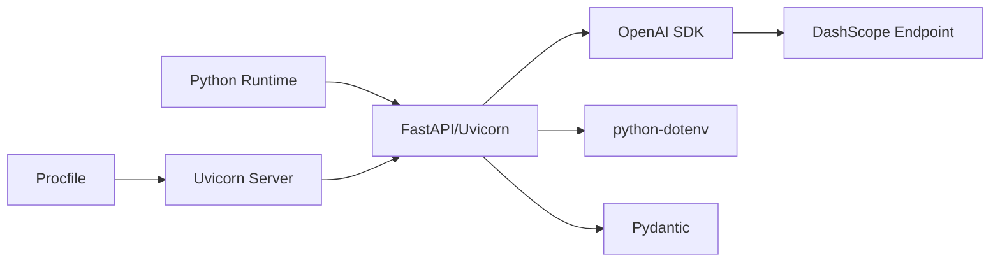

# Deployment and Configuration

<cite>
**Referenced Files in This Document**
- [backend/main.py](file://backend/main.py)
- [backend/Procfile](file://backend/Procfile)
- [README.md](file://README.md)
- [backend/evaluate_engine.py](file://backend/evaluate_engine.py)
- [extension/manifest.json](file://extension/manifest.json)
- [extension/popup.js](file://extension/popup.js)
</cite>

## Update Summary
**Changes Made**
- Added Procfile-based deployment configuration section
- Updated backend setup documentation to reflect enhanced Uvicorn server configuration
- Enhanced CORS configuration guidance with development workflow support
- Updated extension deployment instructions to include local backend testing permissions
- Added cloud deployment examples using Procfile standard

## Table of Contents
1. Introduction
2. Project Structure
3. Core Components
4. Architecture Overview
5. Detailed Component Analysis
6. Dependency Analysis
7. Performance Considerations
8. Troubleshooting Guide
9. Conclusion
10. Appendices

## Introduction
This document provides production-focused deployment guidance for the ScrollGuard AI application, including containerization, cloud deployment options, environment configuration management, CORS setup, secure API key handling, monitoring and logging, scaling strategies, operational procedures, configuration templates, CI/CD automation, troubleshooting, and performance optimization. The backend is a FastAPI service that calls an external LLM via an OpenAI-compatible endpoint; the frontend is a browser extension that communicates with the backend over HTTP.

## Project Structure
The repository contains:
- Backend (FastAPI): Python service exposing endpoints for content analysis and integrating with an external LLM provider.
- Browser Extension: Manifest V3 extension that sends page context to the backend and displays results.
- Evaluation script: A simple benchmarking tool that calls the backend against a dataset.
- Deployment configuration: Procfile for standard PaaS deployment and enhanced server setup.

**Diagram sources**
- [backend/main.py:42-50](file://backend/main.py#L42-L50)
- [backend/main.py:172-208](file://backend/main.py#L172-L208)
- [backend/Procfile:1-2](file://backend/Procfile#L1-L2)
- [backend/main.py:213-222](file://backend/main.py#L213-L222)

**Section sources**
- [backend/main.py:1-223](file://backend/main.py#L1-L223)
- [README.md:44-52](file://README.md#L44-L52)
- [extension/manifest.json:1-29](file://extension/manifest.json#L1-L29)
- [backend/Procfile:1-2](file://backend/Procfile#L1-L2)

## Core Components
- FastAPI application: Defines routes and request/response models, configures CORS, and integrates with the LLM client.
- Environment configuration: Loads secrets from environment variables using dotenv at startup.
- External dependency: OpenAI-compatible client configured to call the DashScope endpoint.
- Browser extension: Sends requests to the backend and renders risk assessments.
- Deployment configuration: Procfile for standard PaaS deployment and enhanced Uvicorn server setup.

Key responsibilities:
- Input validation and error handling on the analyze endpoint.
- Secure retrieval of API keys from environment variables.
- CORS configuration to allow extension communication.
- Cloud-ready server configuration with proper host binding and port handling.

**Section sources**
- [backend/main.py:1-223](file://backend/main.py#L1-L223)
- [backend/Procfile:1-2](file://backend/Procfile#L1-L2)
- [README.md:109-129](file://README.md#L109-L129)
- [extension/manifest.json:11-14](file://extension/manifest.json#L11-L14)

## Architecture Overview
The system consists of a FastAPI backend and a browser extension. The extension posts page data to the backend's /analyze endpoint. The backend validates input, constructs a prompt, calls the LLM provider, parses structured JSON output, and returns it to the caller.

**Diagram sources**
- [backend/main.py:177-195](file://backend/main.py#L177-L195)
- [backend/main.py:213-222](file://backend/main.py#L213-L222)
- [backend/Procfile:1-2](file://backend/Procfile#L1-L2)

## Detailed Component Analysis

### Backend Service (FastAPI)
- Application initialization and version metadata.
- CORS middleware enabling cross-origin requests from the extension.
- Request/response schemas for typed validation.
- Endpoints:
  - GET /: Health/root indicator.
  - POST /analyze: Validates input, calls LLM, parses JSON, returns structured result.
  - POST /scan_links: Batch URL analysis with concurrent processing.
- Error handling:
  - Returns 400 when no URL or text provided.
  - Returns 500 on parsing failures or unexpected exceptions.

Operational notes:
- Requires DASHSCOPE_API_KEY at startup; missing key raises a runtime error.
- Uses dotenv to load environment variables from .env.
- Cloud-ready configuration with proper host binding (0.0.0.0) and configurable PORT.

**Diagram sources**
- [backend/main.py:177-195](file://backend/main.py#L177-L195)

**Section sources**
- [backend/main.py:1-223](file://backend/main.py#L1-L223)

### Browser Extension
- Manifest V3 extension with permissions for active tab, scripting, and storage.
- Enhanced host permissions including local backend testing at http://127.0.0.1:8000/* for development workflows.
- Popup UI triggers analysis by posting to the backend's /analyze endpoint.
- Displays status, risk score, and explanation returned by the backend.

**Section sources**
- [extension/manifest.json:1-29](file://extension/manifest.json#L1-L29)
- [extension/popup.js:1-46](file://extension/popup.js#L1-L46)

### Evaluation Script
- Reads scam_dataset.json and calls the running backend to evaluate detection accuracy.
- Useful for regression testing and model behavior checks in CI.

**Section sources**
- [backend/evaluate_engine.py:1-49](file://backend/evaluate_engine.py#L1-L49)
- [README.md:219-228](file://README.md#L219-L228)

### Deployment Configuration
- Procfile-based deployment for standard PaaS platforms (Render, Heroku, Railway).
- Uvicorn server configuration with proper host binding and environment variable support.
- Development-friendly setup with auto-reload capability.

**Section sources**
- [backend/Procfile:1-2](file://backend/Procfile#L1-L2)
- [backend/main.py:213-222](file://backend/main.py#L213-L222)
- [README.md:159-179](file://README.md#L159-L179)

## Dependency Analysis
External dependencies:
- FastAPI and Uvicorn for serving the API.
- OpenAI SDK configured to use DashScope base URL.
- python-dotenv for loading environment variables.
- Pydantic for request/response validation.

Runtime requirements:
- Python 3.10+ (per README).
- Network access to the LLM provider endpoint.

Configuration surface:
- DASHSCOPE_API_KEY must be set before startup.
- PORT environment variable for flexible port configuration.
- CORS origins can be restricted to specific domains in production.

**Diagram sources**
- [backend/main.py:15-25](file://backend/main.py#L15-L25)
- [backend/Procfile:1-2](file://backend/Procfile#L1-L2)

**Section sources**
- [backend/main.py:15-25](file://backend/main.py#L15-L25)
- [backend/Procfile:1-2](file://backend/Procfile#L1-L2)
- [README.md:44-52](file://README.md#L44-L52)

## Performance Considerations
- Concurrency: Use multiple Uvicorn workers behind a reverse proxy to handle concurrent requests. Tune worker count based on CPU cores and I/O characteristics.
- Timeouts: Configure request timeouts for both the reverse proxy and the application to prevent resource exhaustion during slow LLM responses.
- Caching: Introduce caching for repeated or similar inputs to reduce LLM calls and latency.
- Backpressure: Implement rate limiting at the gateway level to protect the backend and LLM quota.
- Connection reuse: Ensure the HTTP client reuses connections to the LLM provider where supported.
- Monitoring: Track latency, error rates, and throughput to identify bottlenecks.
- Semaphore-based concurrency: Built-in rate limiting with asyncio.Semaphore(5) for concurrent AI calls.

[No sources needed since this section provides general guidance]

## Troubleshooting Guide
Common issues and resolutions:
- Missing API key:
  - Symptom: Startup failure due to missing DASHSCOPE_API_KEY.
  - Resolution: Provide the key via environment variables or secret manager injection.
- CORS errors from the extension:
  - Symptom: Browser blocks requests from extension to backend.
  - Resolution: Restrict CORS origins to the exact extension origin(s) used in production.
- Invalid or malformed LLM response:
  - Symptom: 500 error on /analyze due to JSON parse failure.
  - Resolution: Add retries, stricter parsing, and fallback logic; log raw responses for debugging.
- Extension cannot reach backend:
  - Symptom: Popup shows connection error.
  - Resolution: Verify network connectivity, firewall rules, and that the backend is reachable from the browser environment.
- Port conflicts:
  - Symptom: Server fails to start due to port already in use.
  - Resolution: Configure different PORT values or stop conflicting processes.

Operational checks:
- Health check: Use GET / to verify the service is up.
- Evaluate script: Run evaluation to validate integration with the backend and LLM.
- Local development: Test with http://127.0.0.1:8000/* permissions enabled.

**Section sources**
- [backend/main.py:31-33](file://backend/main.py#L31-L33)
- [backend/main.py:44-50](file://backend/main.py#L44-L50)
- [backend/main.py:180-184](file://backend/main.py#L180-L184)
- [extension/manifest.json:11-14](file://extension/manifest.json#L11-L14)
- [backend/evaluate_engine.py:1-49](file://backend/evaluate_engine.py#L1-L49)

## Conclusion
ScrollGuard AI's backend is a lightweight FastAPI service that depends on an external LLM provider. Production deployments should focus on secure secret management, strict CORS configuration, robust error handling, observability, and horizontal scaling. The browser extension remains a thin client that relies on a reliable backend endpoint. The addition of Procfile support enables seamless deployment to standard PaaS platforms while maintaining development flexibility.

[No sources needed since this section summarizes without analyzing specific files]

## Appendices

### A. Containerization with Docker
Recommended steps:
- Create a multi-stage Dockerfile:
  - Build stage: Install Python dependencies into a virtual environment.
  - Runtime stage: Copy only necessary artifacts and run Uvicorn with multiple workers.
- Expose port 8000 and configure environment variables via container orchestration or secret managers.
- Use health checks to ensure readiness.
- Alternative: Use Procfile-based deployment for simpler PaaS setups.

[No sources needed since this section provides general guidance]

### B. Cloud Deployment Options
- **PaaS Platforms (Procfile-based):**
  - Render: Automatic PORT assignment, supports Procfile natively.
  - Heroku: Standard Procfile format with web process type.
  - Railway: Supports Procfile with environment variable management.
- **AWS:**
  - ECS/Fargate or EKS for containerized deployments.
  - ALB/NLB for load balancing and TLS termination.
  - Secrets Manager or SSM Parameter Store for API keys.
- **Azure:**
  - Container Apps or AKS for orchestration.
  - Application Gateway or Front Door for ingress and security policies.
  - Key Vault for secrets.
- **Google Cloud:**
  - Cloud Run or GKE for containerized services.
  - Cloud Load Balancing for ingress.
  - Secret Manager for secrets.

**Section sources**
- [backend/Procfile:1-2](file://backend/Procfile#L1-L2)
- [README.md:159-179](file://README.md#L159-L179)

### C. Environment Configuration Management
- Required variables:
  - DASHSCOPE_API_KEY: Set via environment variables injected by your platform or secret manager.
  - PORT: Configurable port for flexible deployment (default 8000).
- Best practices:
  - Never commit secrets to version control.
  - Use per-environment configurations (development, staging, production).
  - Rotate keys regularly and audit access.
  - Leverage platform-native secret management services.

**Section sources**
- [backend/main.py:31-33](file://backend/main.py#L31-L33)
- [backend/main.py:216-221](file://backend/main.py#L216-L221)
- [backend/Procfile:1-2](file://backend/Procfile#L1-L2)
- [README.md:169-173](file://README.md#L169-L173)

### D. CORS Configuration for Production
- Current behavior: Allows all origins for development convenience.
- Production recommendation:
  - Restrict allow_origins to known extension origins or domains.
  - Limit allowed methods and headers to the minimum required.
  - Enable credentials only when necessary.
- Development workflow: Local backend testing enabled with http://127.0.0.1:8000/* permissions.

**Section sources**
- [backend/main.py:44-50](file://backend/main.py#L44-L50)
- [extension/manifest.json:11-14](file://extension/manifest.json#L11-L14)

### E. Secure API Key Management
- Use platform-native secret stores:
  - AWS Secrets Manager/SSM, Azure Key Vault, Google Secret Manager.
  - PaaS-specific secret management (Render, Heroku, Railway environment variables).
- Inject secrets at runtime into the container environment.
- Enforce least privilege and rotation policies.

**Section sources**
- [backend/main.py:31-33](file://backend/main.py#L31-L33)
- [README.md:169-173](file://README.md#L169-L173)

### F. Monitoring and Logging
- Application metrics:
  - Expose Prometheus metrics (e.g., via Starlette middleware) for request counts, latency, and error rates.
- Structured logs:
  - Log request IDs, endpoints, status codes, and error details (sanitized).
- Error tracking:
  - Integrate an error tracking service to capture exceptions and stack traces.
- Audit logging:
  - Record access patterns and security-relevant events for compliance.

[No sources needed since this section provides general guidance]

### G. Scaling Considerations
- Horizontal scaling:
  - Deploy multiple instances behind a load balancer.
  - Scale out based on CPU/memory utilization and request latency.
- Load balancing:
  - Use TCP/HTTP-level load balancers with health checks.
- Database connection pooling:
  - If adding persistent storage later, configure connection pools appropriate for concurrency.
- Process management:
  - Use process managers like systemd or container orchestrators for automatic restarts.

[No sources needed since this section provides general guidance]

### H. Operational Procedures
- Health checks:
  - Implement readiness and liveness probes using GET /.
- Graceful shutdown:
  - Handle SIGTERM to finish in-flight requests before stopping workers.
- Rollback strategies:
  - Use immutable container images and blue/green or rolling updates.
  - Maintain previous versions for quick rollback.
- Process monitoring:
  - Monitor Uvicorn worker processes and memory usage.

[No sources needed since this section provides general guidance]

### I. Configuration Templates
- Development:
  - Local .env with DASHSCOPE_API_KEY.
  - CORS allows all origins for ease of testing.
  - Local backend testing enabled with http://127.0.0.1:8000/* permissions.
- Staging:
  - Restricted CORS origins matching staging extension builds.
  - Secrets injected via platform secret store.
- Production:
  - Strict CORS origins, rate limiting, WAF rules.
  - Secrets managed via secret manager.
  - Observability enabled with metrics, logs, and tracing.

**Section sources**
- [extension/manifest.json:11-14](file://extension/manifest.json#L11-L14)
- [backend/main.py:44-50](file://backend/main.py#L44-L50)

### J. CI/CD Automation
- Build pipeline:
  - Lint, test, build container image, push to registry.
- Security scanning:
  - Scan dependencies and container images for vulnerabilities.
- Deployment:
  - Deploy to staging for automated tests, then promote to production with approvals.
  - Use Procfile for consistent deployment across environments.
- Evaluation:
  - Run backend evaluation script against deployed staging to validate behavior.

**Section sources**
- [backend/evaluate_engine.py:1-49](file://backend/evaluate_engine.py#L1-L49)
- [backend/Procfile:1-2](file://backend/Procfile#L1-L2)
- [README.md:219-228](file://README.md#L219-L228)

### K. Troubleshooting Common Deployment Issues
- Startup fails due to missing API key:
  - Ensure secrets are injected correctly into the runtime environment.
- CORS blocked by browsers:
  - Align backend CORS settings with the actual extension origin.
- High latency or timeouts:
  - Increase timeouts at the gateway, add retries, and monitor LLM provider SLAs.
- Extension cannot connect:
  - Verify network policies, DNS resolution, and that the backend is exposed publicly or within the same network.
- Port binding issues:
  - Check PORT environment variable and ensure it's available on the target platform.
- Procfile deployment failures:
  - Verify Procfile syntax and ensure all dependencies are properly listed.

**Section sources**
- [backend/main.py:31-33](file://backend/main.py#L31-L33)
- [backend/main.py:44-50](file://backend/main.py#L44-L50)
- [backend/main.py:216-221](file://backend/main.py#L216-L221)
- [backend/Procfile:1-2](file://backend/Procfile#L1-L2)
- [extension/manifest.json:11-14](file://extension/manifest.json#L11-L14)