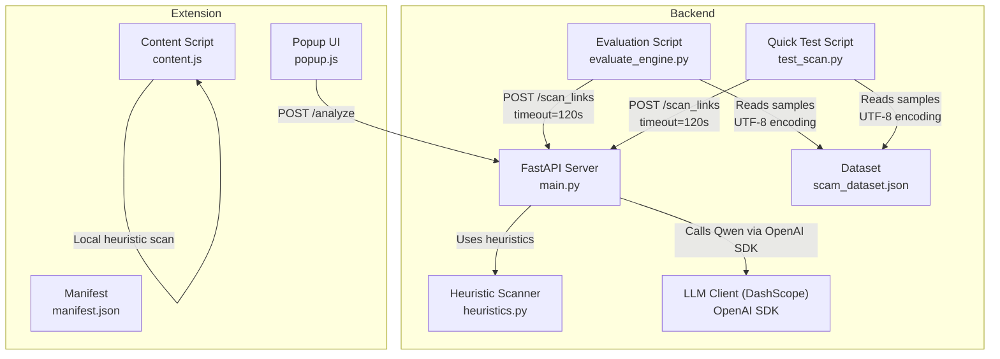
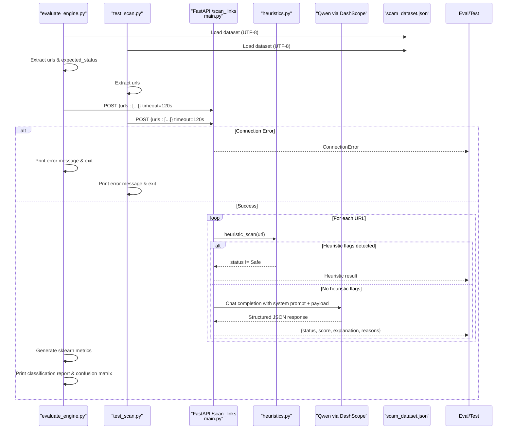
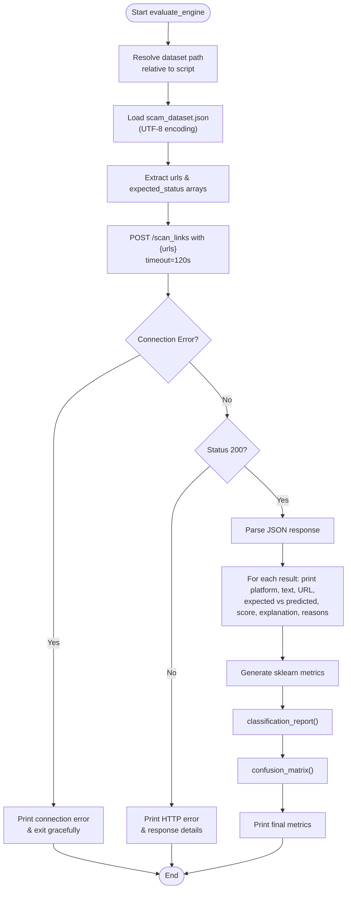
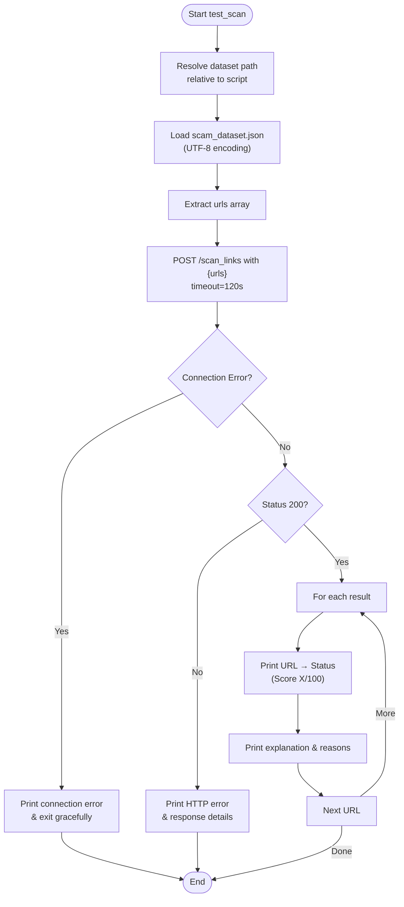
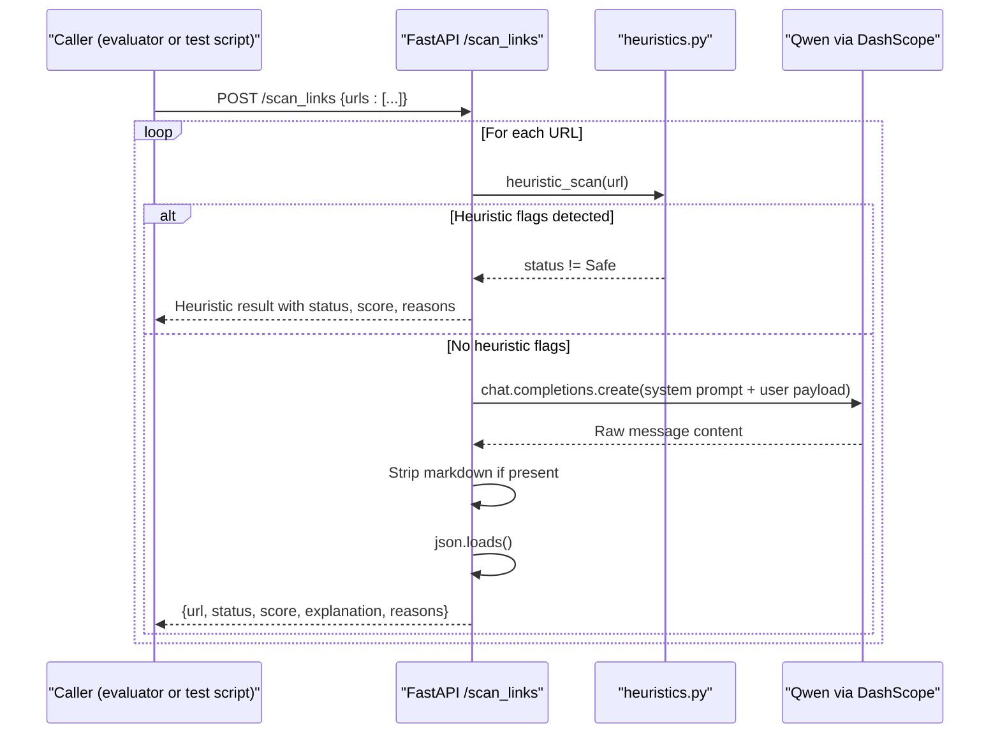
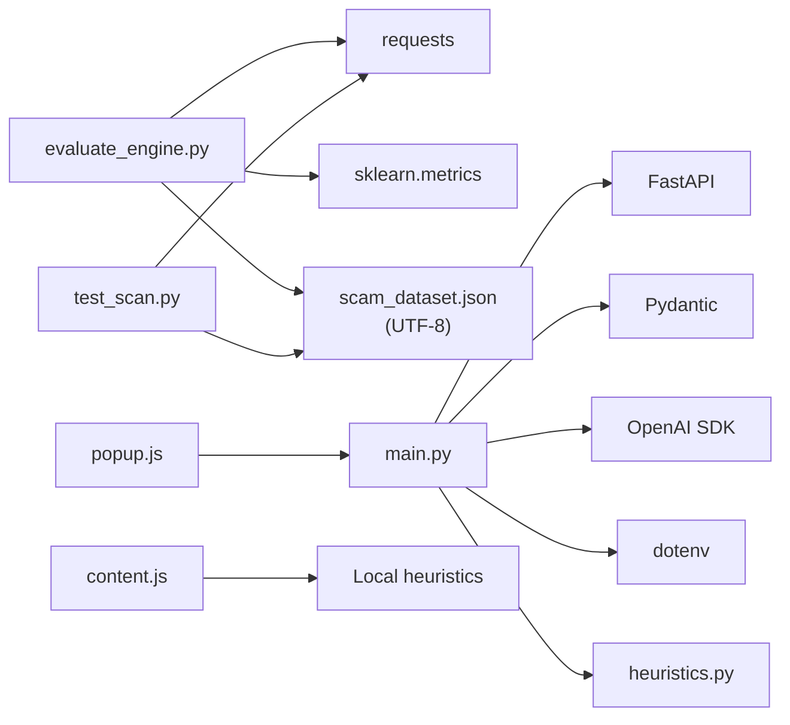

# Evaluation and Testing Framework

<cite>
**Referenced Files in This Document**
- [evaluate_engine.py](file://backend/evaluate_engine.py)
- [test_scan.py](file://backend/test_scan.py)
- [scam_dataset.json](file://backend/scam_dataset.json)
- [main.py](file://backend/main.py)
- [heuristics.py](file://backend/heuristics.py)
- [content.js](file://extension/content.js)
- [popup.js](file://extension/popup.js)
- [manifest.json](file://extension/manifest.json)
- [README.md](file://README.md)
</cite>

## Update Summary
**Changes Made**
- Enhanced evaluation engine with robust error handling and timeout configuration for large dataset processing
- Updated testing scripts to work with new API response format and improved connection error handling
- Implemented relative path resolution for dataset files across all scripts
- Added proper UTF-8 encoding handling for international character support
- Improved error messaging and graceful failure handling throughout the evaluation pipeline

## Table of Contents
1. [Introduction](#introduction)
2. [Project Structure](#project-structure)
3. [Core Components](#core-components)
4. [Architecture Overview](#architecture-overview)
5. [Detailed Component Analysis](#detailed-component-analysis)
6. [Dependency Analysis](#dependency-analysis)
7. [Performance Considerations](#performance-considerations)
8. [Troubleshooting Guide](#troubleshooting-guide)
9. [Conclusion](#conclusion)
10. [Appendices](#appendices)

## Introduction
This document explains the ScrollGuard AI evaluation and testing framework focused on automated accuracy measurement and dataset validation. The framework features enhanced batch evaluation capabilities using sklearn metrics with robust error handling, timeout configuration, and improved reliability for large dataset processing. It covers how the automated test system loads a curated dataset, sends batch requests to the backend API, compares expected versus actual results, and generates detailed performance metrics including precision, recall, F1-scores, and confusion matrices.

## Project Structure
The project is organized into a backend service that exposes both single and batch analysis endpoints powered by an LLM, enhanced automated evaluation scripts that drive benchmarking against a dataset with sklearn metrics, and a browser extension that provides real-time scanning and user feedback.

**Diagram sources**
- [main.py:21-209](file://backend/main.py#L21-L209)
- [evaluate_engine.py:1-78](file://backend/evaluate_engine.py#L1-L78)
- [test_scan.py:1-52](file://backend/test_scan.py#L1-L52)
- [scam_dataset.json:1-37](file://backend/scam_dataset.json#L1-L37)
- [heuristics.py:1-110](file://backend/heuristics.py#L1-L110)
- [content.js:1-262](file://extension/content.js#L1-L262)
- [popup.js:1-139](file://extension/popup.js#L1-L139)
- [manifest.json:1-28](file://extension/manifest.json#L1-L28)

**Section sources**
- [README.md:45-56](file://README.md#L45-L56)
- [README.md:175-190](file://README.md#L175-L190)

## Core Components
- Backend API server: FastAPI application exposing root endpoint, single URL analysis endpoint (`/analyze`), and batch URL analysis endpoint (`/scan_links`) that calls the LLM and returns structured JSON with status, risk score, explanation, and flagged reasons.
- Enhanced automated evaluation engine: Loads scam_dataset.json with UTF-8 encoding, extracts URLs and expected statuses, sends batch requests to the backend analyze endpoint with 120-second timeout, compares predicted statuses with expected statuses, and generates comprehensive sklearn-based metrics including classification reports and confusion matrices.
- Quick test script: Simplified script for rapid testing of the batch scanning endpoint without full evaluation metrics, featuring robust error handling and timeout configuration.
- Test dataset: A JSON array of samples containing id, url, text, platform, and expected_status used as ground truth for evaluation, supporting international characters through UTF-8 encoding.
- Extension components: Content script performs local heuristic scanning; popup triggers live analysis via the backend API.

**Updated** Enhanced error handling, timeout configuration, and UTF-8 encoding support across all evaluation scripts.

**Section sources**
- [main.py:21-209](file://backend/main.py#L21-L209)
- [evaluate_engine.py:1-78](file://backend/evaluate_engine.py#L1-L78)
- [test_scan.py:1-52](file://backend/test_scan.py#L1-L52)
- [scam_dataset.json:1-37](file://backend/scam_dataset.json#L1-L37)
- [content.js:15-89](file://extension/content.js#L15-L89)
- [popup.js:16-45](file://extension/popup.js#L16-L45)

## Architecture Overview
The enhanced evaluation workflow integrates the dataset, evaluation scripts, and backend API with batch processing capabilities, robust error handling, and timeout configuration. The extension demonstrates real-world usage but is separate from the automated evaluation flow.

**Diagram sources**
- [evaluate_engine.py:25-78](file://backend/evaluate_engine.py#L25-L78)
- [test_scan.py:22-52](file://backend/test_scan.py#L22-L52)
- [main.py:198-209](file://backend/main.py#L198-L209)
- [heuristics.py:40-110](file://backend/heuristics.py#L40-L110)
- [scam_dataset.json:1-37](file://backend/scam_dataset.json#L1-L37)

## Detailed Component Analysis

### Enhanced Automated Evaluation Engine
Responsibilities:
- Load dataset from scam_dataset.json with UTF-8 encoding and extract URLs and expected statuses.
- Send batch request to the backend `/scan_links` endpoint with all URLs and 120-second timeout.
- Process batch response containing predicted statuses for all URLs with robust error handling.
- Generate comprehensive sklearn-based metrics including classification reports and confusion matrices.
- Print detailed per-sample diagnostics including platform, text, URL, expected vs predicted status, risk scores, explanations, and flagged reasons.

Key behaviors:
- Uses sklearn.metrics for advanced classification analysis including precision, recall, F1-score, and support metrics.
- Generates confusion matrices for multi-class classification analysis across Safe, Suspicious, and Dangerous categories.
- Handles HTTP errors gracefully with status code checking and meaningful error message display.
- Implements connection error handling with clear instructions for backend startup.
- Provides structured output suitable for automated testing and continuous integration pipelines.
- Supports relative path resolution for dataset file location.

**Updated** Enhanced error handling, timeout configuration, and UTF-8 encoding support.

**Diagram sources**
- [evaluate_engine.py:19-78](file://backend/evaluate_engine.py#L19-L78)

**Section sources**
- [evaluate_engine.py:1-78](file://backend/evaluate_engine.py#L1-L78)

### Quick Test Script for Batch Scanning
Responsibilities:
- Load dataset from scam_dataset.json with UTF-8 encoding and extract URLs.
- Send simple batch request to the backend `/scan_links` endpoint with 120-second timeout.
- Display basic results including URL, status, risk score, explanation, and flagged reasons.
- Provide quick validation of batch endpoint functionality without complex metrics.

Key behaviors:
- Simplified interface for rapid testing and debugging.
- Clean output format showing URL-to-status mapping with risk assessment.
- Robust error handling for connection failures with meaningful error messages.
- Support for relative path resolution and UTF-8 encoding.
- Graceful handling of HTTP errors with status code and response message display.

**Updated** Enhanced error handling, timeout configuration, and UTF-8 encoding support.

**Diagram sources**
- [test_scan.py:17-52](file://backend/test_scan.py#L17-L52)

**Section sources**
- [test_scan.py:1-52](file://backend/test_scan.py#L1-L52)

### Backend API and Batch Processing
Responsibilities:
- Define Pydantic models for request and response schemas including URLBatch model.
- Enforce CORS for extension communication.
- Validate input for single URL analysis endpoint.
- Implement batch URL processing endpoint that handles multiple URLs efficiently.
- Compose user payloads with platform context and call the LLM using the OpenAI-compatible client.
- Apply heuristic scanning before LLM calls for faster detection of obvious threats.
- Clean potential markdown code blocks from model output and parse JSON responses.
- Return structured responses with status, score, explanation, and reasons.

Error handling:
- Raises HTTP 400 if no input provided for single URL analysis.
- Returns error responses with status "Error" for individual URL processing failures in batch mode.
- Handles JSON parsing failures and other exceptions appropriately.

**Updated** Enhanced response format with consistent field naming (score instead of risk_score, reasons instead of flagged_reasons).

**Diagram sources**
- [main.py:198-209](file://backend/main.py#L198-L209)
- [heuristics.py:40-110](file://backend/heuristics.py#L40-L110)

**Section sources**
- [main.py:21-209](file://backend/main.py#L21-L209)

### Test Dataset Structure and Expansion Guidelines
Structure:
- Array of objects, each with:
  - id: unique identifier for the sample.
  - url: link to evaluate.
  - text: contextual text associated with the link (supports international characters via UTF-8).
  - platform: source context (e.g., WhatsApp, Browser, Twitter, SMS).
  - expected_status: ground truth label used for comparison (Safe, Suspicious, Dangerous).

Categorization:
- Samples are categorized by expected_status reflecting known scam types or benign links.
- Platform field helps contextualize detection behavior across channels.

Guidelines for expansion:
- Add new entries following the same schema.
- Ensure balanced representation across Safe, Suspicious, and Dangerous categories.
- Include diverse platforms and realistic text snippets with international character support.
- Use unique ids and avoid duplicates.
- Keep URLs and texts representative of current threat patterns.
- Consider adding edge cases for improved model training and evaluation.

**Updated** Enhanced UTF-8 encoding support for international characters in text fields.

**Section sources**
- [scam_dataset.json:1-37](file://backend/scam_dataset.json#L1-L37)

### Advanced Accuracy Measurement Methods
Current implementation:
- Uses sklearn.metrics for comprehensive classification analysis.
- Generates classification reports with precision, recall, F1-score, and support for each class.
- Produces confusion matrices for multi-class classification analysis.
- Compares predicted statuses with expected statuses across Safe, Suspicious, and Dangerous categories.

Advanced metrics provided:
- **Precision**: proportion of predicted positive classes that are truly positive for each category.
- **Recall**: proportion of true positives correctly identified for each category.
- **F1-Score**: harmonic mean of precision and recall for balanced evaluation.
- **Support**: number of actual occurrences for each class.
- **Confusion Matrix**: detailed breakdown of true/false positives and negatives across all classes.

Benefits of sklearn integration:
- Standardized metric calculation compatible with machine learning workflows.
- Comprehensive reporting suitable for automated quality assurance.
- Easy integration with CI/CD pipelines for regression testing.
- Consistent output format for trend analysis over time.

**Section sources**
- [evaluate_engine.py:68-73](file://backend/evaluate_engine.py#L68-L73)

### Performance Metrics Collection
Current state:
- The evaluation scripts focus on accuracy metrics rather than timing or resource utilization.
- Batch processing reduces API overhead compared to individual URL analysis.
- Timeout configuration (120 seconds) prevents hanging on large datasets.

Recommended enhancements:
- Measure latency per batch request and per individual URL processing.
- Aggregate statistics: mean, median, p95, p99 latency for batch operations.
- Count API call successes/failures and error rates per URL.
- Track memory/CPU usage during evaluation runs.
- Persist metrics to a log or CSV for trend analysis.
- Compare performance between heuristic-only and heuristic+LLM paths.

**Updated** Added timeout configuration to prevent hanging on large datasets.

### Adding New Test Cases
Steps:
- Open scam_dataset.json and append a new object with id, url, text, platform, and expected_status.
- Choose a representative scenario aligned with Safe, Suspicious, or Dangerous categories.
- Run either the full evaluation script (`python evaluate_engine.py`) or quick test script (`python test_scan.py`) after starting the backend server to validate behavior.
- Review sklearn metrics to assess impact on overall model performance.

Example reference paths:
- Dataset entry format: see [scam_dataset.json:1-37](file://backend/scam_dataset.json#L1-L37)
- Full evaluation execution: see [evaluate_engine.py:25-78](file://backend/evaluate_engine.py#L25-L78)
- Quick test execution: see [test_scan.py:22-52](file://backend/test_scan.py#L22-L52)

**Section sources**
- [scam_dataset.json:1-37](file://backend/scam_dataset.json#L1-L37)
- [evaluate_engine.py:25-78](file://backend/evaluate_engine.py#L25-L78)
- [test_scan.py:22-52](file://backend/test_scan.py#L22-L52)

### Interpreting Evaluation Reports
What to look for:
- Per-sample lines showing platform, text, URL, expected vs predicted status, risk score, explanation, and flagged reasons.
- Classification report with precision, recall, F1-score, and support for each class (Safe, Suspicious, Dangerous).
- Confusion matrix showing detailed breakdown of correct and incorrect predictions.
- Any failed HTTP responses or request errors indicating backend issues.

How to use insights:
- Misclassifications highlight areas where prompts, thresholds, or dataset coverage need improvement.
- Low recall for dangerous URLs indicates missed threats requiring stronger heuristics or prompt tuning.
- Low precision suggests overly aggressive detection rules causing false positives.
- High confusion between suspicious and dangerous categories may indicate need for clearer distinction criteria.

**Section sources**
- [evaluate_engine.py:51-73](file://backend/evaluate_engine.py#L51-L73)

### Using Results to Improve Detection Accuracy
Actions:
- Refine system prompt and filtering logic in the backend to better distinguish suspicious vs dangerous signals.
- Expand dataset with edge cases and recent scam patterns to improve model generalization.
- Introduce confidence thresholds or multi-step reasoning if needed for complex cases.
- Analyze confusion matrix to identify specific misclassification patterns.
- Re-run evaluations to measure improvements in precision, recall, and F1-scores.
- Monitor performance trends over time to detect regressions early.

### Extension Behavior (Contextual)
The browser extension includes:
- Local heuristic scanning via content.js that detects suspicious URLs and text patterns and injects a warning banner.
- Popup-driven analysis via popup.js that calls the backend analyze endpoint to obtain structured results.

These features complement the evaluation framework by demonstrating real-time detection and user-facing feedback.

**Section sources**
- [content.js:15-89](file://extension/content.js#L15-L89)
- [content.js:106-253](file://extension/content.js#L106-L253)
- [popup.js:16-45](file://extension/popup.js#L16-L45)
- [manifest.json:1-28](file://extension/manifest.json#L1-L28)

## Dependency Analysis
High-level dependencies:
- evaluate_engine.py depends on requests, sklearn.metrics, and reads scam_dataset.json with UTF-8 encoding.
- test_scan.py depends on requests and reads scam_dataset.json with UTF-8 encoding.
- main.py depends on FastAPI, Pydantic, OpenAI SDK, dotenv, and heuristics.py.
- Extension scripts depend on browser APIs and communicate with the backend via HTTP.

**Diagram sources**
- [evaluate_engine.py:12-17](file://backend/evaluate_engine.py#L12-L17)
- [test_scan.py:11-15](file://backend/test_scan.py#L11-L15)
- [main.py:15-25](file://backend/main.py#L15-L25)
- [popup.js:16-45](file://extension/popup.js#L16-L45)
- [content.js:15-89](file://extension/content.js#L15-L89)

**Section sources**
- [evaluate_engine.py:12-17](file://backend/evaluate_engine.py#L12-L17)
- [test_scan.py:11-15](file://backend/test_scan.py#L11-L15)
- [main.py:15-25](file://backend/main.py#L15-L25)

## Performance Considerations
- Network latency dominates evaluation runtime due to remote LLM calls.
- Batch processing significantly reduces overhead compared to individual URL analysis.
- Heuristic scanning provides fast rejection of obvious threats before LLM calls.
- Timeout configuration (120 seconds) prevents hanging on large datasets or slow network connections.
- Cache repeated queries if appropriate to reduce redundant LLM calls.
- Monitor CPU/memory usage on the host running the evaluation scripts.
- Consider parallel processing for large datasets to improve throughput.

**Updated** Added timeout configuration to handle large datasets and slow network conditions.

## Troubleshooting Guide
Common issues and resolutions:
- Missing dataset file: ensure scam_dataset.json exists in the backend directory before running any evaluation scripts.
- Backend not running: start the FastAPI server locally on port 8000 before executing evaluation or test scripts.
- API key not configured: set DASHSCOPE_API_KEY in the environment or .env file for the backend server.
- HTTP errors: check status codes returned by the backend and inspect logs for parsing or model errors.
- Connection errors: scripts now provide clear error messages when backend is unreachable, including instructions to start Uvicorn.
- Extension connectivity: verify CORS is enabled and the backend is reachable from the browser context.
- Sklearn import errors: ensure sklearn is installed in your Python environment (`pip install scikit-learn`).
- Batch endpoint issues: verify the `/scan_links` endpoint is properly implemented in the backend.
- Timeout issues: increase timeout value in scripts if processing very large datasets.

**Updated** Enhanced error handling with connection error messages and timeout configuration guidance.

Operational references:
- Backend startup and docs: see [README.md:127-142](file://README.md#L127-L142)
- Environment configuration: see [README.md:109-122](file://README.md#L109-L122)
- Direct LLM test script: see [test_qwen.py:1-34](file://backend/test_qwen.py#L1-L34)

**Section sources**
- [evaluate_engine.py:36-46](file://backend/evaluate_engine.py#L36-L46)
- [test_scan.py:28-38](file://backend/test_scan.py#L28-L38)
- [main.py:11-18](file://backend/main.py#L11-L18)
- [test_qwen.py:1-34](file://backend/test_qwen.py#L1-L34)
- [README.md:109-142](file://README.md#L109-L142)

## Conclusion
The enhanced ScrollGuard AI evaluation framework provides a comprehensive mechanism to validate detection accuracy against a curated dataset with advanced sklearn-based metrics and robust error handling. The batch processing capabilities significantly improve efficiency while maintaining detailed per-sample analysis. With enhanced timeout configuration, connection error handling, and UTF-8 encoding support, the framework offers deep insights into model performance across Safe, Suspicious, and Dangerous categories. The addition of the quick test script enables rapid validation of batch endpoint functionality. Maintaining a well-curated dataset and integrating automated checks into CI pipelines will ensure ongoing reliability and improved detection accuracy through continuous monitoring of precision, recall, and F1-scores.

**Updated** Enhanced reliability through robust error handling, timeout configuration, and international character support.

## Appendices

### Running the Enhanced Evaluation
- Start the backend server on http://127.0.0.1:8000.
- Execute the full evaluation script for comprehensive metrics: `python evaluate_engine.py`
- Execute the quick test script for rapid validation: `python test_scan.py`
- Review printed per-sample results, classification reports, and confusion matrices.

References:
- [README.md:175-190](file://README.md#L175-L190)
- [evaluate_engine.py:25-78](file://backend/evaluate_engine.py#L25-L78)
- [test_scan.py:22-52](file://backend/test_scan.py#L22-L52)

**Section sources**
- [README.md:175-190](file://README.md#L175-L190)
- [evaluate_engine.py:25-78](file://backend/evaluate_engine.py#L25-L78)
- [test_scan.py:22-52](file://backend/test_scan.py#L22-L52)

### Best Practices for Dataset Maintenance and Versioning
- Maintain dataset versioning alongside code changes to track evaluation baselines.
- Regularly review and update samples to reflect evolving scam tactics.
- Ensure balanced class distribution and diverse platform coverage.
- Automate dataset validation (schema checks) in pre-commit hooks or CI.
- Include edge cases and adversarial examples to improve model robustness.
- Document changes to dataset composition and rationale for additions/removals.

### Continuous Integration Setup Suggestions
- Install dependencies including sklearn in CI environment.
- Configure environment variables and start the backend server in CI.
- Run both evaluation and test scripts to validate functionality.
- Capture logs, classification reports, and confusion matrices as artifacts.
- Fail builds on significant accuracy regressions or unexpected errors.
- Set up automated alerts for performance degradation based on sklearn metrics.

### Sklearn Metrics Reference
The enhanced evaluation framework leverages sklearn.metrics for standardized machine learning evaluation:

- **classification_report()**: Provides precision, recall, F1-score, and support for each class
- **confusion_matrix()**: Generates detailed breakdown of true/false positives and negatives
- **Labels**: ["Safe", "Suspicious", "Dangerous"] for consistent multi-class analysis
- **Integration**: Compatible with standard ML workflows and CI/CD pipelines

Benefits:
- Industry-standard metrics for consistent evaluation
- Easy comparison with other machine learning models
- Comprehensive reporting suitable for stakeholder communication
- Automated regression detection in continuous integration

**Section sources**
- [evaluate_engine.py:17,68-73](file://backend/evaluate_engine.py#L17,L68-L73)