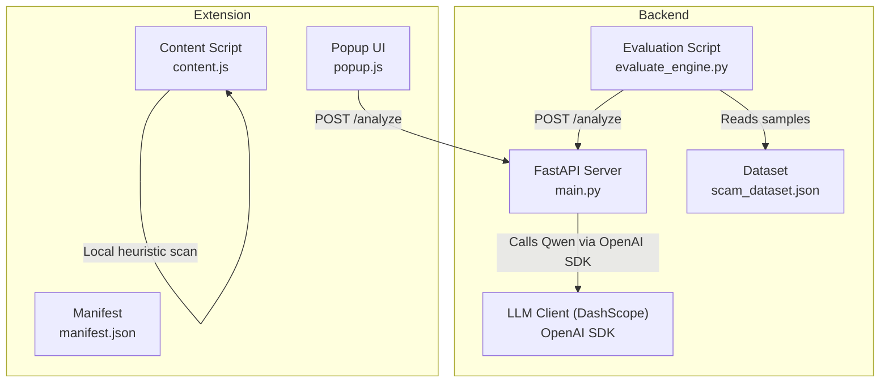
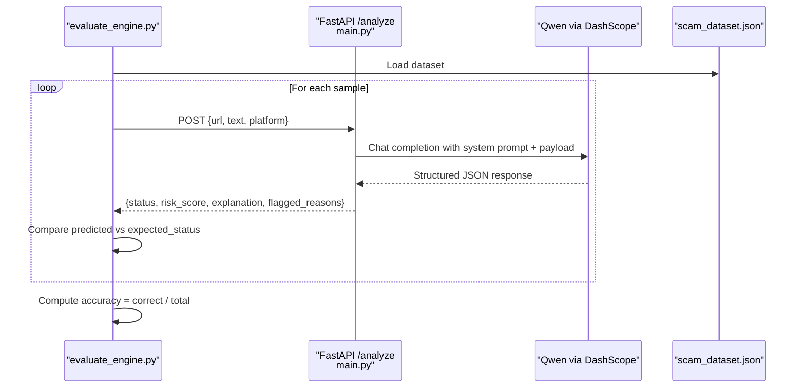
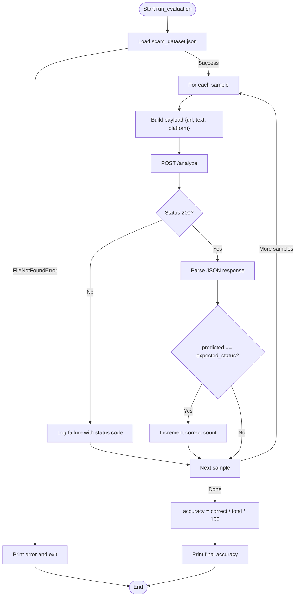
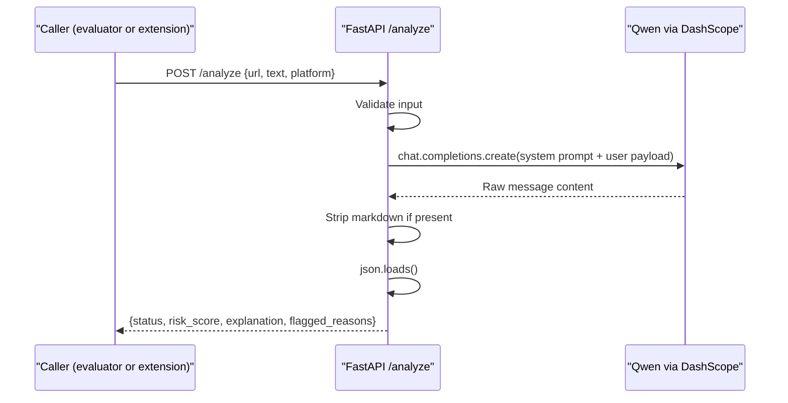
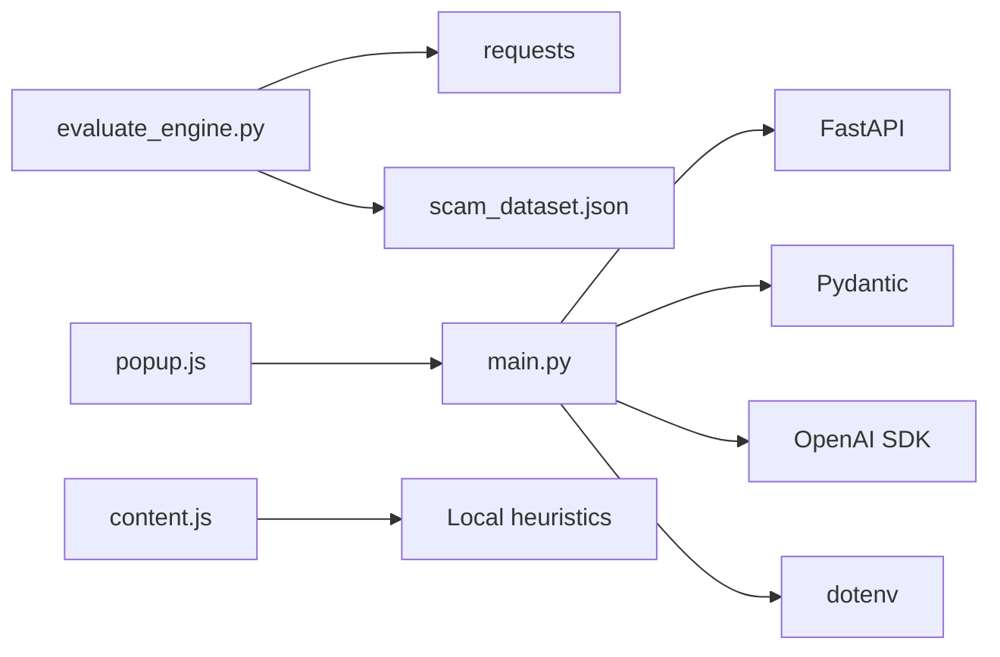

# Evaluation and Testing Framework

<cite>
**Referenced Files in This Document**
- [evaluate_engine.py](file://backend/evaluate_engine.py)
- [scam_dataset.json](file://backend/scam_dataset.json)
- [main.py](file://backend/main.py)
- [test_qwen.py](file://backend/test_qwen.py)
- [content.js](file://extension/content.js)
- [popup.js](file://extension/popup.js)
- [manifest.json](file://extension/manifest.json)
- [README.md](file://README.md)
</cite>

## Table of Contents
1. [Introduction](#introduction)
2. [Project Structure](#project-structure)
3. [Core Components](#core-components)
4. [Architecture Overview](#architecture-overview)
5. [Detailed Component Analysis](#detailed-component-analysis)
6. [Dependency Analysis](#dependency-analysis)
7. [Performance Considerations](#performance-considerations)
8. [Troubleshooting Guide](#troubleshooting-guide)
9. [Conclusion](#conclusion)
10. [Appendices](#appendices)

## Introduction
This document explains the ScrollGuard AI evaluation and testing framework focused on automated accuracy measurement and dataset validation. It covers how the automated test system loads a curated dataset, sends each sample to the backend API, compares expected versus actual results, and reports accuracy. It also details the dataset structure, guidelines for expanding it, methods for computing precision/recall/false positives/negatives, performance metrics collection, examples for adding new test cases, interpreting reports, and best practices for maintenance and continuous integration.

## Project Structure
The project is organized into a backend service that exposes an analysis endpoint powered by an LLM, an automated evaluation script that drives benchmarking against a dataset, and a browser extension that provides real-time scanning and user feedback.

**Diagram sources**
- [main.py:20-92](file://backend/main.py#L20-L92)
- [evaluate_engine.py:6-49](file://backend/evaluate_engine.py#L6-L49)
- [scam_dataset.json:1-37](file://backend/scam_dataset.json#L1-L37)
- [content.js:1-276](file://extension/content.js#L1-L276)
- [popup.js:1-46](file://extension/popup.js#L1-L46)
- [manifest.json:1-20](file://extension/manifest.json#L1-L20)

**Section sources**
- [README.md:45-56](file://README.md#L45-L56)
- [README.md:175-190](file://README.md#L175-L190)

## Core Components
- Backend API server: FastAPI application exposing a root endpoint and an analyze endpoint that calls the LLM and returns structured JSON with status, risk score, explanation, and flagged reasons.
- Automated evaluation engine: Loads scam_dataset.json, iterates through samples, posts each to the backend analyze endpoint, compares predicted status with expected_status, and prints per-sample results and overall accuracy.
- Test dataset: A JSON array of samples containing id, url, text, platform, and expected_status used as ground truth for evaluation.
- Extension components: Content script performs local heuristic scanning; popup triggers live analysis via the backend API.

**Section sources**
- [main.py:20-92](file://backend/main.py#L20-L92)
- [evaluate_engine.py:6-49](file://backend/evaluate_engine.py#L6-L49)
- [scam_dataset.json:1-37](file://backend/scam_dataset.json#L1-L37)
- [content.js:15-89](file://extension/content.js#L15-L89)
- [popup.js:16-45](file://extension/popup.js#L16-L45)

## Architecture Overview
The evaluation workflow integrates the dataset, the evaluation script, and the backend API. The extension demonstrates real-world usage but is separate from the automated evaluation flow.

**Diagram sources**
- [evaluate_engine.py:6-49](file://backend/evaluate_engine.py#L6-L49)
- [main.py:64-92](file://backend/main.py#L64-L92)
- [scam_dataset.json:1-37](file://backend/scam_dataset.json#L1-L37)

## Detailed Component Analysis

### Automated Evaluation Engine
Responsibilities:
- Load dataset from scam_dataset.json.
- Iterate over each sample and construct a request payload with url, text, and platform.
- Send requests to the backend analyze endpoint.
- Extract predicted status from the response and compare with expected_status.
- Print per-sample diagnostics including expected vs predicted, risk score, and explanation.
- Compute and print overall accuracy.

Key behaviors:
- Error handling for missing dataset file and HTTP errors or exceptions during requests.
- Accuracy calculation uses simple equality between predicted and expected statuses.

**Diagram sources**
- [evaluate_engine.py:6-49](file://backend/evaluate_engine.py#L6-L49)

**Section sources**
- [evaluate_engine.py:6-49](file://backend/evaluate_engine.py#L6-L49)

### Backend API and LLM Integration
Responsibilities:
- Define Pydantic models for request and response schemas.
- Enforce CORS for extension communication.
- Validate input (at least one of url or text).
- Compose user payload with platform, URL, and text.
- Call the LLM using the OpenAI-compatible client and DashScope base URL.
- Clean potential markdown code blocks from model output and parse JSON.
- Return structured response with status, risk_score, explanation, and flagged_reasons.

Error handling:
- Raises HTTP 400 if no input provided.
- Raises HTTP 500 on JSON parsing failures or other exceptions.

**Diagram sources**
- [main.py:20-92](file://backend/main.py#L20-L92)

**Section sources**
- [main.py:20-92](file://backend/main.py#L20-L92)

### Test Dataset Structure and Expansion Guidelines
Structure:
- Array of objects, each with:
  - id: unique identifier for the sample.
  - url: link to evaluate.
  - text: contextual text associated with the link.
  - platform: source context (e.g., WhatsApp, Browser, Twitter, SMS).
  - expected_status: ground truth label used for comparison (Safe, Suspicious, Dangerous).

Categorization:
- Samples are categorized by expected_status reflecting known scam types or benign links.
- Platform field helps contextualize detection behavior across channels.

Guidelines for expansion:
- Add new entries following the same schema.
- Ensure balanced representation across Safe, Suspicious, and Dangerous categories.
- Include diverse platforms and realistic text snippets.
- Use unique ids and avoid duplicates.
- Keep URLs and texts representative of current threat patterns.

**Section sources**
- [scam_dataset.json:1-37](file://backend/scam_dataset.json#L1-L37)

### Accuracy Measurement Methods
Current implementation:
- Compares predicted status with expected_status for each sample.
- Computes accuracy as the ratio of correct predictions to total samples.

Recommended metrics for comprehensive evaluation:
- Precision: proportion of predicted positive classes that are truly positive.
- Recall: proportion of true positives correctly identified.
- False Positives (FP): predicted positive when actually negative.
- False Negatives (FN): predicted negative when actually positive.
- Macro/micro averages across classes if multi-class confusion is needed.

To extend the evaluator:
- Track TP, FP, FN, TN per class.
- Compute precision, recall, F1 per class and macro/micro averages.
- Output a classification report and per-sample misclassification details.

[No sources needed since this section provides general guidance]

### Performance Metrics Collection
Current state:
- The evaluation script does not collect timing or resource utilization metrics.

Recommended enhancements:
- Measure latency per request (time to first byte, total round-trip time).
- Aggregate statistics: mean, median, p95, p99 latency.
- Count API call successes/failures and error rates.
- Track memory/CPU usage during evaluation runs.
- Persist metrics to a log or CSV for trend analysis.

[No sources needed since this section provides general guidance]

### Adding New Test Cases
Steps:
- Open scam_dataset.json and append a new object with id, url, text, platform, and expected_status.
- Choose a representative scenario aligned with Safe, Suspicious, or Dangerous categories.
- Run the evaluation script after starting the backend server to validate behavior.

Example reference paths:
- Dataset entry format: see [scam_dataset.json:1-37](file://backend/scam_dataset.json#L1-L37)
- Evaluation execution: see [evaluate_engine.py:6-49](file://backend/evaluate_engine.py#L6-L49)

**Section sources**
- [scam_dataset.json:1-37](file://backend/scam_dataset.json#L1-L37)
- [evaluate_engine.py:6-49](file://backend/evaluate_engine.py#L6-L49)

### Interpreting Evaluation Reports
What to look for:
- Per-sample lines showing expected vs predicted, match status, risk score, and explanation.
- Final accuracy percentage and total correct/total counts.
- Any failed HTTP responses or request errors indicating backend issues.

How to use insights:
- Misclassifications highlight areas where prompts, thresholds, or dataset coverage need improvement.
- High-risk false negatives indicate missed threats requiring stronger heuristics or prompt tuning.
- False positives suggest overly aggressive detection rules or insufficient context.

**Section sources**
- [evaluate_engine.py:19-46](file://backend/evaluate_engine.py#L19-L46)

### Using Results to Improve Detection Accuracy
Actions:
- Refine system prompt and filtering logic in the backend to better distinguish suspicious vs dangerous signals.
- Expand dataset with edge cases and recent scam patterns.
- Introduce confidence thresholds or multi-step reasoning if needed.
- Re-run evaluations to measure improvements.

[No sources needed since this section provides general guidance]

### Extension Behavior (Contextual)
The browser extension includes:
- Local heuristic scanning via content.js that detects suspicious URLs and text patterns and injects a warning banner.
- Popup-driven analysis via popup.js that calls the backend analyze endpoint to obtain structured results.

These features complement the evaluation framework by demonstrating real-time detection and user-facing feedback.

**Section sources**
- [content.js:15-89](file://extension/content.js#L15-L89)
- [content.js:106-253](file://extension/content.js#L106-L253)
- [popup.js:16-45](file://extension/popup.js#L16-L45)
- [manifest.json:1-20](file://extension/manifest.json#L1-L20)

## Dependency Analysis
High-level dependencies:
- evaluate_engine.py depends on requests and reads scam_dataset.json.
- main.py depends on FastAPI, Pydantic, OpenAI SDK, and dotenv.
- Extension scripts depend on browser APIs and communicate with the backend via HTTP.

**Diagram sources**
- [evaluate_engine.py:1-49](file://backend/evaluate_engine.py#L1-L49)
- [main.py:1-92](file://backend/main.py#L1-L92)
- [popup.js:16-45](file://extension/popup.js#L16-L45)
- [content.js:15-89](file://extension/content.js#L15-L89)

**Section sources**
- [evaluate_engine.py:1-49](file://backend/evaluate_engine.py#L1-L49)
- [main.py:1-92](file://backend/main.py#L1-L92)

## Performance Considerations
- Network latency dominates evaluation runtime due to remote LLM calls.
- Batch processing is not implemented; consider batching payloads to reduce overhead if supported by the backend.
- Implement retries and timeouts to handle transient network issues.
- Cache repeated queries if appropriate to reduce redundant LLM calls.
- Monitor CPU/memory usage on the host running the evaluation script.

[No sources needed since this section provides general guidance]

## Troubleshooting Guide
Common issues and resolutions:
- Missing dataset file: ensure scam_dataset.json exists in the backend directory before running the evaluator.
- Backend not running: start the FastAPI server locally on port 8000 before executing the evaluation script.
- API key not configured: set DASHSCOPE_API_KEY in the environment or .env file for both the backend and any direct LLM tests.
- HTTP errors: check status codes returned by the backend and inspect logs for parsing or model errors.
- Extension connectivity: verify CORS is enabled and the backend is reachable from the browser context.

Operational references:
- Backend startup and docs: see [README.md:127-142](file://README.md#L127-L142)
- Environment configuration: see [README.md:109-122](file://README.md#L109-L122)
- Direct LLM test script: see [test_qwen.py:1-34](file://backend/test_qwen.py#L1-L34)

**Section sources**
- [evaluate_engine.py:7-12](file://backend/evaluate_engine.py#L7-L12)
- [main.py:11-18](file://backend/main.py#L11-L18)
- [test_qwen.py:1-34](file://backend/test_qwen.py#L1-L34)
- [README.md:109-142](file://README.md#L109-L142)

## Conclusion
The ScrollGuard AI evaluation framework provides a straightforward yet effective mechanism to validate detection accuracy against a curated dataset. By iterating through samples, calling the backend analyze endpoint, and comparing predicted outcomes with expected labels, it yields actionable accuracy metrics. Extending the evaluator with richer metrics, performance instrumentation, and robust error handling will further strengthen quality assurance. Maintaining a well-curated dataset and integrating automated checks into CI pipelines will ensure ongoing reliability and improved detection accuracy.

## Appendices

### Running the Evaluation
- Start the backend server on http://127.0.0.1:8000.
- Execute the evaluation script in the backend directory.
- Review printed per-sample results and final accuracy.

References:
- [README.md:175-190](file://README.md#L175-L190)
- [evaluate_engine.py:6-49](file://backend/evaluate_engine.py#L6-L49)

**Section sources**
- [README.md:175-190](file://README.md#L175-L190)
- [evaluate_engine.py:6-49](file://backend/evaluate_engine.py#L6-L49)

### Best Practices for Dataset Maintenance and Versioning
- Maintain dataset versioning alongside code changes to track evaluation baselines.
- Regularly review and update samples to reflect evolving scam tactics.
- Ensure balanced class distribution and diverse platform coverage.
- Automate dataset validation (schema checks) in pre-commit hooks or CI.

[No sources needed since this section provides general guidance]

### Continuous Integration Setup Suggestions
- Install dependencies and configure environment variables in CI.
- Start the backend server in CI, then run the evaluation script.
- Capture logs and accuracy metrics as artifacts.
- Fail builds on significant accuracy regressions or unexpected errors.

[No sources needed since this section provides general guidance]