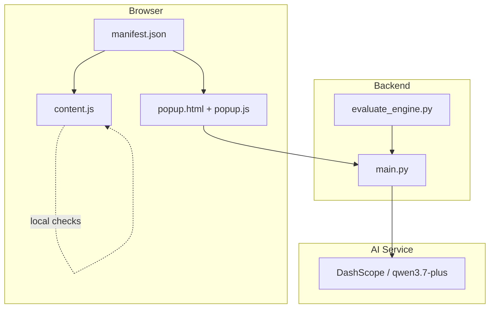
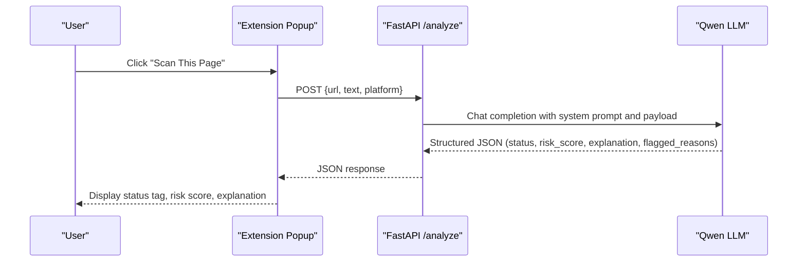
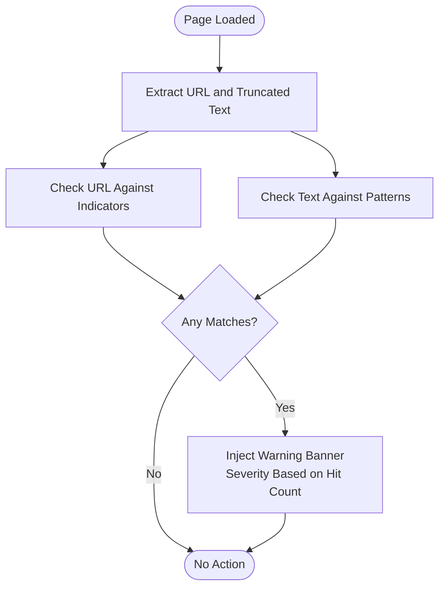
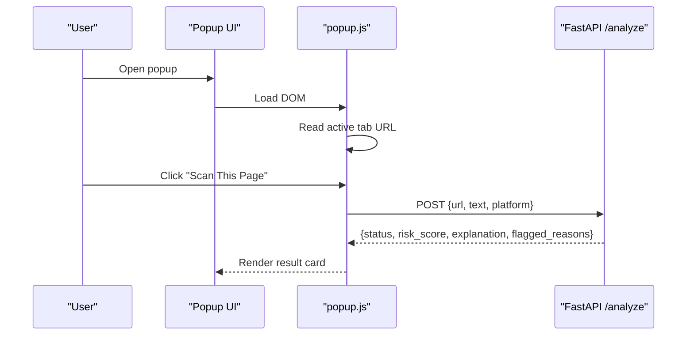
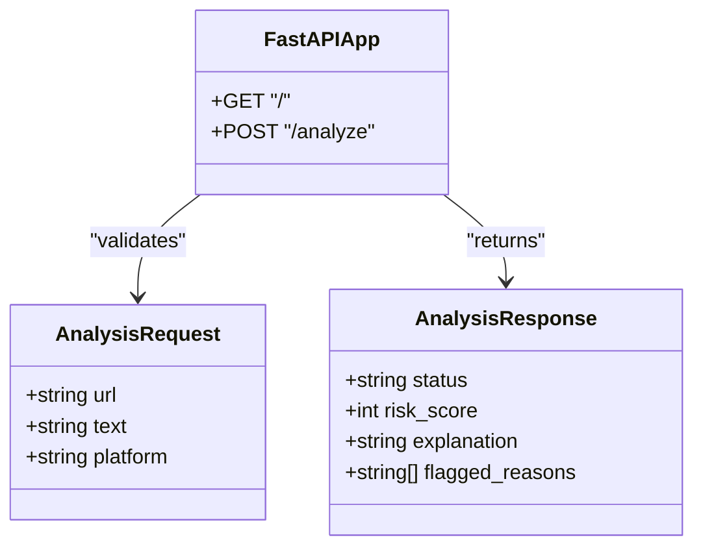
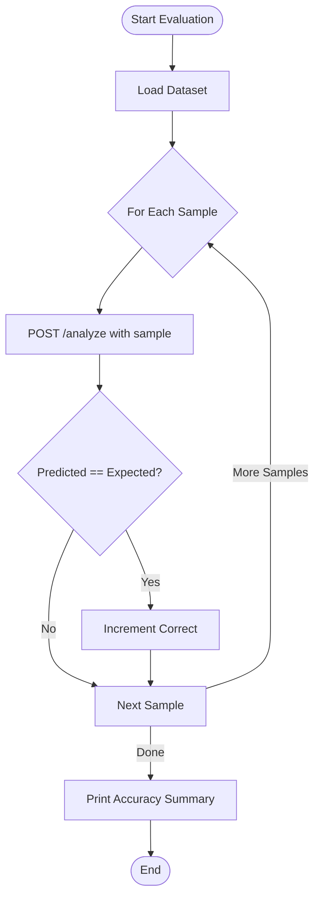
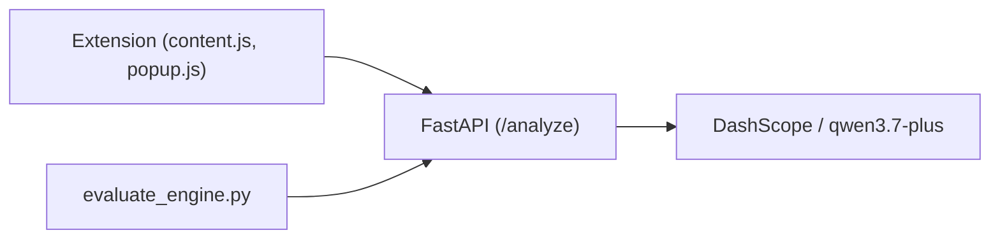

# Project Overview

<cite>
**Referenced Files in This Document**
- [README.md](file://README.md)
- [main.py](file://backend/main.py)
- [evaluate_engine.py](file://backend/evaluate_engine.py)
- [manifest.json](file://extension/manifest.json)
- [content.js](file://extension/content.js)
- [popup.html](file://extension/popup.html)
- [popup.js](file://extension/popup.js)
</cite>

## Table of Contents
1. [Introduction](#introduction)
2. [Project Structure](#project-structure)
3. [Core Components](#core-components)
4. [Architecture Overview](#architecture-overview)
5. [Detailed Component Analysis](#detailed-component-analysis)
6. [Dependency Analysis](#dependency-analysis)
7. [Performance Considerations](#performance-considerations)
8. [Troubleshooting Guide](#troubleshooting-guide)
9. [Conclusion](#conclusion)

## Introduction
ScrollGuard AI is a real-time, AI-powered browser security extension and backend API built for the Alibaba Cloud AI Hackathon by Team Raven. It protects users from phishing attempts, deceptive giveaways, fraudulent domains, and social media scam links by scanning URLs and page content on the fly and returning structured risk assessments with clear threat levels: Safe, Suspicious, or Dangerous. The solution combines a lightweight Chrome Extension frontend with a Python FastAPI backend that leverages Alibaba Cloud’s Qwen LLM (qwen3.7-plus via DashScope) to analyze context, urgency tactics, and domain reputation. It also includes an automated evaluation benchmark to measure detection accuracy against a curated dataset.

Key capabilities include:
- Real-time URL and content scanning directly from the browser
- Qwen LLM intelligence integration for contextual analysis
- Structured risk scoring with JSON responses and clear threat levels
- Automated evaluation benchmarking for continuous validation

## Project Structure
The project follows a hybrid pattern:
- Frontend: A Manifest V3 Chrome Extension that injects a content script to detect suspicious patterns locally and provides a popup UI to trigger deep scans via the backend.
- Backend: A FastAPI service that calls the Qwen model to produce structured risk assessments.
- Evaluation: A script that runs a dataset through the backend to compute accuracy metrics.

**Diagram sources**
- [manifest.json:1-20](file://extension/manifest.json#L1-L20)
- [content.js:1-276](file://extension/content.js#L1-L276)
- [popup.html:1-108](file://extension/popup.html#L1-L108)
- [popup.js:1-46](file://extension/popup.js#L1-L46)
- [main.py:1-92](file://backend/main.py#L1-L92)
- [evaluate_engine.py:1-49](file://backend/evaluate_engine.py#L1-L49)

**Section sources**
- [README.md:19-55](file://README.md#L19-L55)
- [manifest.json:1-20](file://extension/manifest.json#L1-L20)

## Core Components
- Chrome Extension (Frontend)
  - Content script performs immediate, client-side pattern matching to flag suspicious URLs and text, injecting a warning banner when indicators are found.
  - Popup UI displays the current tab URL and triggers a backend scan, rendering status, risk score, and explanation.
- FastAPI Backend
  - Exposes a single endpoint that accepts URL/text/platform, constructs a prompt for the Qwen model, parses structured JSON output, and returns threat level, risk score, explanation, and flagged reasons.
  - CORS enabled for cross-origin communication from the extension.
- Evaluation Engine
  - Loads a dataset of known samples, sends each to the backend, compares predicted status to expected labels, and prints accuracy statistics.

Practical examples of common use cases:
- Detecting phishing attempts: Scans URLs and visible text for urgency cues, credential harvesting phrases, and impersonation patterns; returns Dangerous with high risk scores when confirmed.
- Identifying fraudulent domains: Flags shortened link services and suspicious TLDs; may return Suspicious until LLM confirms intent.
- Social media scam links: Analyzes giveaway claims and “claim now” messaging; returns appropriate threat levels based on combined signals.

**Section sources**
- [content.js:15-57](file://extension/content.js#L15-L57)
- [content.js:61-99](file://extension/content.js#L61-L99)
- [content.js:106-253](file://extension/content.js#L106-L253)
- [popup.html:95-104](file://extension/popup.html#L95-L104)
- [popup.js:16-45](file://extension/popup.js#L16-L45)
- [main.py:31-40](file://backend/main.py#L31-L40)
- [main.py:42-58](file://backend/main.py#L42-L58)
- [main.py:64-92](file://backend/main.py#L64-L92)
- [evaluate_engine.py:6-49](file://backend/evaluate_engine.py#L6-L49)

## Architecture Overview
ScrollGuard AI uses a hybrid approach:
- Local pattern matching in the extension for fast, offline detection and immediate user feedback.
- Backend AI analysis for deeper context understanding and structured risk scoring using Qwen.

**Diagram sources**
- [popup.js:16-45](file://extension/popup.js#L16-L45)
- [main.py:64-92](file://backend/main.py#L64-L92)

## Detailed Component Analysis

### Chrome Extension: Content Script (Local Detection)
- Purpose: Instantly inspect the active page URL and visible text for known scam indicators and show a non-intrusive warning banner if threats are detected.
- Mechanism:
  - Maintains lists of URL indicators (suspicious TLDs, shorteners, phishing-style paths) and text indicators (regex patterns for urgency, credential harvesting, fake giveaways).
  - On DOM ready, extracts truncated page text and runs both URL and text checks.
  - If any matches are found, injects a fixed banner at the top of the page with severity labeling based on hit counts.
- User Experience:
  - Banner includes dismiss action and adjusts page layout so content remains readable.
  - Provides immediate visual feedback without network calls.

**Diagram sources**
- [content.js:15-57](file://extension/content.js#L15-L57)
- [content.js:61-99](file://extension/content.js#L61-L99)
- [content.js:106-253](file://extension/content.js#L106-L253)

**Section sources**
- [content.js:15-57](file://extension/content.js#L15-L57)
- [content.js:61-99](file://extension/content.js#L61-L99)
- [content.js:106-253](file://extension/content.js#L106-L253)

### Chrome Extension: Popup UI (Deep Scan Trigger)
- Purpose: Provide a simple interface to send the current tab’s URL and title to the backend for AI-powered analysis and display results.
- Behavior:
  - Reads the active tab URL and shows it in the popup.
  - On click, posts a JSON payload to the backend and renders status, risk score, and explanation.
  - Handles connection errors gracefully with user feedback.

**Diagram sources**
- [popup.html:95-104](file://extension/popup.html#L95-L104)
- [popup.js:1-46](file://extension/popup.js#L1-L46)

**Section sources**
- [popup.html:95-104](file://extension/popup.html#L95-L104)
- [popup.js:1-46](file://extension/popup.js#L1-L46)

### Backend: FastAPI Analysis Endpoint
- Purpose: Accept analysis requests, call the Qwen model with a strict system prompt, parse structured JSON, and return consistent threat assessments.
- Key Elements:
  - Request schema: url, text, platform.
  - System prompt enforces exact JSON structure and defines threat levels and risk score ranges.
  - Error handling for invalid payloads and parsing failures.
  - CORS middleware to allow extension communication.

**Diagram sources**
- [main.py:31-40](file://backend/main.py#L31-L40)
- [main.py:64-92](file://backend/main.py#L64-L92)

**Section sources**
- [main.py:31-40](file://backend/main.py#L31-L40)
- [main.py:42-58](file://backend/main.py#L42-L58)
- [main.py:64-92](file://backend/main.py#L64-L92)

### Evaluation Engine: Automated Benchmarking
- Purpose: Measure detection accuracy by running a dataset of known samples through the backend and comparing predicted statuses to expected labels.
- Behavior:
  - Loads scam_dataset.json.
  - Iterates over samples, posts payloads to the backend, and records correctness.
  - Prints per-sample details and final accuracy percentage.

**Diagram sources**
- [evaluate_engine.py:6-49](file://backend/evaluate_engine.py#L6-L49)

**Section sources**
- [evaluate_engine.py:6-49](file://backend/evaluate_engine.py#L6-L49)

## Dependency Analysis
- Extension depends on:
  - Browser APIs (activeTab, scripting) declared in manifest.
  - Content script logic for local scanning.
  - Popup UI for triggering backend scans.
- Backend depends on:
  - FastAPI framework and CORS middleware.
  - OpenAI-compatible client configured to use DashScope base URL.
  - Environment variable for API key.
- Evaluation depends on:
  - Requests library to call the backend.
  - Dataset file for ground truth labels.

**Diagram sources**
- [manifest.json:6-18](file://extension/manifest.json#L6-L18)
- [content.js:1-276](file://extension/content.js#L1-L276)
- [popup.js:16-45](file://extension/popup.js#L16-L45)
- [main.py:1-29](file://backend/main.py#L1-L29)
- [main.py:64-92](file://backend/main.py#L64-L92)
- [evaluate_engine.py:1-49](file://backend/evaluate_engine.py#L1-L49)

**Section sources**
- [manifest.json:6-18](file://extension/manifest.json#L6-L18)
- [main.py:1-29](file://backend/main.py#L1-L29)
- [evaluate_engine.py:1-49](file://backend/evaluate_engine.py#L1-L49)

## Performance Considerations
- Hybrid detection reduces latency:
  - Immediate local checks provide instant feedback without network overhead.
  - Backend AI analysis is invoked only when the user explicitly scans or when deeper context is needed.
- Lightweight extension:
  - Uses minimal permissions and efficient DOM operations to avoid impacting page performance.
- Backend efficiency:
  - Single endpoint design minimizes routing complexity.
  - Strict JSON parsing ensures predictable error paths.
- Evaluation throughput:
  - Batch processing of dataset allows quick iteration during development.

[No sources needed since this section provides general guidance]

## Troubleshooting Guide
Common issues and resolutions:
- Backend not reachable from extension:
  - Ensure the FastAPI server is running on the expected address and port.
  - Verify CORS is enabled and the extension can reach the backend.
- Missing environment variables:
  - Confirm DASHSCOPE_API_KEY is set in the backend environment before starting the server.
- Parsing errors from AI model:
  - If the model returns unexpected formatting, the backend will raise a structured error; re-run with updated prompts or retry.
- Evaluation script fails:
  - Ensure scam_dataset.json exists and the backend is accessible at the configured URL.

**Section sources**
- [main.py:11-13](file://backend/main.py#L11-L13)
- [main.py:22-29](file://backend/main.py#L22-L29)
- [main.py:89-92](file://backend/main.py#L89-L92)
- [evaluate_engine.py:6-12](file://backend/evaluate_engine.py#L6-L12)
- [popup.js:39-41](file://extension/popup.js#L39-L41)

## Conclusion
ScrollGuard AI delivers a practical, real-time defense against phishing and scam links by combining fast, local pattern matching with powerful AI-driven analysis. The extension offers immediate visual warnings, while the backend provides structured risk scoring and explanations grounded in Qwen’s contextual understanding. With an automated evaluation engine, the project supports ongoing validation and improvement. This architecture balances speed, accuracy, and usability—ideal for protecting users across browsers and platforms.

[No sources needed since this section summarizes without analyzing specific files]