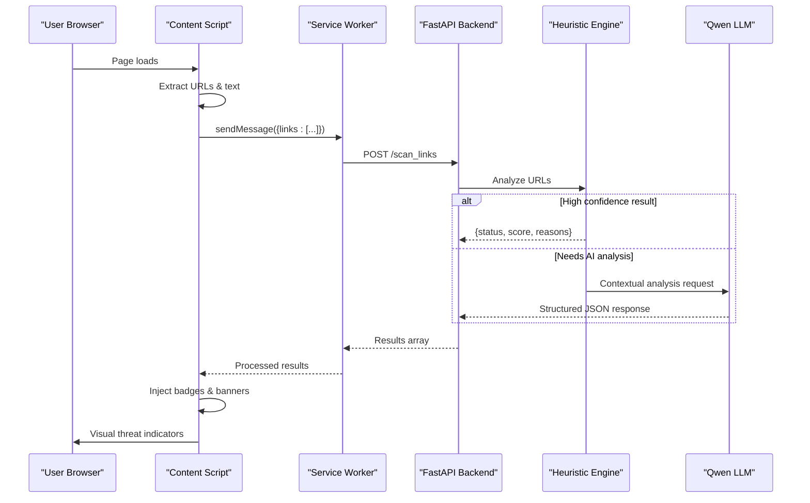
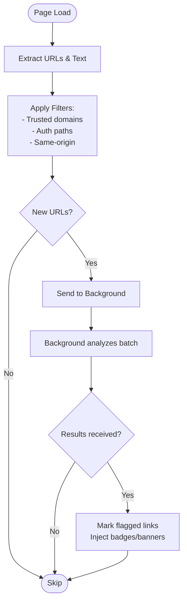

# Project Overview

<cite>
**Referenced Files in This Document**
- [README.md](file://README.md)
- [main.py](file://backend/main.py)
- [evaluate_engine.py](file://backend/evaluate_engine.py)
- [manifest.json](file://extension/manifest.json)
- [content.js](file://extension/content.js)
- [background.js](file://extension/background.js)
- [popup.html](file://extension/popup.html)
- [popup.js](file://extension/popup.js)
</cite>

## Update Summary
**Changes Made**
- Updated architecture description to reflect Manifest V3 service worker architecture
- Enhanced tech stack details with specific technologies and deployment options
- Added comprehensive installation and setup instructions
- Included cloud deployment guides for Render, Heroku, and Alibaba Cloud
- Expanded future roadmap with Phase 2 WhatsApp/Telegram bot features
- Updated data flow diagrams to show complete extension-backend communication
- Enhanced security features documentation including zero-click scanning and SPA support

## Table of Contents
1. [Introduction](#introduction)
2. [Project Structure](#project-structure)
3. [Core Components](#core-components)
4. [Architecture Overview](#architecture-overview)
5. [Detailed Component Analysis](#detailed-component-analysis)
6. [Installation & Setup](#installation--setup)
7. [Cloud Deployment](#cloud-deployment)
8. [Performance Considerations](#performance-considerations)
9. [Future Roadmap](#future-roadmap)
10. [Troubleshooting Guide](#troubleshooting-guide)
11. [Conclusion](#conclusion)

## Introduction
ScrollGuard AI is a real-time, AI-powered browser security extension and backend API built for the Alibaba Cloud AI Hackathon by Team Raven. It provides zero-click protection against phishing attempts, deceptive giveaways, fraudulent domains, and social media scam links by automatically scanning URLs and page content as users browse, returning structured risk assessments with clear threat levels: Safe, Suspicious, or Dangerous.

The solution combines a sophisticated Chrome Extension frontend with a Python FastAPI backend that leverages Alibaba Cloud's Qwen LLM (qwen3.6-plus via DashScope) to analyze context, urgency tactics, and domain reputation. Unlike traditional extensions that require manual scanning, ScrollGuard AI operates continuously in the background, providing immediate visual warnings when threats are detected.

Key capabilities include:
- **Zero-click auto-scanning**: Protection starts immediately upon page load without user interaction
- **Real-time SPA link scraping**: Uses MutationObserver to detect dynamically loaded links in infinite-scroll feeds
- **Interactive inline threat badges**: Visual indicators directly on suspicious links with detailed explanation modals
- **Two-stage detection pipeline**: Heuristic pre-filtering followed by Qwen LLM deep analysis
- **Structured risk scoring**: JSON responses with numerical scores (0-100) and detailed explanations
- **Automated evaluation benchmarking**: Continuous validation against curated scam datasets

## Project Structure
The project follows a modern hybrid architecture with clear separation between browser extension and backend services:

```mermaid
graph TB
subgraph "Browser Extension (Manifest V3)"
M["manifest.json"]
C["content.js - Zero-click scanner"]
B["background.js - Service Worker"]
P["popup.html + popup.js - Dashboard"]
end
subgraph "Backend Services"
API["FastAPI /analyze endpoint"]
SCAN["FastAPI /scan_links endpoint"]
HEU["Heuristic Engine"]
AI["Qwen LLM Integration"]
end
subgraph "External Services"
DASH["DashScope API"]
ALIBABA["Alibaba Cloud"]
end
M --> C
M --> B
M --> P
C -. chrome.runtime.sendMessage .-> B
B -. fetch() .-> SCAN
SCAN --> HEU
HEU --> |High confidence| SCAN
HEU --> |Needs AI| AI
AI --> DASH
DASH --> ALIBABA
```

**Diagram sources**
- [manifest.json:1-47](file://extension/manifest.json#L1-L47)
- [content.js:1-826](file://extension/content.js#L1-L826)
- [background.js:1-69](file://extension/background.js#L1-L69)
- [main.py:1-329](file://backend/main.py#L1-L329)

**Section sources**
- [README.md:9-73](file://README.md#L9-L73)
- [manifest.json:1-47](file://extension/manifest.json#L1-L47)

## Core Components

### Chrome Extension (Frontend)
The extension implements a sophisticated three-layer architecture:

**Content Script (content.js)**: Performs zero-click scanning on every page load, using MutationObserver to detect dynamically injected links from social media feeds and other SPAs. Implements advanced filtering including trusted domain allowlists, authentication path detection, and URL deduplication to minimize unnecessary API calls.

**Service Worker (background.js)**: Acts as a privileged network proxy that bypasses CORS restrictions, handling all backend communication and managing the connection between content scripts and the FastAPI backend.

**Popup Interface (popup.html + popup.js)**: Provides a comprehensive dashboard showing real-time scan statistics, active status monitoring, and manual scanning fallback capabilities.

### FastAPI Backend
The backend provides two primary endpoints:
- **POST /analyze**: Single URL analysis with text context
- **POST /scan_links**: Batch URL analysis for multiple links simultaneously

Both endpoints implement a two-stage detection pipeline: heuristic pre-filtering for immediate results when high confidence is achieved, followed by Qwen LLM analysis for complex cases requiring contextual understanding.

### Evaluation Engine
An automated testing system that validates detection accuracy against known scam samples, providing classification reports and confusion matrices to measure performance improvements over time.

**Section sources**
- [content.js:1-826](file://extension/content.js#L1-L826)
- [background.js:1-69](file://extension/background.js#L1-L69)
- [popup.html:1-340](file://extension/popup.html#L1-L340)
- [popup.js:1-168](file://extension/popup.js#L1-L168)
- [main.py:1-329](file://backend/main.py#L1-L329)
- [evaluate_engine.py:1-78](file://backend/evaluate_engine.py#L1-L78)

## Architecture Overview
ScrollGuard AI employs a sophisticated hybrid detection approach combining immediate client-side heuristics with powerful AI-driven analysis:



**Diagram sources**
- [content.js:205-220](file://extension/content.js#L205-L220)
- [background.js:39-57](file://extension/background.js#L39-L57)
- [main.py:209-275](file://backend/main.py#L209-L275)

The architecture ensures minimal latency through intelligent filtering while maintaining high accuracy through AI analysis when needed.

## Detailed Component Analysis

### Chrome Extension: Zero-Click Content Scanner
The content script implements advanced real-time scanning with sophisticated filtering mechanisms:

**Key Features:**
- **MutationObserver integration**: Detects dynamically injected links from infinite-scroll feeds on platforms like Facebook, Instagram, Twitter, and Reddit
- **Trusted domain allowlist**: Automatically skips 20+ major domains (google.com, github.com, etc.) to conserve API quota and eliminate false positives
- **Authentication path filtering**: Skips standard login/signup paths to prevent false positives on legitimate authentication flows
- **URL deduplication**: Uses Sets and WeakSets to ensure each unique link triggers exactly one API call per session
- **Debounced processing**: 300ms debouncing to handle bursts of DOM mutations efficiently

**Visual Indicators:**
- **Inline threat badges**: Color-coded badges ([DANGEROUS SCAN], [SUSPICIOUS SCAN]) injected next to flagged links
- **Page-level warning banners**: Full-width banners at the top of dangerous/suspicious pages
- **Interactive detail modals**: Clickable badges open comprehensive explanation modals with risk scores and reasoning



**Diagram sources**
- [content.js:171-194](file://extension/content.js#L171-L194)
- [content.js:740-770](file://extension/content.js#L740-L770)

**Section sources**
- [content.js:23-826](file://extension/content.js#L23-L826)

### Chrome Extension: Service Worker Proxy
The background service worker acts as a privileged network proxy, solving critical CORS and Mixed Content issues:

**Architecture Benefits:**
- **CORS bypass**: Executes network requests in the extension's privileged context, avoiding browser security restrictions
- **Batch processing**: Handles multiple URL analysis requests efficiently
- **Error handling**: Graceful error management with timeout handling and connection failure recovery
- **Configuration flexibility**: Supports both local development and cloud deployment through configurable backend URLs

**Section sources**
- [background.js:1-69](file://extension/background.js#L1-L69)

### Chrome Extension: Interactive Popup Dashboard
The popup provides comprehensive monitoring and control capabilities:

**Features:**
- **Real-time statistics**: Live display of scanned and flagged link counts
- **Auto-scan status**: Visual indicator showing active scanning status with animated pulse
- **Manual scanning fallback**: On-demand scanning capability for verification
- **Result visualization**: Detailed cards showing threat levels, risk scores, explanations, and flagged reasons

**Section sources**
- [popup.html:1-340](file://extension/popup.html#L1-L340)
- [popup.js:1-168](file://extension/popup.js#L1-L168)

### Backend: Two-Stage Detection Pipeline
The FastAPI backend implements an intelligent two-stage analysis process:

**Stage 1 - Heuristic Pre-filtering:**
- Rapid rule-based analysis using pattern matching for known threat indicators
- Immediate results for high-confidence detections (suspicious TLDs, shorteners, typosquatting)
- Reduces unnecessary AI API calls and improves response times

**Stage 2 - AI Deep Analysis:**
- Qwen LLM contextual analysis for complex cases requiring nuanced understanding
- Aggressive few-shot prompting with worked examples for each threat level
- Critical enforcement directives ensuring dangerous threats aren't downgraded
- Structured JSON output with consistent schema across all responses

**Rate Limiting & Performance:**
- Semaphore-based concurrency control (5 concurrent AI calls)
- Async OpenAI client for non-blocking operations
- Efficient error handling and retry logic

**Section sources**
- [main.py:15-329](file://backend/main.py#L15-L329)

### Evaluation Engine: Automated Benchmarking
The evaluation system provides continuous validation of detection accuracy:

**Capabilities:**
- **Dataset loading**: Reads from scam_dataset.json containing known malicious and benign URLs
- **Batch processing**: Sends all test URLs to the backend simultaneously
- **Performance metrics**: Generates classification reports and confusion matrices
- **Per-sample analysis**: Detailed output showing expected vs. predicted classifications

**Section sources**
- [evaluate_engine.py:1-78](file://backend/evaluate_engine.py#L1-L78)

## Installation & Setup

### Prerequisites
- **Python 3.10+** for backend development
- **Google Chrome or Microsoft Edge** for extension testing
- **Active Alibaba Cloud DashScope API Key** for AI analysis capabilities

### Backend Setup
```bash
# Navigate to backend directory
cd backend

# Install dependencies
pip install fastapi uvicorn openai python-dotenv pydantic requests

# Configure environment variables
cp .env.example .env
# Edit .env and add your DASHSCOPE_API_KEY

# Start development server
python main.py
# Or with auto-reload for development:
python -m uvicorn main:app --reload --port 8000
```

### Extension Setup
1. Open browser extensions page (`chrome://extensions/` or `edge://extensions/`)
2. Enable Developer Mode (toggle in top-right corner)
3. Click "Load unpacked" and select the `extension` folder
4. Pin ScrollGuard AI to toolbar for easy access
5. Protection begins automatically - visit any page to see real-time scanning in action

### Configuration
By default, the extension targets `http://127.0.0.1:8000/scan_links` for local development. To use a cloud-deployed backend:

```javascript
// Run in extension DevTools console
chrome.storage.local.set({
  sg_backendUrl: "https://your-app.onrender.com/scan_links"
})
```

**Section sources**
- [README.md:122-178](file://README.md#L122-L178)

## Cloud Deployment

### Render Deployment
The backend includes a Procfile for standard PaaS deployment:

```
web: uvicorn main:app --host 0.0.0.0 --port $PORT
```

**Steps:**
1. Push backend directory to GitHub repository
2. Create new Web Service on Render and connect repository
3. Set environment variable: `DASHSCOPE_API_KEY=<your_key>`
4. Deploy - Render automatically configures PORT variable

### Alibaba Cloud Deployment
For production deployments on Alibaba Cloud infrastructure:

1. Upload backend files to ECS instance or Function Compute
2. Set environment variables: `DASHSCOPE_API_KEY`, `PORT` (default 8000)
3. Run application: `python main.py`

### Docker Deployment
Optional containerized deployment:

```dockerfile
FROM python:3.12-slim
WORKDIR /app
COPY backend/ .
RUN pip install --no-cache-dir fastapi uvicorn openai python-dotenv pydantic requests
EXPOSE 8000
CMD ["python", "main.py"]
```

**Section sources**
- [README.md:181-214](file://README.md#L181-L214)

## Performance Considerations

### Optimization Strategies
- **Hybrid detection reduces latency**: Immediate local checks provide instant feedback without network overhead
- **Intelligent filtering**: Trusted domain allowlists and auth-path filters eliminate unnecessary API calls
- **Batch processing**: Multiple URLs analyzed concurrently with semaphore-based rate limiting
- **Efficient DOM manipulation**: Minimal CSS injection with prefixed classes to avoid conflicts

### Resource Management
- **Memory optimization**: WeakSet usage for anchor element tracking enables garbage collection
- **Network efficiency**: Debounced mutation observation prevents excessive API calls during rapid DOM changes
- **Concurrent processing**: Async operations and asyncio.gather for efficient batch analysis

### Scalability Features
- **Rate limiting**: Configurable semaphore limits concurrent AI calls to prevent API throttling
- **Error resilience**: Graceful degradation when backend is unavailable
- **Configurable timeouts**: 30-second timeout prevents hanging connections

## Future Roadmap

### Phase 2 — Mobile Messaging Protection
Planned expansion includes a **WhatsApp and Telegram forwarding bot** that protects mobile users from SMS phishing. Users will forward suspicious messages or links to the bot, which runs the same ScrollGuard AI detection pipeline and instantly replies with threat verdicts—extending protection beyond browsers to platforms where most scam messages arrive.

### Later Phases
- **Firefox extension**: Port via WebExtensions API compatibility layer
- **Mobile browser support**: Kiwi Browser (Android) and Firefox for Android
- **Full DOM text analysis**: Extend scanning to paragraph text, button labels, and form actions for social-engineering patterns
- **Persistent threat dashboard**: Store flagged URLs locally with history view in popup
- **User-configurable rules**: Domain whitelists and heuristic sensitivity controls via options page

**Section sources**
- [README.md:267-280](file://README.md#L267-L280)

## Troubleshooting Guide

### Common Issues and Solutions

**Backend Connectivity Issues:**
- Ensure FastAPI server is running on expected address/port
- Verify CORS configuration allows extension communication
- Check firewall settings if deploying to cloud environments

**Environment Configuration:**
- Confirm DASHSCOPE_API_KEY is properly set in backend environment
- Verify .env file syntax and proper key formatting
- Check network connectivity to DashScope API endpoints

**Extension Communication:**
- Validate chrome.runtime.sendMessage calls succeed
- Check service worker logs for connection errors
- Ensure proper permissions in manifest.json

**Performance Issues:**
- Monitor API rate limits and adjust concurrent call limits
- Review trusted domain list effectiveness
- Check for memory leaks in long-running sessions

**Evaluation Script Problems:**
- Verify scam_dataset.json exists and contains valid data
- Ensure backend is accessible at configured URL
- Check Python dependencies including sklearn for metrics

**Section sources**
- [main.py:27-33](file://backend/main.py#L27-L33)
- [background.js:22-33](file://extension/background.js#L22-L33)
- [evaluate_engine.py:35-41](file://backend/evaluate_engine.py#L35-L41)

## Conclusion
ScrollGuard AI delivers comprehensive, real-time protection against phishing and scam links through its sophisticated hybrid architecture. The combination of immediate client-side heuristics and powerful AI-driven analysis provides both speed and accuracy, while the zero-click design ensures protection without user intervention.

The extension's innovative approach to SPA support, combined with interactive visual indicators and detailed explanations, creates an intuitive user experience that educates users about online threats while protecting them in real-time. With robust deployment options and a clear roadmap for future enhancements, ScrollGuard AI represents a significant advancement in browser-based security solutions.

Built specifically for the Alibaba Cloud AI Hackathon by Team Raven, this project demonstrates the practical application of AI technology in addressing real-world cybersecurity challenges, particularly in protecting users from increasingly sophisticated phishing and scam attacks.