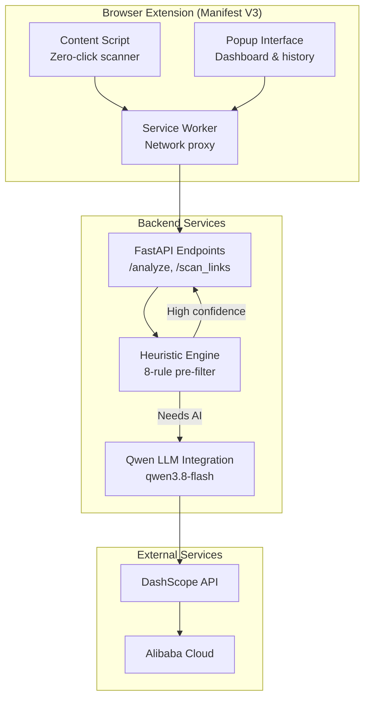

# Project Overview

<cite>
**Referenced Files in This Document**
- [README.md](file://README.md)
- [main.py](file://backend/main.py)
- [heuristics.py](file://backend/heuristics.py)
- [evaluate_engine.py](file://backend/evaluate_engine.py)
- [manifest.json](file://extension/manifest.json)
- [content.js](file://extension/content.js)
- [background.js](file://extension/background.js)
- [popup.html](file://extension/popup.html)
- [popup.js](file://extension/popup.js)
</cite>

## Update Summary
**Changes Made**
- Enhanced problem statement section with specific South Asian scam threat examples
- Updated solution architecture to reflect Manifest V3 service worker implementation
- Added comprehensive visual demonstration references with screenshot gallery
- Expanded technical specifications including Qwen LLM model details and detection pipeline
- Improved installation and setup instructions with detailed step-by-step guidance
- Enhanced cloud deployment options with Render, Heroku, Railway, and Alibaba Cloud specifics
- Updated future roadmap with Phase 2 WhatsApp/Telegram bot features
- Refined performance considerations and known limitations section

## Table of Contents
1. [Introduction](#introduction)
2. [Problem Statement](#problem-statement)
3. [Solution Architecture](#solution-architecture)
4. [Core Components](#core-components)
5. [Technical Implementation](#technical-implementation)
6. [Installation & Setup](#installation--setup)
7. [Cloud Deployment](#cloud-deployment)
8. [Performance & Limitations](#performance--limitations)
9. [Future Roadmap](#future-roadmap)
10. [Visual Demonstrations](#visual-demonstrations)
11. [Conclusion](#conclusion)

## Introduction
ScrollGuard AI is a real-time, AI-powered browser security extension and backend API built for the **Alibaba Cloud AI Hackathon Pakistan 2026** by Team Raven. It provides zero-click protection against phishing attempts, deceptive giveaways, fraudulent domains, and social media scam links by automatically scanning URLs and page content as users browse, returning structured risk assessments with clear threat levels: Safe, Suspicious, or Dangerous.

The solution combines a sophisticated Chrome Extension frontend (Manifest V3) with a Python FastAPI backend that leverages Alibaba Cloud's Qwen LLM (qwen3.8-flash via DashScope) to analyze context, urgency tactics, and domain reputation. Unlike traditional extensions that require manual scanning, ScrollGuard AI operates continuously in the background, providing immediate visual warnings when threats are detected.

Key capabilities include:
- **Zero-click auto-scanning**: Protection starts immediately upon page load without user interaction
- **Real-time SPA link scraping**: Uses MutationObserver to detect dynamically loaded links in infinite-scroll feeds
- **Interactive inline threat badges**: Visual indicators directly on suspicious links with detailed explanation modals
- **Two-stage detection pipeline**: Heuristic pre-filtering followed by Qwen LLM deep analysis
- **Structured risk scoring**: JSON responses with numerical scores (0-100) and detailed explanations
- **Automated evaluation benchmarking**: Continuous validation against curated scam datasets

## Problem Statement
Online scams in Pakistan and South Asia are overwhelmingly **social-engineering attacks delivered through ordinary links** — pasted into Facebook feeds, WhatsApp groups, comment sections, and forwarded messages:

- **Fake government welfare schemes** — pages impersonating **BISP / Ehsaas / PM Kisan** programs that harvest victims' CNIC numbers and bank details from unofficial `.tk` / `.ml` / `.ga` domains.
- **Domain typosquatting** — look-alike brands (`g00gle.com`, `paypa1.com`, `amaz0n-deals.com`) that capture login credentials from hurried users.
- **Fake lotteries and giveaways** — "Congratulations, you won!" pages paired with urgency language and unknown domains.
- **Get-rich-quick and crypto-doubling schemes** spread through URL shorteners.

Existing defenses fail against this threat model: browser blocklists only catch *known-bad* domains after victims have already been harmed, antivirus tools never inspect the links inside a social feed, and manual URL checkers require users to *notice* the threat and copy-paste it — which is precisely what scam victims never do.

## Solution Architecture
ScrollGuard AI inverts the model: **the user never has to act**. A `MutationObserver` watches the live DOM, so every link that appears while you scroll — including infinite-scroll feeds on Facebook, X, Instagram, Reddit, and WhatsApp Web — is validated, sanitized, batched, and classified in the background by a two-stage engine (rule-based heuristics, then Alibaba Cloud's Qwen LLM). Threats are surfaced **inline**, exactly where the dangerous link sits, as colored outlines, clickable badges, and full-screen risk modals — plus a session-scoped **Flagged Threat History** in the popup.



**Diagram sources**
- [manifest.json:1-47](file://extension/manifest.json#L1-L47)
- [content.js:1-200](file://extension/content.js#L1-L200)
- [background.js:1-305](file://extension/background.js#L1-L305)
- [main.py:1-381](file://backend/main.py#L1-L381)

## Core Components

### Chrome Extension (Frontend)
The extension implements a sophisticated three-layer architecture:

**Content Script (content.js)**: Performs zero-click scanning on every page load, using MutationObserver to detect dynamically injected links from social media feeds and other SPAs. Implements advanced filtering including trusted domain allowlists, authentication path detection, and URL deduplication to minimize unnecessary API calls. Features include tracking parameter stripping, interactive threat badges, and modal overlays.

**Service Worker (background.js)**: Acts as a privileged network proxy that bypasses CORS restrictions, handling all backend communication and managing the connection between content scripts and the FastAPI backend. Includes session-scoped flagged threat history and graceful error handling.

**Popup Interface (popup.html + popup.js)**: Provides a comprehensive dashboard showing real-time scan statistics, active status monitoring, and manual scanning fallback capabilities with animated status indicators.

### FastAPI Backend
The backend provides two primary endpoints:
- **POST /analyze**: Single URL analysis with text context
- **POST /scan_links**: Batch URL analysis for multiple links simultaneously

Both endpoints implement a two-stage detection pipeline: heuristic pre-filtering for immediate results when high confidence is achieved, followed by Qwen LLM analysis for complex cases requiring contextual understanding.

### Detection Engine
An intelligent two-stage system combining:
- **Heuristic Pre-filtering**: 8-rule pattern matching for immediate threat detection
- **AI Deep Analysis**: Qwen LLM contextual analysis with few-shot prompting
- **Threshold Enforcement**: Programmatic score-to-status mapping preventing hallucinations

**Section sources**
- [content.js:1-200](file://extension/content.js#L1-L200)
- [background.js:1-305](file://extension/background.js#L1-L305)
- [popup.html:1-200](file://extension/popup.html#L1-L200)
- [main.py:1-381](file://backend/main.py#L1-L381)
- [heuristics.py:1-110](file://backend/heuristics.py#L1-L110)

## Technical Implementation

### Zero-Click Content Scanning
The content script implements advanced real-time scanning with sophisticated filtering mechanisms:

**Key Features:**
- **MutationObserver integration**: Detects dynamically injected links from infinite-scroll feeds on platforms like Facebook, Instagram, Twitter, and Reddit
- **Trusted domain allowlist**: Automatically skips 20+ major domains (google.com, github.com, etc.) to conserve API quota and eliminate false positives
- **Authentication path filtering**: Skips standard login/signup paths to prevent false positives on legitimate authentication flows
- **URL sanitization**: Strips tracking parameters (fbclid, gclid, utm_*) before sending to backend
- **URL deduplication**: Uses Sets and WeakSets to ensure each unique link triggers exactly one API call per session
- **Debounced processing**: 300ms debouncing to handle bursts of DOM mutations efficiently

### Service Worker Proxy Architecture
The background service worker acts as a privileged network proxy, solving critical CORS and Mixed Content issues:

**Architecture Benefits:**
- **CORS bypass**: Executes network requests in the extension's privileged context, avoiding browser security restrictions
- **Batch processing**: Handles multiple URL analysis requests efficiently
- **Error handling**: Graceful error management with timeout handling and connection failure recovery
- **Configuration flexibility**: Supports both local development and cloud deployment through configurable backend URLs

### Two-Stage Detection Pipeline
The FastAPI backend implements an intelligent analysis process:

**Stage 1 - Heuristic Pre-filtering:**
- Rapid rule-based analysis using pattern matching for known threat indicators
- Immediate results for high-confidence detections (suspicious TLDs, shorteners, typosquatting)
- Reduces unnecessary AI API calls and improves response times

**Stage 2 - AI Deep Analysis:**
- Qwen LLM contextual analysis for complex cases requiring nuanced understanding
- Aggressive few-shot prompting with worked examples for each threat level
- Critical enforcement directives ensuring dangerous threats aren't downgraded
- Structured JSON output with consistent schema across all responses

**Rate Limiting & Performance:**
- Semaphore-based concurrency control (5 concurrent AI calls)
- Async OpenAI client for non-blocking operations
- Efficient error handling and retry logic

**Section sources**
- [content.js:1-200](file://extension/content.js#L1-L200)
- [background.js:1-305](file://extension/background.js#L1-L305)
- [main.py:1-381](file://backend/main.py#L1-L381)
- [heuristics.py:1-110](file://backend/heuristics.py#L1-L110)

## Installation & Setup

### Prerequisites
- **Python 3.10+** for backend development
- **Google Chrome or Microsoft Edge** for extension testing
- **Active Alibaba Cloud DashScope API Key** for AI analysis capabilities

### Backend Setup
```bash
# Navigate to backend directory
cd backend

# Install dependencies
pip install fastapi uvicorn openai python-dotenv pydantic

# Configure environment variables
cp .env.example .env
# Edit .env and add your DASHSCOPE_API_KEY

# Start development server
python main.py
# Or with auto-reload for development:
python -m uvicorn main:app --reload --port 8000
```

### Extension Setup
1. Open browser extensions page (`chrome://extensions/` or `edge://extensions/`)
2. Enable Developer Mode (toggle in top-right corner)
3. Click "Load unpacked" and select the `extension` folder
4. Pin ScrollGuard AI to toolbar for easy access
5. Protection begins automatically - visit any page to see real-time scanning in action

### Configuration
By default, the extension targets `http://127.0.0.1:8000/scan_links` for local development. To use a cloud-deployed backend:

```javascript
// Run in extension DevTools console
chrome.storage.local.set({
  sg_backendUrl: "https://your-app.onrender.com/scan_links"
})
```

**Section sources**
- [README.md:205-276](file://README.md#L205-L276)

## Cloud Deployment

### PaaS Deployment Options
The backend includes a Procfile for standard PaaS deployment:

```
web: uvicorn main:app --host 0.0.0.0 --port $PORT
```

**Render / Heroku / Railway** — push the `backend/` directory to a GitHub repository, create a Web Service, set the `DASHSCOPE_API_KEY` environment variable, and deploy (the platform injects `PORT` automatically).

### Alibaba Cloud Deployment
For production deployments on Alibaba Cloud infrastructure:

1. Upload backend files to ECS instance or Function Compute
2. Set environment variables: `DASHSCOPE_API_KEY`, `PORT` (default 8000)
3. Run application: `python main.py`

### Docker Deployment
Optional containerized deployment:

```dockerfile
FROM python:3.12-slim
WORKDIR /app
COPY backend/ .
RUN pip install --no-cache-dir fastapi uvicorn openai python-dotenv pydantic
EXPOSE 8000
CMD ["python", "main.py"]
```

**Section sources**
- [README.md:279-304](file://README.md#L279-L304)

## Performance & Limitations

### Optimization Strategies
- **Hybrid detection reduces latency**: Immediate local checks provide instant feedback without network overhead
- **Intelligent filtering**: Trusted domain allowlists and auth-path filters eliminate unnecessary API calls
- **Batch processing**: Multiple URLs analyzed concurrently with semaphore-based rate limiting
- **Efficient DOM manipulation**: Minimal CSS injection with prefixed classes to avoid conflicts

### Resource Management
- **Memory optimization**: WeakSet usage for anchor element tracking enables garbage collection
- **Network efficiency**: Debounced mutation observation prevents excessive API calls during rapid DOM changes
- **Concurrent processing**: Async operations and asyncio.gather for efficient batch analysis

### Known Limitations
- **Link-only scanning** — the extension analyzes `<a>` `href` attributes, not full DOM paragraph text, image sources, or embedded scripts.
- **Auth-path links skipped** — links containing authentication paths are intentionally never sent to the backend to eliminate false positives; the main page URL itself is still always scanned.
- **Session-scoped history** — flagged links persist for the current browsing session only (cleared on browser restart); there is no cross-session persistent log yet.
- **Backend dependency** — AI analysis requires a running FastAPI backend (local or cloud); the heuristic pre-filter still applies without it.
- **Rate limits** — batches are capped at 100 URLs and 5 concurrent LLM calls, so very heavy pages may resolve progressively.

## Future Roadmap

### Phase 2 — Mobile Messaging Protection
Planned expansion includes a **WhatsApp and Telegram forwarding bot** that protects mobile users from SMS phishing. Users will forward suspicious messages or links to the bot, which runs the same ScrollGuard AI detection pipeline and instantly replies with threat verdicts—extending protection beyond browsers to platforms where most scam messages arrive.

### Later Phases
- **Firefox extension**: Port via WebExtensions API compatibility layer
- **Mobile browser support**: Kiwi Browser (Android) and Firefox for Android
- **Full DOM text analysis**: Extend scanning to paragraph text, button labels, and form actions for social-engineering patterns
- **Persistent threat dashboard**: Store flagged URLs locally with history view in popup
- **User-configurable rules**: Domain whitelists and heuristic sensitivity controls via options page

**Section sources**
- [README.md:361-372](file://README.md#L361-L372)

## Visual Demonstrations

### Real-Time Threat Detection Banner


### Flagged Threat History Log


### AI-Powered Interactive Risk Modal


### AI Threat Explanation


## Conclusion
ScrollGuard AI delivers comprehensive, real-time protection against phishing and scam links through its sophisticated hybrid architecture. The combination of immediate client-side heuristics and powerful AI-driven analysis provides both speed and accuracy, while the zero-click design ensures protection without user intervention.

Built specifically for the Alibaba Cloud AI Hackathon Pakistan 2026 by Team Raven, this project demonstrates the practical application of AI technology in addressing real-world cybersecurity challenges, particularly in protecting users from increasingly sophisticated phishing and scam attacks prevalent in South Asia.

The extension's innovative approach to SPA support, combined with interactive visual indicators and detailed explanations, creates an intuitive user experience that educates users about online threats while protecting them in real-time. With robust deployment options and a clear roadmap for future enhancements, ScrollGuard AI represents a significant advancement in browser-based security solutions.