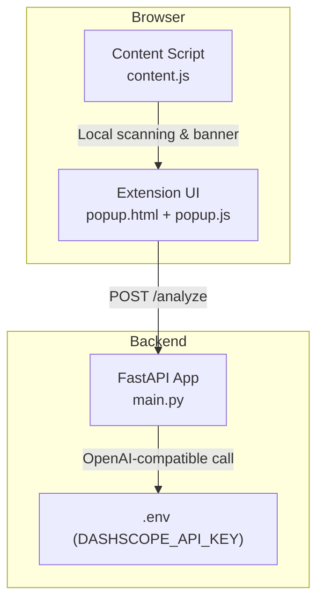
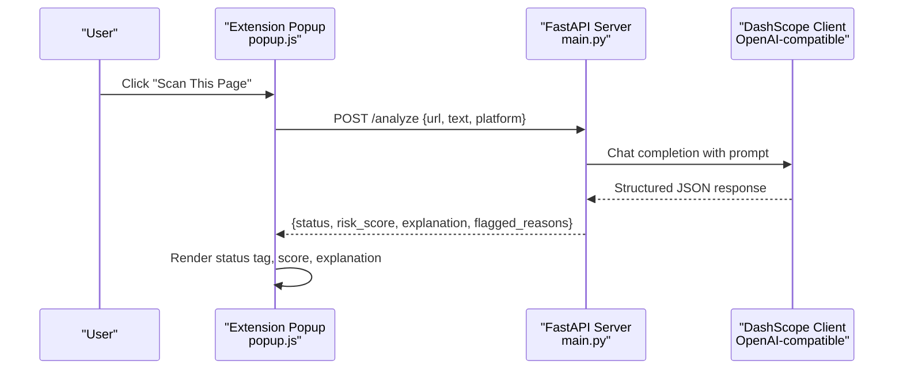
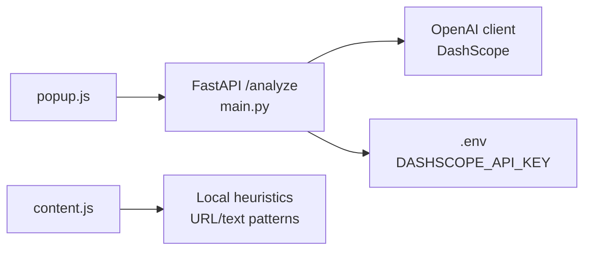

# Quick Start Guide

<cite>
**Referenced Files in This Document**
- [README.md](file://README.md)
- [main.py](file://backend/main.py)
- [manifest.json](file://extension/manifest.json)
- [content.js](file://extension/content.js)
- [popup.html](file://extension/popup.html)
- [popup.js](file://extension/popup.js)
- [evaluate_engine.py](file://backend/evaluate_engine.py)
</cite>

## Table of Contents
1. Introduction
2. Project Structure
3. Core Components
4. Architecture Overview
5. Detailed Component Analysis
6. Dependency Analysis
7. Performance Considerations
8. Troubleshooting Guide
9. Conclusion

## Introduction
This Quick Start Guide helps you get ScrollGuard AI up and running quickly. You will set up the backend API server, install and configure the browser extension, and perform your first scan to detect suspicious or dangerous links. The system uses a FastAPI backend that calls Alibaba Cloud Model Studio (DashScope) via an OpenAI-compatible client to analyze URLs and page content for scam indicators.

## Project Structure
ScrollGuard AI consists of:
- Backend: A FastAPI server exposing an analysis endpoint and integrating with DashScope’s model.
- Browser Extension: A lightweight Chrome/Edge extension that scans pages locally and optionally sends data to the backend for deeper analysis.

**Diagram sources**
- [main.py:1-92](file://backend/main.py#L1-L92)
- [manifest.json:1-20](file://extension/manifest.json#L1-L20)
- [content.js:1-276](file://extension/content.js#L1-L276)
- [popup.html:1-108](file://extension/popup.html#L1-L108)
- [popup.js:1-46](file://extension/popup.js#L1-L46)

**Section sources**
- [README.md:45-55](file://README.md#L45-L55)
- [README.md:63-168](file://README.md#L63-L168)

## Core Components
- Backend API server: Provides a root health check and an analysis endpoint that returns structured risk assessments.
- Environment configuration: Loads the DashScope API key from a .env file.
- Browser extension: Injects a warning banner on risky pages and offers a “Scan This Page” action to query the backend.

Key responsibilities:
- Backend validates inputs, calls the model, parses JSON output, and returns standardized responses.
- Extension reads the current tab URL/title, displays results, and performs local heuristic scanning.

**Section sources**
- [main.py:20-41](file://backend/main.py#L20-L41)
- [main.py:60-92](file://backend/main.py#L60-L92)
- [manifest.json:1-20](file://extension/manifest.json#L1-L20)
- [content.js:15-57](file://extension/content.js#L15-L57)
- [content.js:101-253](file://extension/content.js#L101-L253)
- [popup.html:90-108](file://extension/popup.html#L90-L108)
- [popup.js:1-46](file://extension/popup.js#L1-L46)

## Architecture Overview
The extension can operate in two modes:
- Local mode: content.js scans visible text and URL patterns to show an immediate warning banner.
- Backend mode: popup.js sends the current URL and title to the backend’s /analyze endpoint for AI-powered analysis.

**Diagram sources**
- [popup.js:16-45](file://extension/popup.js#L16-L45)
- [main.py:64-92](file://backend/main.py#L64-L92)

## Detailed Component Analysis

### Backend Setup (FastAPI + DashScope)
- Prerequisites: Python 3.10+, an active Alibaba Cloud Model Studio API Key.
- Install dependencies: fastapi, uvicorn, openai, python-dotenv, pydantic, requests.
- Configure environment: Create a .env file in the backend directory with DASHSCOPE_API_KEY.
- Launch server: Run the Uvicorn server on port 8000.
- Verify: Access interactive docs at http://127.0.0.1:8000/docs.

Important behaviors:
- The server requires at least one of url or text; otherwise it returns a 400 error.
- The server expects a strict JSON response from the model and returns it directly.
- CORS is enabled to allow communication from the browser extension.

**Section sources**
- [README.md:67-142](file://README.md#L67-L142)
- [main.py:1-18](file://backend/main.py#L1-L18)
- [main.py:22-29](file://backend/main.py#L22-L29)
- [main.py:31-41](file://backend/main.py#L31-L41)
- [main.py:60-92](file://backend/main.py#L60-L92)

### Chrome / Edge Extension Setup
- Open extensions page:
  - Chrome: chrome://extensions/
  - Edge: edge://extensions/
- Enable Developer Mode.
- Click Load unpacked and select the extension folder.
- Pin the extension to the toolbar.
- On any web page, click the extension icon and then “Scan This Page”.

What happens:
- The popup shows the current tab URL/title.
- Clicking “Scan This Page” sends a request to the backend and renders the result.
- The content script automatically injects a warning banner when local heuristics detect suspicious content.

**Section sources**
- [README.md:147-168](file://README.md#L147-L168)
- [manifest.json:1-20](file://extension/manifest.json#L1-L20)
- [popup.html:90-108](file://extension/popup.html#L90-L108)
- [popup.js:1-46](file://extension/popup.js#L1-L46)
- [content.js:101-253](file://extension/content.js#L101-L253)

### Running the Evaluation Benchmark (Optional)
- Ensure the backend is running on http://127.0.0.1:8000.
- Run the evaluation script inside the backend directory.
- The script reads scam_dataset.json and reports accuracy against expected statuses.

**Section sources**
- [README.md:175-190](file://README.md#L175-L190)
- [evaluate_engine.py:1-49](file://backend/evaluate_engine.py#L1-L49)

## Dependency Analysis
- Backend depends on:
  - FastAPI and Uvicorn for serving the API.
  - OpenAI client configured to use DashScope’s base URL.
  - python-dotenv to load DASHSCOPE_API_KEY.
  - Pydantic for request/response models.
  - requests used by the evaluation script.
- Extension depends on:
  - Manifest V3 permissions: activeTab, scripting.
  - Content script for local scanning and banner injection.
  - Popup UI to trigger backend analysis.

**Diagram sources**
- [popup.js:16-45](file://extension/popup.js#L16-L45)
- [main.py:1-18](file://backend/main.py#L1-L18)
- [main.py:64-92](file://backend/main.py#L64-L92)
- [content.js:15-57](file://extension/content.js#L15-L57)

**Section sources**
- [main.py:1-18](file://backend/main.py#L1-L18)
- [main.py:22-29](file://backend/main.py#L22-L29)
- [manifest.json:6-9](file://extension/manifest.json#L6-L9)
- [evaluate_engine.py:1-49](file://backend/evaluate_engine.py#L1-L49)

## Performance Considerations
- Keep the extension lightweight: content.js performs local checks to provide immediate feedback without network calls.
- Use the backend only when needed via the popup to minimize latency and API usage.
- Avoid excessive polling; rely on user-triggered scans.

[No sources needed since this section provides general guidance]

## Troubleshooting Guide

Common issues and fixes:
- Connection problems between extension and backend
  - Symptom: Popup shows an alert about connecting to the backend server.
  - Fix: Ensure the Uvicorn server is running on http://127.0.0.1:8000 and accessible from the browser.
  - Reference: [popup.js:16-45](file://extension/popup.js#L16-L45)

- API key configuration errors
  - Symptom: Backend fails to start due to missing API key.
  - Fix: Create a .env file in the backend directory with DASHSCOPE_API_KEY set to your valid key. Do not wrap the key in quotes.
  - Reference: [main.py:1-18](file://backend/main.py#L1-L18), [README.md:109-123](file://README.md#L109-L123)

- Invalid or empty input to /analyze
  - Symptom: 400 error indicating at least a URL or text must be provided.
  - Fix: Ensure the extension sends both url and text fields (the popup includes them).
  - Reference: [main.py:64-68](file://backend/main.py#L64-L68)

- Parsing errors from AI model response
  - Symptom: 500 error indicating failed parsing of structured response.
  - Fix: Check model availability and retry; ensure the model returns strict JSON as expected.
  - Reference: [main.py:80-92](file://backend/main.py#L80-L92)

- Extension loading failures
  - Symptom: Cannot load unpacked extension or no icon appears.
  - Fix: Confirm Developer Mode is enabled and you selected the correct extension folder containing manifest.json.
  - Reference: [manifest.json:1-20](file://extension/manifest.json#L1-L20), [README.md:147-168](file://README.md#L147-L168)

- No banner shown on suspicious pages
  - Symptom: Warning banner does not appear even on risky pages.
  - Fix: Ensure content.js is injected (check console for errors) and that the page allows scripts. The banner is injected when local heuristics match.
  - Reference: [content.js:101-253](file://extension/content.js#L101-L253)

**Section sources**
- [popup.js:16-45](file://extension/popup.js#L16-L45)
- [main.py:1-18](file://backend/main.py#L1-L18)
- [main.py:64-92](file://backend/main.py#L64-L92)
- [manifest.json:1-20](file://extension/manifest.json#L1-L20)
- [content.js:101-253](file://extension/content.js#L101-L253)
- [README.md:109-168](file://README.md#L109-L168)

## Conclusion
You now have the essential steps to run ScrollGuard AI: set up the backend with your DashScope API key, launch the FastAPI server, and install the browser extension. Use the extension’s “Scan This Page” feature to send URLs and titles to the backend for AI-powered risk assessment, and rely on the content script for immediate local warnings. If you encounter issues, consult the troubleshooting guide above.