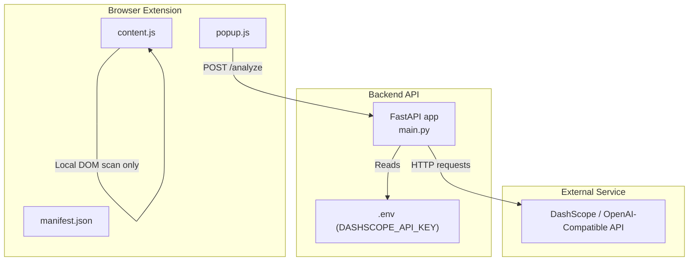
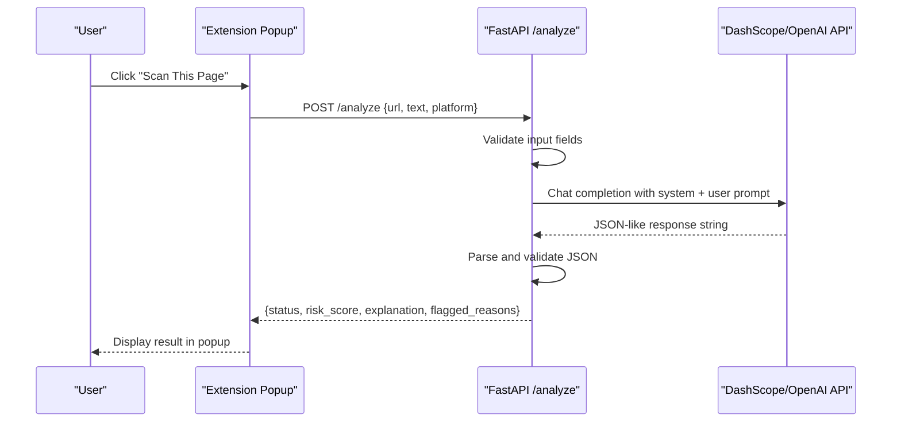
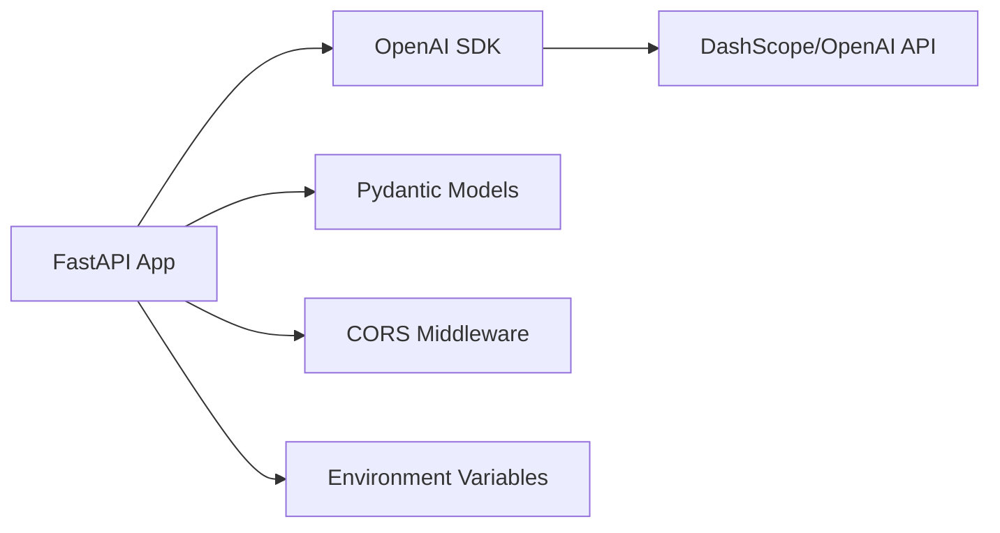

# Security Considerations

<cite>
**Referenced Files in This Document**
- [backend/main.py](file://backend/main.py)
- [extension/manifest.json](file://extension/manifest.json)
- [extension/content.js](file://extension/content.js)
- [extension/popup.js](file://extension/popup.js)
- [README.md](file://README.md)
</cite>

## Table of Contents
1. [Introduction](#introduction)
2. [Project Structure](#project-structure)
3. [Core Components](#core-components)
4. [Architecture Overview](#architecture-overview)
5. [Detailed Component Analysis](#detailed-component-analysis)
6. [Dependency Analysis](#dependency-analysis)
7. [Performance Considerations](#performance-considerations)
8. [Troubleshooting Guide](#troubleshooting-guide)
9. [Conclusion](#conclusion)

## Introduction
This document provides comprehensive security guidance for the ScrollGuard AI application, focusing on protecting sensitive data and maintaining secure operations across the backend API and browser extension. It covers API key management, CORS configuration, extension permissions, input validation and sanitization, security monitoring, error handling, and deployment security best practices. The goal is to help developers harden the system against common threats such as credential leakage, cross-origin abuse, injection attacks, and unauthorized access.

## Project Structure
The project consists of:
- Backend API server built with FastAPI that integrates an external AI model via an OpenAI-compatible endpoint.
- A browser extension (Manifest V3) with a content script for local scanning and a popup UI that calls the backend.
- Documentation and evaluation scripts.

**Diagram sources**
- [backend/main.py:1-92](file://backend/main.py#L1-L92)
- [extension/manifest.json:1-20](file://extension/manifest.json#L1-L20)
- [extension/content.js:1-276](file://extension/content.js#L1-L276)
- [extension/popup.js:1-46](file://extension/popup.js#L1-L46)

**Section sources**
- [backend/main.py:1-92](file://backend/main.py#L1-L92)
- [extension/manifest.json:1-20](file://extension/manifest.json#L1-L20)
- [extension/content.js:1-276](file://extension/content.js#L1-L276)
- [extension/popup.js:1-46](file://extension/popup.js#L1-L46)
- [README.md:63-141](file://README.md#L63-L141)

## Core Components
- Backend API (FastAPI): Exposes endpoints for analysis, loads secrets from environment variables, configures CORS, validates inputs via Pydantic, and communicates with an external AI service.
- Browser Extension:
  - Content script performs local scanning using predefined indicators and injects a warning banner into the page DOM.
  - Popup UI sends user-provided URL and text to the backend for AI-based analysis.
- Environment Configuration: API keys are loaded from environment variables; documentation instructs not to commit secrets.

Key security responsibilities:
- Protect API keys and never expose them in client code or logs.
- Restrict CORS to trusted origins.
- Validate and sanitize all inputs before processing or rendering.
- Limit extension permissions to the minimum required.
- Implement robust error handling that does not leak internal details.

**Section sources**
- [backend/main.py:1-92](file://backend/main.py#L1-L92)
- [extension/manifest.json:1-20](file://extension/manifest.json#L1-L20)
- [extension/content.js:1-276](file://extension/content.js#L1-L276)
- [extension/popup.js:1-46](file://extension/popup.js#L1-L46)
- [README.md:109-122](file://README.md#L109-L122)

## Architecture Overview
The extension’s popup triggers analysis by calling the backend’s analyze endpoint. The backend validates the request, constructs a prompt, calls the external AI service, parses the structured response, and returns it to the extension. The content script runs locally within the page context to detect suspicious patterns and display a warning banner without contacting the backend.

**Diagram sources**
- [extension/popup.js:16-45](file://extension/popup.js#L16-L45)
- [backend/main.py:64-92](file://backend/main.py#L64-L92)

**Section sources**
- [extension/popup.js:1-46](file://extension/popup.js#L1-L46)
- [backend/main.py:31-92](file://backend/main.py#L31-L92)

## Detailed Component Analysis

### API Key Management
- Secret storage: The backend reads the API key from an environment variable at startup and raises an error if missing. This ensures keys are not hardcoded.
- Environment file: The README instructs creating a .env file and explicitly warns not to include quotes around the key and to add .env to .gitignore.
- Rotation procedure: When rotating DASHSCOPE_API_KEY:
  - Generate a new key in the provider console.
  - Update the environment variable in your runtime environment (.env in development, secret manager in production).
  - Restart the backend service to load the new key.
  - Revoke the old key after confirming the new one works.
  - Audit logs and access records for any anomalies during rotation.

Security notes:
- Never log or print the API key.
- Use secret managers in production (e.g., cloud secret stores) instead of plain files.
- Restrict file permissions for .env in development.

**Section sources**
- [backend/main.py:1-18](file://backend/main.py#L1-L18)
- [README.md:109-122](file://README.md#L109-L122)

### CORS Configuration Best Practices
Current state:
- The backend enables CORS with permissive settings allowing all origins, methods, and headers. This is convenient for development but risky in production.

Recommended changes:
- Restrict allow_origins to known extension origins and domains. For a local development extension, use the specific chrome-extension:// origin(s) you test with. In production, restrict to your hosted frontend domain(s).
- Disable allow_credentials unless necessary; if enabled, ensure allow_origins is explicit and not wildcard.
- Whitelist only required methods and headers to reduce attack surface.
- Consider adding rate limiting and IP allowlisting for the API endpoint.

Operational guidance:
- Maintain a small, auditable list of allowed origins.
- Log and alert on rejected CORS attempts for reconnaissance detection.
- Test CORS behavior across browsers and extension contexts.

**Section sources**
- [backend/main.py:22-29](file://backend/main.py#L22-L29)

### Extension Permission Security
Current permissions:
- activeTab and scripting are used. These are relatively minimal and appropriate for reading the current tab’s URL and injecting content scripts.

Recommendations:
- Keep permissions minimal. Avoid host_permissions or broad permissions unless strictly necessary.
- Ensure content_scripts match only needed URLs or keep <all_urls> only if unavoidable; consider restricting matches to specific TLDs or patterns where feasible.
- Isolate content script logic from background scripts; avoid exposing sensitive APIs to the page context.
- Do not send secrets or tokens from the extension to third-party services.

Safe DOM manipulation practices:
- Prefer setting textContent over innerHTML to prevent XSS when inserting user-driven strings.
- If HTML must be injected, sanitize it with a vetted library and escape dynamic content.
- Use unique IDs and guards to prevent duplicate injections and ensure cleanup on removal.

**Section sources**
- [extension/manifest.json:6-18](file://extension/manifest.json#L6-L18)
- [extension/content.js:106-253](file://extension/content.js#L106-L253)

### Input Validation and Sanitization
Backend validation:
- Pydantic models enforce structure for incoming requests.
- The analyze endpoint requires either url or text; otherwise, it returns a 400 error.

Recommendations:
- Enforce strict schemas: limit field lengths, validate URL format, and constrain text length to prevent abuse.
- Sanitize inputs before constructing prompts to mitigate injection risks.
- Reject malformed or excessively long payloads early to reduce resource consumption.
- Return generic error messages to users while logging detailed diagnostics securely.

Frontend considerations:
- The popup sends the current tab URL and title; ensure these values are validated on the backend before use.
- Avoid displaying raw backend errors to users; show friendly messages and log details server-side.

**Section sources**
- [backend/main.py:31-67](file://backend/main.py#L31-L67)
- [extension/popup.js:20-29](file://extension/popup.js#L20-L29)

### Security Monitoring and Error Handling
Monitoring:
- Add structured logging for API requests, including timestamps, source IPs, endpoints, and outcomes. Exclude sensitive data from logs.
- Implement rate limiting on /analyze to prevent abuse and protect downstream AI service quotas.
- Track failed parsing and external API errors to detect anomalies.

Error handling:
- The backend catches JSON parse errors and other exceptions, returning HTTP 500 with generic detail messages. Ensure no stack traces or internal details are exposed.
- In production, centralize error handling to mask internals and provide safe responses.

Alerting:
- Alert on spikes in 4xx/5xx responses, repeated failures, or unusual traffic patterns.
- Monitor external API usage and costs to detect potential abuse.

**Section sources**
- [backend/main.py:64-92](file://backend/main.py#L64-L92)

### Deployment Security Considerations
HTTPS enforcement:
- Always serve the backend over HTTPS in production. Use a reverse proxy (e.g., Nginx, Cloudflare) to terminate TLS and enforce HSTS.
- Redirect HTTP to HTTPS and disable insecure protocols.

Secure headers:
- Configure headers such as Strict-Transport-Security, X-Content-Type-Options, X-Frame-Options, Content-Security-Policy, and Referrer-Policy to harden the API surface.

Secrets management:
- Store secrets in a secure vault or managed secret store rather than plain files.
- Rotate credentials regularly and audit access.

Dependency audits:
- Regularly scan dependencies for vulnerabilities and update libraries promptly.
- Pin versions and use lockfiles to ensure reproducible builds.

Access control:
- Restrict API access to known clients (e.g., via origin checks, API keys, or mutual TLS) in production.
- Apply network-level controls (firewalls, WAF) to block malicious traffic.

**Section sources**
- [README.md:127-141](file://README.md#L127-L141)

## Dependency Analysis
The main runtime dependencies and their roles:
- FastAPI: Web framework for building the API.
- Uvicorn: ASGI server for running FastAPI.
- OpenAI SDK: Client for communicating with DashScope’s OpenAI-compatible endpoint.
- Python-Dotenv: Loads environment variables from .env files.
- Pydantic: Data validation and serialization.

Potential risks:
- External dependency vulnerabilities can introduce supply chain risks.
- Misconfiguration of CORS or secrets can lead to data exposure.

Mitigations:
- Use dependency scanning tools and automate updates.
- Pin versions and review changelogs for breaking changes.
- Minimize external integrations to essential services only.

**Diagram sources**
- [backend/main.py:1-18](file://backend/main.py#L1-L18)
- [backend/main.py:22-29](file://backend/main.py#L22-L29)
- [backend/main.py:31-92](file://backend/main.py#L31-L92)

**Section sources**
- [backend/main.py:1-92](file://backend/main.py#L1-L92)
- [README.md:49-55](file://README.md#L49-L55)

## Performance Considerations
- Rate limiting: Protect both the backend and the external AI service by throttling requests per client or IP.
- Payload size limits: Enforce maximum sizes for URL and text fields to prevent resource exhaustion.
- Response caching: Cache repeated analyses for identical inputs to reduce latency and cost.
- Efficient DOM operations: The content script truncates page text and uses efficient selectors to minimize overhead.

[No sources needed since this section provides general guidance]

## Troubleshooting Guide
Common issues and resolutions:
- Missing API key: The backend will raise an error if the environment variable is not set. Ensure the key is present in the runtime environment and restart the service.
- CORS errors: If the extension cannot call the backend due to CORS, verify that the origin is allowed and credentials are configured correctly.
- Parsing errors: If the AI response is not valid JSON, the backend returns a 500 error. Check logs for malformed outputs and adjust prompts or post-processing.
- Extension connectivity: The popup targets localhost; ensure the backend is running and accessible from the browser.

Operational tips:
- Enable verbose logging in development to diagnose issues quickly.
- In production, capture structured logs and metrics without exposing sensitive information.
- Use health check endpoints to monitor service availability.

**Section sources**
- [backend/main.py:11-13](file://backend/main.py#L11-L13)
- [backend/main.py:64-92](file://backend/main.py#L64-L92)
- [extension/popup.js:20-45](file://extension/popup.js#L20-L45)

## Conclusion
To secure ScrollGuard AI:
- Store and rotate API keys securely using environment variables and secret management.
- Tighten CORS to trusted origins and apply least-privilege principles.
- Keep extension permissions minimal and practice safe DOM manipulation to prevent XSS.
- Validate and sanitize all inputs rigorously and return safe error messages.
- Implement monitoring, rate limiting, and robust error handling to detect and mitigate abuse.
- Deploy with HTTPS, secure headers, and regular dependency audits to maintain a strong security posture.

[No sources needed since this section summarizes without analyzing specific files]