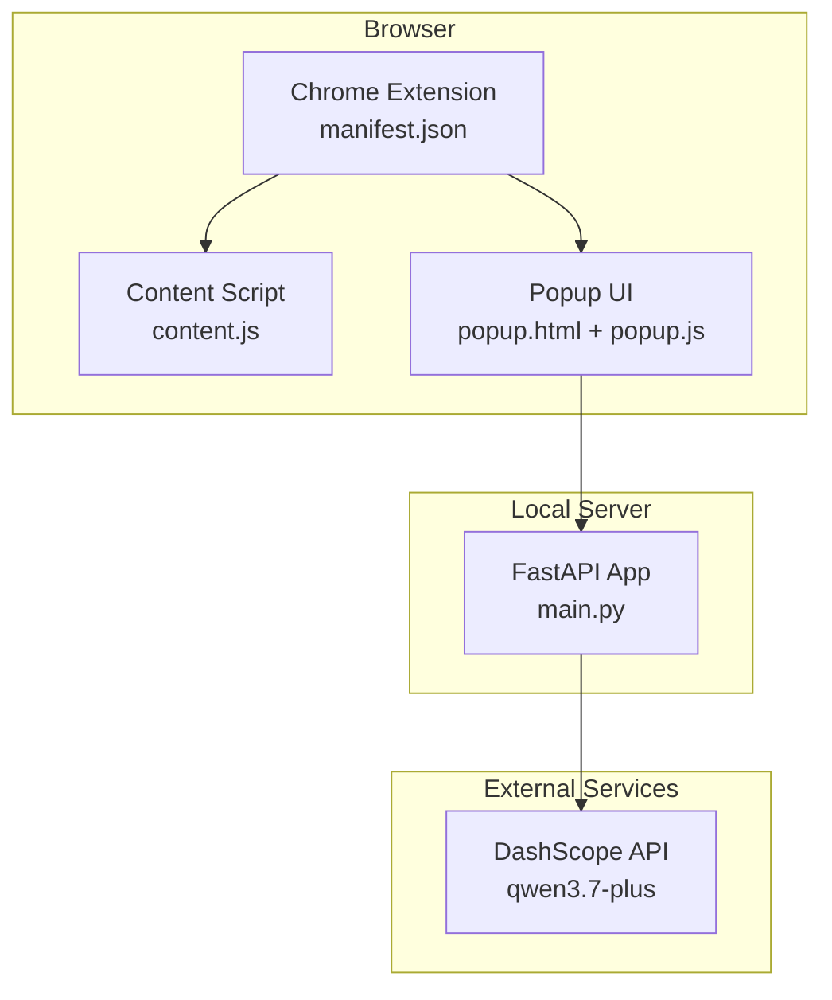
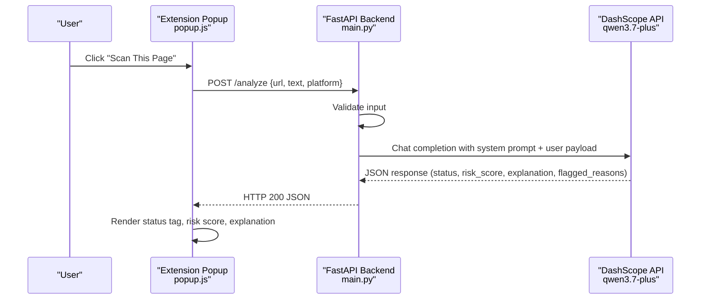
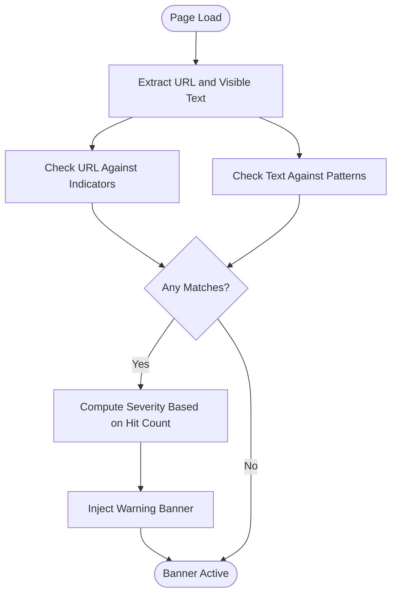
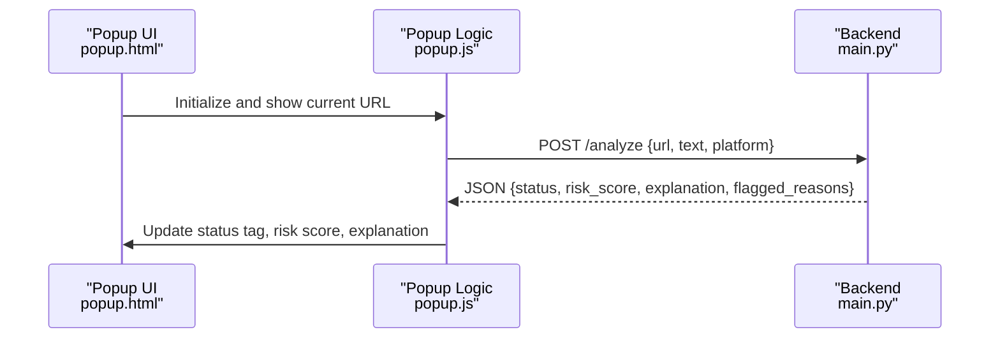
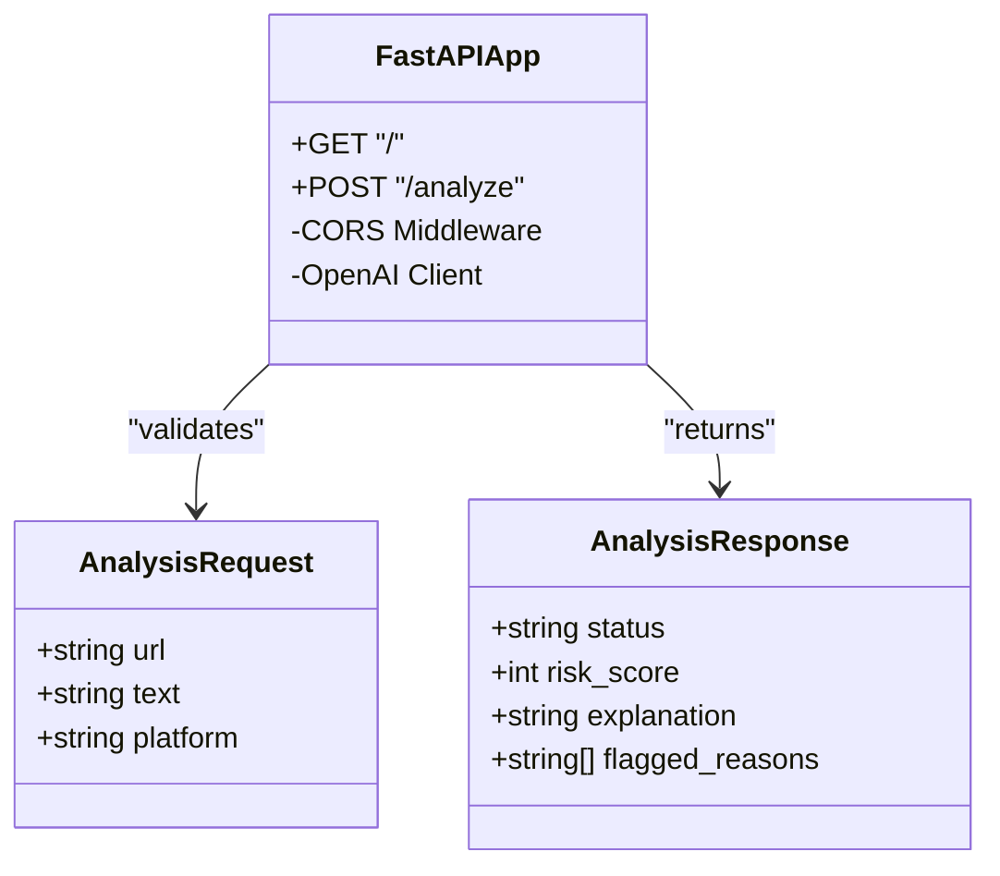
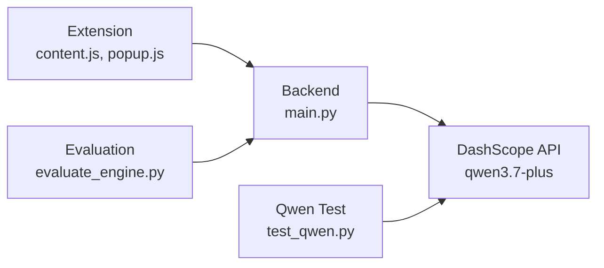

# System Architecture

<cite>
**Referenced Files in This Document**
- [README.md](file://README.md)
- [main.py](file://backend/main.py)
- [evaluate_engine.py](file://backend/evaluate_engine.py)
- [test_qwen.py](file://backend/test_qwen.py)
- [manifest.json](file://extension/manifest.json)
- [content.js](file://extension/content.js)
- [popup.html](file://extension/popup.html)
- [popup.js](file://extension/popup.js)
</cite>

## Table of Contents
1. [Introduction](#introduction)
2. [Project Structure](#project-structure)
3. [Core Components](#core-components)
4. [Architecture Overview](#architecture-overview)
5. [Detailed Component Analysis](#detailed-component-analysis)
6. [Dependency Analysis](#dependency-analysis)
7. [Performance Considerations](#performance-considerations)
8. [Security Considerations](#security-considerations)
9. [Troubleshooting Guide](#troubleshooting-guide)
10. [Conclusion](#conclusion)

## Introduction
ScrollGuard AI is a full-stack browser security application that protects users from phishing, scam links, and deceptive content in real time. It combines a lightweight Chrome Extension (Manifest V3) with a Python FastAPI backend that leverages Alibaba Cloud’s DashScope API (Qwen model) to analyze URLs and page content for threats. The system provides both automatic scanning via a content script and manual scanning through the extension popup.

Key capabilities:
- Real-time URL and visible text inspection within the active tab
- Structured risk scoring with clear threat levels: Safe, Suspicious, Dangerous
- Lightweight UI feedback via an injected banner and a popup report
- Automated evaluation benchmarking against a dataset

**Section sources**
- [README.md:19-55](file://README.md#L19-L55)

## Project Structure
The repository is organized into two primary layers:
- Backend: FastAPI server exposing an analysis endpoint and integrating with the DashScope OpenAI-compatible API
- Extension: Manifest V3 Chrome/Edge extension with a content script for automatic detection and a popup for manual scanning

**Diagram sources**
- [manifest.json:1-20](file://extension/manifest.json#L1-L20)
- [content.js:1-276](file://extension/content.js#L1-L276)
- [popup.html:1-108](file://extension/popup.html#L1-L108)
- [popup.js:1-46](file://extension/popup.js#L1-L46)
- [main.py:1-92](file://backend/main.py#L1-L92)

**Section sources**
- [README.md:45-55](file://README.md#L45-L55)
- [manifest.json:1-20](file://extension/manifest.json#L1-L20)

## Core Components
- Content Script (Automatic Scanning): Inspects the current page URL and visible text using predefined indicators and regex patterns; injects a warning banner when risks are detected.
- Popup Interface (Manual Scanning): Retrieves the active tab URL and title, sends them to the backend /analyze endpoint, and renders structured results (status, risk score, explanation).
- FastAPI Backend: Validates input, constructs a prompt for the Qwen model via DashScope, parses JSON responses, and returns standardized risk reports. CORS middleware enables cross-origin requests from the extension.
- Evaluation Tools: Scripts to test the Qwen integration and evaluate detection accuracy against a dataset.

**Section sources**
- [content.js:15-89](file://extension/content.js#L15-L89)
- [content.js:101-276](file://extension/content.js#L101-L276)
- [popup.html:90-108](file://extension/popup.html#L90-L108)
- [popup.js:1-46](file://extension/popup.js#L1-L46)
- [main.py:20-92](file://backend/main.py#L20-L92)
- [evaluate_engine.py:1-49](file://backend/evaluate_engine.py#L1-L49)
- [test_qwen.py:1-34](file://backend/test_qwen.py#L1-L34)

## Architecture Overview
ScrollGuard AI follows a client-server architecture:
- Client: Chrome Extension with a content script and popup interface
- Server: FastAPI backend providing a single REST endpoint for analysis
- External AI Service: DashScope OpenAI-compatible API for LLM-based analysis

**Diagram sources**
- [popup.js:16-45](file://extension/popup.js#L16-L45)
- [main.py:64-92](file://backend/main.py#L64-L92)

## Detailed Component Analysis

### Content Script: Automatic Detection and Banner Injection
- Scans the current URL and visible page text using curated indicator lists and regex patterns
- Determines severity based on hit counts and injects a persistent banner at the top of the page
- Uses DOM manipulation and MutationObserver to manage banner lifecycle and layout adjustments

**Diagram sources**
- [content.js:61-99](file://extension/content.js#L61-L99)
- [content.js:106-253](file://extension/content.js#L106-L253)
- [content.js:257-276](file://extension/content.js#L257-L276)

**Section sources**
- [content.js:15-89](file://extension/content.js#L15-L89)
- [content.js:101-276](file://extension/content.js#L101-L276)

### Popup Interface: Manual Scanning Workflow
- Reads the active tab URL and title
- Sends a POST request to the backend /analyze endpoint
- Displays structured results including status, risk score, and explanation

**Diagram sources**
- [popup.html:90-108](file://extension/popup.html#L90-L108)
- [popup.js:1-46](file://extension/popup.js#L1-L46)
- [main.py:64-92](file://backend/main.py#L64-L92)

**Section sources**
- [popup.html:90-108](file://extension/popup.html#L90-L108)
- [popup.js:1-46](file://extension/popup.js#L1-L46)

### FastAPI Backend: Input Validation, AI Integration, and Response Handling
- Loads environment variables for API key management
- Configures CORS middleware to allow cross-origin requests from the extension
- Defines Pydantic models for request/response schemas
- Calls DashScope API with a system prompt and user payload, then parses and validates JSON output
- Returns standardized risk reports or raises appropriate HTTP errors

**Diagram sources**
- [main.py:31-41](file://backend/main.py#L31-L41)
- [main.py:64-92](file://backend/main.py#L64-L92)

**Section sources**
- [main.py:1-92](file://backend/main.py#L1-L92)

### Infrastructure and Technology Stack
- Backend: Python 3.12, FastAPI, Uvicorn, Pydantic, python-dotenv, openai SDK
- Frontend: Chrome/Edge Extension (Manifest V3), JavaScript, HTML5, CSS3
- AI Engine: Alibaba Cloud Model Studio (DashScope OpenAI-Compatible API) using qwen3.7-plus
- DevOps: Git, GitHub

**Section sources**
- [README.md:45-55](file://README.md#L45-L55)
- [README.md:67-141](file://README.md#L67-L141)

## Dependency Analysis
The system has clear separation between client and server components with minimal coupling:
- Extension depends on the backend only via HTTP requests to /analyze
- Backend depends on external DashScope API for AI analysis
- Evaluation scripts depend on the running backend and dataset file

**Diagram sources**
- [content.js:1-276](file://extension/content.js#L1-L276)
- [popup.js:1-46](file://extension/popup.js#L1-L46)
- [main.py:1-92](file://backend/main.py#L1-L92)
- [evaluate_engine.py:1-49](file://backend/evaluate_engine.py#L1-L49)
- [test_qwen.py:1-34](file://backend/test_qwen.py#L1-L34)

**Section sources**
- [evaluate_engine.py:1-49](file://backend/evaluate_engine.py#L1-L49)
- [test_qwen.py:1-34](file://backend/test_qwen.py#L1-L34)

## Performance Considerations
- Content script runs at document_idle to avoid blocking initial page rendering
- Local pattern matching reduces unnecessary network calls by providing immediate visual feedback
- Backend uses asynchronous FastAPI endpoints for efficient request handling
- AI API calls are the most expensive operation; consider caching strategies for repeated URLs if needed

[No sources needed since this section provides general guidance]

## Security Considerations
- API Key Management: The DashScope API key is loaded from environment variables via python-dotenv; ensure .env is excluded from version control
- Permission Scoping: Extension uses minimal permissions (activeTab, scripting) to access only necessary context
- Input Validation: Backend validates that at least one of URL or text is provided; malformed AI responses raise HTTP 500 errors
- CORS Configuration: Currently allows all origins; restrict to trusted extension origins in production environments

**Section sources**
- [main.py:11-18](file://backend/main.py#L11-L18)
- [main.py:22-29](file://backend/main.py#L22-L29)
- [main.py:64-68](file://backend/main.py#L64-L68)
- [main.py:89-92](file://backend/main.py#L89-L92)
- [manifest.json:6-9](file://extension/manifest.json#L6-L9)

## Troubleshooting Guide
- Backend not responding: Ensure Uvicorn is running on port 8000 and the .env file contains a valid DASHSCOPE_API_KEY
- CORS errors: Verify that the extension can reach http://127.0.0.1:8000 and that CORS middleware is enabled
- AI parsing errors: If the model returns non-JSON content, the backend will raise a 500 error; check system prompt and model behavior
- Extension connectivity: The popup displays an alert if the backend connection fails; verify network settings and firewall rules

**Section sources**
- [popup.js:39-44](file://extension/popup.js#L39-L44)
- [main.py:11-13](file://backend/main.py#L11-L13)
- [main.py:89-92](file://backend/main.py#L89-L92)

## Conclusion
ScrollGuard AI demonstrates a clean separation of concerns between a lightweight browser extension and a robust backend service. The content script provides immediate local feedback while the popup interface leverages AI-powered analysis for comprehensive threat assessment. The system’s modular design, combined with careful security practices and performance considerations, makes it suitable for real-world deployment with further hardening of CORS policies and additional caching mechanisms.

[No sources needed since this section summarizes without analyzing specific files]