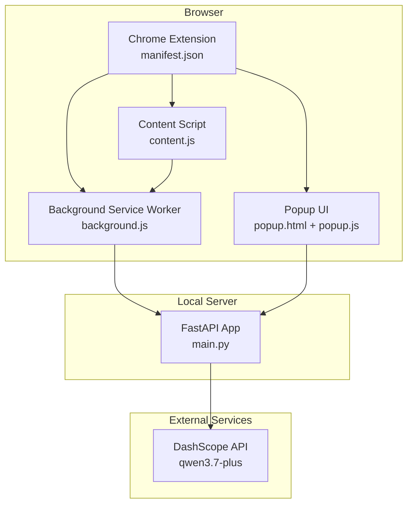
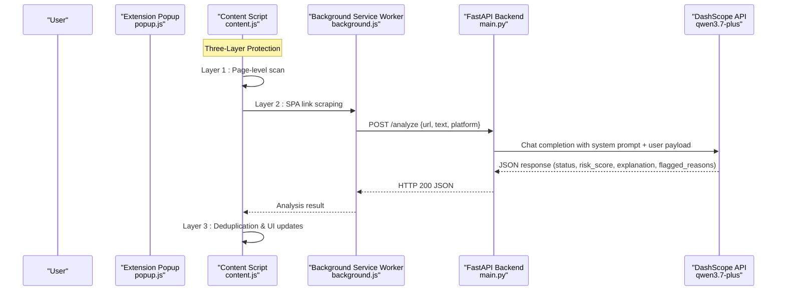
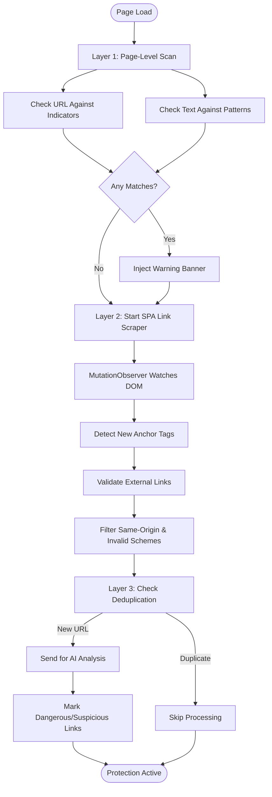
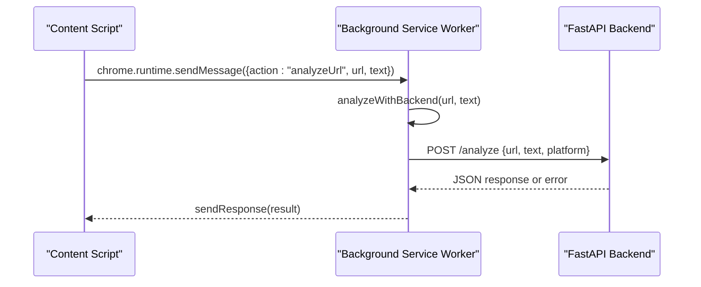
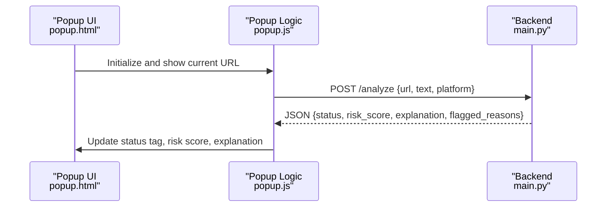
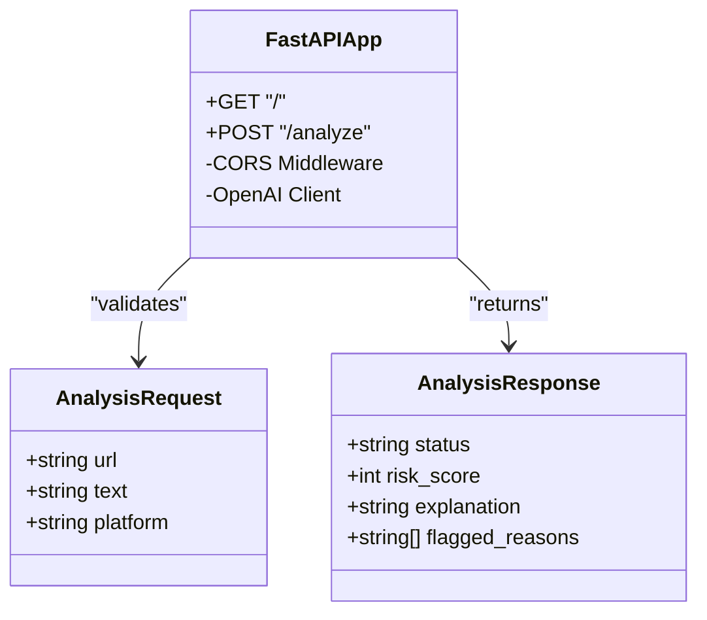
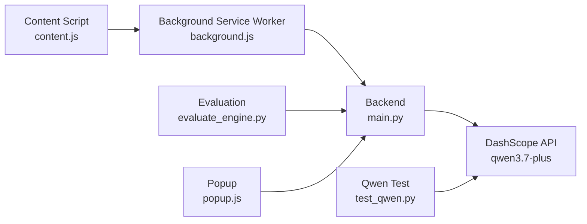

# System Architecture

<cite>
**Referenced Files in This Document**
- [README.md](file://README.md)
- [main.py](file://backend/main.py)
- [evaluate_engine.py](file://backend/evaluate_engine.py)
- [test_qwen.py](file://backend/test_qwen.py)
- [manifest.json](file://extension/manifest.json)
- [content.js](file://extension/content.js)
- [background.js](file://extension/background.js)
- [popup.html](file://extension/popup.html)
- [popup.js](file://extension/popup.js)
</cite>

## Update Summary
**Changes Made**
- Updated architecture from two-layer to three-layer real-time protection system
- Added comprehensive SPA link scraping capability using MutationObserver
- Enhanced background service worker for secure API communication
- Improved content script with advanced dynamic content monitoring
- Updated component interactions to reflect new service worker proxy pattern

## Table of Contents
1. [Introduction](#introduction)
2. [Project Structure](#project-structure)
3. [Core Components](#core-components)
4. [Architecture Overview](#architecture-overview)
5. [Detailed Component Analysis](#detailed-component-analysis)
6. [Dependency Analysis](#dependency-analysis)
7. [Performance Considerations](#performance-considerations)
8. [Security Considerations](#security-considerations)
9. [Troubleshooting Guide](#troubleshooting-guide)
10. [Conclusion](#conclusion)

## Introduction
ScrollGuard AI is a full-stack browser security application that protects users from phishing, scam links, and deceptive content through a sophisticated three-layer real-time protection system. It combines a lightweight Chrome Extension (Manifest V3) with a Python FastAPI backend that leverages Alibaba Cloud's DashScope API (Qwen model) to analyze URLs and page content for threats. The system provides automatic scanning via content scripts with dynamic SPA monitoring and manual scanning through the extension popup.

Key capabilities:
- **Layer 1 - Page-Level Scan**: Real-time URL and visible text inspection within the active tab using local heuristics
- **Layer 2 - SPA Link Scraper**: Dynamic monitoring of newly inserted links in single-page applications using MutationObserver
- **Layer 3 - Deduplication**: Intelligent URL tracking to prevent API spamming and optimize performance
- Structured risk scoring with clear threat levels: Safe, Suspicious, Dangerous
- Lightweight UI feedback via injected banners and inline link marking
- Automated evaluation benchmarking against a dataset

**Section sources**
- [README.md:19-55](file://README.md#L19-L55)

## Project Structure
The repository is organized into a three-layer architecture:
- **Backend**: FastAPI server exposing an analysis endpoint and integrating with the DashScope OpenAI-compatible API
- **Extension Layer**: Manifest V3 Chrome/Edge extension with content scripts for automatic detection, background service worker for secure API communication, and popup for manual scanning
- **Service Worker Layer**: Background service worker acting as a proxy between content scripts and backend, avoiding CORS restrictions

**Diagram sources**
- [manifest.json:1-27](file://extension/manifest.json#L1-L27)
- [content.js:1-635](file://extension/content.js#L1-L635)
- [background.js:1-49](file://extension/background.js#L1-L49)
- [popup.html:1-108](file://extension/popup.html#L1-L108)
- [popup.js:1-46](file://extension/popup.js#L1-L46)
- [main.py:1-92](file://backend/main.py#L1-L92)

**Section sources**
- [README.md:45-55](file://README.md#L45-L55)
- [manifest.json:1-27](file://extension/manifest.json#L1-L27)

## Core Components
- **Content Script (Three-Layer Protection)**: Implements page-level scanning, SPA link scraping with MutationObserver, and intelligent deduplication; injects warning banners and marks dangerous links inline
- **Background Service Worker**: Secure proxy between content scripts and backend, handling CORS and mixed content issues while maintaining extension privileges
- **Popup Interface (Manual Scanning)**: Retrieves the active tab URL and title, sends them to the backend /analyze endpoint, and renders structured results
- **FastAPI Backend**: Validates input, constructs prompts for the Qwen model via DashScope, parses JSON responses, and returns standardized risk reports with CORS middleware for cross-origin requests
- **Evaluation Tools**: Scripts to test the Qwen integration and evaluate detection accuracy against a dataset

**Section sources**
- [content.js:1-635](file://extension/content.js#L1-L635)
- [background.js:1-49](file://extension/background.js#L1-L49)
- [popup.html:90-108](file://extension/popup.html#L90-L108)
- [popup.js:1-46](file://extension/popup.js#L1-L46)
- [main.py:20-92](file://backend/main.py#L20-L92)
- [evaluate_engine.py:1-49](file://backend/evaluate_engine.py#L1-L49)
- [test_qwen.py:1-34](file://backend/test_qwen.py#L1-L34)

## Architecture Overview
ScrollGuard AI follows a three-layer client-server architecture with enhanced real-time protection:
- **Client Layer**: Chrome Extension with content scripts, background service worker, and popup interface
- **Service Worker Layer**: Background service worker providing secure API communication proxy
- **Server Layer**: FastAPI backend providing REST endpoints for analysis
- **External AI Service**: DashScope OpenAI-compatible API for LLM-based analysis

**Diagram sources**
- [popup.js:16-45](file://extension/popup.js#L16-L45)
- [content.js:590-616](file://extension/content.js#L590-L616)
- [background.js:16-36](file://extension/background.js#L16-L36)
- [main.py:64-92](file://backend/main.py#L64-L92)

## Detailed Component Analysis

### Content Script: Three-Layer Real-Time Protection System

**Updated** Enhanced from basic content detection to a comprehensive three-layer protection system with SPA monitoring capabilities.

#### Layer 1: Page-Level Scan
- Scans current URL and visible page text using curated indicator lists and regex patterns
- Determines severity based on hit counts and injects persistent banner at page top
- Uses DOM manipulation and MutationObserver for banner lifecycle management

#### Layer 2: SPA Link Scraper
- Implements MutationObserver to watch document.body for dynamically inserted anchor tags
- Monitors infinite-scroll feeds on social media platforms (Twitter/X, Facebook, LinkedIn)
- Filters external links using sophisticated validation logic (rejects same-origin, non-HTTP schemes, navigation stubs)
- Applies visual markers (red borders, warning badges) to dangerous/suspicious links inline

#### Layer 3: Deduplication System
- Maintains WeakSet of processed anchor elements to prevent memory leaks
- Uses Set-based URL deduplication to avoid API spamming when same URLs appear multiple times
- Implements fire-and-forget processing for high-volume feed scenarios

**Diagram sources**
- [content.js:29-71](file://extension/content.js#L29-L71)
- [content.js:366-566](file://extension/content.js#L366-L566)
- [content.js:590-616](file://extension/content.js#L590-L616)

**Section sources**
- [content.js:1-635](file://extension/content.js#L1-L635)

### Background Service Worker: Secure API Proxy

**Updated** New component added to provide secure communication between content scripts and backend, avoiding CORS and mixed content restrictions.

- Acts as privileged proxy between content scripts and FastAPI backend
- Handles fetch requests in extension context to bypass CORS limitations
- Provides error handling and timeout management for API calls
- Listens for messages from content scripts and popup interfaces

**Diagram sources**
- [background.js:16-48](file://extension/background.js#L16-L48)

**Section sources**
- [background.js:1-49](file://extension/background.js#L1-L49)

### Popup Interface: Manual Scanning Workflow
- Reads the active tab URL and title
- Sends a POST request to the backend /analyze endpoint
- Displays structured results including status, risk score, and explanation

**Diagram sources**
- [popup.html:90-108](file://extension/popup.html#L90-L108)
- [popup.js:1-46](file://extension/popup.js#L1-L46)
- [main.py:64-92](file://backend/main.py#L64-L92)

**Section sources**
- [popup.html:90-108](file://extension/popup.html#L90-L108)
- [popup.js:1-46](file://extension/popup.js#L1-L46)

### FastAPI Backend: Input Validation, AI Integration, and Response Handling
- Loads environment variables for API key management
- Configures CORS middleware to allow cross-origin requests from the extension
- Defines Pydantic models for request/response schemas
- Calls DashScope API with a system prompt and user payload, then parses and validates JSON output
- Returns standardized risk reports or raises appropriate HTTP errors

**Diagram sources**
- [main.py:31-41](file://backend/main.py#L31-L41)
- [main.py:64-92](file://backend/main.py#L64-L92)

**Section sources**
- [main.py:1-92](file://backend/main.py#L1-L92)

### Infrastructure and Technology Stack
- **Backend**: Python 3.12, FastAPI, Uvicorn, Pydantic, python-dotenv, openai SDK
- **Frontend**: Chrome/Edge Extension (Manifest V3), JavaScript, HTML5, CSS3
- **Service Worker**: Chrome Extension Background Service Worker for secure API communication
- **AI Engine**: Alibaba Cloud Model Studio (DashScope OpenAI-Compatible API) using qwen3.7-plus
- **DevOps**: Git, GitHub

**Section sources**
- [README.md:45-55](file://README.md#L45-L55)
- [README.md:67-141](file://README.md#L67-L141)

## Dependency Analysis
The system has clear separation between client, service worker, and server components with minimal coupling:
- Content scripts depend on background service worker for API communication
- Background service worker depends on the backend only via HTTP requests to /analyze
- Backend depends on external DashScope API for AI analysis
- Evaluation scripts depend on the running backend and dataset file

**Diagram sources**
- [content.js:125-137](file://extension/content.js#L125-L137)
- [background.js:16-48](file://extension/background.js#L16-L48)
- [popup.js:20-45](file://extension/popup.js#L20-L45)
- [main.py:1-92](file://backend/main.py#L1-L92)
- [evaluate_engine.py:1-49](file://backend/evaluate_engine.py#L1-L49)
- [test_qwen.py:1-34](file://backend/test_qwen.py#L1-L34)

**Section sources**
- [evaluate_engine.py:1-49](file://backend/evaluate_engine.py#L1-L49)
- [test_qwen.py:1-34](file://backend/test_qwen.py#L1-L34)

## Performance Considerations
- Content script runs at document_idle to avoid blocking initial page rendering
- Local pattern matching reduces unnecessary network calls by providing immediate visual feedback
- Background service worker handles API communication asynchronously with timeout protection
- MutationObserver efficiently monitors DOM changes without polling overhead
- WeakSet usage prevents memory leaks in SPA link monitoring
- URL deduplication set prevents API spamming for repeated links
- Backend uses asynchronous FastAPI endpoints for efficient request handling
- AI API calls are the most expensive operation; consider caching strategies for repeated URLs if needed

## Security Considerations
- **API Key Management**: The DashScope API key is loaded from environment variables via python-dotenv; ensure .env is excluded from version control
- **Permission Scoping**: Extension uses minimal permissions (activeTab, scripting) to access only necessary context
- **Input Validation**: Backend validates that at least one of URL or text is provided; malformed AI responses raise HTTP 500 errors
- **CORS Configuration**: Currently allows all origins; restrict to trusted extension origins in production environments
- **Service Worker Security**: Background service worker acts as secure proxy, preventing direct backend access from content scripts
- **Link Validation**: Sophisticated filtering rejects same-origin links, non-HTTP schemes, and navigation stubs before analysis
- **Memory Management**: WeakSet usage prevents memory leaks in long-running SPA monitoring

**Section sources**
- [main.py:11-18](file://backend/main.py#L11-L18)
- [main.py:22-29](file://backend/main.py#L22-L29)
- [main.py:64-68](file://backend/main.py#L64-L68)
- [main.py:89-92](file://backend/main.py#L89-L92)
- [manifest.json:6-12](file://extension/manifest.json#L6-L12)
- [content.js:394-422](file://extension/content.js#L394-L422)

## Troubleshooting Guide
- **Backend not responding**: Ensure Uvicorn is running on port 8000 and the .env file contains a valid DASHSCOPE_API_KEY
- **CORS errors**: Verify that the extension can reach http://127.0.0.1:8000 and that CORS middleware is enabled
- **AI parsing errors**: If the model returns non-JSON content, the backend will raise a 500 error; check system prompt and model behavior
- **Extension connectivity**: The popup displays an alert if the backend connection fails; verify network settings and firewall rules
- **SPA monitoring issues**: Check if MutationObserver is properly initialized and watching document.body with correct options
- **Memory leaks**: Monitor WeakSet usage and ensure processed anchors are properly garbage collected
- **API rate limiting**: Implement additional caching if experiencing rate limits from DashScope API

**Section sources**
- [popup.js:39-44](file://extension/popup.js#L39-L44)
- [main.py:11-13](file://backend/main.py#L11-L13)
- [main.py:89-92](file://backend/main.py#L89-L92)
- [content.js:554-566](file://extension/content.js#L554-L566)

## Conclusion
ScrollGuard AI demonstrates a sophisticated three-layer real-time protection system that combines immediate local heuristic scanning with AI-powered analysis and dynamic SPA monitoring. The enhanced architecture provides comprehensive protection against phishing, scam links, and deceptive content through:

1. **Immediate local feedback** via page-level scanning and heuristic detection
2. **Real-time SPA monitoring** using MutationObserver for dynamic content in modern web applications
3. **Secure API communication** through a dedicated background service worker
4. **Intelligent deduplication** to optimize performance and prevent API abuse

The system's modular design, combined with careful security practices, memory management, and performance considerations, makes it suitable for real-world deployment with further hardening of CORS policies and additional caching mechanisms. The three-layer approach ensures robust protection across both traditional websites and modern single-page applications.