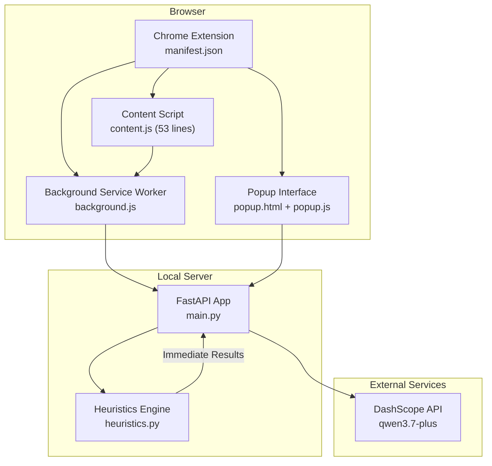
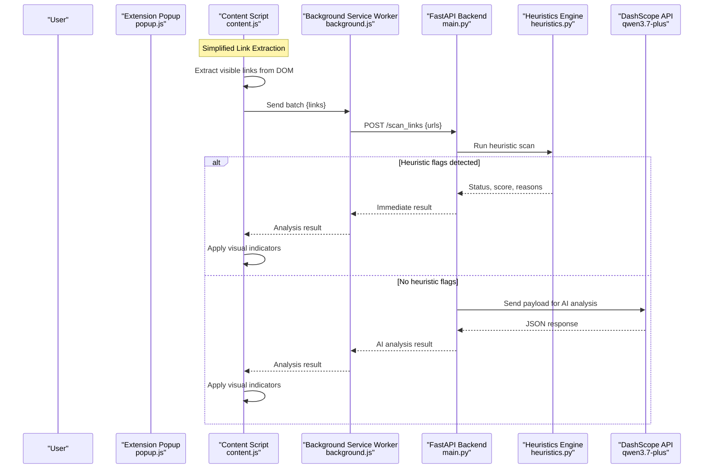
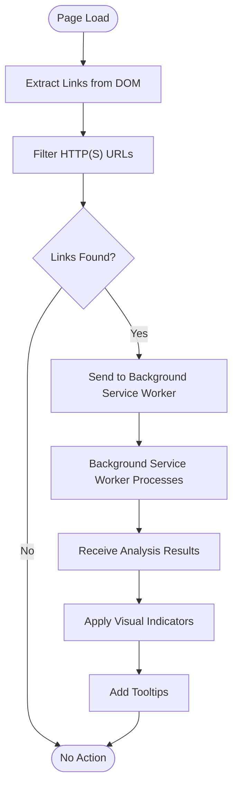
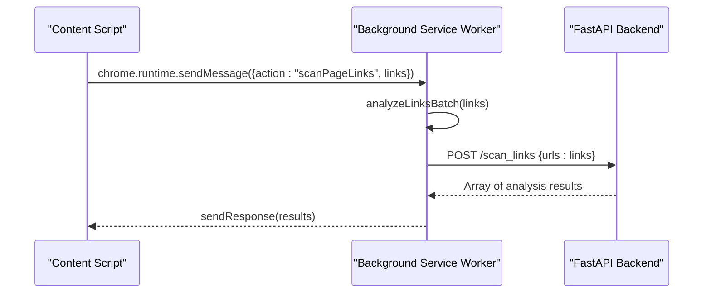
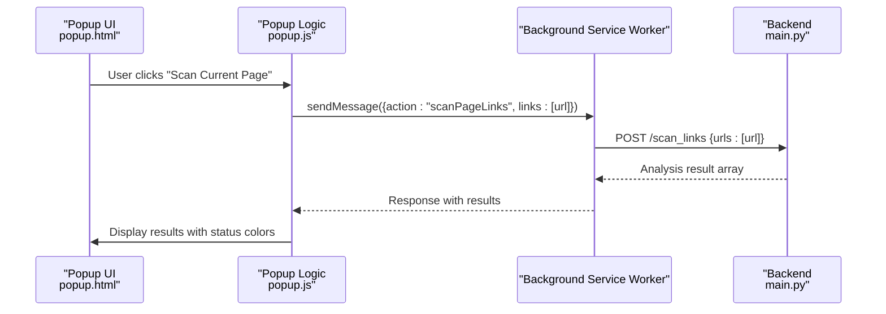
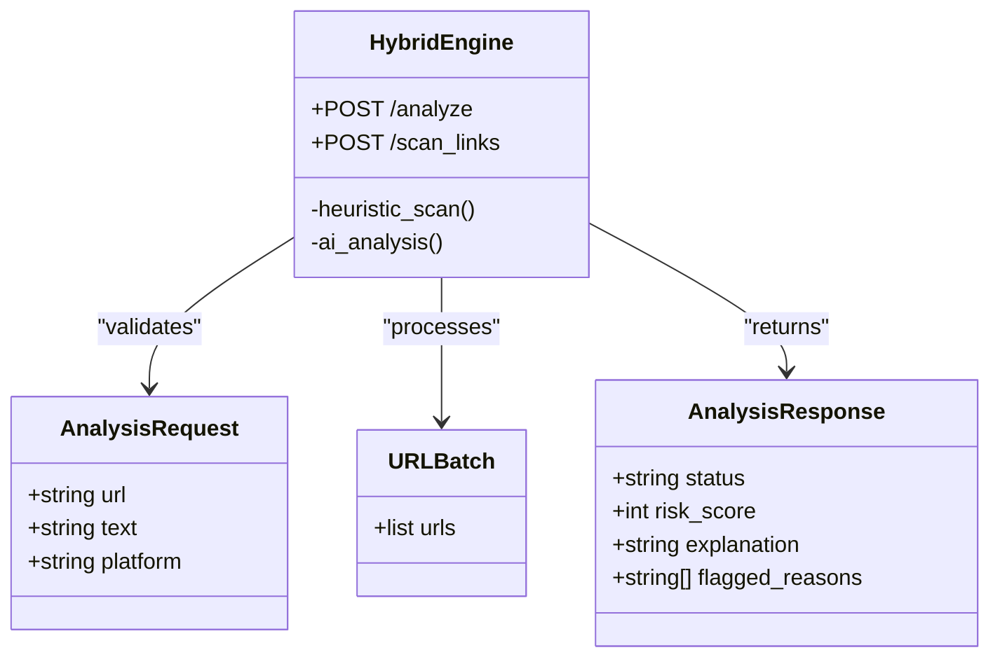
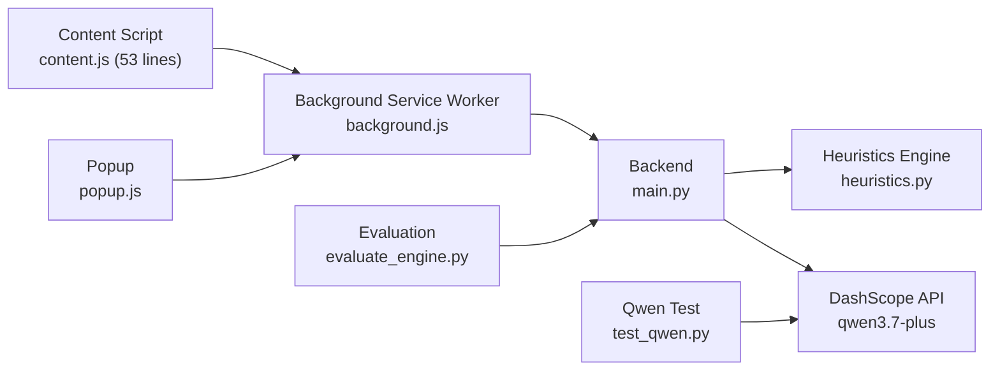

# System Architecture

<cite>
**Referenced Files in This Document**
- [README.md](file://README.md)
- [main.py](file://backend/main.py)
- [heuristics.py](file://backend/heuristics.py)
- [evaluate_engine.py](file://backend/evaluate_engine.py)
- [test_qwen.py](file://backend/test_qwen.py)
- [test_scan.py](file://backend/test_scan.py)
- [manifest.json](file://extension/manifest.json)
- [content.js](file://extension/content.js)
- [background.js](file://extension/background.js)
- [popup.html](file://extension/popup.html)
- [popup.js](file://extension/popup.js)
</cite>

## Update Summary
**Changes Made**
- Updated architecture from complex three-layer real-time protection system to simplified hybrid backend approach
- Reduced content script complexity from 622 lines to 53 lines by removing SPA monitoring and sophisticated deduplication
- Introduced new heuristics-based scanning layer for immediate URL risk assessment before AI analysis
- Simplified background service worker to handle batch link processing instead of complex message routing
- Streamlined popup interface for manual scanning workflows
- Enhanced backend with dual-layer security: heuristic scanning followed by AI analysis

## Table of Contents
1. [Introduction](#introduction)
2. [Project Structure](#project-structure)
3. [Core Components](#core-components)
4. [Architecture Overview](#architecture-overview)
5. [Detailed Component Analysis](#detailed-component-analysis)
6. [Dependency Analysis](#dependency-analysis)
7. [Performance Considerations](#performance-considerations)
8. [Security Considerations](#security-considerations)
9. [Troubleshooting Guide](#troubleshooting-guide)
10. [Conclusion](#conclusion)

## Introduction
ScrollGuard AI is a full-stack browser security application that protects users from phishing, scam links, and deceptive content through a streamlined hybrid approach combining lightweight client-side scanning with intelligent backend analysis. The system features a simplified Chrome Extension (Manifest V3) with a Python FastAPI backend that leverages Alibaba Cloud's DashScope API (Qwen model) for advanced threat detection. The architecture prioritizes performance and simplicity while maintaining comprehensive security coverage.

Key capabilities:
- **Hybrid Scanning Approach**: Immediate heuristic-based URL scanning followed by AI-powered analysis when needed
- **Lightweight Content Script**: Minimal JavaScript footprint (53 lines) focusing on link extraction and visual feedback
- **Efficient Background Processing**: Batch URL analysis through background service worker proxy
- **Dual-Layer Security**: Heuristic rules provide instant feedback, AI analysis offers deep contextual understanding
- **Structured Risk Assessment**: Clear threat categorization (Safe, Suspicious, Dangerous) with detailed explanations
- **Real-Time Visual Indicators**: Inline link marking with color-coded borders and tooltips

**Section sources**
- [README.md:19-37](file://README.md#L19-L37)

## Project Structure
The repository follows a simplified two-tier architecture optimized for performance:
- **Backend Layer**: FastAPI server with integrated heuristics engine and DashScope API integration
- **Extension Layer**: Lightweight Chrome/Edge extension with minimal content scripts and efficient background processing

**Diagram sources**
- [manifest.json:1-29](file://extension/manifest.json#L1-L29)
- [content.js:1-54](file://extension/content.js#L1-L54)
- [background.js:1-45](file://extension/background.js#L1-L45)
- [popup.html:1-47](file://extension/popup.html#L1-L47)
- [popup.js:1-37](file://extension/popup.js#L1-L37)
- [main.py:1-150](file://backend/main.py#L1-L150)
- [heuristics.py:1-49](file://backend/heuristics.py#L1-L49)

**Section sources**
- [README.md:45-55](file://README.md#L45-L55)
- [manifest.json:1-29](file://extension/manifest.json#L1-L29)

## Core Components
- **Simplified Content Script**: Extracts visible links from pages and sends them for analysis; provides inline visual feedback with color-coded borders and tooltips
- **Streamlined Background Service Worker**: Handles batch URL processing and acts as secure proxy between content scripts and backend
- **Enhanced Popup Interface**: Manual scanning capability for current page URLs with structured result display
- **Hybrid Backend Engine**: Combines fast heuristic scanning with AI-powered analysis; returns immediate results for suspicious patterns
- **Heuristics Engine**: Rule-based scanner detecting free TLDs, typosquatting patterns, shortened URLs, and scam keywords
- **Evaluation Tools**: Scripts for testing Qwen integration and benchmarking detection accuracy against datasets

**Section sources**
- [content.js:1-54](file://extension/content.js#L1-L54)
- [background.js:1-45](file://extension/background.js#L1-L45)
- [popup.html:39-47](file://extension/popup.html#L39-L47)
- [popup.js:1-37](file://extension/popup.js#L1-L37)
- [main.py:1-150](file://backend/main.py#L1-L150)
- [heuristics.py:1-49](file://backend/heuristics.py#L1-L49)
- [evaluate_engine.py:1-44](file://backend/evaluate_engine.py#L1-L44)
- [test_qwen.py:1-34](file://backend/test_qwen.py#L1-L34)

## Architecture Overview
ScrollGuard AI implements a streamlined hybrid architecture that balances performance with comprehensive security:
- **Client Layer**: Lightweight Chrome Extension with minimal content scripts and efficient background processing
- **Service Worker Layer**: Background service worker providing secure batch API communication
- **Server Layer**: Hybrid backend with integrated heuristics engine and AI analysis capabilities
- **External AI Service**: DashScope OpenAI-compatible API for advanced contextual analysis

**Diagram sources**
- [popup.js:7-36](file://extension/popup.js#L7-L36)
- [content.js:12-43](file://extension/content.js#L12-L43)
- [background.js:17-43](file://extension/background.js#L17-L43)
- [main.py:71-149](file://backend/main.py#L71-L149)
- [heuristics.py:4-49](file://backend/heuristics.py#L4-L49)

## Detailed Component Analysis

### Content Script: Simplified Link Extraction and Visual Feedback

**Updated** Drastically reduced from 622 lines to 53 lines, focusing solely on link extraction and visual feedback without complex SPA monitoring or deduplication systems.

#### Core Functionality
- **Link Extraction**: Uses simple DOM query to find all anchor tags and filter HTTP(S) URLs
- **Batch Processing**: Sends collected links to background service worker for analysis
- **Visual Feedback**: Applies inline styling with color-coded borders (red for dangerous, orange for suspicious)
- **Tooltip Integration**: Adds descriptive tooltips showing status and risk scores

**Diagram sources**
- [content.js:12-43](file://extension/content.js#L12-L43)

**Section sources**
- [content.js:1-54](file://extension/content.js#L1-L54)

### Background Service Worker: Streamlined Batch Processing

**Updated** Simplified to focus exclusively on batch URL processing and secure API communication, removing complex message routing logic.

#### Key Features
- **Batch Processing**: Accepts arrays of URLs for efficient bulk analysis
- **Secure Proxy**: Executes fetch requests in privileged extension context to avoid CORS issues
- **Error Handling**: Comprehensive error handling with user-friendly error messages
- **Message Routing**: Simple message listener for content script and popup communication

**Diagram sources**
- [background.js:17-43](file://extension/background.js#L17-L43)

**Section sources**
- [background.js:1-45](file://extension/background.js#L1-L45)

### Popup Interface: Manual Scanning Workflow
- Retrieves active tab URL and initiates manual scanning
- Sends single URL to background service worker for analysis
- Displays structured results with color-coded status indicators

**Diagram sources**
- [popup.html:39-47](file://extension/popup.html#L39-L47)
- [popup.js:7-36](file://extension/popup.js#L7-L36)
- [background.js:39-43](file://extension/background.js#L39-L43)
- [main.py:110-149](file://backend/main.py#L110-L149)

**Section sources**
- [popup.html:39-47](file://extension/popup.html#L39-L47)
- [popup.js:1-37](file://extension/popup.js#L1-L37)

### Hybrid Backend: Dual-Layer Security Engine

**Updated** Implemented hybrid approach combining fast heuristic scanning with AI-powered analysis for optimal performance and accuracy.

#### Heuristics Engine
- **Free TLD Detection**: Identifies domains ending in .tk, .ml, .ga, .cf, .gq commonly used in scams
- **Typosquatting Patterns**: Detects domain names with excessive zeros, ones, letter 'l', or hyphens
- **Shortened URL Detection**: Flags bit.ly, tinyurl, t.co domains as potentially suspicious
- **Scam Keywords**: Searches for urgency-inducing words like "claim", "win", "free", "urgent"
- **HTTPS Validation**: Checks for missing HTTPS security protocols

#### AI Analysis Pipeline
- **Conditional Processing**: Only sends URLs to AI when heuristic scan returns "Safe" status
- **Contextual Analysis**: Provides platform context and URL information to Qwen model
- **Structured Output**: Parses JSON responses with status, risk scores, and explanations
- **Error Handling**: Robust error handling for API failures and parsing issues

**Diagram sources**
- [main.py:33-46](file://backend/main.py#L33-L46)
- [main.py:71-149](file://backend/main.py#L71-L149)
- [heuristics.py:4-49](file://backend/heuristics.py#L4-L49)

**Section sources**
- [main.py:1-150](file://backend/main.py#L1-L150)
- [heuristics.py:1-49](file://backend/heuristics.py#L1-L49)

### Infrastructure and Technology Stack
- **Backend**: Python 3.12, FastAPI, Uvicorn, Pydantic, python-dotenv, openai SDK
- **Frontend**: Chrome/Edge Extension (Manifest V3), JavaScript, HTML5, CSS3
- **Service Worker**: Chrome Extension Background Service Worker for secure API communication
- **AI Engine**: Alibaba Cloud Model Studio (DashScope OpenAI-Compatible API) using qwen3.7-plus
- **DevOps**: Git, GitHub

**Section sources**
- [README.md:45-55](file://README.md#L45-L55)
- [README.md:67-141](file://README.md#L67-L141)

## Dependency Analysis
The system maintains clear separation between components with minimal coupling:
- Content scripts depend only on background service worker for API communication
- Background service worker depends on backend via HTTP requests to /scan_links endpoint
- Backend depends on external DashScope API and internal heuristics engine
- Evaluation tools depend on running backend and dataset files

**Diagram sources**
- [content.js:18-41](file://extension/content.js#L18-L41)
- [background.js:39-43](file://extension/background.js#L39-L43)
- [popup.js:16-34](file://extension/popup.js#L16-L34)
- [main.py:71-149](file://backend/main.py#L71-L149)
- [heuristics.py:4-49](file://backend/heuristics.py#L4-L49)
- [evaluate_engine.py:12-43](file://backend/evaluate_engine.py#L12-L43)
- [test_qwen.py:19-31](file://backend/test_qwen.py#L19-L31)

**Section sources**
- [evaluate_engine.py:1-44](file://backend/evaluate_engine.py#L1-L44)
- [test_qwen.py:1-34](file://backend/test_qwen.py#L1-L34)

## Performance Considerations
- **Minimal Content Script**: 53-line implementation reduces memory footprint and improves page load performance
- **Efficient Link Extraction**: Simple DOM queries with basic filtering minimize processing overhead
- **Throttled Scrolling**: Debounced scroll events prevent excessive API calls during rapid scrolling
- **Batch Processing**: Background service worker processes multiple URLs in single requests
- **Immediate Heuristic Results**: Fast rule-based scanning provides instant feedback without network latency
- **Conditional AI Analysis**: AI calls only made when heuristic scan returns safe results, reducing API costs
- **Asynchronous Processing**: All operations use async patterns to prevent blocking UI threads
- **Memory Efficiency**: No complex data structures or persistent state management in content script

## Security Considerations
- **API Key Management**: DashScope API key loaded from environment variables via python-dotenv; ensure .env excluded from version control
- **Permission Scoping**: Extension uses minimal permissions (activeTab, scripting, storage) for necessary functionality
- **Input Validation**: Backend validates request payloads and handles malformed AI responses gracefully
- **CORS Configuration**: Allows all origins for development; restrict to trusted extension origins in production
- **Service Worker Security**: Background service worker acts as secure proxy, preventing direct backend access from content scripts
- **URL Validation**: Basic validation ensures only HTTP(S) URLs are processed
- **Error Handling**: Comprehensive error handling prevents sensitive information leakage to clients

**Section sources**
- [main.py:12-14](file://backend/main.py#L12-L14)
- [main.py:24-30](file://backend/main.py#L24-L30)
- [main.py:73-74](file://backend/main.py#L73-L74)
- [main.py:104-107](file://backend/main.py#L104-L107)
- [manifest.json:6-13](file://extension/manifest.json#L6-L13)
- [content.js:15](file://extension/content.js#L15)

## Troubleshooting Guide
- **Backend not responding**: Ensure Uvicorn is running on port 8000 and .env file contains valid DASHSCOPE_API_KEY
- **CORS errors**: Verify extension can reach http://127.0.0.1:8000 and CORS middleware is enabled
- **AI parsing errors**: Check system prompt formatting and model behavior if non-JSON responses occur
- **Extension connectivity**: Popup displays error messages if backend connection fails; verify network settings
- **Content script issues**: Check browser console for JavaScript errors and ensure content script loads properly
- **Heuristic false positives**: Review rule thresholds in heuristics.py if legitimate URLs are flagged
- **API rate limiting**: Implement additional caching if experiencing rate limits from DashScope API
- **Performance issues**: Monitor network requests and consider implementing local caching for repeated URLs

**Section sources**
- [popup.js:22-25](file://extension/popup.js#L22-L25)
- [main.py:12-14](file://backend/main.py#L12-L14)
- [main.py:104-107](file://backend/main.py#L104-L107)
- [content.js:21-24](file://extension/content.js#L21-L24)

## Conclusion
ScrollGuard AI demonstrates an effective simplified architecture that prioritizes performance and maintainability while delivering comprehensive security protection. The hybrid approach combines immediate heuristic-based scanning with AI-powered analysis, providing both speed and accuracy. Key improvements include:

1. **Streamlined Client-Side**: Dramatically reduced content script complexity (622 → 53 lines) for better performance
2. **Efficient Backend Processing**: Hybrid engine provides immediate results for suspicious patterns while reserving AI analysis for safe URLs
3. **Optimized Communication**: Simplified background service worker focuses on batch processing and secure API proxying
4. **Maintainable Architecture**: Clear separation of concerns with minimal dependencies between components

The system's modular design, combined with careful security practices and performance optimizations, makes it suitable for real-world deployment. The simplified architecture reduces maintenance overhead while maintaining robust protection against phishing, scam links, and deceptive content through both immediate heuristic detection and advanced AI analysis.