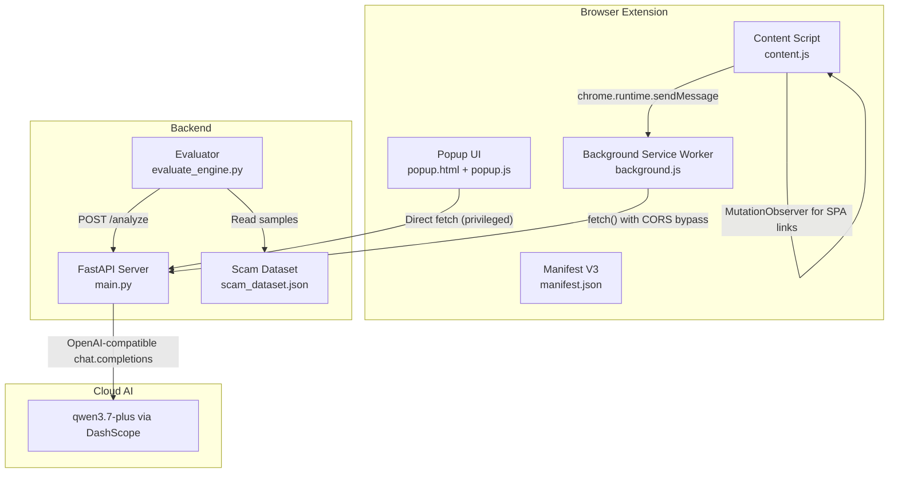
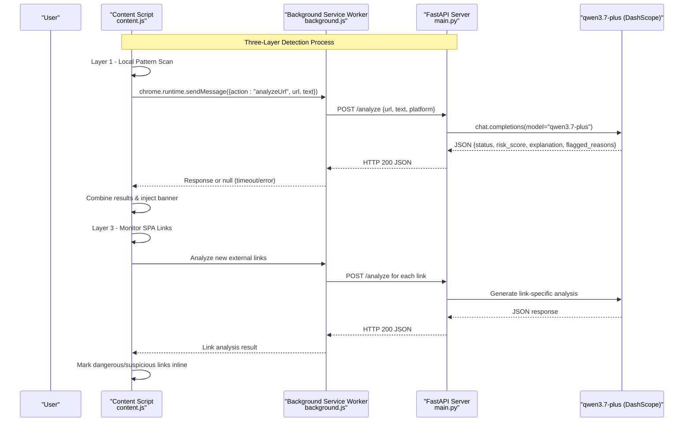
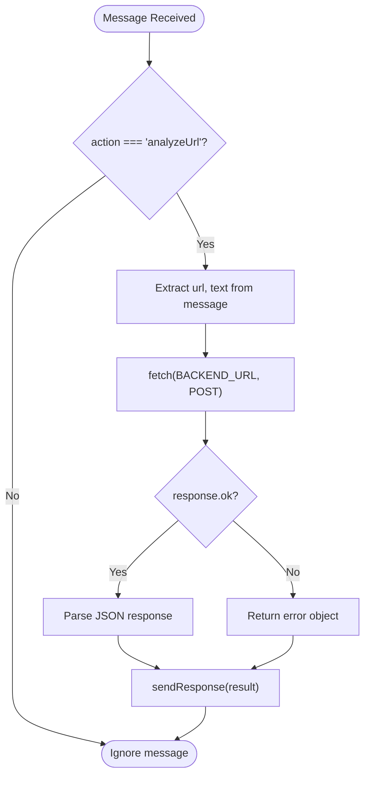
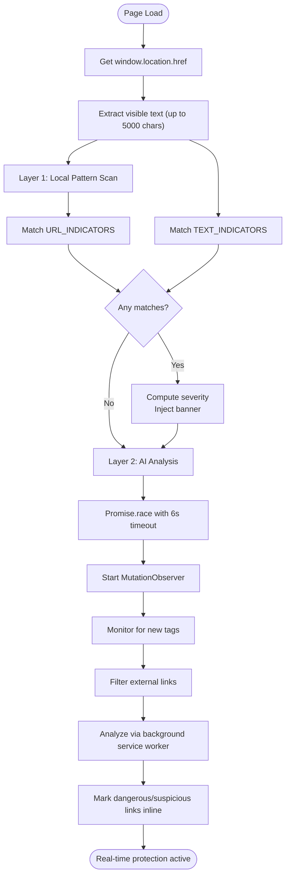
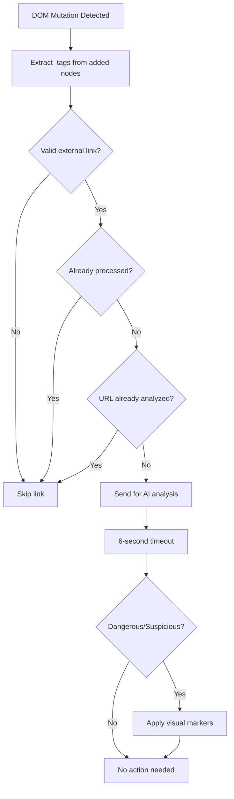
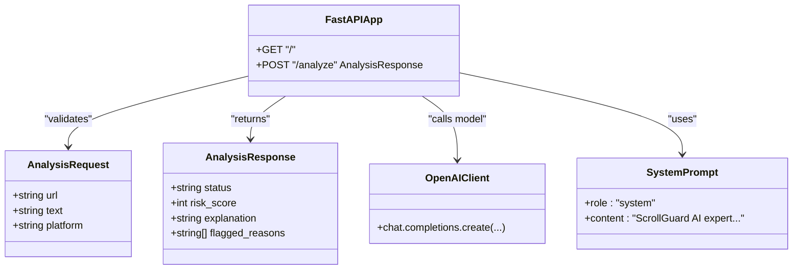
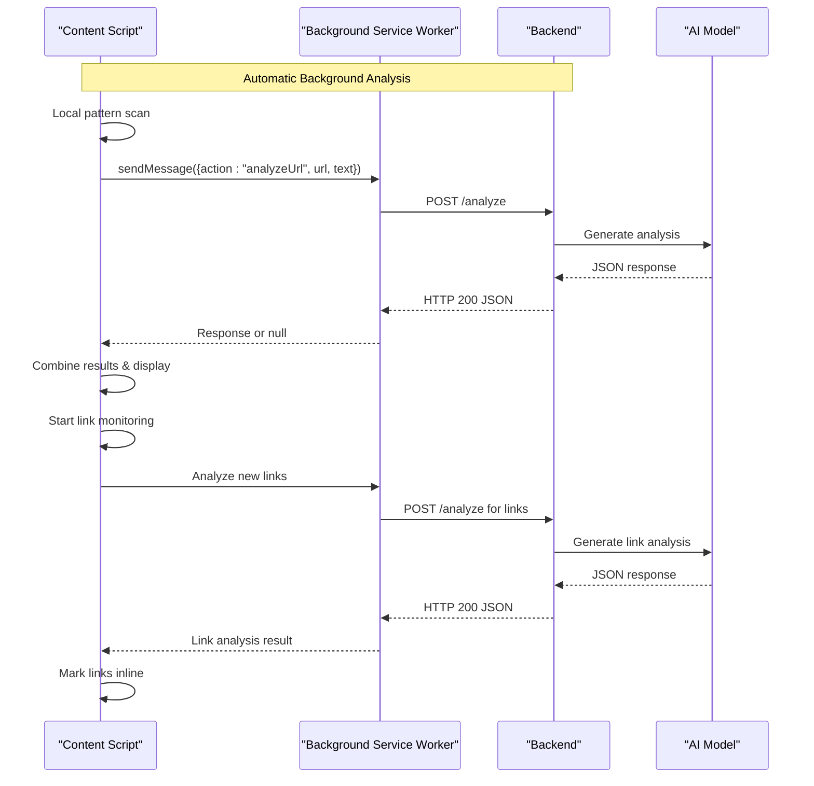
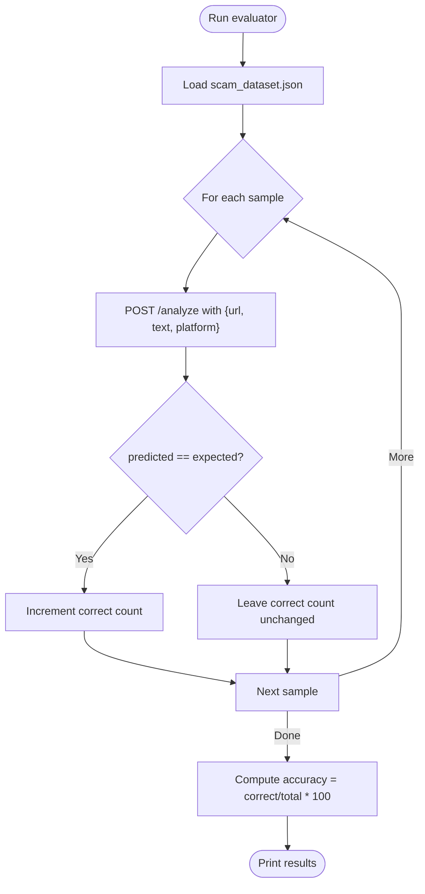
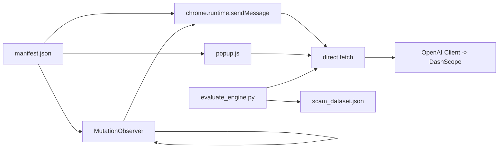

# Threat Detection Engine

<cite>
**Referenced Files in This Document**
- [main.py](file://backend/main.py)
- [evaluate_engine.py](file://backend/evaluate_engine.py)
- [scam_dataset.json](file://backend/scam_dataset.json)
- [content.js](file://extension/content.js)
- [popup.js](file://extension/popup.js)
- [popup.html](file://extension/popup.html)
- [manifest.json](file://extension/manifest.json)
- [background.js](file://extension/background.js)
- [README.md](file://README.md)
</cite>

## Update Summary
**Changes Made**
- Added comprehensive documentation for the new third layer of real-time link monitoring for SPA feeds
- Enhanced visual feedback system with inline link marking and warning badges
- Updated backend communication architecture supporting both page-level and link-level analysis
- Expanded three-layer detection approach documentation with detailed implementation details
- Added MutationObserver-based link scraping for dynamic content feeds
- Enhanced deduplication mechanisms to prevent API spamming

## Table of Contents
1. [Introduction](#introduction)
2. [Project Structure](#project-structure)
3. [Core Components](#core-components)
4. [Architecture Overview](#architecture-overview)
5. [Detailed Component Analysis](#detailed-component-analysis)
6. [Dependency Analysis](#dependency-analysis)
7. [Performance Considerations](#performance-considerations)
8. [Troubleshooting Guide](#troubleshooting-guide)
9. [Conclusion](#conclusion)
10. [Appendices](#appendices)

## Introduction
ScrollGuard AI is an advanced three-layer threat detection engine that combines immediate local heuristic scanning with sophisticated AI-powered backend analysis through a background service worker architecture. The system employs a comprehensive three-layer detection approach: Layer 1 performs fast, lightweight pattern matching directly in the browser using URL indicators and text regex patterns for instant user feedback, Layer 2 leverages cloud-based AI analysis via a background service worker to provide nuanced threat classification and explanations, and Layer 3 provides real-time monitoring of dynamically inserted links in Single Page Applications (SPAs) through MutationObserver technology. The background service worker acts as a secure proxy, bypassing CORS and Mixed Content restrictions that would otherwise block direct API calls from content scripts and popups running on HTTPS pages.

## Project Structure
The project consists of:
- **Backend**: FastAPI server exposing an /analyze endpoint for AI-powered analysis
- **Browser Extension**: 
  - Background service worker for secure API proxying
  - Content script for real-time local scanning, UI injection, and SPA link monitoring
  - Popup UI for manual scans and detailed analysis
- **Evaluation**: Script to benchmark detection accuracy using a curated dataset

**Diagram sources**
- [background.js:16-36](file://extension/background.js#L16-L36)
- [content.js:112-124](file://extension/content.js#L112-L124)
- [content.js:559-566](file://extension/content.js#L559-L566)
- [popup.js:20-29](file://extension/popup.js#L20-L29)
- [main.py:64-92](file://backend/main.py#L64-L92)
- [evaluate_engine.py:19-27](file://backend/evaluate_engine.py#L19-L27)
- [scam_dataset.json:1-37](file://backend/scam_dataset.json#L1-L37)
- [manifest.json:13-25](file://extension/manifest.json#L13-L25)

**Section sources**
- [README.md:45-56](file://README.md#L45-L56)
- [manifest.json:1-27](file://extension/manifest.json#L1-L27)

## Core Components
- **Background Service Worker**: Secure proxy that handles all backend communications, bypassing CORS and Mixed Content restrictions for content scripts and popups
- **Three-Layer Detection System**: 
  - Layer 1: Immediate local heuristic scanning using URL indicators and text regex patterns
  - Layer 2: AI-powered analysis via background service worker for sophisticated threat understanding
  - Layer 3: Real-time SPA link monitoring with MutationObserver for dynamic content feeds
- **AI-Powered Analysis Backend**: Accepts structured requests, constructs prompts for qwen3.7-plus model, and returns standardized JSON responses
- **Evaluation Pipeline**: Validates detection accuracy against curated scam dataset

Key responsibilities:
- **background.js**: Secure API proxy with error handling and timeout management
- **content.js**: Real-time local scanning, severity calculation, banner injection, and SPA link monitoring
- **main.py**: API endpoint, prompt engineering, and AI integration
- **evaluate_engine.py**: Batched evaluation against dataset
- **popup.js**: Manual trigger for comprehensive backend analysis

**Section sources**
- [background.js:16-36](file://extension/background.js#L16-L36)
- [content.js:374-400](file://extension/content.js#L374-L400)
- [content.js:559-566](file://extension/content.js#L559-L566)
- [main.py:64-92](file://backend/main.py#L64-L92)
- [evaluate_engine.py:19-49](file://backend/evaluate_engine.py#L19-L49)
- [popup.js:16-45](file://extension/popup.js#L16-L45)

## Architecture Overview
The enhanced three-layer architecture separates immediate detection from deep analysis while ensuring secure communication and real-time monitoring:

**Diagram sources**
- [content.js:374-400](file://extension/content.js#L374-L400)
- [content.js:559-566](file://extension/content.js#L559-L566)
- [background.js:42-48](file://extension/background.js#L42-L48)
- [main.py:64-92](file://backend/main.py#L64-L92)

## Detailed Component Analysis

### Background Service Worker Architecture
The background service worker serves as a secure intermediary between content scripts and the backend API, solving critical browser security restrictions:

- **CORS Bypass**: Executes fetch requests in the extension's privileged context, avoiding CORS and Mixed Content blocks
- **Message Routing**: Listens for messages from content scripts and routes them to the appropriate backend endpoints
- **Error Handling**: Provides graceful error handling when backend is unavailable or network requests fail
- **Timeout Management**: Ensures long-running operations don't block page loading

**Diagram sources**
- [background.js:42-48](file://extension/background.js#L42-L48)
- [background.js:16-36](file://extension/background.js#L16-L36)

**Section sources**
- [background.js:1-49](file://extension/background.js#L1-L49)

### Enhanced Three-Layer Detection System
The content script implements a sophisticated three-layer approach combining immediate local scanning, AI-powered analysis, and real-time SPA link monitoring:

**Layer 1 - Local Heuristic Scanning**:
- URL indicator matching for suspicious TLDs, shorteners, and phishing patterns
- Text regex analysis for scam phrases, urgency tactics, and credential harvesting
- Immediate severity calculation and banner injection without network latency

**Layer 2 - AI-Powered Analysis**:
- Asynchronous background service worker communication
- 6-second timeout to prevent blocking page loading
- Integration with backend AI model for nuanced threat assessment

**Layer 3 - Real-Time SPA Link Monitoring**:
- MutationObserver watches document.body for dynamically inserted <a> tags
- Supports infinite-scroll feeds on Twitter/X, Facebook, LinkedIn, etc.
- Inline visual marking with red borders, tinted backgrounds, and warning badges
- Deduplication mechanism prevents API spamming with duplicate URLs

**Diagram sources**
- [content.js:374-400](file://extension/content.js#L374-L400)
- [content.js:131-140](file://extension/content.js#L131-L140)
- [content.js:358-372](file://extension/content.js#L358-L372)
- [content.js:559-566](file://extension/content.js#L559-L566)

**Section sources**
- [content.js:21-61](file://extension/content.js#L21-L61)
- [content.js:69-93](file://extension/content.js#L69-L93)
- [content.js:374-400](file://extension/content.js#L374-L400)
- [content.js:559-566](file://extension/content.js#L559-L566)

### Real-Time SPA Link Monitoring (Layer 3)
The third layer provides continuous monitoring of dynamically inserted links in Single Page Applications:

**MutationObserver Implementation**:
- Watches document.body for childList mutations with subtree observation
- Captures newly inserted <a> tags including deeply nested elements
- Processes links asynchronously to avoid blocking the main thread

**Link Validation and Filtering**:
- Rejects non-HTTP(S) schemes (javascript:, data:, mailto:, tel:, #anchors)
- Filters out navigation stubs used by SPA frameworks (#, !, /, ?)
- Excludes same-origin links (internal SPA navigation)
- Only processes external third-party links that might be phishing or scam links

**Visual Feedback System**:
- Applies 3px solid outline (red for Dangerous, orange for Suspicious)
- Adds translucent background colors for visual distinction
- Injects inline warning badges with emoji indicators (🚨 [DANGEROUS] or ⚠️ [SUSPICIOUS])
- Uses WeakSet to track processed anchors and prevent memory leaks

**Deduplication Mechanism**:
- Set-based URL tracking prevents sending duplicate requests to backend
- Handles cases where the same URL appears multiple times in feed posts
- Memory-efficient approach using native JavaScript Set

**Diagram sources**
- [content.js:504-552](file://extension/content.js#L504-L552)
- [content.js:394-422](file://extension/content.js#L394-L422)
- [content.js:436-476](file://extension/content.js#L436-L476)

**Section sources**
- [content.js:504-552](file://extension/content.js#L504-L552)
- [content.js:394-422](file://extension/content.js#L394-L422)
- [content.js:436-476](file://extension/content.js#L436-L476)

### AI-Powered Analysis Layer (Backend)
The backend provides sophisticated threat analysis through the qwen3.7-plus model:

- **Prompt Engineering**: Comprehensive system prompt defining role, output schema, and scoring rules
- **Risk Scoring Methodology**: Structured scoring system with Safe (0-25), Suspicious (26-69), Dangerous (70-100)
- **Status Classification Logic**: Clear categorization based on threat indicators and context
- **Natural Language Explanation**: Concise, actionable threat assessments

**Diagram sources**
- [main.py:31-40](file://backend/main.py#L31-L40)
- [main.py:42-58](file://backend/main.py#L42-L58)
- [main.py:64-92](file://backend/main.py#L64-L92)

**Section sources**
- [main.py:42-58](file://backend/main.py#L42-L58)
- [main.py:64-92](file://backend/main.py#L64-L92)

### Integration Between Layers and Components
The three-tier architecture ensures seamless communication between components:

- **Immediate Feedback**: Content script provides instant warnings based on local patterns
- **Secure Communication**: Background service worker handles all backend interactions
- **On-Demand Deep Analysis**: Users can trigger comprehensive analysis via popup or automatic background processing
- **Contextual Processing**: Platform, URL, and text combined for accurate threat assessment
- **Real-Time Monitoring**: Continuous link analysis for dynamic content feeds

**Diagram sources**
- [content.js:112-124](file://extension/content.js#L112-L124)
- [content.js:559-566](file://extension/content.js#L559-L566)
- [background.js:42-48](file://extension/background.js#L42-L48)
- [main.py:64-92](file://backend/main.py#L64-L92)

**Section sources**
- [content.js:112-124](file://extension/content.js#L112-L124)
- [content.js:559-566](file://extension/content.js#L559-L566)
- [background.js:42-48](file://extension/background.js#L42-L48)
- [popup.js:16-45](file://extension/popup.js#L16-L45)

### Customization and Tuning
The modular architecture supports extensive customization:

- **Pattern Enhancement**: Extend URL_INDICATORS and TEXT_INDICATORS arrays for new threat types
- **Prompt Customization**: Modify SYSTEM_PROMPT for domain-specific threat detection
- **Threshold Tuning**: Adjust severity thresholds and timeout values for different use cases
- **Service Worker Configuration**: Customize BACKEND_URL and error handling behavior
- **SPA Monitoring**: Configure link validation rules and visual feedback styles

**Section sources**
- [content.js:21-61](file://extension/content.js#L21-L61)
- [content.js:374-400](file://extension/content.js#L374-L400)
- [content.js:559-566](file://extension/content.js#L559-L566)
- [background.js:10](file://extension/background.js#L10)
- [main.py:42-58](file://backend/main.py#L42-L58)

### Evaluation and Benchmarking
The evaluation system validates detection accuracy across all layers:

- **Dataset Management**: Curated scam_dataset.json with labeled examples
- **Automated Testing**: Batch processing of test cases against backend API
- **Accuracy Measurement**: Comparison of predicted vs expected status classifications
- **Performance Metrics**: Risk score validation and explanation quality assessment

**Diagram sources**
- [evaluate_engine.py:19-49](file://backend/evaluate_engine.py#L19-L49)
- [scam_dataset.json:1-37](file://backend/scam_dataset.json#L1-L37)

**Section sources**
- [evaluate_engine.py:19-49](file://backend/evaluate_engine.py#L19-L49)
- [scam_dataset.json:1-37](file://backend/scam_dataset.json#L1-L37)

## Dependency Analysis
The enhanced three-layer architecture introduces new dependencies and relationships:

- **Extension Dependencies**:
  - manifest.json for permissions and service worker registration
  - background.js for secure API proxying
  - content.js for local scanning, UI interaction, and SPA link monitoring
  - popup.js for manual analysis triggers
- **Backend Dependencies**:
  - FastAPI and CORS middleware for request handling
  - OpenAI client configured for DashScope endpoint
  - Environment variable DASHSCOPE_API_KEY for authentication
- **Communication Dependencies**:
  - chrome.runtime API for service worker messaging
  - fetch API for HTTP requests in privileged context
  - MutationObserver API for DOM change detection

**Diagram sources**
- [manifest.json:13-25](file://extension/manifest.json#L13-L25)
- [content.js:112-124](file://extension/content.js#L112-L124)
- [content.js:559-566](file://extension/content.js#L559-L566)
- [background.js:42-48](file://extension/background.js#L42-L48)
- [popup.js:20-29](file://extension/popup.js#L20-L29)
- [main.py:15-18](file://backend/main.py#L15-L18)

**Section sources**
- [main.py:1-18](file://backend/main.py#L1-L18)
- [main.py:20-29](file://backend/main.py#L20-L29)
- [manifest.json:1-27](file://extension/manifest.json#L1-L27)

## Performance Considerations
The three-layer architecture optimizes performance through strategic design:

**Local Scanning Efficiency**:
- Truncates visible text to 5000 characters to limit processing overhead
- Uses efficient string checks and regex tests for fast pattern matching
- Prevents duplicate banner injection with DOM element checking

**Background Service Worker Optimization**:
- 6-second timeout prevents blocking page loading during AI analysis
- Promise.race ensures graceful degradation when backend is unavailable
- Message-based communication reduces direct API call overhead

**SPA Link Monitoring Optimization**:
- MutationObserver uses efficient childList and subtree watching
- WeakSet prevents memory leaks from processed anchor elements
- Set-based deduplication prevents API spamming with duplicate URLs
- Fire-and-forget async processing avoids blocking main thread

**Network Optimization**:
- Background service worker handles all backend communications in privileged context
- Popup uses direct fetch for manual scans (privileged extension context)
- Efficient error handling prevents repeated failed requests
- 6-second timeouts prevent hanging connections

**Caching Strategies**:
- No client-side caching implemented; consider adding localStorage for repeated URL analyses
- Backend could implement response caching for identical requests
- Service worker could cache successful responses for offline scenarios
- Deduplication set prevents redundant API calls within session

**Fallback Mechanisms**:
- Graceful degradation when background service worker is unavailable
- Local pattern matching continues to work even if AI analysis fails
- Error states handled throughout the communication chain
- MutationObserver continues monitoring even if individual link analysis fails

**Section sources**
- [content.js:98-103](file://extension/content.js#L98-L103)
- [content.js:386-395](file://extension/content.js#L386-L395)
- [content.js:559-566](file://extension/content.js#L559-L566)
- [background.js:16-36](file://extension/background.js#L16-L36)

## Troubleshooting Guide
Common issues and solutions for the enhanced three-layer architecture:

**Background Service Worker Issues**:
- **Service Worker Not Loading**: Check manifest.json background.service_worker configuration
- **Message Communication Failures**: Verify chrome.runtime.onMessage listener is properly registered
- **CORS Errors**: Ensure background service worker is used instead of direct content script fetch calls

**Backend Connectivity Problems**:
- **Missing API Key**: Set DASHSCOPE_API_KEY environment variable before starting backend
- **Server Not Running**: Start FastAPI server using uvicorn as documented
- **Connection Timeouts**: Increase timeout values in content.js if backend is slow

**Content Script Issues**:
- **Banner Not Appearing**: Check shouldShowBanner logic and local pattern matching results
- **AI Analysis Failing**: Verify background service worker communication and timeout handling
- **DOM Manipulation Errors**: Ensure proper element creation and event listener attachment
- **SPA Link Monitoring Not Working**: Check MutationObserver setup and link validation logic

**SPA Link Monitoring Issues**:
- **Links Not Being Monitored**: Verify MutationObserver is observing document.body with correct options
- **False Positives/Negatives**: Review isValidExternalLink function and link filtering criteria
- **Memory Leaks**: Ensure WeakSet is properly tracking processed anchors
- **Performance Issues**: Check for excessive DOM mutations or inefficient link processing

**Popup Functionality**:
- **Direct API Access**: Popup requires host_permissions for http://127.0.0.1:8000/*
- **Error Handling**: Implement try-catch blocks around fetch calls
- **State Management**: Track button states during analysis to prevent multiple clicks

**Evaluation Problems**:
- **Dataset Missing**: Ensure scam_dataset.json exists in backend directory
- **API Endpoint Changes**: Update evaluate_engine.py API_URL if backend port changes
- **Authentication Issues**: Verify DASHSCOPE_API_KEY is set correctly

**Section sources**
- [background.js:42-48](file://extension/background.js#L42-L48)
- [content.js:386-395](file://extension/content.js#L386-L395)
- [content.js:559-566](file://extension/content.js#L559-L566)
- [main.py:11-13](file://backend/main.py#L11-L13)
- [main.py:64-92](file://backend/main.py#L64-L92)
- [popup.js:39-44](file://extension/popup.js#L39-L44)
- [evaluate_engine.py:7-12](file://backend/evaluate_engine.py#L7-L12)

## Conclusion
ScrollGuard AI delivers a robust three-layer threat detection system that combines immediate local scanning, sophisticated AI-powered analysis, and real-time SPA link monitoring through a secure background service worker architecture. The enhanced design addresses critical browser security restrictions while providing comprehensive threat detection capabilities for both static pages and dynamic Single Page Applications. The modular architecture enables easy customization of patterns, prompts, and thresholds, while the evaluation pipeline supports ongoing accuracy measurement. Future enhancements may include client-side caching, request batching, additional fallback strategies, and expanded SPA framework support to further optimize performance and resilience.

## Appendices

### Example Workflows
**Automatic Background Analysis Workflow**:
- On page load, content script performs local pattern scanning
- Simultaneously sends data to background service worker for AI analysis
- Combines results and displays appropriate warning banner
- Handles timeouts and errors gracefully

**Manual Popup Analysis Workflow**:
- User opens popup and clicks "Scan This Page"
- Popup makes direct fetch call to backend (privileged context)
- Displays comprehensive analysis results including risk score and explanation
- Provides detailed threat assessment with actionable insights

**Real-Time SPA Link Monitoring Workflow**:
- MutationObserver continuously monitors for newly inserted links
- External links are validated and filtered for analysis
- Each unique link is sent to backend for AI analysis
- Dangerous or suspicious links receive inline visual marking with warning badges
- Deduplication prevents API spamming with duplicate URLs

**Section sources**
- [content.js:374-400](file://extension/content.js#L374-L400)
- [content.js:559-566](file://extension/content.js#L559-L566)
- [background.js:42-48](file://extension/background.js#L42-L48)
- [popup.js:16-45](file://extension/popup.js#L16-L45)