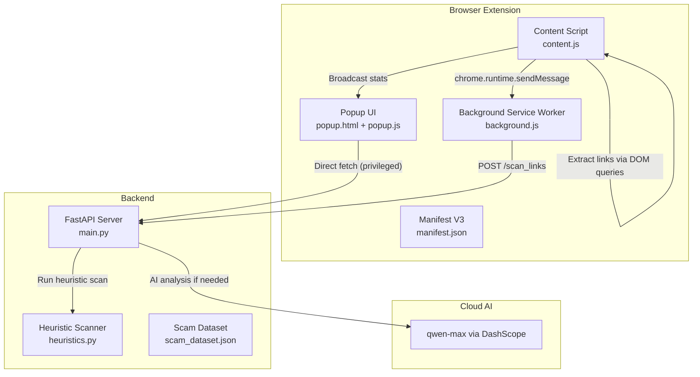
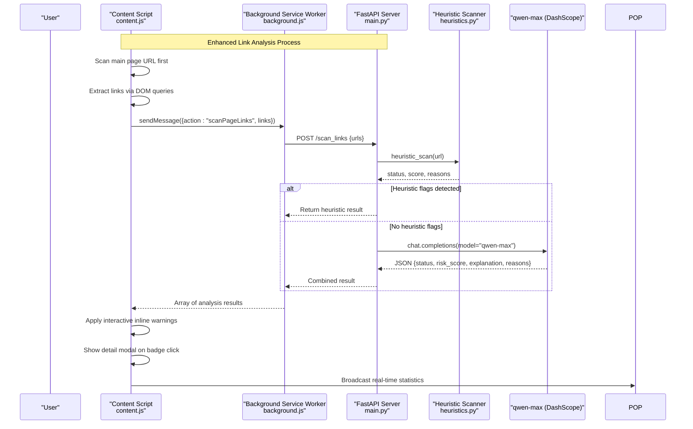
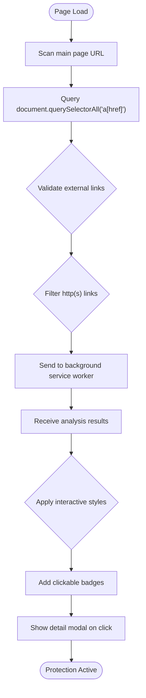
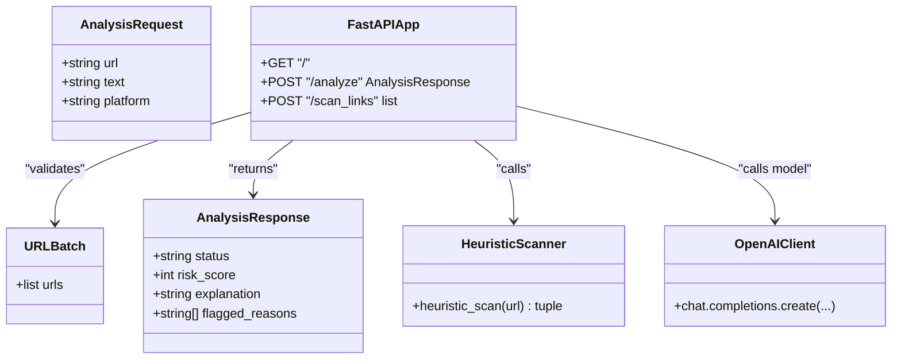
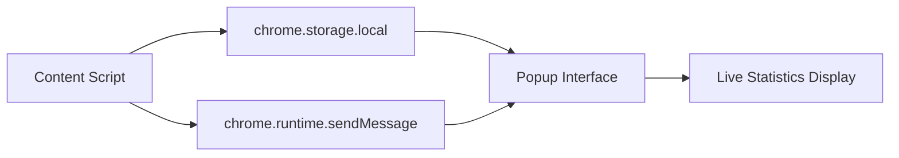
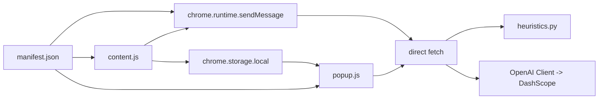

# Threat Detection Engine

<cite>
**Referenced Files in This Document**
- [main.py](file://backend/main.py)
- [heuristics.py](file://backend/heuristics.py)
- [content.js](file://extension/content.js)
- [background.js](file://extension/background.js)
- [popup.js](file://extension/popup.js)
- [popup.html](file://extension/popup.html)
- [manifest.json](file://extension/manifest.json)
</cite>

## Update Summary
**Changes Made**
- Enhanced backend classification system with improved system prompts featuring high-precision classification rules (Dangerous 70-100, Suspicious 26-69, Safe 0-15)
- Added few-shot learning examples to improve AI classification accuracy
- Implemented strict JSON output schema enforcement for consistent AI responses
- Added main-page scanning capability that analyzes current page URLs before link examination
- Enhanced threat detection with comprehensive government benefit scam detection patterns
- Improved error handling and fallback mechanisms throughout the communication chain

## Table of Contents
1. [Introduction](#introduction)
2. [Project Structure](#project-structure)
3. [Core Components](#core-components)
4. [Architecture Overview](#architecture-overview)
5. [Detailed Component Analysis](#detailed-component-analysis)
6. [Enhanced Backend Classification System](#enhanced-backend-classification-system)
7. [Main Page Scanning Capability](#main-page-scanning-capability)
8. [Interactive User Interface System](#interactive-user-interface-system)
9. [Real-Time Statistics Tracking](#real-time-statistics-tracking)
10. [Dependency Analysis](#dependency-analysis)
11. [Performance Considerations](#performance-considerations)
12. [Troubleshooting Guide](#troubleshooting-guide)
13. [Conclusion](#conclusion)
14. [Appendices](#appendices)

## Introduction
ScrollGuard AI is an advanced threat detection engine that combines browser-based link extraction with backend-driven heuristic scanning and AI-powered analysis. The system employs a sophisticated two-tier approach: the content script performs real-time DOM queries to extract visible links from web pages, while the background service worker handles communication with the backend API for comprehensive threat analysis. The enhanced user interface provides interactive detail modals showing comprehensive threat analysis, risk scores, AI explanations, and specific flagging reasons. Real-time statistics tracking ensures users can monitor scanning activity across all tabs through a unified dashboard interface.

## Project Structure
The project consists of:
- **Backend**: FastAPI server exposing endpoints for both single URL analysis and batch link scanning
- **Browser Extension**: 
  - Background service worker for secure API proxying and batch processing
  - Content script for real-time link extraction with interactive visual feedback
  - Popup UI for manual page scanning and live statistics monitoring
- **Heuristic Engine**: Rule-based detection system for immediate threat identification



**Diagram sources**
- [content.js:12-43](file://extension/content.js#L12-L43)
- [background.js:17-44](file://extension/background.js#L17-L44)
- [main.py:110-149](file://backend/main.py#L110-L149)
- [heuristics.py:4-48](file://backend/heuristics.py#L4-L48)

**Section sources**
- [manifest.json:1-29](file://extension/manifest.json#L1-L29)

## Core Components
- **Enhanced Content Script**: Advanced DOM query functionality with real-time link extraction, interactive visual feedback, and modal display system
- **Streamlined Background Service Worker**: Handles batch link analysis requests and communicates with backend API
- **Enhanced Heuristic Scanning Engine**: Comprehensive rule-based detection system identifying suspicious patterns in URLs including sophisticated TLD detection, typosquatting, shortened URLs, and scam keywords
- **AI-Powered Analysis Backend**: Integrates heuristic results with advanced AI analysis through qwen-max model for comprehensive threat assessment
- **Interactive Popup Interface**: Manual scanning capability with live statistics monitoring and detailed result presentation

Key responsibilities:
- **content.js**: Extract links from DOM, apply interactive visual markings, and manage modal displays
- **background.js**: Batch processing and backend communication with error handling
- **heuristics.py**: Immediate threat detection using predefined rules
- **main.py**: API endpoints coordinating heuristic and AI analysis
- **popup.js**: User interface for manual scanning and live statistics monitoring

**Section sources**
- [content.js:12-43](file://extension/content.js#L12-L43)
- [background.js:17-44](file://extension/background.js#L17-L44)
- [heuristics.py:4-48](file://backend/heuristics.py#L4-L48)
- [main.py:110-149](file://backend/main.py#L110-L149)
- [popup.js:7-36](file://extension/popup.js#L7-L36)

## Architecture Overview
The enhanced architecture focuses on efficient link extraction, comprehensive backend analysis, and interactive user feedback:



**Diagram sources**
- [content.js:18-41](file://extension/content.js#L18-L41)
- [background.js:39-44](file://extension/background.js#L39-L44)
- [main.py:110-149](file://backend/main.py#L110-L149)
- [heuristics.py:4-48](file://backend/heuristics.py#L4-L48)

## Detailed Component Analysis

### Enhanced Content Script Implementation
The content script provides sophisticated link extraction functionality with interactive visual feedback:

**Advanced Link Extraction Logic**:
- Uses `document.querySelectorAll("a[href]")` to find all anchor elements with href attributes
- Validates external links by filtering out internal navigation, JavaScript protocols, and same-origin domains
- Implements WeakSet for memory-efficient element tracking and Set for URL deduplication
- Sends collected links to background service worker for analysis with timeout handling

**Interactive Visual Feedback System**:
- Applies inline styling directly to detected links with sophisticated visual indicators
- Red borders with 🚨 [DANGEROUS SCAN] badges for Dangerous links, amber borders with ⚠️ [SUSPICIOUS SCAN] badges for Suspicious links
- Clickable badges that open comprehensive detail modals with full threat analysis
- Tooltip integration showing risk assessment details with color-coded status
- Idempotent marking via data-scrollguard-marked attribute prevents duplicate processing



**Diagram sources**
- [content.js:12-16](file://extension/content.js#L12-L16)
- [content.js:27-39](file://extension/content.js#L27-L39)

**Section sources**
- [content.js:12-43](file://extension/content.js#L12-L43)

### Streamlined Background Service Worker
The background service worker handles batch processing and backend communication:

**Batch Processing Architecture**:
- Accepts arrays of URLs from content scripts
- Performs HTTP POST requests to backend `/scan_links` endpoint
- Handles error responses and network failures gracefully
- Returns structured results back to content scripts

**Message Routing**:
- Listens for specific action messages (`scanPageLinks`)
- Routes messages to appropriate processing functions
- Maintains asynchronous communication patterns
- Provides consistent error handling across all operations


**Diagram sources**
- [background.js:39-44](file://extension/background.js#L39-L44)
- [background.js:17-33](file://extension/background.js#L17-L33)

**Section sources**
- [background.js:17-44](file://extension/background.js#L17-L44)

### Enhanced Heuristic Scanning Engine
The heuristic engine provides immediate threat detection using comprehensive rule-based analysis:

**Updated Detection Rules**:
- **Sophisticated TLD Detection**: Identifies domains ending in `.tk`, `.ml`, `.ga`, `.cf`, `.gq`, `.xyz`, `.top`, `.buzz`, `.click`, `.icu`, `.cam` commonly used in scams
- **URL Shortener Service Detection**: Flags known URL shortening services including bit.ly, tinyurl.com, t.co, ow.ly, shorturl.at, goo.gl, is.gd, buff.ly, rebrand.ly
- **Typosquatting Pattern Detection**: Detects domains with deceptive patterns mimicking known brands like Google (g00gl), PayPal (paypa1), Amazon (amaz0n), Facebook (faceb00k), Apple (app1e), Microsoft (mircosoft)
- **Comprehensive Keyword Analysis**: Searches for suspicious keywords in both URL paths and domain names including "claim", "winner", "free-money", "giveaway", "bonus", "verify-account", "urgent-security", "login-secure", "confirm-identity", "suspended-account", "double-bitcoin", "free-gift"
- **Advanced Security Protocol Checks**: Identifies missing HTTPS encryption and unusual subdomain nesting patterns
- **Hyphen-heavy Domain Detection**: Flags domains with excessive hyphens (3+ hyphens) commonly used in phishing attacks

**Refined Risk Scoring Algorithm**:
- Assigns weighted scores to different threat indicators based on severity:
  - Free/suspicious TLDs: +40 points
  - Typosquatting patterns: +35 points
  - Scam keywords in URL path: +30 points
  - Scam keywords in domain name: +25 points
  - URL shortener services: +20 points
  - Hyphen-heavy domains: +20 points
  - Excessive subdomain depth: +15 points
  - Missing HTTPS: +10 points
- Final classification based on cumulative score thresholds:
  - Dangerous: Score ≥ 70 points
  - Suspicious: Score ≥ 30 points
  - Safe: Score < 30 points


**Diagram sources**
- [heuristics.py:40-109](file://backend/heuristics.py#L40-L109)

**Section sources**
- [heuristics.py:4-110](file://backend/heuristics.py#L4-L110)

### AI-Powered Analysis Integration
The backend integrates heuristic results with advanced AI analysis:

**Hybrid Analysis Approach**:
- Runs heuristic scan first for immediate threat identification
- Only proceeds to AI analysis when heuristic scan returns "Safe" status
- Combines heuristic findings with AI insights for comprehensive assessment
- Maintains fast response times by leveraging quick heuristic checks

**Enhanced Prompt Engineering Strategy**:
- System prompt defines ScrollGuard AI role as cybersecurity expert specializing in online scams, phishing links, and fake giveaways targeting social media users
- Structured output schema ensures consistent JSON responses with status, score, explanation, and reasons fields
- Clear status definitions guide AI decision-making with specific criteria for Safe (0-15), Suspicious (26-69), and Dangerous (70-100) classifications
- Platform context provided for more accurate threat assessment

**Robust Error Handling and Fallbacks**:
- Graceful handling of AI service failures with proper exception management
- Consistent error response format across all failure scenarios
- Fallback to heuristic-only results when AI unavailable or fails to parse responses
- Markdown fence stripping for LLM responses that include ```json wrappers



**Diagram sources**
- [main.py:33-46](file://backend/main.py#L33-L46)
- [main.py:110-149](file://backend/main.py#L110-L149)
- [heuristics.py:4-48](file://backend/heuristics.py#L4-L48)

**Section sources**
- [main.py:110-149](file://backend/main.py#L110-L149)
- [main.py:71-108](file://backend/main.py#L71-L108)

### Interactive Detail Modal System
The content script implements a sophisticated modal system for displaying comprehensive threat analysis:

**Modal Features**:
- Full-screen overlay with backdrop blur effect for focus isolation
- Dynamic header with threat level indicators (🚨 for Dangerous, ⚠️ for Suspicious)
- Color-coded border styling based on threat severity
- Comprehensive information display including scanned URL, risk score, AI explanation, and specific flagged reasons
- Interactive action buttons: "Close / Stay Safe" and "Proceed Anyway"
- Keyboard accessibility and click-outside-to-close functionality

**Modal Data Structure**:
- Status field indicating threat level (Dangerous/Suspicious)
- URL field showing the analyzed link
- Score field displaying numerical risk assessment (0-100)
- Explanation field containing AI-generated threat analysis
- Reasons field listing specific detection triggers

**Section sources**
- [content.js:134-396](file://extension/content.js#L134-L396)

## Enhanced Backend Classification System

The backend has been significantly enhanced with a sophisticated classification system that combines rule-based heuristics with AI-powered analysis for maximum accuracy.

### High-Precision Classification Rules

The system now implements precise classification thresholds with clear boundaries:

- **Dangerous (70-100)**: Immediate threats requiring urgent user attention
- **Suspicious (26-69)**: Potentially harmful content requiring caution
- **Safe (0-15)**: Verified safe content with minimal risk

### Enhanced System Prompt Engineering

The system prompt has been completely redesigned to provide:

**Strict Output Schema Enforcement**:
```json
{
  "status": "Safe" | "Suspicious" | "Dangerous",
  "score": <integer 0-100>,
  "explanation": "<1-2 sentence plain-text summary>",
  "reasons": ["<reason 1>", "<reason 2>", ...]
}
```

**Comprehensive Classification Guidelines**:
- **Dangerous Patterns**: Fake government benefit schemes, credential harvesting, fake lottery scams, typosquatting, bank impersonation, deeply nested subdomains
- **Suspicious Indicators**: Get-rich-quick schemes, URL shorteners with urgency, high-pressure language, unrealistic financial promises
- **Safe Content**: Standard websites, official brand domains, legitimate educational pages, benign shortened links

**Few-Shot Learning Examples**:
The system includes three detailed examples demonstrating proper classification:
1. **Dangerous Example**: Government aid scam using .tk domain with credential harvesting
2. **Suspicious Example**: URL shortener with get-rich-quick claims and urgency tactics  
3. **Safe Example**: Legitimate educational event registration on official domain

### Bias Rules and Decision Logic

The system implements intelligent bias rules:
- When uncertain between Safe and Suspicious, default to Safe
- When clear Dangerous patterns are detected, must return Dangerous without downgrading
- Prioritizes user safety over false negatives

**Section sources**
- [main.py:64-177](file://backend/main.py#L64-L177)
- [main.py:194-260](file://backend/main.py#L194-L260)

## Main Page Scanning Capability

A new main-page scanning capability has been added to analyze the current page URL before examining individual links, providing comprehensive protection against malicious landing pages.

### Main Page Analysis Workflow

The enhanced content script now performs a three-stage initialization process:

1. **Main Page Scan**: Analyzes `window.location.href` before any other processing
2. **Link Extraction**: Processes all visible links on the page
3. **Dynamic Monitoring**: Watches for newly inserted content

### Warning Banner System

When the main page itself is flagged as dangerous or suspicious, the system injects a prominent warning banner:

**Banner Features**:
- Fixed positioning at the top of the page with high z-index
- Color-coded gradients (red for dangerous, amber for suspicious)
- Shield/warning icons based on threat level
- Dismissible with X button for user control
- Includes risk score and AI-generated explanation
- Prevents duplicate banner injection

**Visual Design**:
- **Dangerous Pages**: Red gradient background with 🚨 icon and "This page is DANGEROUS" headline
- **Suspicious Pages**: Amber gradient background with ⚠️ icon and "This page is SUSPICIOUS" headline
- **Risk Display**: Shows numerical score (0-100) with AI explanation
- **Dismiss Functionality**: Allows users to close the banner if they choose to proceed

### Allowlist Integration

The main page scanner respects the existing allowlist system, automatically skipping trusted domains to avoid unnecessary scanning and potential performance issues.

**Section sources**
- [content.js:186-307](file://extension/content.js#L186-L307)
- [content.js:745-747](file://extension/content.js#L745-L747)

## Interactive User Interface System

### Inline Visual Marking System
The content script provides sophisticated inline visual feedback for detected threats:

**Visual Indicators**:
- **Dangerous Links**: Red outline (3px solid #dc2626) with red background tint (rgba(220, 38, 38, 0.08)) and 🚨 [DANGEROUS SCAN] badge
- **Suspicious Links**: Amber outline (3px solid #d97706) with amber background tint (rgba(217, 119, 6, 0.08)) and ⚠️ [SUSPICIOUS SCAN] badge
- **Clickable Badges**: Interactive badges with hover effects and tooltip information showing risk scores
- **Event Prevention**: Badge clicks are intercepted with preventDefault and stopPropagation to prevent accidental navigation

**Badge Implementation**:
- Dynamically created span elements inserted after target links
- Styled with modern CSS properties including border-radius, box-shadow, and custom fonts
- Responsive design adapting to different screen sizes
- Persistent state via data-scrollguard-marked attribute preventing duplicate processing

**Section sources**
- [content.js:400-474](file://extension/content.js#L400-L474)

## Real-Time Statistics Tracking

### Live Statistics Broadcasting
The system implements real-time statistics tracking and broadcasting between content scripts and popup interfaces:

**Statistics Collection**:
- **Total Scanned**: Counter tracking all unique URLs processed by the content script
- **Total Flagged**: Counter tracking URLs identified as Dangerous or Suspicious
- **Persistent Storage**: Statistics stored in chrome.storage.local for cross-tab persistence
- **Real-time Updates**: Live broadcasting to open popup windows via chrome.runtime.sendMessage

**Popup Integration**:
- **Live Dashboard**: Popup displays current scanning statistics with animated status indicators
- **Auto-refresh**: Automatic updates when new scanning activity occurs
- **Status Monitoring**: Visual indicators showing whether scanning is active or waiting
- **Manual Override**: Fallback scanning capability for individual tab analysis

**Communication Flow**:


**Section sources**
- [content.js:478-499](file://extension/content.js#L478-L499)
- [popup.js:27-47](file://extension/popup.js#L27-L47)

### Enhanced Popup Interface
The popup provides a comprehensive dashboard for monitoring scanning activity:

**Dashboard Features**:
- **Active Tab URL Display**: Shows current tab URL with fallback handling for internal pages
- **Status Banner**: Animated pulse indicator showing active scanning status
- **Statistics Chips**: Three-chip layout displaying Links Scanned, Flagged count, and Status
- **Manual Scan Button**: Fallback scanning capability with loading states and error handling
- **Result Cards**: Detailed presentation of analysis results with color-coded status badges

**Interactive Elements**:
- **Loading States**: Spinner animation during analysis with button disablement
- **Error Handling**: Graceful error messages with user-friendly descriptions
- **Responsive Design**: Mobile-friendly layout adapting to different screen sizes
- **Accessibility**: Proper ARIA labels and keyboard navigation support

**Section sources**
- [popup.js:9-167](file://extension/popup.js#L9-L167)
- [popup.html:276-336](file://extension/popup.html#L276-L336)

## Dependency Analysis
The enhanced architecture maintains essential dependencies while adding sophisticated user interaction capabilities:

- **Extension Dependencies**:
  - manifest.json for permissions and service worker registration
  - content.js for advanced DOM link extraction with interactive visual feedback
  - background.js for backend communication and batch processing
  - popup.js for manual scanning interface with live statistics monitoring
- **Backend Dependencies**:
  - FastAPI and CORS middleware for request handling
  - OpenAI client configured for DashScope endpoint with rate limiting
  - Environment variable DASHSCOPE_API_KEY for authentication
  - heuristics.py for comprehensive rule-based threat detection
- **Communication Dependencies**:
  - chrome.runtime API for service worker messaging
  - chrome.storage API for persistent statistics storage
  - fetch API for HTTP requests in privileged context



**Diagram sources**
- [manifest.json:14-22](file://extension/manifest.json#L14-L22)
- [content.js:18-41](file://extension/content.js#L18-L41)
- [background.js:39-44](file://extension/background.js#L39-L44)
- [main.py:110-149](file://backend/main.py#L110-L149)
- [heuristics.py:4-48](file://backend/heuristics.py#L4-L48)

**Section sources**
- [manifest.json:1-29](file://extension/manifest.json#L1-L29)
- [main.py:1-19](file://backend/main.py#L1-L19)

## Performance Considerations
The enhanced architecture optimizes performance through strategic design choices:

**Enhanced Content Script Efficiency**:
- Uses efficient DOM queries with `document.querySelectorAll("a[href]")` and WeakSet for memory-efficient element tracking
- Minimal JavaScript overhead with simple filtering logic and URL deduplication
- Throttled MutationObserver with debouncing at 300ms to prevent excessive processing
- Lightweight inline styling for visual feedback with idempotent marking

**Optimized Background Service Worker**:
- Batch processing reduces multiple API calls to single requests
- Efficient error handling prevents cascading failures
- Asynchronous message handling maintains responsiveness
- Simple request/response pattern minimizes overhead

**Enhanced Backend Performance**:
- Comprehensive heuristic scanning provides immediate results without AI latency
- Conditional AI analysis only runs when heuristic scan passes safe threshold
- Efficient URL parsing and pattern matching algorithms with regex optimization
- Structured error handling prevents resource leaks
- Rate limiting with semaphore for concurrent AI calls (max 5 concurrent)

**Network Optimization**:
- Single endpoint `/scan_links` handles batch requests efficiently
- Background service worker executes requests in privileged context
- Minimal payload size with essential data transmission
- Timeout handling prevents hanging connections (30-second timeout)

**Caching Strategies**:
- Client-side URL deduplication using Set to avoid redundant analyses
- Persistent statistics storage using chrome.storage.local for cross-tab sharing
- Backend could implement response caching for identical requests
- Heuristic results are deterministic and could be cached server-side

**Fallback Mechanisms**:
- Graceful degradation when background service worker is unavailable
- Local pattern matching continues to work even if AI analysis fails
- Error states handled throughout the communication chain
- Simple error messages provide user feedback with descriptive error states

**Section sources**
- [content.js:50-53](file://extension/content.js#L50-L53)
- [background.js:17-33](file://extension/background.js#L17-L33)
- [main.py:110-149](file://backend/main.py#L110-L149)
- [heuristics.py:4-48](file://backend/heuristics.py#L4-L48)

## Troubleshooting Guide
Common issues and solutions for the enhanced architecture:

**Enhanced Content Script Issues**:
- **Links Not Being Extracted**: Verify DOM contains anchor elements with href attributes and check console for errors
- **Visual Styling Not Applied**: Ensure CSS selectors match actual link elements and check for existing scrollguard markings
- **MutationObserver Not Working**: Check observer configuration and debouncing logic
- **Duplicate Link Processing**: Verify WeakSet and Set usage for proper deduplication
- **Modal Not Appearing**: Check event listener attachment and ensure badge click events are properly handled
- **Main Page Banner Not Showing**: Verify allowlist configuration and check if page URL is being properly scanned

**Background Service Worker Problems**:
- **Messages Not Received**: Verify chrome.runtime.onMessage listener is properly registered
- **Backend Communication Failures**: Check BACKEND_URL configuration and network connectivity
- **Batch Processing Errors**: Validate URL array format and error handling
- **Timeout Issues**: Adjust timeout values if backend is slow to respond

**Backend Connectivity Issues**:
- **Missing API Key**: Set DASHSCOPE_API_KEY environment variable before starting backend
- **Server Not Running**: Start FastAPI server using uvicorn as documented
- **Connection Timeouts**: Verify network access and firewall settings
- **Rate Limiting**: Monitor concurrent AI call limits and adjust semaphore settings

**Enhanced Heuristic Scanning Issues**:
- **False Positives/Negatives**: Review rule thresholds and keyword lists in heuristics.py
- **Pattern Matching Errors**: Check regex patterns and string comparison logic for typosquatting detection
- **Score Calculation Issues**: Verify point assignments and threshold values for new detection rules
- **TLD Detection Problems**: Ensure suspicious TLD list is up-to-date with current abuse patterns

**Popup Functionality**:
- **Button Not Working**: Check event listener attachment and DOM element existence
- **Results Not Displaying**: Verify message passing and result formatting
- **Permission Errors**: Ensure proper manifest permissions are set
- **Loading States**: Check spinner implementation and button disable logic
- **Statistics Not Updating**: Verify chrome.storage.local communication and message broadcasting

**Real-Time Statistics Issues**:
- **Stats Not Persisting**: Check chrome.storage.local permissions and storage quotas
- **Broadcasting Failures**: Verify chrome.runtime.sendMessage is working correctly
- **Popup Not Refreshing**: Check message listener registration and update logic
- **Cross-Tab Communication**: Ensure proper origin policies and extension permissions

**Evaluation and Testing**:
- **Test Script Failures**: Verify backend is running and accessible
- **Dataset Issues**: Check scam_dataset.json format and accessibility
- **API Endpoint Changes**: Update test configurations if backend changes
- **Performance Testing**: Monitor concurrent AI call limits and response times

**Section sources**
- [content.js:18-41](file://extension/content.js#L18-L41)
- [background.js:39-44](file://extension/background.js#L39-L44)
- [main.py:110-149](file://backend/main.py#L110-L149)
- [heuristics.py:4-48](file://backend/heuristics.py#L4-L48)
- [popup.js:7-36](file://extension/popup.js#L7-L36)

## Conclusion
ScrollGuard AI delivers an enhanced threat detection system that effectively combines simple browser-based link extraction with comprehensive backend analysis and sophisticated user interaction. The enhanced heuristic scanning engine provides sophisticated rule-based detection with comprehensive TLD monitoring, typosquatting protection, and keyword analysis. The new main-page scanning capability ensures protection against malicious landing pages before users interact with any links. The interactive user interface system provides real-time visual feedback through inline markings and detailed modal displays. The enhanced backend classification system with high-precision rules and few-shot learning examples significantly improves threat detection accuracy. The real-time statistics tracking ensures users can monitor scanning activity across all tabs through a unified dashboard interface. The modular design enables easy customization of detection rules and analysis parameters, while the efficient communication patterns ensure responsive user experience. Future enhancements may include expanded heuristic rules, improved visual feedback mechanisms, additional caching strategies, and enhanced error reporting to further optimize performance and usability.

## Appendices

### Example Workflows
**Automatic Link Analysis Workflow**:
- On page load, content script scans main page URL first, then extracts all visible links using DOM queries with WeakSet deduplication
- Links are sent to background service worker for batch processing with timeout handling
- Backend runs comprehensive heuristic scan first for immediate threat identification
- AI analysis performed only when heuristic scan returns safe results with rate limiting
- Results returned with enhanced inline visual indicators applied to links
- Interactive badges displayed for flagged links with modal detail access

**Main Page Protection Workflow**:
- Content script immediately scans current page URL upon page load
- If main page is flagged as dangerous or suspicious, prominent warning banner is injected
- Banner includes risk score, AI explanation, and dismiss functionality
- Trusted domains are automatically skipped to avoid unnecessary scanning
- Users receive immediate visual feedback about page safety before interacting with any content

**Interactive Modal Workflow**:
- User clicks on suspicious link badge to view detailed threat analysis
- Modal opens with comprehensive information including URL, risk score, AI explanation, and specific reasons
- User can choose to stay safe (close modal) or proceed anyway (open URL in new tab)
- Modal includes keyboard accessibility and click-outside-to-close functionality

**Manual Popup Analysis Workflow**:
- User clicks "Scan Active Tab" button in popup with loading state management
- Popup retrieves active tab URL and sends to background service worker
- Background service worker processes request through backend API with error handling
- Results displayed with color-coded status indicators and detailed explanations
- Risk scores and explanations provided for each analyzed URL with formatted presentation

**Real-Time Statistics Workflow**:
- Content script tracks scanning activity and persists statistics to chrome.storage.local
- Statistics broadcast to open popup windows via chrome.runtime.sendMessage
- Popup displays live updates with animated status indicators
- Cross-tab synchronization ensures consistent statistics across all extension instances

**Enhanced Heuristic Analysis Workflow**:
- URL parsed and components extracted (domain, path, query)
- Multiple detection rules applied in sequence: TLD check, shortener detection, typosquatting analysis, keyword scanning
- Weighted scoring system calculates cumulative risk score
- Classification determined by threshold-based scoring (Safe < 30, Suspicious 30-69, Dangerous ≥ 70)
- Detailed reasons provided for each detected threat indicator

**Enhanced AI Classification Workflow**:
- System prompt provides strict JSON schema and comprehensive classification guidelines
- Few-shot learning examples demonstrate proper classification patterns
- High-precision rules ensure accurate categorization into Safe (0-15), Suspicious (26-69), or Dangerous (70-100)
- Bias rules prioritize user safety while minimizing false positives
- Robust error handling ensures graceful degradation when AI service is unavailable

**Section sources**
- [content.js:12-43](file://extension/content.js#L12-L43)
- [background.js:39-44](file://extension/background.js#L39-L44)
- [popup.js:7-167](file://extension/popup.js#L7-L167)
- [main.py:110-149](file://backend/main.py#L110-L149)
- [heuristics.py:40-109](file://backend/heuristics.py#L40-L109)