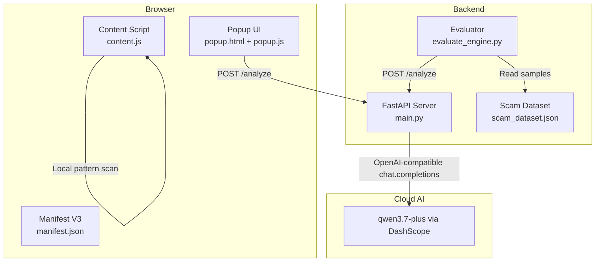
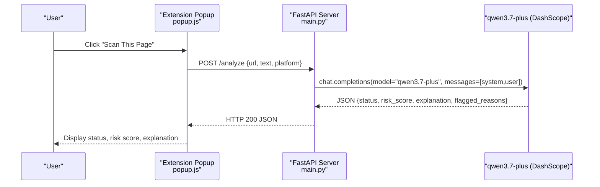
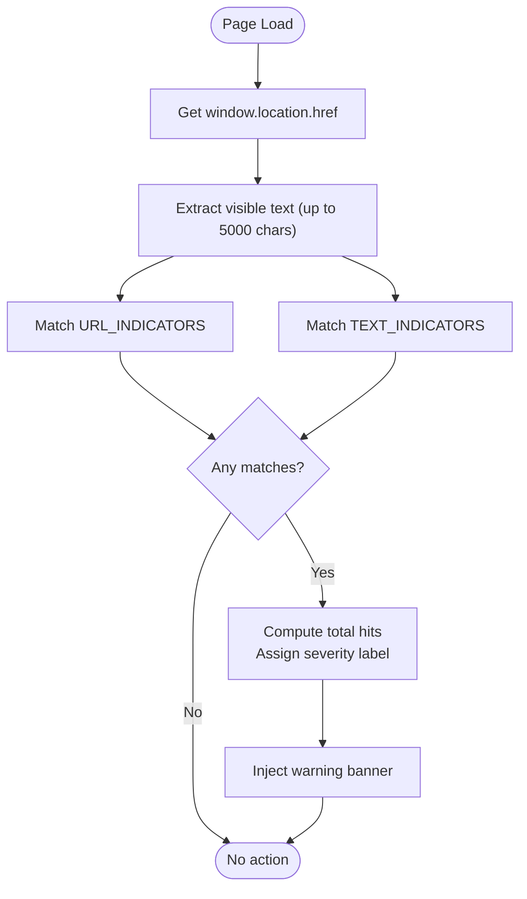
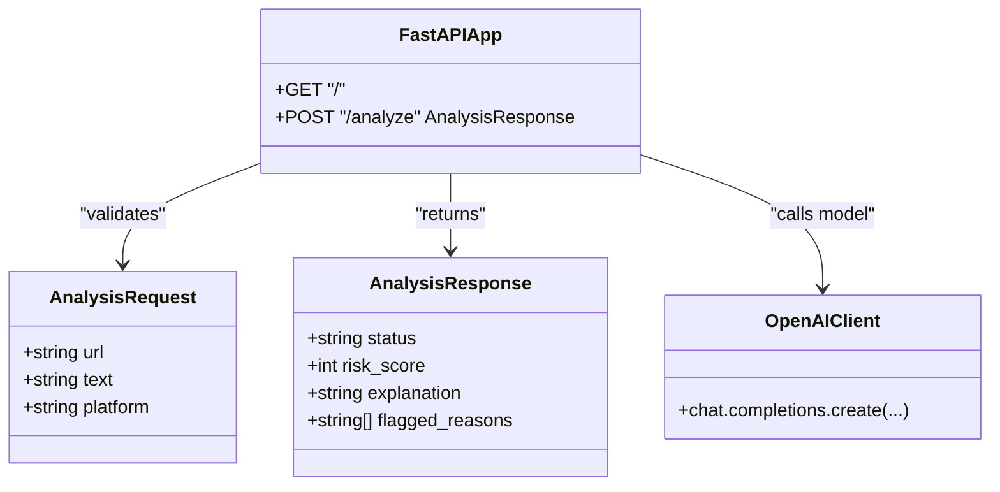
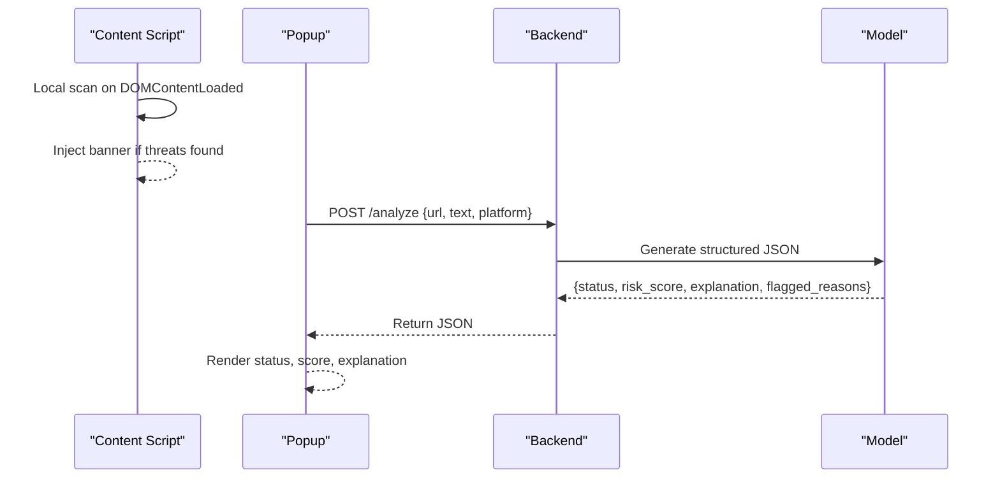
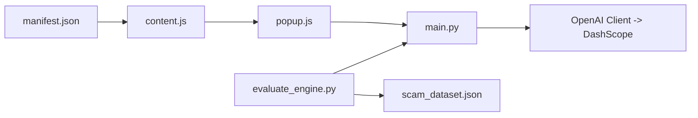

# Threat Detection Engine

<cite>
**Referenced Files in This Document**
- [main.py](file://backend/main.py)
- [evaluate_engine.py](file://backend/evaluate_engine.py)
- [scam_dataset.json](file://backend/scam_dataset.json)
- [content.js](file://extension/content.js)
- [popup.js](file://extension/popup.js)
- [popup.html](file://extension/popup.html)
- [manifest.json](file://extension/manifest.json)
- [README.md](file://README.md)
</cite>

## Table of Contents
1. [Introduction](#introduction)
2. [Project Structure](#project-structure)
3. [Core Components](#core-components)
4. [Architecture Overview](#architecture-overview)
5. [Detailed Component Analysis](#detailed-component-analysis)
6. [Dependency Analysis](#dependency-analysis)
7. [Performance Considerations](#performance-considerations)
8. [Troubleshooting Guide](#troubleshooting-guide)
9. [Conclusion](#conclusion)
10. [Appendices](#appendices)

## Introduction
ScrollGuard AI is a hybrid threat detection engine that combines local pattern matching with cloud-based AI analysis to identify phishing, scams, and malicious content in real time. The browser extension performs immediate, lightweight checks using URL indicators and text regex patterns to provide instant feedback via an on-page warning banner. For deeper understanding and nuanced classification, the system sends structured requests to a FastAPI backend that leverages the qwen3.7-plus model through DashScope’s OpenAI-compatible API. The AI layer returns a standardized JSON response including status (Safe/Suspicious/Dangerous), risk score (0–100), explanation, and flagged reasons. An evaluation script validates detection accuracy against a curated dataset.

## Project Structure
The project consists of:
- Backend: FastAPI server exposing an /analyze endpoint for AI-powered analysis
- Browser Extension: Content script for local scanning and popup UI for manual scans
- Evaluation: Script to benchmark detection accuracy using a sample dataset

**Diagram sources**
- [content.js:15-89](file://extension/content.js#L15-L89)
- [popup.js:16-45](file://extension/popup.js#L16-L45)
- [main.py:20-92](file://backend/main.py#L20-L92)
- [evaluate_engine.py:6-49](file://backend/evaluate_engine.py#L6-L49)
- [scam_dataset.json:1-37](file://backend/scam_dataset.json#L1-L37)
- [manifest.json:1-20](file://extension/manifest.json#L1-L20)

**Section sources**
- [README.md:45-56](file://README.md#L45-L56)
- [manifest.json:1-20](file://extension/manifest.json#L1-L20)

## Core Components
- Local Pattern Matching (Extension): Scans current page URL and visible text using predefined URL indicators and regex patterns to detect suspicious domains, shortened links, urgency phrases, and credential harvesting cues. Provides immediate visual warnings via an injected banner.
- AI-Powered Analysis (Backend): Accepts URL, text, and platform context; constructs a prompt for qwen3.7-plus; parses structured JSON output containing status, risk_score, explanation, and flagged_reasons.
- Evaluation Pipeline: Loads test cases from scam_dataset.json, posts each to the backend, compares predicted status with expected_status, and reports accuracy.

Key responsibilities:
- content.js: Real-time local scanning and UI injection
- main.py: API endpoint, prompt engineering, and AI integration
- evaluate_engine.py: Batched evaluation against dataset
- popup.js: Manual trigger to send current tab data to backend

**Section sources**
- [content.js:15-89](file://extension/content.js#L15-L89)
- [main.py:31-92](file://backend/main.py#L31-L92)
- [evaluate_engine.py:6-49](file://backend/evaluate_engine.py#L6-L49)
- [popup.js:16-45](file://extension/popup.js#L16-L45)

## Architecture Overview
The hybrid architecture separates immediate detection from deep analysis:
- Immediate detection runs locally in the browser using pattern matching for low-latency user feedback.
- Deep analysis is delegated to the backend which calls the AI model to produce nuanced classifications and explanations.

**Diagram sources**
- [popup.js:16-45](file://extension/popup.js#L16-L45)
- [main.py:64-92](file://backend/main.py#L64-L92)

## Detailed Component Analysis

### Local Pattern Matching System (Extension)
- URL Indicators: Checks for suspicious TLDs, known shorteners, phishing-style path keywords, and hyphen-heavy domain patterns. Returns matched indicators for severity calculation.
- Text Analysis: Uses regex patterns to detect prize/lottery scams, investment/crypto scams, phishing urgency, pressure tactics, and credential harvesting attempts.
- Severity Calculation: Computes total hits from URL and text matches to assign severity labels (Potential Threat, Suspicious, High Risk) and injects a persistent banner.

**Diagram sources**
- [content.js:61-99](file://extension/content.js#L61-L99)
- [content.js:106-110](file://extension/content.js#L106-L110)
- [content.js:257-267](file://extension/content.js#L257-L267)

**Section sources**
- [content.js:15-89](file://extension/content.js#L15-L89)
- [content.js:106-110](file://extension/content.js#L106-L110)
- [content.js:257-267](file://extension/content.js#L257-L267)

### AI-Powered Analysis Layer (Backend)
- Prompt Engineering: A system prompt defines role, output schema, and rules for status definitions and scoring ranges. The user payload includes platform, URL, and text content.
- Risk Scoring Methodology: The model assigns a risk_score between 0 and 100 aligned with status categories: Safe (0–25), Suspicious (26–69), Dangerous (70–100).
- Status Classification Logic:
  - Safe: Standard domains, verified URLs, benign context
  - Suspicious: Urgency tactics, shortened links, unrealistic claims
  - Dangerous: Known impersonation schemes, fraudulent domains, credential harvesting
- Natural Language Explanation: The model returns a concise explanation summarizing the threat assessment.

**Diagram sources**
- [main.py:31-40](file://backend/main.py#L31-L40)
- [main.py:64-92](file://backend/main.py#L64-L92)

**Section sources**
- [main.py:42-58](file://backend/main.py#L42-L58)
- [main.py:64-92](file://backend/main.py#L64-L92)

### Integration Between Local and Cloud Layers
- Immediate Feedback: The content script provides instant warnings based on local patterns without network latency.
- On-Demand Deep Analysis: Users can trigger the popup to send current tab data to the backend for comprehensive analysis and richer explanations.
- Contextual Inputs: Platform, URL, and text are combined into a single payload to help the model understand context and improve accuracy.

**Diagram sources**
- [content.js:257-267](file://extension/content.js#L257-L267)
- [popup.js:16-45](file://extension/popup.js#L16-L45)
- [main.py:64-92](file://backend/main.py#L64-L92)

**Section sources**
- [content.js:257-267](file://extension/content.js#L257-L267)
- [popup.js:16-45](file://extension/popup.js#L16-L45)
- [main.py:64-92](file://backend/main.py#L64-L92)

### Customization and Tuning
- Custom Pattern Creation: Extend URL_INDICATORS and TEXT_INDICATORS arrays in the content script to add new suspicious TLDs, shortener domains, or phrase patterns. Regex entries allow flexible matching for complex patterns.
- Prompt Customization: Modify the SYSTEM_PROMPT in the backend to adjust status definitions, scoring ranges, or add domain-specific rules for different threat types.
- Threshold Tuning: Adjust severity thresholds in the extension’s severity calculation logic to change when banners appear and how they are labeled. In the backend, refine prompt instructions to influence risk_score boundaries.

**Section sources**
- [content.js:15-57](file://extension/content.js#L15-L57)
- [content.js:106-110](file://extension/content.js#L106-L110)
- [main.py:42-58](file://backend/main.py#L42-L58)

### Evaluation and Benchmarking
- Dataset: scam_dataset.json contains labeled samples with expected_status for validation.
- Evaluator: evaluate_engine.py reads the dataset, posts each sample to the backend, compares predicted vs expected status, and prints per-sample results and overall accuracy.

**Diagram sources**
- [evaluate_engine.py:6-49](file://backend/evaluate_engine.py#L6-L49)
- [scam_dataset.json:1-37](file://backend/scam_dataset.json#L1-L37)

**Section sources**
- [evaluate_engine.py:6-49](file://backend/evaluate_engine.py#L6-L49)
- [scam_dataset.json:1-37](file://backend/scam_dataset.json#L1-L37)

## Dependency Analysis
- Extension depends on:
  - manifest.json for permissions and content script registration
  - content.js for local scanning and banner injection
  - popup.js for triggering backend analysis and displaying results
- Backend depends on:
  - FastAPI and CORS middleware for request handling
  - OpenAI client configured to use DashScope’s OpenAI-compatible endpoint
  - Environment variable DASHSCOPE_API_KEY for authentication
- Evaluator depends on:
  - requests library to call the backend
  - scam_dataset.json for test inputs and expected outputs

**Diagram sources**
- [manifest.json:1-20](file://extension/manifest.json#L1-L20)
- [content.js:257-267](file://extension/content.js#L257-L267)
- [popup.js:16-45](file://extension/popup.js#L16-L45)
- [main.py:15-18](file://backend/main.py#L15-L18)
- [evaluate_engine.py:6-49](file://backend/evaluate_engine.py#L6-L49)
- [scam_dataset.json:1-37](file://backend/scam_dataset.json#L1-L37)

**Section sources**
- [main.py:1-18](file://backend/main.py#L1-L18)
- [main.py:20-29](file://backend/main.py#L20-L29)
- [manifest.json:1-20](file://extension/manifest.json#L1-L20)

## Performance Considerations
- Local Scanning Efficiency:
  - Truncates visible text to a fixed length to limit processing overhead.
  - Uses simple string checks and regex tests for fast pattern matching.
  - Prevents duplicate banner injection by checking for an existing banner element.
- Network Optimization:
  - The popup triggers analysis only on explicit user action to avoid unnecessary requests.
  - The backend uses a single model call per request; consider batching multiple items at the API level if needed.
- Caching Strategies:
  - No caching is implemented in the current codebase. You could cache repeated URL analyses in-memory or in localStorage to reduce redundant AI calls.
- Fallback Mechanisms:
  - If the backend is unavailable, the extension still provides local pattern-based warnings.
  - The popup shows an error alert when connection fails; you could extend this to fall back to local severity estimation.
- Error Handling:
  - Backend raises HTTP exceptions for invalid payloads and parsing failures.
  - Evaluator handles request errors gracefully and continues processing remaining samples.

[No sources needed since this section provides general guidance]

## Troubleshooting Guide
- Missing API Key:
  - Ensure DASHSCOPE_API_KEY is set in environment variables before starting the backend.
- Backend Not Running:
  - The popup will show an error alert if it cannot connect to http://127.0.0.1:8000. Start the FastAPI server using uvicorn as documented.
- Invalid Payload:
  - The /analyze endpoint requires at least a URL or text; otherwise, it returns a 400 error.
- AI Response Parsing Errors:
  - If the model returns malformed JSON, the backend raises a 500 error indicating parsing failure. Validate the system prompt and model behavior.
- Evaluation Failures:
  - If scam_dataset.json is missing, the evaluator prints an error and exits. Ensure the file exists in the backend directory.

**Section sources**
- [main.py:11-13](file://backend/main.py#L11-L13)
- [main.py:64-92](file://backend/main.py#L64-L92)
- [popup.js:39-44](file://extension/popup.js#L39-L44)
- [evaluate_engine.py:7-12](file://backend/evaluate_engine.py#L7-L12)

## Conclusion
ScrollGuard AI delivers a practical hybrid approach to threat detection: immediate, low-latency local scanning for user awareness, complemented by robust AI-powered analysis for nuanced classification and explanations. The modular design allows easy customization of patterns, prompts, and thresholds, while the evaluation pipeline supports ongoing accuracy measurement. Future enhancements may include caching, request batching, and fallback strategies to further optimize performance and resilience.

[No sources needed since this section summarizes without analyzing specific files]

## Appendices

### Example Workflows
- Local Scan Workflow:
  - On page load, the content script extracts URL and visible text, applies URL and text indicators, computes severity, and injects a banner if threats are detected.
- Manual Scan Workflow:
  - The user opens the popup, clicks “Scan This Page,” and the extension sends the current tab’s URL and title to the backend for AI analysis. Results are displayed as status, risk score, and explanation.

**Section sources**
- [content.js:257-267](file://extension/content.js#L257-L267)
- [popup.js:16-45](file://extension/popup.js#L16-L45)