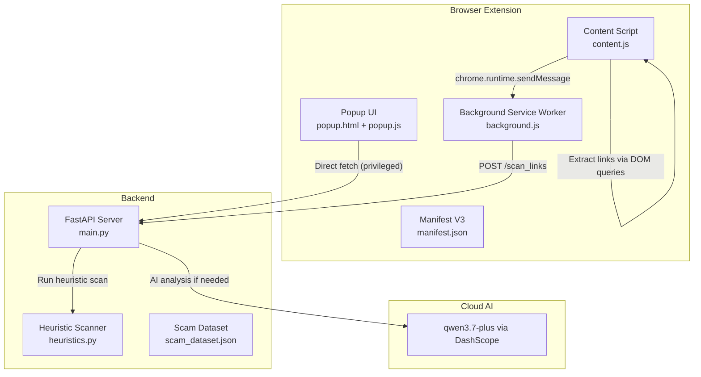
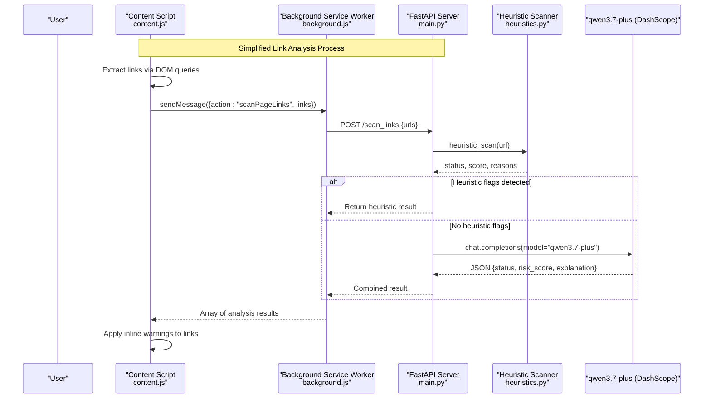
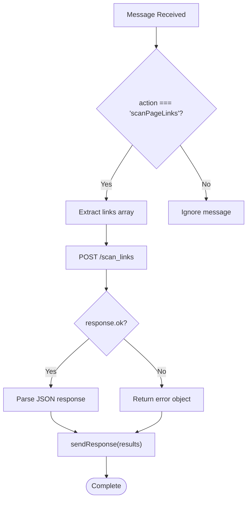
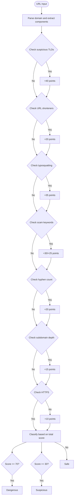
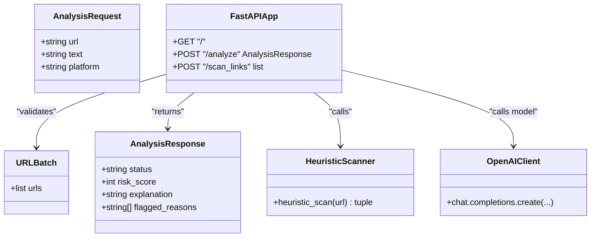
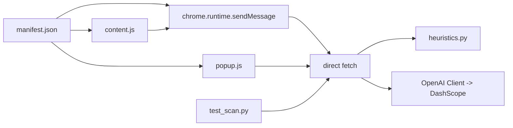

# Threat Detection Engine

<cite>
**Referenced Files in This Document**
- [main.py](file://backend/main.py)
- [heuristics.py](file://backend/heuristics.py)
- [content.js](file://extension/content.js)
- [background.js](file://extension/background.js)
- [popup.js](file://extension/popup.js)
- [popup.html](file://extension/popup.html)
- [manifest.json](file://extension/manifest.json)
- [test_scan.py](file://backend/test_scan.py)
</cite>

## Update Summary
**Changes Made**
- Updated Heuristic Scanning Engine section to reflect comprehensive rule-based detection enhancements
- Added detailed documentation for sophisticated TLD detection patterns (.tk, .ml, .ga, .cf, .gq, .xyz, .top, .buzz, .click, .icu, .cam)
- Enhanced URL shortener service detection with expanded list of known services
- Updated typosquatting detection for known brands (Google, PayPal, Amazon, Facebook, Apple, Microsoft)
- Refined keyword-based scam detection with comprehensive path and domain keyword lists
- Updated risk scoring algorithm with weighted scoring for various threat indicators
- Enhanced visual feedback system with improved inline styling and badge integration

## Table of Contents
1. [Introduction](#introduction)
2. [Project Structure](#project-structure)
3. [Core Components](#core-components)
4. [Architecture Overview](#architecture-overview)
5. [Detailed Component Analysis](#detailed-component-analysis)
6. [Dependency Analysis](#dependency-analysis)
7. [Performance Considerations](#performance-considerations)
8. [Troubleshooting Guide](#troubleshooting-guide)
9. [Conclusion](#conclusion)
10. [Appendices](#appendices)

## Introduction
ScrollGuard AI is a streamlined threat detection engine that combines simple browser-based link extraction with backend-driven heuristic scanning and AI-powered analysis. The system employs a simplified two-tier approach: the content script performs basic DOM queries to extract visible links from web pages, while the background service worker handles communication with the backend API for comprehensive threat analysis. The backend integrates rule-based heuristic scanning with sophisticated AI analysis through the qwen3.7-plus model to provide nuanced threat classification and explanations. This simplified architecture focuses on essential functionality while maintaining effectiveness in detecting suspicious URLs and potential threats.

## Project Structure
The project consists of:
- **Backend**: FastAPI server exposing endpoints for both single URL analysis and batch link scanning
- **Browser Extension**: 
  - Background service worker for secure API proxying and batch processing
  - Content script for basic link extraction from DOM elements
  - Popup UI for manual page scanning
- **Heuristic Engine**: Rule-based detection system for immediate threat identification



**Diagram sources**
- [content.js:12-43](file://extension/content.js#L12-L43)
- [background.js:17-44](file://extension/background.js#L17-L44)
- [main.py:110-149](file://backend/main.py#L110-L149)
- [heuristics.py:4-48](file://backend/heuristics.py#L4-L48)

**Section sources**
- [manifest.json:1-29](file://extension/manifest.json#L1-L29)

## Core Components
- **Simplified Content Script**: Basic DOM query functionality to extract all visible links from web pages using `document.querySelectorAll("a")`
- **Streamlined Background Service Worker**: Handles batch link analysis requests and communicates with backend API
- **Enhanced Heuristic Scanning Engine**: Comprehensive rule-based detection system identifying suspicious patterns in URLs including sophisticated TLD detection, typosquatting, shortened URLs, and scam keywords
- **AI-Powered Analysis Backend**: Integrates heuristic results with advanced AI analysis through qwen3.7-plus model for comprehensive threat assessment
- **Popup Interface**: Manual scanning capability for individual page URLs

Key responsibilities:
- **content.js**: Extract links from DOM and send to background service worker
- **background.js**: Batch processing and backend communication
- **heuristics.py**: Immediate threat detection using predefined rules
- **main.py**: API endpoints coordinating heuristic and AI analysis
- **popup.js**: User interface for manual scanning

**Section sources**
- [content.js:12-43](file://extension/content.js#L12-L43)
- [background.js:17-44](file://extension/background.js#L17-L44)
- [heuristics.py:4-48](file://backend/heuristics.py#L4-L48)
- [main.py:110-149](file://backend/main.py#L110-L149)
- [popup.js:7-36](file://extension/popup.js#L7-L36)

## Architecture Overview
The simplified architecture focuses on efficient link extraction and comprehensive backend analysis:



**Diagram sources**
- [content.js:18-41](file://extension/content.js#L18-L41)
- [background.js:39-44](file://extension/background.js#L39-L44)
- [main.py:110-149](file://backend/main.py#L110-L149)
- [heuristics.py:4-48](file://backend/heuristics.py#L4-L48)

## Detailed Component Analysis

### Simplified Content Script Implementation
The content script provides basic link extraction functionality using straightforward DOM queries:

**Link Extraction Logic**:
- Uses `document.querySelectorAll("a")` to find all anchor elements on the page
- Maps extracted elements to their href attributes
- Filters for valid HTTP(S) links only
- Sends collected links to background service worker for analysis

**Enhanced Visual Feedback System**:
- Applies inline styling directly to detected links with sophisticated visual indicators
- Red borders with 🚨 badges for Dangerous links, orange borders with ⚠️ badges for Suspicious links
- Tooltip integration showing risk assessment details with color-coded status
- Simple and effective visual indicators without complex DOM manipulation


**Diagram sources**
- [content.js:12-16](file://extension/content.js#L12-L16)
- [content.js:27-39](file://extension/content.js#L27-L39)

**Section sources**
- [content.js:12-43](file://extension/content.js#L12-L43)

### Streamlined Background Service Worker
The background service worker handles batch processing and backend communication:

**Batch Processing Architecture**:
- Accepts arrays of URLs from content scripts
- Performs HTTP POST requests to backend `/scan_links` endpoint
- Handles error responses and network failures gracefully
- Returns structured results back to content scripts

**Message Routing**:
- Listens for specific action messages (`scanPageLinks`)
- Routes messages to appropriate processing functions
- Maintains asynchronous communication patterns
- Provides consistent error handling across all operations



**Diagram sources**
- [background.js:39-44](file://extension/background.js#L39-L44)
- [background.js:17-33](file://extension/background.js#L17-L33)

**Section sources**
- [background.js:17-44](file://extension/background.js#L17-L44)

### Enhanced Heuristic Scanning Engine
The heuristic engine provides immediate threat detection using comprehensive rule-based analysis:

**Updated Detection Rules**:
- **Sophisticated TLD Detection**: Identifies domains ending in `.tk`, `.ml`, `.ga`, `.cf`, `.gq`, `.xyz`, `.top`, `.buzz`, `.click`, `.icu`, `.cam` commonly used in scams
- **URL Shortener Service Detection**: Flags known URL shortening services including bit.ly, tinyurl.com, t.co, ow.ly, shorturl.at, goo.gl, is.gd, buff.ly, rebrand.ly
- **Typosquatting Pattern Detection**: Detects domains with deceptive patterns mimicking known brands like Google (g00gl), PayPal (paypa1), Amazon (amaz0n), Facebook (faceb00k), Apple (app1e), Microsoft (mircosoft)
- **Comprehensive Keyword Analysis**: Searches for suspicious keywords in both URL paths and domain names including "claim", "winner", "free-money", "giveaway", "bonus", "verify-account", "urgent-security", "login-secure", "confirm-identity", "suspended-account", "double-bitcoin", "free-gift"
- **Advanced Security Protocol Checks**: Identifies missing HTTPS encryption and unusual subdomain nesting patterns
- **Hyphen-heavy Domain Detection**: Flags domains with excessive hyphens (3+ hyphens) commonly used in phishing attacks

**Refined Risk Scoring Algorithm**:
- Assigns weighted scores to different threat indicators based on severity:
  - Free/suspicious TLDs: +40 points
  - Typosquatting patterns: +35 points
  - Scam keywords in URL path: +30 points
  - Scam keywords in domain name: +25 points
  - URL shortener services: +20 points
  - Hyphen-heavy domains: +20 points
  - Excessive subdomain depth: +15 points
  - Missing HTTPS: +10 points
- Final classification based on cumulative score thresholds:
  - Dangerous: Score ≥ 70 points
  - Suspicious: Score ≥ 30 points
  - Safe: Score < 30 points



**Diagram sources**
- [heuristics.py:40-109](file://backend/heuristics.py#L40-L109)

**Section sources**
- [heuristics.py:4-110](file://backend/heuristics.py#L4-L110)

### AI-Powered Analysis Integration
The backend integrates heuristic results with advanced AI analysis:

**Hybrid Analysis Approach**:
- Runs heuristic scan first for immediate threat identification
- Only proceeds to AI analysis when heuristic scan returns "Safe" status
- Combines heuristic findings with AI insights for comprehensive assessment
- Maintains fast response times by leveraging quick heuristic checks

**Enhanced Prompt Engineering Strategy**:
- System prompt defines ScrollGuard AI role as cybersecurity expert specializing in online scams, phishing links, and fake giveaways targeting social media users
- Structured output schema ensures consistent JSON responses with status, score, explanation, and reasons fields
- Clear status definitions guide AI decision-making with specific criteria for Safe (0-25), Suspicious (26-69), and Dangerous (70-100) classifications
- Platform context provided for more accurate threat assessment

**Robust Error Handling and Fallbacks**:
- Graceful handling of AI service failures with proper exception management
- Consistent error response format across all failure scenarios
- Fallback to heuristic-only results when AI unavailable or fails to parse responses
- Markdown fence stripping for LLM responses that include ```json wrappers



**Diagram sources**
- [main.py:33-46](file://backend/main.py#L33-L46)
- [main.py:110-149](file://backend/main.py#L110-L149)
- [heuristics.py:4-48](file://backend/heuristics.py#L4-L48)

**Section sources**
- [main.py:110-149](file://backend/main.py#L110-L149)
- [main.py:71-108](file://backend/main.py#L71-L108)

### Popup Interface for Manual Scanning
The popup provides manual scanning capabilities for individual page URLs:

**Enhanced User Interaction Flow**:
- Click "Scan Current Page" button to initiate analysis with loading states
- Retrieves active tab URL via Chrome extension API
- Sends single URL to background service worker for processing
- Displays results with color-coded status indicators and detailed explanations

**Improved Result Display**:
- Color-coded text output with styled badges (green for Safe, orange for Suspicious, red for Dangerous)
- Risk score display alongside status information with formatted labels
- Clean, minimal interface focused on essential information with responsive design
- Loading spinner during analysis and error state handling

**Section sources**
- [popup.js:7-139](file://extension/popup.js#L7-L139)
- [popup.html:187-205](file://extension/popup.html#L187-L205)

## Dependency Analysis
The simplified architecture maintains essential dependencies while reducing complexity:

- **Extension Dependencies**:
  - manifest.json for permissions and service worker registration
  - content.js for basic DOM link extraction with enhanced visual feedback
  - background.js for backend communication and batch processing
  - popup.js for manual scanning interface with improved UI
- **Backend Dependencies**:
  - FastAPI and CORS middleware for request handling
  - OpenAI client configured for DashScope endpoint with rate limiting
  - Environment variable DASHSCOPE_API_KEY for authentication
  - heuristics.py for comprehensive rule-based threat detection
- **Communication Dependencies**:
  - chrome.runtime API for service worker messaging
  - fetch API for HTTP requests in privileged context



**Diagram sources**
- [manifest.json:14-22](file://extension/manifest.json#L14-L22)
- [content.js:18-41](file://extension/content.js#L18-L41)
- [background.js:39-44](file://extension/background.js#L39-L44)
- [main.py:110-149](file://backend/main.py#L110-L149)
- [heuristics.py:4-48](file://backend/heuristics.py#L4-L48)

**Section sources**
- [manifest.json:1-29](file://extension/manifest.json#L1-L29)
- [main.py:1-19](file://backend/main.py#L1-L19)

## Performance Considerations
The simplified architecture optimizes performance through strategic design choices:

**Enhanced Content Script Efficiency**:
- Uses efficient DOM queries with `document.querySelectorAll("a")` and WeakSet for memory-efficient element tracking
- Minimal JavaScript overhead with simple filtering logic and URL deduplication
- Throttled MutationObserver with debouncing at 300ms to prevent excessive processing
- Lightweight inline styling for visual feedback with idempotent marking

**Optimized Background Service Worker**:
- Batch processing reduces multiple API calls to single requests
- Efficient error handling prevents cascading failures
- Asynchronous message handling maintains responsiveness
- Simple request/response pattern minimizes overhead

**Enhanced Backend Performance**:
- Comprehensive heuristic scanning provides immediate results without AI latency
- Conditional AI analysis only runs when heuristic scan passes safe threshold
- Efficient URL parsing and pattern matching algorithms with regex optimization
- Structured error handling prevents resource leaks
- Rate limiting with semaphore for concurrent AI calls (max 5 concurrent)

**Network Optimization**:
- Single endpoint `/scan_links` handles batch requests efficiently
- Background service worker executes requests in privileged context
- Minimal payload size with essential data transmission
- Timeout handling prevents hanging connections (30-second timeout)

**Caching Strategies**:
- Client-side URL deduplication using Set to avoid redundant analyses
- No persistent caching implemented; consider adding localStorage for repeated URL analyses
- Backend could implement response caching for identical requests
- Heuristic results are deterministic and could be cached server-side

**Fallback Mechanisms**:
- Graceful degradation when background service worker is unavailable
- Local pattern matching continues to work even if AI analysis fails
- Error states handled throughout the communication chain
- Simple error messages provide user feedback with descriptive error states

**Section sources**
- [content.js:50-53](file://extension/content.js#L50-L53)
- [background.js:17-33](file://extension/background.js#L17-L33)
- [main.py:110-149](file://backend/main.py#L110-L149)
- [heuristics.py:4-48](file://backend/heuristics.py#L4-L48)

## Troubleshooting Guide
Common issues and solutions for the simplified architecture:

**Enhanced Content Script Issues**:
- **Links Not Being Extracted**: Verify DOM contains anchor elements and check console for errors
- **Visual Styling Not Applied**: Ensure CSS selectors match actual link elements and check for existing scrollguard markings
- **MutationObserver Not Working**: Check observer configuration and debouncing logic
- **Duplicate Link Processing**: Verify WeakSet and Set usage for proper deduplication

**Background Service Worker Problems**:
- **Messages Not Received**: Verify chrome.runtime.onMessage listener is properly registered
- **Backend Communication Failures**: Check BACKEND_URL configuration and network connectivity
- **Batch Processing Errors**: Validate URL array format and error handling
- **Timeout Issues**: Adjust timeout values if backend is slow to respond

**Backend Connectivity Issues**:
- **Missing API Key**: Set DASHSCOPE_API_KEY environment variable before starting backend
- **Server Not Running**: Start FastAPI server using uvicorn as documented
- **Connection Timeouts**: Verify network access and firewall settings
- **Rate Limiting**: Monitor concurrent AI call limits and adjust semaphore settings

**Enhanced Heuristic Scanning Issues**:
- **False Positives/Negatives**: Review rule thresholds and keyword lists in heuristics.py
- **Pattern Matching Errors**: Check regex patterns and string comparison logic for typosquatting detection
- **Score Calculation Issues**: Verify point assignments and threshold values for new detection rules
- **TLD Detection Problems**: Ensure suspicious TLD list is up-to-date with current abuse patterns

**Popup Functionality**:
- **Button Not Working**: Check event listener attachment and DOM element existence
- **Results Not Displaying**: Verify message passing and result formatting
- **Permission Errors**: Ensure proper manifest permissions are set
- **Loading States**: Check spinner implementation and button disable logic

**Evaluation and Testing**:
- **Test Script Failures**: Verify backend is running and accessible
- **Dataset Issues**: Check scam_dataset.json format and accessibility
- **API Endpoint Changes**: Update test configurations if backend changes
- **Performance Testing**: Monitor concurrent AI call limits and response times

**Section sources**
- [content.js:18-41](file://extension/content.js#L18-L41)
- [background.js:39-44](file://extension/background.js#L39-L44)
- [main.py:110-149](file://backend/main.py#L110-L149)
- [heuristics.py:4-48](file://backend/heuristics.py#L4-L48)
- [popup.js:7-36](file://extension/popup.js#L7-L36)

## Conclusion
ScrollGuard AI delivers a streamlined threat detection system that effectively combines simple browser-based link extraction with comprehensive backend analysis. The enhanced heuristic scanning engine provides sophisticated rule-based detection with comprehensive TLD monitoring, typosquatting protection, and keyword analysis. The simplified architecture focuses on essential functionality while maintaining effectiveness in detecting suspicious URLs through integrated heuristic scanning and AI-powered analysis. The modular design enables easy customization of detection rules and analysis parameters, while the efficient communication patterns ensure responsive user experience. Future enhancements may include expanded heuristic rules, improved visual feedback mechanisms, additional caching strategies, and enhanced error reporting to further optimize performance and usability.

## Appendices

### Example Workflows
**Automatic Link Analysis Workflow**:
- On page load, content script extracts all visible links using DOM queries with WeakSet deduplication
- Links are sent to background service worker for batch processing with timeout handling
- Backend runs comprehensive heuristic scan first for immediate threat identification
- AI analysis performed only when heuristic scan returns safe results with rate limiting
- Results returned with enhanced inline visual indicators applied to links

**Manual Popup Analysis Workflow**:
- User clicks "Scan Current Page" button in popup with loading state management
- Popup retrieves active tab URL and sends to background service worker
- Background service worker processes request through backend API with error handling
- Results displayed with color-coded status indicators and detailed explanations
- Risk scores and explanations provided for each analyzed URL with formatted presentation

**Enhanced Heuristic Analysis Workflow**:
- URL parsed and components extracted (domain, path, query)
- Multiple detection rules applied in sequence: TLD check, shortener detection, typosquatting analysis, keyword scanning
- Weighted scoring system calculates cumulative risk score
- Classification determined by threshold-based scoring (Safe < 30, Suspicious 30-69, Dangerous ≥ 70)
- Detailed reasons provided for each detected threat indicator

**Section sources**
- [content.js:12-43](file://extension/content.js#L12-L43)
- [background.js:39-44](file://extension/background.js#L39-L44)
- [popup.js:7-139](file://extension/popup.js#L7-L139)
- [main.py:110-149](file://backend/main.py#L110-L149)
- [heuristics.py:40-109](file://backend/heuristics.py#L40-L109)