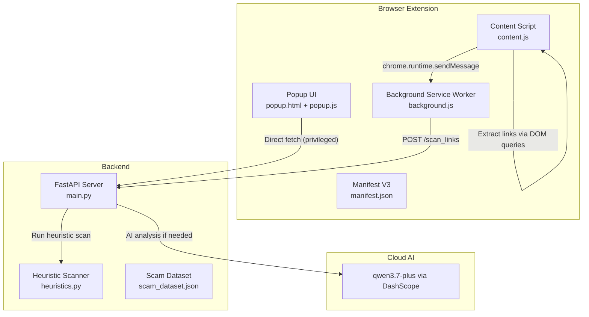
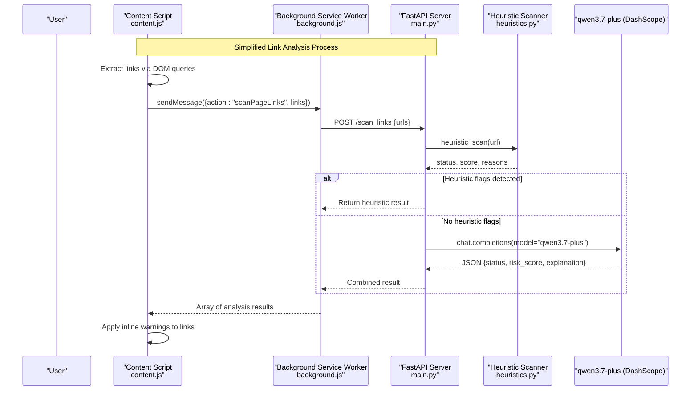
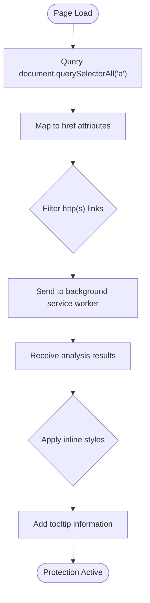
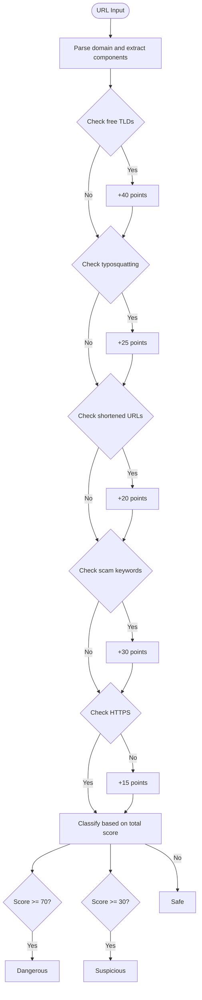
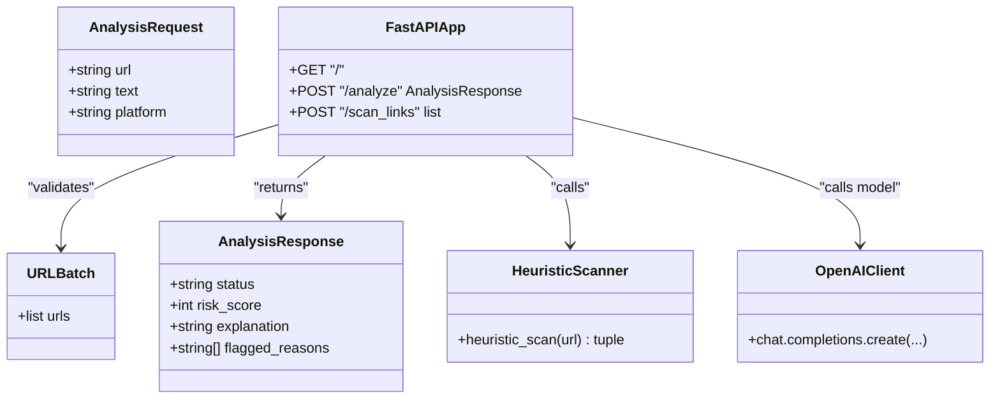
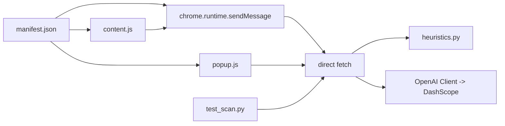

# Threat Detection Engine

<cite>
**Referenced Files in This Document**
- [main.py](file://backend/main.py)
- [heuristics.py](file://backend/heuristics.py)
- [content.js](file://extension/content.js)
- [background.js](file://extension/background.js)
- [popup.js](file://extension/popup.js)
- [popup.html](file://extension/popup.html)
- [manifest.json](file://extension/manifest.json)
- [test_scan.py](file://backend/test_scan.py)
</cite>

## Update Summary
**Changes Made**
- Removed comprehensive three-layer detection system documentation (Layer 1 local heuristic scanning, Layer 2 AI-powered analysis via background service worker, Layer 3 real-time SPA link monitoring)
- Updated to reflect simplified content script with basic DOM queries for link extraction
- Simplified background service worker architecture focused on batch link analysis
- Streamlined backend with heuristic scanning as primary detection mechanism
- Removed MutationObserver-based SPA monitoring and complex visual feedback systems
- Updated performance considerations to reflect simplified architecture

## Table of Contents
1. [Introduction](#introduction)
2. [Project Structure](#project-structure)
3. [Core Components](#core-components)
4. [Architecture Overview](#architecture-overview)
5. [Detailed Component Analysis](#detailed-component-analysis)
6. [Dependency Analysis](#dependency-analysis)
7. [Performance Considerations](#performance-considerations)
8. [Troubleshooting Guide](#troubleshooting-guide)
9. [Conclusion](#conclusion)
10. [Appendices](#appendices)

## Introduction
ScrollGuard AI is a streamlined threat detection engine that combines simple browser-based link extraction with backend-driven heuristic scanning and AI-powered analysis. The system employs a simplified two-tier approach: the content script performs basic DOM queries to extract visible links from web pages, while the background service worker handles communication with the backend API for comprehensive threat analysis. The backend integrates rule-based heuristic scanning with sophisticated AI analysis through the qwen3.7-plus model to provide nuanced threat classification and explanations. This simplified architecture focuses on essential functionality while maintaining effectiveness in detecting suspicious URLs and potential threats.

## Project Structure
The project consists of:
- **Backend**: FastAPI server exposing endpoints for both single URL analysis and batch link scanning
- **Browser Extension**: 
  - Background service worker for secure API proxying and batch processing
  - Content script for basic link extraction from DOM elements
  - Popup UI for manual page scanning
- **Heuristic Engine**: Rule-based detection system for immediate threat identification

**Diagram sources**
- [content.js:12-43](file://extension/content.js#L12-L43)
- [background.js:17-44](file://extension/background.js#L17-L44)
- [main.py:110-149](file://backend/main.py#L110-L149)
- [heuristics.py:4-48](file://backend/heuristics.py#L4-L48)

**Section sources**
- [manifest.json:1-29](file://extension/manifest.json#L1-L29)

## Core Components
- **Simplified Content Script**: Basic DOM query functionality to extract all visible links from web pages using `document.querySelectorAll("a")`
- **Streamlined Background Service Worker**: Handles batch link analysis requests and communicates with backend API
- **Heuristic Scanning Engine**: Rule-based detection system identifying suspicious patterns in URLs including free TLDs, typosquatting, shortened URLs, and scam keywords
- **AI-Powered Analysis Backend**: Integrates heuristic results with advanced AI analysis through qwen3.7-plus model for comprehensive threat assessment
- **Popup Interface**: Manual scanning capability for individual page URLs

Key responsibilities:
- **content.js**: Extract links from DOM and send to background service worker
- **background.js**: Batch processing and backend communication
- **heuristics.py**: Immediate threat detection using predefined rules
- **main.py**: API endpoints coordinating heuristic and AI analysis
- **popup.js**: User interface for manual scanning

**Section sources**
- [content.js:12-43](file://extension/content.js#L12-L43)
- [background.js:17-44](file://extension/background.js#L17-L44)
- [heuristics.py:4-48](file://backend/heuristics.py#L4-L48)
- [main.py:110-149](file://backend/main.py#L110-L149)
- [popup.js:7-36](file://extension/popup.js#L7-L36)

## Architecture Overview
The simplified architecture focuses on efficient link extraction and comprehensive backend analysis:

**Diagram sources**
- [content.js:18-41](file://extension/content.js#L18-L41)
- [background.js:39-44](file://extension/background.js#L39-L44)
- [main.py:110-149](file://backend/main.py#L110-L149)
- [heuristics.py:4-48](file://backend/heuristics.py#L4-L48)

## Detailed Component Analysis

### Simplified Content Script Implementation
The content script provides basic link extraction functionality using straightforward DOM queries:

**Link Extraction Logic**:
- Uses `document.querySelectorAll("a")` to find all anchor elements on the page
- Maps extracted elements to their href attributes
- Filters for valid HTTP(S) links only
- Sends collected links to background service worker for analysis

**Visual Feedback System**:
- Applies inline styling directly to detected links
- Red borders for Dangerous links, orange for Suspicious, no border for Safe
- Tooltip integration showing risk assessment details
- Simple and effective visual indicators without complex DOM manipulation

**Diagram sources**
- [content.js:12-16](file://extension/content.js#L12-L16)
- [content.js:27-39](file://extension/content.js#L27-L39)

**Section sources**
- [content.js:12-43](file://extension/content.js#L12-L43)

### Streamlined Background Service Worker
The background service worker handles batch processing and backend communication:

**Batch Processing Architecture**:
- Accepts arrays of URLs from content scripts
- Performs HTTP POST requests to backend `/scan_links` endpoint
- Handles error responses and network failures gracefully
- Returns structured results back to content scripts

**Message Routing**:
- Listens for specific action messages (`scanPageLinks`)
- Routes messages to appropriate processing functions
- Maintains asynchronous communication patterns
- Provides consistent error handling across all operations

**Diagram sources**
- [background.js:39-44](file://extension/background.js#L39-L44)
- [background.js:17-33](file://extension/background.js#L17-L33)

**Section sources**
- [background.js:17-44](file://extension/background.js#L17-L44)

### Heuristic Scanning Engine
The heuristic engine provides immediate threat detection using rule-based analysis:

**Detection Rules**:
- **Free TLD Detection**: Identifies domains ending in `.tk`, `.ml`, `.ga`, `.cf`, `.gq` commonly used in scams
- **Typosquatting Patterns**: Detects domains with repeated characters or deceptive patterns like `0o`, `1l`, or hyphens
- **Shortened URL Recognition**: Flags known URL shortening services (bit.ly, tinyurl, t.co)
- **Scam Keyword Analysis**: Searches for suspicious keywords like "claim", "win", "free", "bonus", "verify", "urgent", "login"
- **Security Protocol Checks**: Identifies missing HTTPS encryption

**Risk Scoring Algorithm**:
- Assigns weighted scores to different threat indicators
- Free TLDs: +40 points
- Typosquatting patterns: +25 points  
- Shortened URLs: +20 points
- Scam keywords: +30 points
- Missing HTTPS: +15 points
- Final classification based on cumulative score thresholds

**Diagram sources**
- [heuristics.py:4-48](file://backend/heuristics.py#L4-L48)

**Section sources**
- [heuristics.py:4-48](file://backend/heuristics.py#L4-L48)

### AI-Powered Analysis Integration
The backend integrates heuristic results with advanced AI analysis:

**Hybrid Analysis Approach**:
- Runs heuristic scan first for immediate threat identification
- Only proceeds to AI analysis when heuristic scan returns "Safe" status
- Combines heuristic findings with AI insights for comprehensive assessment
- Maintains fast response times by leveraging quick heuristic checks

**Prompt Engineering Strategy**:
- System prompt defines ScrollGuard AI role as cybersecurity expert
- Structured output schema ensures consistent JSON responses
- Clear status definitions guide AI decision-making
- Platform context provided for more accurate threat assessment

**Error Handling and Fallbacks**:
- Graceful handling of AI service failures
- Consistent error response format
- Fallback to heuristic-only results when AI unavailable

**Diagram sources**
- [main.py:33-46](file://backend/main.py#L33-L46)
- [main.py:110-149](file://backend/main.py#L110-L149)
- [heuristics.py:4-48](file://backend/heuristics.py#L4-L48)

**Section sources**
- [main.py:110-149](file://backend/main.py#L110-L149)
- [main.py:71-108](file://backend/main.py#L71-L108)

### Popup Interface for Manual Scanning
The popup provides manual scanning capabilities for individual page URLs:

**User Interaction Flow**:
- Click "Scan Current Page" button to initiate analysis
- Retrieves active tab URL via Chrome extension API
- Sends single URL to background service worker for processing
- Displays results with color-coded status indicators

**Result Display**:
- Color-coded text output (green for Safe, orange for Suspicious, red for Dangerous)
- Risk score display alongside status information
- Clean, minimal interface focused on essential information

**Section sources**
- [popup.js:7-36](file://extension/popup.js#L7-L36)
- [popup.html:39-46](file://extension/popup.html#L39-L46)

## Dependency Analysis
The simplified architecture maintains essential dependencies while reducing complexity:

- **Extension Dependencies**:
  - manifest.json for permissions and service worker registration
  - content.js for basic DOM link extraction
  - background.js for backend communication and batch processing
  - popup.js for manual scanning interface
- **Backend Dependencies**:
  - FastAPI and CORS middleware for request handling
  - OpenAI client configured for DashScope endpoint
  - Environment variable DASHSCOPE_API_KEY for authentication
  - heuristics.py for rule-based threat detection
- **Communication Dependencies**:
  - chrome.runtime API for service worker messaging
  - fetch API for HTTP requests in privileged context

**Diagram sources**
- [manifest.json:14-22](file://extension/manifest.json#L14-L22)
- [content.js:18-41](file://extension/content.js#L18-L41)
- [background.js:39-44](file://extension/background.js#L39-L44)
- [main.py:110-149](file://backend/main.py#L110-L149)
- [heuristics.py:4-48](file://backend/heuristics.py#L4-L48)

**Section sources**
- [manifest.json:1-29](file://extension/manifest.json#L1-L29)
- [main.py:1-19](file://backend/main.py#L1-L19)

## Performance Considerations
The simplified architecture optimizes performance through strategic design choices:

**Content Script Efficiency**:
- Uses efficient DOM queries with `document.querySelectorAll("a")`
- Minimal JavaScript overhead with simple filtering logic
- Throttled scroll event handling prevents excessive processing
- Lightweight inline styling for visual feedback

**Background Service Worker Optimization**:
- Batch processing reduces multiple API calls to single requests
- Efficient error handling prevents cascading failures
- Asynchronous message handling maintains responsiveness
- Simple request/response pattern minimizes overhead

**Backend Performance**:
- Heuristic scanning provides immediate results without AI latency
- Conditional AI analysis only runs when heuristic scan passes
- Efficient URL parsing and pattern matching algorithms
- Structured error handling prevents resource leaks

**Network Optimization**:
- Single endpoint `/scan_links` handles batch requests efficiently
- Background service worker executes requests in privileged context
- Minimal payload size with essential data transmission
- Timeout handling prevents hanging connections

**Caching Strategies**:
- No client-side caching implemented; consider adding localStorage for repeated URL analyses
- Backend could implement response caching for identical requests
- Heuristic results are deterministic and could be cached server-side

**Fallback Mechanisms**:
- Graceful degradation when background service worker is unavailable
- Local pattern matching continues to work even if AI analysis fails
- Error states handled throughout the communication chain
- Simple error messages provide user feedback

**Section sources**
- [content.js:50-53](file://extension/content.js#L50-L53)
- [background.js:17-33](file://extension/background.js#L17-L33)
- [main.py:110-149](file://backend/main.py#L110-L149)
- [heuristics.py:4-48](file://backend/heuristics.py#L4-L48)

## Troubleshooting Guide
Common issues and solutions for the simplified architecture:

**Content Script Issues**:
- **Links Not Being Extracted**: Verify DOM contains anchor elements and check console for errors
- **Visual Styling Not Applied**: Ensure CSS selectors match actual link elements
- **Scroll Events Not Triggering**: Check event listener registration and throttling logic

**Background Service Worker Problems**:
- **Messages Not Received**: Verify chrome.runtime.onMessage listener is properly registered
- **Backend Communication Failures**: Check BACKEND_URL configuration and network connectivity
- **Batch Processing Errors**: Validate URL array format and error handling

**Backend Connectivity Issues**:
- **Missing API Key**: Set DASHSCOPE_API_KEY environment variable before starting backend
- **Server Not Running**: Start FastAPI server using uvicorn as documented
- **Connection Timeouts**: Verify network access and firewall settings

**Heuristic Scanning Issues**:
- **False Positives/Negatives**: Review rule thresholds in heuristics.py
- **Pattern Matching Errors**: Check regex patterns and string comparison logic
- **Score Calculation Issues**: Verify point assignments and threshold values

**Popup Functionality**:
- **Button Not Working**: Check event listener attachment and DOM element existence
- **Results Not Displaying**: Verify message passing and result formatting
- **Permission Errors**: Ensure proper manifest permissions are set

**Evaluation and Testing**:
- **Test Script Failures**: Verify backend is running and accessible
- **Dataset Issues**: Check scam_dataset.json format and accessibility
- **API Endpoint Changes**: Update test configurations if backend changes

**Section sources**
- [content.js:18-41](file://extension/content.js#L18-L41)
- [background.js:39-44](file://extension/background.js#L39-L44)
- [main.py:110-149](file://backend/main.py#L110-L149)
- [heuristics.py:4-48](file://backend/heuristics.py#L4-L48)
- [popup.js:7-36](file://extension/popup.js#L7-L36)

## Conclusion
ScrollGuard AI delivers a streamlined threat detection system that effectively combines simple browser-based link extraction with comprehensive backend analysis. The simplified architecture focuses on essential functionality while maintaining effectiveness in detecting suspicious URLs through integrated heuristic scanning and AI-powered analysis. The modular design enables easy customization of detection rules and analysis parameters, while the efficient communication patterns ensure responsive user experience. Future enhancements may include expanded heuristic rules, improved visual feedback mechanisms, additional caching strategies, and enhanced error reporting to further optimize performance and usability.

## Appendices

### Example Workflows
**Automatic Link Analysis Workflow**:
- On page load, content script extracts all visible links using DOM queries
- Links are sent to background service worker for batch processing
- Backend runs heuristic scan first for immediate threat identification
- AI analysis performed only when heuristic scan returns safe results
- Results returned with inline visual indicators applied to links

**Manual Popup Analysis Workflow**:
- User clicks "Scan Current Page" button in popup
- Popup retrieves active tab URL and sends to background service worker
- Background service worker processes request through backend API
- Results displayed with color-coded status indicators
- Risk scores and explanations provided for each analyzed URL

**Section sources**
- [content.js:12-43](file://extension/content.js#L12-L43)
- [background.js:39-44](file://extension/background.js#L39-L44)
- [popup.js:7-36](file://extension/popup.js#L7-L36)
- [main.py:110-149](file://backend/main.py#L110-L149)