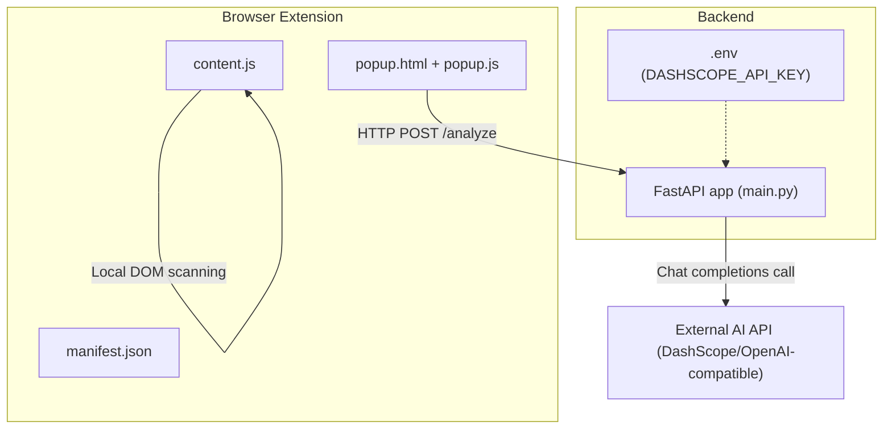
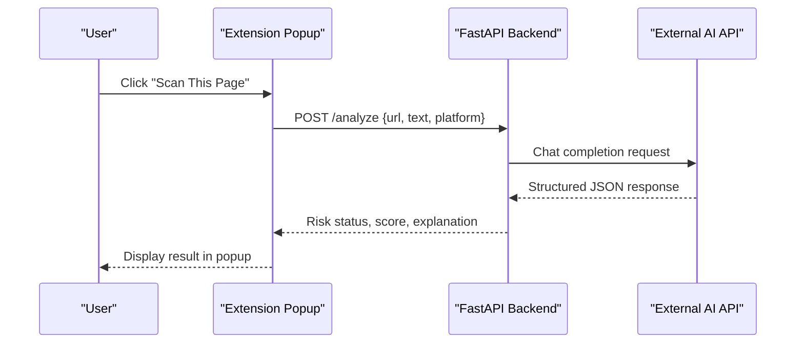
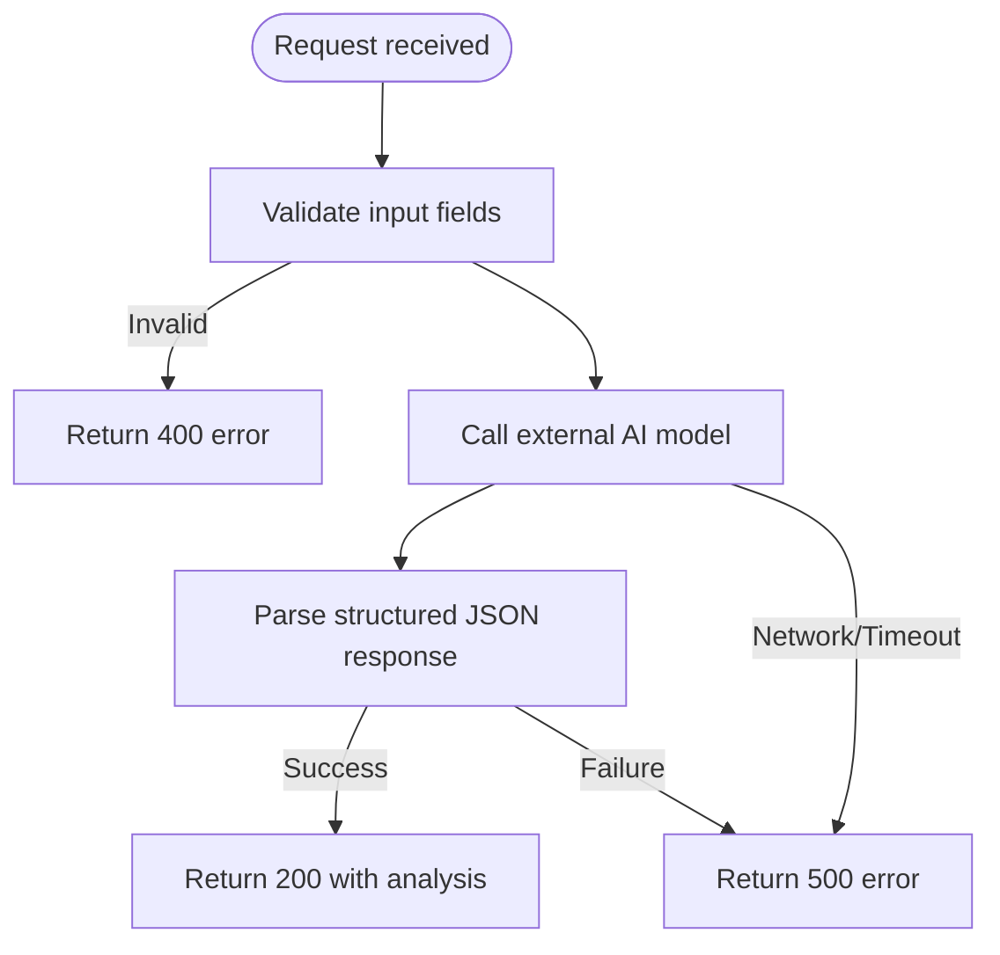
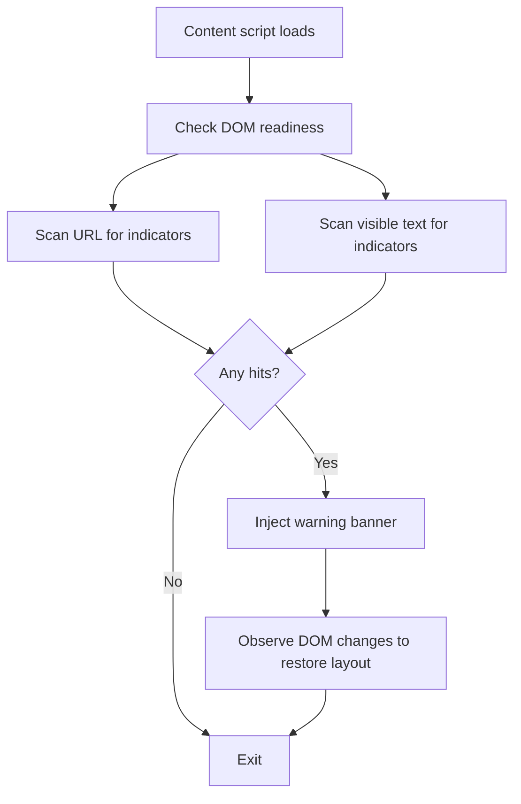
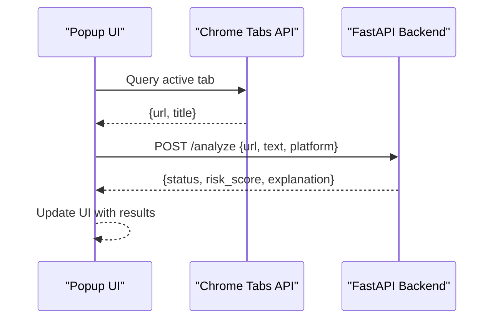

# Troubleshooting and FAQ

<cite>
**Referenced Files in This Document**
- [README.md](file://README.md)
- [main.py](file://backend/main.py)
- [evaluate_engine.py](file://backend/evaluate_engine.py)
- [manifest.json](file://extension/manifest.json)
- [content.js](file://extension/content.js)
- [popup.html](file://extension/popup.html)
- [popup.js](file://extension/popup.js)
</cite>

## Table of Contents
1. Introduction
2. Project Structure
3. Core Components
4. Architecture Overview
5. Detailed Component Analysis
6. Dependency Analysis
7. Performance Considerations
8. Troubleshooting Guide
9. Conclusion
10. Appendices

## Introduction
This document provides comprehensive troubleshooting guidance for the ScrollGuard AI application, covering setup issues, backend API debugging, extension debugging, performance tuning, frequently asked questions, diagnostic tools, and migration/rollback procedures. It is designed to help both new users and experienced developers quickly resolve common problems and optimize the system.

## Project Structure
ScrollGuard AI consists of:
- A FastAPI backend that integrates with an external AI model via a compatible OpenAI-style client.
- A Chrome/Edge browser extension (Manifest V3) with a content script for local scanning and a popup UI that calls the backend.

**Diagram sources**
- [main.py:1-92](file://backend/main.py#L1-L92)
- [manifest.json:1-20](file://extension/manifest.json#L1-L20)
- [content.js:1-276](file://extension/content.js#L1-L276)
- [popup.html:1-108](file://extension/popup.html#L1-L108)
- [popup.js:1-46](file://extension/popup.js#L1-L46)

**Section sources**
- [README.md:45-168](file://README.md#L45-L168)
- [main.py:1-92](file://backend/main.py#L1-L92)
- [manifest.json:1-20](file://extension/manifest.json#L1-L20)
- [content.js:1-276](file://extension/content.js#L1-L276)
- [popup.html:1-108](file://extension/popup.html#L1-L108)
- [popup.js:1-46](file://extension/popup.js#L1-L46)

## Core Components
- Backend API server:
  - Loads environment variables and validates required keys at startup.
  - Configures CORS to allow requests from the browser extension.
  - Exposes endpoints including a root health check and an analysis endpoint that calls the external AI service and returns structured results.
- Browser extension:
  - Content script performs local scanning using URL patterns and text heuristics, injecting a warning banner when threats are detected.
  - Popup UI retrieves the active tab’s URL/title and sends it to the backend for AI-based analysis.

**Section sources**
- [main.py:1-92](file://backend/main.py#L1-L92)
- [content.js:1-276](file://extension/content.js#L1-L276)
- [popup.html:1-108](file://extension/popup.html#L1-L108)
- [popup.js:1-46](file://extension/popup.js#L1-L46)

## Architecture Overview
The extension triggers two flows:
- Local scanning flow: The content script scans the page URL and visible text for scam indicators and injects a warning banner directly in the browser.
- AI-assisted analysis flow: The popup sends the current tab’s URL and title to the backend, which calls the external AI model and returns a risk assessment.

**Diagram sources**
- [popup.js:16-45](file://extension/popup.js#L16-L45)
- [main.py:64-92](file://backend/main.py#L64-L92)

## Detailed Component Analysis

### Backend API (FastAPI)
Key responsibilities:
- Environment validation: Ensures the required API key is present before starting.
- CORS configuration: Allows cross-origin requests from the extension.
- Request handling: Validates inputs, constructs prompts, calls the external AI service, parses structured output, and returns standardized responses.

Common failure points:
- Missing or invalid environment variable for the external API key.
- Network failures or timeouts when calling the external AI service.
- Malformed responses from the AI service leading to parsing errors.

**Diagram sources**
- [main.py:31-40](file://backend/main.py#L31-L40)
- [main.py:64-92](file://backend/main.py#L64-L92)

**Section sources**
- [main.py:1-92](file://backend/main.py#L1-L92)

### Extension Content Script
Key responsibilities:
- Detect suspicious URLs and text patterns using built-in heuristics.
- Inject a persistent warning banner into the page when risks are found.
- Prevent duplicate injections and manage banner lifecycle.

Common failure points:
- Script not running due to incorrect manifest configuration.
- DOM manipulation conflicts on pages with strict CSP or dynamic content.
- Banner not appearing due to early execution timing or missing DOM elements.

**Diagram sources**
- [content.js:12-13](file://extension/content.js#L12-L13)
- [content.js:65-89](file://extension/content.js#L65-L89)
- [content.js:106-253](file://extension/content.js#L106-L253)
- [content.js:257-274](file://extension/content.js#L257-L274)

**Section sources**
- [content.js:1-276](file://extension/content.js#L1-L276)

### Extension Popup
Key responsibilities:
- Retrieve the active tab’s URL and title.
- Send analysis request to the backend.
- Render status, risk score, and explanation.

Common failure points:
- Backend not running or unreachable.
- CORS misconfiguration preventing requests from the extension.
- Incorrect payload format causing backend validation errors.

**Diagram sources**
- [popup.js:1-45](file://extension/popup.js#L1-L45)

**Section sources**
- [popup.html:1-108](file://extension/popup.html#L1-L108)
- [popup.js:1-46](file://extension/popup.js#L1-L46)

## Dependency Analysis
- External dependencies:
  - FastAPI and Uvicorn for the API server.
  - OpenAI-compatible client to call DashScope’s OpenAI-compatible endpoint.
  - Python-Dotenv for environment variable loading.
  - Pydantic for request/response models.
  - Requests used by evaluation script to test the backend.
- Extension dependencies:
  - Manifest V3 permissions for active tab access and scripting.
  - Content scripts injected into all URLs.

Potential coupling issues:
- Hardcoded backend address in the extension popup may break if the server port or host changes.
- CORS policy must remain permissive for local development; tighten for production.

**Section sources**
- [README.md:99-132](file://README.md#L99-L132)
- [main.py:1-29](file://backend/main.py#L1-L29)
- [evaluate_engine.py:1-49](file://backend/evaluate_engine.py#L1-L49)
- [manifest.json:1-20](file://extension/manifest.json#L1-L20)
- [popup.js:20-29](file://extension/popup.js#L20-L29)

## Performance Considerations
- Slow page scanning:
  - Reduce the amount of text scanned by limiting the sampled length in the content script.
  - Optimize regex checks and avoid unnecessary DOM traversals.
- High memory usage:
  - Avoid storing large strings in memory; process chunks where possible.
  - Ensure banners and observers are properly cleaned up when dismissed.
- API timeout problems:
  - Increase client-side timeouts or add retry logic in the extension popup.
  - Configure backend timeouts and implement graceful degradation when the external AI service is slow or unavailable.

[No sources needed since this section provides general guidance]

## Troubleshooting Guide

### Setup Issues

#### Python dependency conflicts
Symptoms:
- Import errors when starting the backend.
- Incompatible package versions causing runtime exceptions.

Resolution steps:
- Use a virtual environment to isolate dependencies.
- Install only the required packages listed in the installation guide.
- If conflicts persist, recreate the environment and reinstall dependencies.

**Section sources**
- [README.md:99-104](file://README.md#L99-L104)

#### Missing environment variables
Symptoms:
- Startup error indicating the required API key is not set.
- Backend fails to initialize.

Resolution steps:
- Create a .env file in the backend directory with the required key.
- Ensure the key is not quoted and the file is ignored by version control.
- Restart the server after updating the .env file.

**Section sources**
- [main.py:11-13](file://backend/main.py#L11-L13)
- [README.md:109-122](file://README.md#L109-L122)

#### CORS errors
Symptoms:
- Browser blocks requests from the extension to the backend.
- Console shows CORS-related network errors.

Resolution steps:
- Verify the backend has CORS middleware enabled and allows origins from the extension.
- For local development, ensure the origin matches the extension’s context.
- In production, restrict allowed origins to trusted domains.

**Section sources**
- [main.py:22-29](file://backend/main.py#L22-L29)

#### Chrome extension loading failures
Symptoms:
- Extension does not appear in chrome://extensions/.
- Errors when trying to load unpacked folder.

Resolution steps:
- Enable Developer Mode in the extensions page.
- Load the extension from the correct folder path.
- Confirm manifest_version is set correctly and permissions are declared.

**Section sources**
- [README.md:147-168](file://README.md#L147-L168)
- [manifest.json:1-20](file://extension/manifest.json#L1-L20)

### Backend API Debugging

#### Using FastAPI interactive documentation
- Access the auto-generated docs at the documented docs URL.
- Use the interface to test endpoints and inspect schemas.

**Section sources**
- [README.md:127-142](file://README.md#L127-L142)

#### Checking server logs
- Run the server with reload mode during development to capture detailed logs.
- Look for startup errors, request traces, and exception messages.

**Section sources**
- [README.md:127-132](file://README.md#L127-L132)

#### Testing endpoints with curl or Postman
- Test the root endpoint to verify the server is running.
- Send a POST request to the analyze endpoint with a valid payload containing at least one of url or text.

**Section sources**
- [main.py:60-67](file://backend/main.py#L60-L67)
- [main.py:64-92](file://backend/main.py#L64-L92)

#### Diagnosing network connectivity issues
- Confirm the backend is reachable at the expected host and port.
- Check firewall settings and proxy configurations that might block requests.
- Validate DNS resolution if using a domain instead of localhost.

[No sources needed since this section provides general guidance]

### Extension Debugging

#### Using Chrome DevTools
- Open DevTools on any page and switch to the Console tab to view JavaScript errors.
- Use the Network tab to monitor requests made by the extension popup.

**Section sources**
- [popup.js:16-45](file://extension/popup.js#L16-L45)

#### Inspecting content script execution
- In DevTools, go to the Sources panel and locate the content script to set breakpoints.
- Verify the script runs at the intended time and interacts with the DOM as expected.

**Section sources**
- [content.js:257-274](file://extension/content.js#L257-L274)

#### Monitoring API calls
- Use the Network tab to inspect POST requests to the backend.
- Check headers, payloads, and responses for correctness.

**Section sources**
- [popup.js:20-29](file://extension/popup.js#L20-L29)

#### Identifying JavaScript errors in the console
- Look for syntax errors, reference errors, and promise rejections.
- Address any blocking errors that prevent the popup or content script from functioning.

**Section sources**
- [popup.js:39-44](file://extension/popup.js#L39-L44)

### Performance Issues

#### Slow page scanning
- Reduce the sample size of text scanned by the content script.
- Minimize regex complexity and number of patterns checked.

**Section sources**
- [content.js:94-99](file://extension/content.js#L94-L99)
- [content.js:65-89](file://extension/content.js#L65-L89)

#### High memory usage
- Avoid retaining large DOM references or strings longer than necessary.
- Clean up event listeners and observers when banners are dismissed.

**Section sources**
- [content.js:241-252](file://extension/content.js#L241-L252)

#### API timeout problems
- Add retries or exponential backoff in the extension popup.
- Configure appropriate timeouts on the backend and handle partial failures gracefully.

**Section sources**
- [popup.js:16-45](file://extension/popup.js#L16-L45)
- [main.py:71-92](file://backend/main.py#L71-L92)

### Frequently Asked Questions

#### Supported browsers
- The extension targets Google Chrome and Microsoft Edge using Manifest V3.

**Section sources**
- [README.md:67-73](file://README.md#L67-L73)
- [README.md:147-168](file://README.md#L147-L168)

#### Compatibility issues
- Ensure your browser supports Manifest V3.
- Some enterprise environments may restrict developer mode or extension loading.

**Section sources**
- [README.md:147-168](file://README.md#L147-L168)

#### Privacy concerns
- The content script scans the current page’s URL and visible text locally.
- The popup sends data to the backend for AI analysis; review privacy policies and configure accordingly.

**Section sources**
- [content.js:257-267](file://extension/content.js#L257-L267)
- [popup.js:20-29](file://extension/popup.js#L20-L29)

#### Feature limitations
- Local scanning relies on predefined heuristics and may miss novel threats.
- AI-assisted analysis depends on the external model’s availability and accuracy.

**Section sources**
- [content.js:17-57](file://extension/content.js#L17-L57)
- [main.py:42-58](file://backend/main.py#L42-L58)

### Diagnostic Tools and Commands

#### Collecting system information
- Note the operating system, Python version, and browser version.
- Record the backend server address and port.

[No sources needed since this section provides general guidance]

#### Testing connectivity
- Use curl to test the root endpoint and the analyze endpoint with a minimal payload.
- Verify CORS headers in the response when testing from the browser.

**Section sources**
- [main.py:60-67](file://backend/main.py#L60-L67)
- [main.py:64-92](file://backend/main.py#L64-L92)

#### Generating debug reports
- Capture console logs from the extension popup and content script.
- Export network logs showing failed requests and error details.
- Include backend server logs around the time of the issue.

**Section sources**
- [popup.js:39-44](file://extension/popup.js#L39-L44)
- [main.py:89-92](file://backend/main.py#L89-L92)

### Migration and Rollback Procedures

#### Updating versions
- Back up the current backend and extension folders.
- Update dependencies carefully and validate environment variables.
- Re-run the evaluation script to confirm detection accuracy remains acceptable.

**Section sources**
- [README.md:175-190](file://README.md#L175-L190)
- [evaluate_engine.py:1-49](file://backend/evaluate_engine.py#L1-L49)

#### Rollback procedures
- Restore the previous backend and extension versions from backups.
- Reapply environment variables and restart services.
- Verify functionality using the interactive docs and extension tests.

[No sources needed since this section provides general guidance]

## Conclusion
This troubleshooting guide addresses common setup, debugging, performance, and operational issues for ScrollGuard AI. By following the step-by-step procedures and leveraging the provided diagnostics, you can quickly identify and resolve problems, maintain reliable operation, and confidently update or roll back versions as needed.