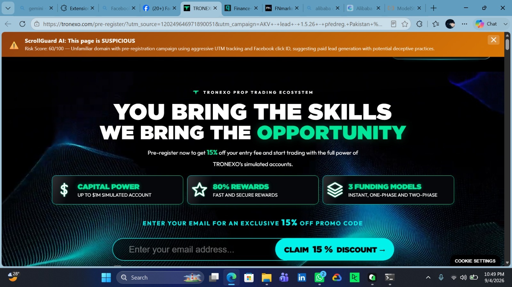
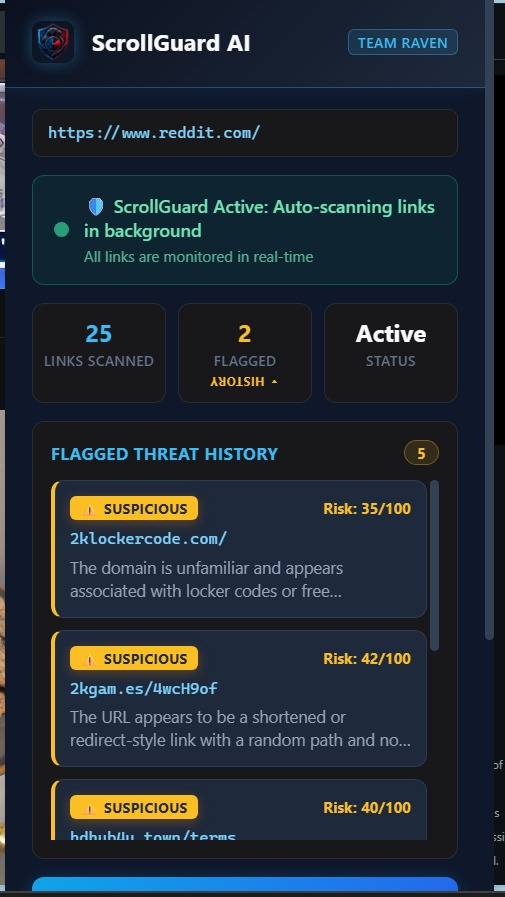
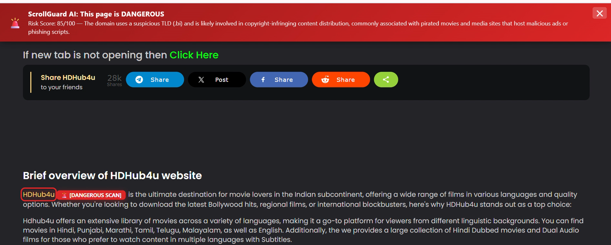
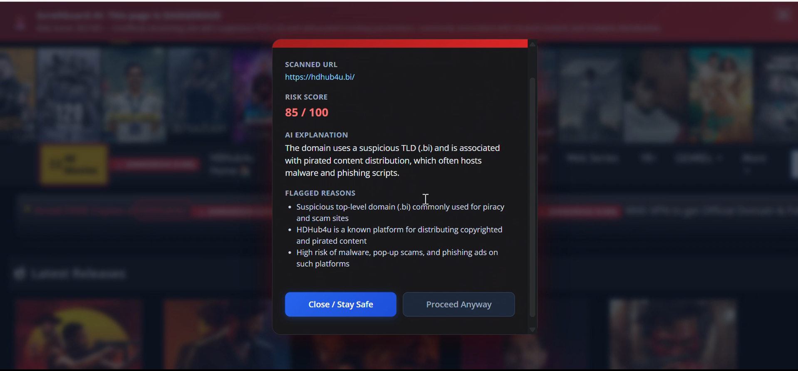

# 🛡️ ScrollGuard AI

**Zero-Click, Real-Time AI Protection Against Phishing & Scam Links**

> Built by **Team Raven** for the **Alibaba Cloud AI Hackathon Pakistan 2026**


ScrollGuard AI is a browser security extension paired with an AI-powered detection
backend. It automatically scans **every link on every page you visit** — including
dynamically loaded content in social-media feeds — and flags phishing links, fake
government schemes (BISP/Ehsaas scams), fraudulent lotteries, and
credential-harvesting pages **directly in the page, in real time, with zero clicks**.

---

## 🎯 Problem Statement

Online scams in Pakistan and South Asia are overwhelmingly **social-engineering
attacks delivered through ordinary links** — pasted into Facebook feeds, WhatsApp
groups, comment sections, and forwarded messages:

- **Fake government welfare schemes** — pages impersonating **BISP / Ehsaas /
  PM Kisan** programs that harvest victims' CNIC numbers and bank details from
  unofficial `.tk` / `.ml` / `.ga` domains.
- **Domain typosquatting** — look-alike brands (`g00gle.com`, `paypa1.com`,
  `amaz0n-deals.com`) that capture login credentials from hurried users.
- **Fake lotteries and giveaways** — "Congratulations, you won!" pages paired with
  urgency language and unknown domains.
- **Get-rich-quick and crypto-doubling schemes** spread through URL shorteners.

Existing defenses fail against this threat model: browser blocklists only catch
*known-bad* domains after victims have already been harmed, antivirus tools never
inspect the links inside a social feed, and manual URL checkers require users to
*notice* the threat and copy-paste it — which is precisely what scam victims
never do.

## 💡 Our Solution

ScrollGuard AI inverts the model: **the user never has to act**. A
`MutationObserver` watches the live DOM, so every link that appears while you
scroll — including infinite-scroll feeds on Facebook, X, Instagram, Reddit, and
WhatsApp Web — is validated, sanitized, batched, and classified in the background
by a two-stage engine (rule-based heuristics, then Alibaba Cloud's Qwen LLM).
Threats are surfaced **inline**, exactly where the dangerous link sits, as
colored outlines, clickable badges, and full-screen risk modals — plus a
session-scoped **Flagged Threat History** in the popup.

---

## ✨ Key Features

### 1. Real-Time Feed Scanning (Zero-Click)
Scanning starts automatically on page load — no button, no configuration. A
`MutationObserver` attached to `document.body` catches every `<a>` tag injected
after initial load; mutations are debounced at 300 ms and deduplicated
(`Set` for URLs, `WeakSet` for elements), so each unique link triggers exactly
one API call per session. The current page URL itself is checked first — if
*you* are on a threat page, a full-width warning banner is pinned to the top.

### 2. Tracking-Parameter Stripping (URL Sanitizer)
Before any URL is sent to the backend, marketing tracking parameters
(`fbclid`, `gclid`, `msclkid`, `utm_source`, `utm_medium`, `utm_campaign`,
`utm_term`, `utm_content`, and more) are parsed out and removed. The base
**origin and path are preserved** so threat detection stays accurate, while
payloads shrink (some `fbclid` values exceed 200 characters) and the dedup Set
keys on the *meaningful* part of the URL — two links differing only in tracking
junk collapse into a single scan.

### 3. Inline Threat Badges
Flagged links are outlined in place — red for 🚨 **Dangerous**, amber for
⚠️ **Suspicious** — with a clickable badge injected next to each one. All
injected UI uses `sg-ai-`-prefixed classes and inline styles, so host-page CSS
can never hide or break it.

### 4. Interactive Risk Modals
Clicking a badge opens a full-screen modal showing the scanned URL, risk score
(X/100), the Qwen LLM's explanation, and the specific reasons the link was
flagged — plus **"Close / Stay Safe"** and **"Proceed Anyway"** actions.

### 5. Session-Based Flagged Threat History
The popup's FLAGGED stat card toggles open a live history of every
Dangerous/Suspicious link caught this browsing session — severity pill, risk
score, URL, and AI explanation per entry. The list is mirrored to
`chrome.storage.local` (MV3 service workers are ephemeral), capped at 50
entries, and wiped on browser restart so it always reflects the *current*
session.

### 6. Graceful Degradation
Every backend call runs through the extension's privileged service worker with
a 30-second abort timeout. A slow or unreachable backend resolves into graceful
per-URL "evaluation delayed" fallbacks — never an error wall, never an unhandled
rejection, and never Chrome's extension error badge.

### 7. False-Positive Filters (Client-Side, Pre-Request)
Three filters run **before** any request is made, saving API quota and
eliminating noise: a 20-domain trusted allowlist (google.com, github.com, …
plus subdomains), an auth-path skip (`login`, `signin`, `signup`, `auth`,
`oauth`, `register`), and scheme/same-origin rejection (`javascript:`,
`mailto:`, `data:`, internal navigation).

---

## 🧰 Tech Stack

| Layer | Technology |
|-------|------------|
| Browser Extension | **Chrome Manifest V3** — service worker, content scripts, action popup (JavaScript, HTML5, CSS3) |
| DOM Scraping | **`MutationObserver`** on `document.body` + `querySelectorAll`, debounced and deduplicated |
| Backend | **Python 3.10+ / FastAPI** — fully async (`AsyncOpenAI`, `asyncio.gather`), Uvicorn ASGI server, Pydantic contracts |
| AI Engine | **Alibaba Cloud Qwen (`qwen3.8-flash`)** via the OpenAI-compatible DashScope API — any OpenAI-compatible LLM can be swapped in by changing one `model` parameter |
| Rate Limiting | `asyncio.Semaphore(5)` caps concurrent LLM calls per batch |
| Deployment | Procfile-based PaaS (Render / Heroku / Alibaba Cloud), Docker-ready |

### Extension Architecture (Manifest V3)

- **`content.js`** runs on every page: zero-click scans, client-side filters,
  URL sanitization, and injection of the banner, badges, and modals.
- **`background.js`** is the sole network fetcher — all backend calls route
  through the extension's privileged service-worker context, bypassing the CORS
  and Mixed-Content restrictions that would otherwise block a content script on
  an HTTPS page from reaching an HTTP backend. It also maintains the session
  Flagged Threat History and the 30 s timeout fallback.
- **`popup.html` / `popup.js`** provide the status dashboard: live scan
  statistics synced via `chrome.storage`, the flagged-history toggle panel,
  and the manual "Scan Active Tab" fallback.

### Detection Engine (FastAPI Backend)

- **Two-stage pipeline**: an 8-rule heuristic pre-filter (suspicious TLDs,
  URL shorteners, subdomain depth, hyphen-heavy domains, typosquatting
  patterns, scam keywords in path/domain, missing HTTPS) followed by Qwen LLM
  deep analysis for everything the rules cannot confidently clear.
- **Threshold enforcer**: a programmatic guard maps LLM scores to statuses
  (≥ 75 → Dangerous, ≥ 30 → Suspicious) and overrides hallucinated labels —
  the reported status always matches the score band.
- **Endpoints**: `GET /` (health check), `POST /analyze` (single URL + text),
  `POST /scan_links` (batch URL analysis, capped at 100 URLs per request).
- **Prompting**: aggressive few-shot system prompt with worked examples for
  each threat level and hard JSON-format constraints.

---

## 🏗️ Data Flow

```
┌──────────────────────────────────────────────────────────────────┐
│                          Browser Tab                              │
│                                                                   │
│  querySelectorAll + MutationObserver (300 ms debounce)            │
│        │                                                          │
│        ▼                                                          │
│  Client-side filters                                              │
│    • trusted-domain allowlist (20 domains + subdomains)           │
│    • auth-path skip (login / signin / signup / oauth / …)         │
│    • scheme + same-origin rejection                               │
│        │                                                          │
│        ▼                                                          │
│  URL sanitizer — strips fbclid / gclid / utm_* tracking params    │
│        │            (origin + path preserved)                     │
│        ▼  chrome.runtime.sendMessage (deduped batch)              │
│  background.js — MV3 service worker (CORS bypass, 30 s timeout)   │
└────────┼──────────────────────────────────────────────────────────┘
         │ fetch() → POST /scan_links
         ▼
┌──────────────────────────────────────┐
│      FastAPI Backend (Uvicorn)       │
│                                      │
│  ① 8-rule heuristic pre-filter       │
│       │  flagged → returned instantly│
│       ▼  otherwise                   │
│  ② Qwen LLM (qwen3.8-flash)          │
│     few-shot prompt, strict JSON     │
│       │                              │
│       ▼                              │
│  ③ Threshold enforcer — score band   │
│     overrides model hallucinations   │
└──────────────────────────────────────┘
         │
         ▼  { status, score, explanation, reasons }
   Banner + inline badges + risk modals + popup history
```

---

## 📸 Screenshots

### Real-Time Threat Detection Banner


### Flagged Threat History Log


### AI-Powered Interactive Risk Modal


### AI Threat Explanation


---

## 🚀 Quickstart Guide

### Prerequisites

- Python 3.10+
- Google Chrome or Microsoft Edge
- An active [Alibaba Cloud DashScope API Key](https://dashscope.console.alibabacloud.com/)

### Step 1 — Run the FastAPI Backend

```bash
# Clone the repository
git clone https://github.com/Aymanaahh/scrollguard-ai.git
cd scrollguard-ai/backend

# (Recommended) create and activate a virtual environment
python -m venv .venv
# Windows:
.venv\Scripts\activate
# macOS / Linux:
source .venv/bin/activate

# Install dependencies
pip install fastapi uvicorn openai python-dotenv pydantic

# Configure your API key
cp .env.example .env        # Windows: copy .env.example .env
# Edit .env and set: DASHSCOPE_API_KEY=your_key_here  (no quotes)
```

Start the server:

```bash
uvicorn main:app --reload --port 8000
# or simply:
python main.py
```

Verify it is live:
- Health check → `http://127.0.0.1:8000/`
- Interactive API docs → `http://127.0.0.1:8000/docs`

### Step 2 — Load the Extension into Chrome

1. Open **`chrome://extensions/`** (or `edge://extensions/` on Edge).
2. Toggle **Developer mode** on (top-right corner).
3. Click **Load unpacked**.
4. Select the **`scrollguard-ai/extension`** folder.
5. Pin **ScrollGuard AI** to your toolbar.

### Step 3 — Verify Protection Is Active

Visit any content-heavy page (a news site or social feed). Open the ScrollGuard
popup — the **Links Scanned** counter climbs as the background scanner works,
and the status chip shows **Active**. Use the **Scan Active Tab** button for an
on-demand verdict on the current page.

### (Optional) Point the Extension at a Cloud Backend

By default the extension targets `http://127.0.0.1:8000/scan_links`. To use a
deployed backend instead:

1. Open `chrome://extensions/` and click the **service worker** link under
   ScrollGuard AI to open its DevTools console.
2. Run:
   ```js
   chrome.storage.local.set({
     sg_backendUrl: "https://your-app.onrender.com/scan_links"
   })
   ```
3. Reload the extension. All requests now route to your cloud backend.

---

## ☁️ Cloud Deployment (Backend)

The backend ships with a `Procfile` for standard PaaS deployment:

```
web: uvicorn main:app --host 0.0.0.0 --port $PORT
```

**Render / Heroku / Railway** — push the `backend/` directory to a GitHub
repository, create a Web Service, set the `DASHSCOPE_API_KEY` environment
variable, and deploy (the platform injects `PORT` automatically).

**Alibaba Cloud (ECS / Function Compute)** — upload the backend, set
`DASHSCOPE_API_KEY` and `PORT` (default 8000), and run `python main.py`.

**Docker**

```dockerfile
FROM python:3.12-slim
WORKDIR /app
COPY backend/ .
RUN pip install --no-cache-dir fastapi uvicorn openai python-dotenv pydantic
EXPOSE 8000
CMD ["python", "main.py"]
```

---

## 📊 Benchmark Evaluation

Test detection accuracy against the bundled scam dataset:

```bash
cd backend
python evaluate_engine.py
```

The script evaluates every URL in `scam_dataset.json` through the full pipeline
and reports per-URL verdicts and overall accuracy.

---

## 📁 Project Structure

```
scrollguard-ai/
├── backend/
│   ├── main.py              # FastAPI engine: endpoints, Qwen prompt, threshold enforcer
│   ├── heuristics.py        # 8-rule pre-filter (TLDs, shorteners, typosquatting, keywords)
│   ├── evaluate_engine.py   # Benchmark runner against scam_dataset.json
│   ├── scam_dataset.json    # Labeled scam / benign URL dataset
│   ├── .env.example         # DASHSCOPE_API_KEY template
│   └── Procfile             # PaaS deployment entry
├── extension/
│   ├── manifest.json        # Chrome Manifest V3 declaration
│   ├── content.js           # Zero-click scanner: observer, filters, sanitizer, badges, modals
│   ├── background.js        # Service worker: fetch proxy, timeout fallback, flagged history
│   ├── popup.html / popup.js# Dashboard: stats, history panel, manual scan
│   └── icons/               # Extension + modal logo assets
├── assets/                  # Screenshot gallery (see above)
└── README.md
```

---

## ⚠️ Known Limitations

- **Link-only scanning** — the extension analyzes `<a>` `href` attributes, not
  full DOM paragraph text, image sources, or embedded scripts.
- **Auth-path links skipped** — links containing authentication paths are
  intentionally never sent to the backend to eliminate false positives; the
  main page URL itself is still always scanned.
- **Session-scoped history** — flagged links persist for the current browsing
  session only (cleared on browser restart); there is no cross-session
  persistent log yet.
- **Backend dependency** — AI analysis requires a running FastAPI backend
  (local or cloud); the heuristic pre-filter still applies without it.
- **Rate limits** — batches are capped at 100 URLs and 5 concurrent LLM calls,
  so very heavy pages may resolve progressively.

---

## 🔭 Roadmap

- **Phase 2 — WhatsApp / Telegram forwarding bot**: forward any suspicious
  message or link to a bot running the same detection pipeline and receive an
  instant verdict — extending protection to the platforms where most scam
  messages actually arrive.
- **Firefox port** via the WebExtensions compatibility layer.
- **Mobile browsers** — Kiwi Browser (Android) and Firefox for Android.
- **Full DOM text analysis** — paragraph text, button labels, and form actions.
- **Persistent cross-session threat dashboard** with an options page for
  user-configurable allowlists and heuristic sensitivity.

---

## 🐦 Team Raven

*Alibaba Cloud AI Hackathon Pakistan 2026*

- **Member A** — Backend Architecture & AI API Integration Lead
- **Member B** — Frontend Extension & Dataset Benchmarking Lead
